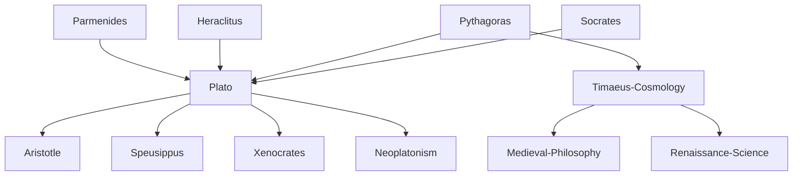

---
cssclasses:
  - Philosophy
subclasses:
  - Ancient-Greek-and-Roman-Philosophy
  - Metaphysics
  - Epistemology
aliases:
  - late plato
  - supreme genera
  - demiurge
  - timaeus
  - dialectic
  - non being
  - unwritten doctrines
  - one diad
  - sophist dialogue
  - parmenicide
tags:
  - Conceptual
  - Constructive
authors:
  - "[[Plato]]"
  - "[[Parmenides]]"
  - "[[Aristotle]]"
  - "[[Pythagoras]]"
movements:
  - "[[Platonism]]"
  - "[[Pythagoreanism]]"
  - "[[Eleaticism]]"
reference: "[[The search for thought - Unit 3 Chapter 3.pdf]]"
---

#### Central Problem

The late Platonic philosophy confronts two fundamental problems that emerge from the need to mitigate the rigid dualism between the immutable world of Ideas and the mutable world of things: first, how should the world of Ideas be adequately conceived? Second, how should the relationship between Ideas and natural realities be properly understood? These questions arise from Plato's continuous self-revision, representing the most typical Socratic inheritance in Platonism—the capacity to constantly question oneself and return to reconsider previous positions.

The first question is addressed primarily in the Sophist, prepared by the Theaetetus (which investigates the nature of knowledge) and the Parmenides (which examines the nature of being and its relationship to non-being). The second question is answered in the Timaeus, where Plato develops his cosmological vision. Additionally, the late Plato grapples with redefining the concept of the Good for human life in the Philebus, and with the problem of laws in politics in the Statesman and Laws. The philosopher also develops unwritten doctrines that propose the One and the Dyad as ultimate principles underlying all reality, including the Ideas themselves.

#### Main Thesis

Plato's late philosophy accomplishes a decisive "parricide" of Parmenides by demonstrating that non-being exists—not as absolute nothingness, but as "otherness" or "being different." This breakthrough allows Plato to justify the plurality of Ideas and their mutual relations. The five supreme genera (megista gene) of being are: being, the same, the different, rest, and motion. Every Idea exists (participates in being), is identical to itself (participates in the same), is different from other Ideas (participates in the different), and can either remain in itself (rest) or enter into communication with other Ideas (motion).

Being itself is redefined as "possibility"—anything that possesses any capacity whatsoever to act upon or be acted upon by something else. This relational definition applies not only to Ideas but to natural things and humans, representing a generalization that anticipates Aristotelian ontology.

In the Timaeus, Plato introduces the Demiurge as a divine craftsman who mediates between Ideas and matter, ordering the chaotic primordial material (chora) according to ideal models. The cosmos is thus a living organism animated by a world-soul, with time as the "moving image of eternity." The imperfections of the world derive from the resistance of matter to the Demiurge's intelligent ordering.

The Philebus establishes that the good for human beings is a mixed life of pleasure and intelligence, with proper measure and proportion. The hierarchy of values places measure and order first, followed by proportion and beauty, then intelligence, then knowledge and opinion, and finally pure pleasures.

The Laws represents a more practical approach to politics, recognizing human weakness and establishing law as necessary for education and virtue, with religion providing the foundation for civic cohesion through astral theology.

#### Historical Context

The late dialogues were written during Plato's final decades at the Academy in Athens, approximately 360-347 BCE. This period followed the failure of Plato's political experiments in Syracuse and saw the philosopher returning to theoretical work with renewed vigor. The Academy had become an established center of learning, attracting students like Aristotle who would later develop their own philosophical systems partly in response to Plato's teachings.

The intellectual context was marked by ongoing debates with various philosophical schools: the Eleatics who maintained that being is one and unchanging; the Heracliteans who emphasized flux; the materialists who reduced everything to body; and the mathematicians and Pythagoreans whose influence grew stronger in Plato's later thought. The relationship with Pythagorean mathematical philosophy becomes particularly pronounced in the Timaeus and in the unwritten doctrines.

Politically, the Greek world was experiencing profound transformations, with the rise of Macedonian power under Philip II threatening the autonomy of the city-states. This context reinforced Plato's conviction that political stability required a foundation in cosmic order and divine providence, leading to the astral theology developed in the Laws.

#### Philosophical Lineage

#### Key Thinkers

| Thinker | Dates | Movement | Main Work | Core Concept |
|---------|-------|----------|-----------|--------------|
| [[Plato]] | 427-347 BCE | [[Platonism]] | *Sophist*, *Timaeus*, *Laws* | Supreme genera, Demiurge, Non-being as otherness |
| [[Parmenides]] | c. 515-450 BCE | [[Eleaticism]] | *On Nature* | Being is one, non-being cannot be spoken |
| [[Pythagoras]] | c. 570-495 BCE | [[Pythagoreanism]] | — | Numbers as structure of reality, Limit and Unlimited |
| [[Aristotle]] | 384-322 BCE | [[Peripateticism]] | *Metaphysics* | Critique and development of late Platonic ontology |

#### Key Concepts

| Concept | Definition | Related to |
|---------|------------|------------|
| Supreme Genera (megista gene) | The five fundamental determinations of Ideas: being, the same, the different, rest, and motion | [[Plato]], [[Sophist]] |
| Non-being as Otherness | Non-being is not absolute nothingness but simply being different from something else | [[Plato]], [[Parmenides]] |
| Demiurge | Divine craftsman who orders primordial matter according to ideal models, creating the cosmos | [[Plato]], [[Timaeus]] |
| Chora | Primordial matter or receptacle, the "mother of the world," resistant to intelligent ordering | [[Plato]], [[Cosmology]] |
| Being as Possibility | Being is defined as the capacity to act or be acted upon, to enter into any relation | [[Plato]], [[Ontology]] |
| Dialectic | The supreme science of Ideas, establishing which Ideas connect and which do not through dichotomous division | [[Plato]], [[Method]] |
| World-Soul | The animating principle that vivifies and orders matter, giving form to the cosmos | [[Plato]], [[Timaeus]] |
| Astral Theology | Religious doctrine viewing celestial bodies as manifestations of divinity and divine order | [[Plato]], [[Laws]] |
| One and Dyad | The two ultimate principles (in unwritten doctrines): the One as formal/limiting, the Dyad of great-and-small as material/unlimited | [[Plato]], [[Pythagoreanism]] |

#### Authors Comparison

| Theme | [[Plato]] (Late) | [[Parmenides]] | [[Democritus]] |
|-------|------------------|----------------|----------------|
| Nature of Being | Heterogeneous, multiple, relational | Homogeneous, unique, immobile | Atoms and void |
| Non-being | Exists as otherness/difference | Absolutely does not exist | Void exists as non-being |
| Explanation of plurality | Supreme genera and communication of Ideas | Illusion of mortals | Atomic combinations |
| Cosmological principle | Intelligent Demiurge ordering for the Good | — | Mechanical necessity |
| Mathematics and nature | Mathematical structure underlies all reality | — | Atoms have geometric shapes |
| Final causes | Primary explanation of natural phenomena | — | Rejected in favor of mechanism |

#### Influences & Connections

- **Predecessors:** [[Plato]] ← influenced by ← [[Parmenides]], [[Heraclitus]], [[Pythagoras]], [[Socrates]]
- **Contemporaries:** [[Plato]] ↔ dialogue with ↔ [[Eudoxus]], [[Theaetetus]]
- **Followers:** [[Plato]] → influenced → [[Aristotle]], [[Speusippus]], [[Xenocrates]], [[Neoplatonism]]
- **Followers:** [[Timaeus]] → influenced → [[Medieval Philosophy]], [[Copernicus]], [[Kepler]], [[Galileo]]
- **Opposing views:** [[Plato]] ← opposed by ← [[Democritus]] (mechanism), [[Aristotle]] (critique of Forms)

#### Summary Formulas

- **[[Plato]] (Sophist):** Non-being exists as otherness, not as absolute nothingness; this "parricide" of Parmenides enables the plurality and communication of Ideas.
- **[[Plato]] (Timaeus):** The cosmos is the product of a divine Demiurge who orders chaotic matter according to ideal models, creating time as the moving image of eternity.
- **[[Plato]] (Philebus):** The good for human beings consists in the proper measure and proportion between pleasure and intelligence, with measure as the highest value.
- **[[Plato]] (Laws):** Political stability requires the foundation of religion and astral theology, with laws serving an educational function to promote virtue in citizens.

#### Timeline

| Year | Event |
|------|-------|
| c. 369-362 BCE | [[Plato]] writes the Theaetetus on the nature of knowledge |
| c. 360-355 BCE | [[Plato]] writes the Parmenides, examining problems in the theory of Forms |
| c. 360-355 BCE | [[Plato]] writes the Sophist, introducing the five supreme genera |
| c. 360-355 BCE | [[Plato]] writes the Statesman on political art and law |
| c. 360-350 BCE | [[Plato]] writes the Philebus on the good for human life |
| c. 360-347 BCE | [[Plato]] writes the Timaeus, his cosmological dialogue |
| c. 350-347 BCE | [[Plato]] writes the Laws, his final and longest work |
| 347 BCE | Death of [[Plato]]; Laws published posthumously by Philip of Opus |

#### Notable Quotes

> "Being is anything that possesses any capacity whatsoever to act upon or be acted upon by something else, even in the slightest degree, even if only once."
> — [[Plato]]

> "Time is the moving image of eternity."
> — [[Plato]]

> "God, wishing that all things should be good and, as far as possible, nothing be imperfect, took all that was visible—not at rest but moving irregularly and in disorder—and brought it from disorder into order."
> — [[Plato]]

#### See Also

- [[Theory of Forms]]
- [[Parmenides]]
- [[Eleatic Philosophy]]
- [[Pythagorean Mathematics]]
- [[Cosmology]]
- [[Demiurge]]
- [[Dialectic]]
- [[Political Philosophy]]
- [[Unwritten Doctrines]]
- [[Neoplatonism]]
- [[Medieval Philosophy]]
- [[Scientific Revolution]]

> [!NOTE]
> *This summary has been created to present the key points from the source text, which was automatically extracted using LLM. Please note that the summary may contain errors. It serves as an essential starting point for study and reference purposes.*
