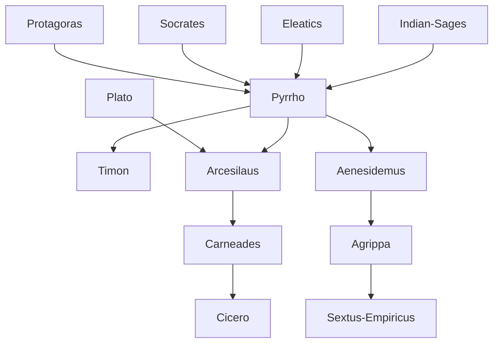

---
cssclasses:
  - Philosophy
subclasses:
  - Ancient-Greek-and-Roman-Philosophy
  - Epistemology
  - Ethics
aliases:
  - skepticism
  - pyrrhonism
  - epoch
  - suspension judgment
  - ataraxia
  - tropes
  - probabilism
  - diallele
  - dogmatism critique
  - pyrrho
tags:
  - Conceptual
authors:
  - "[[Pyrrho]]"
  - "[[Timon]]"
  - "[[Arcesilaus]]"
  - "[[Carneades]]"
  - "[[Aenesidemus]]"
  - "[[Agrippa]]"
  - "[[Empiricus]]"
movements:
  - "[[Skepticism]]"
  - "[[Hellenistic Philosophy]]"
  - "[[Academic Skepticism]]"
reference: "[[The search for thought - Unit 5 Chapter 4.pdf]]"
---

#### Central Problem

Skepticism confronts a fundamental epistemological problem: given the bewildering plurality of philosophical and theological systems, each claiming exclusive possession of truth about the nature of reality, how can human beings determine which (if any) is correct? The skeptics were struck by the irreconcilable conflicts among competing worldviews—particularly between Stoicism and Epicureanism—each promising happiness and serenity through adherence to its metaphysical doctrines.

The central tension lies in the relationship between knowledge and happiness. While the "dogmatists" (from Greek *dógma*, "fixed opinion") claimed that tranquility could only be achieved through grasping ultimate truths about the cosmos, the skeptics argued the opposite: that peace of mind (*ataraxia*) comes precisely from recognizing the impossibility of such knowledge and liberating oneself from the burden of defending any particular doctrine.

Importantly, skepticism does not deny the reality of phenomena—that day and night exist, that we see and think—but questions our ability to know the ultimate nature or causes underlying appearances. The distinction is between the "that" of phenomena (their evident presence) and the "how" (their unknowable deeper nature).

#### Main Thesis

The skeptical thesis holds that since every philosophical claim can be countered by an equally plausible opposing claim (*isosthenia*), the only rational response is *epoché*—suspension of judgment regarding all non-evident matters. This suspension, far from being a source of anxiety, paradoxically produces the very tranquility that dogmatic philosophers vainly seek through their metaphysical constructions.

[[Pyrrho]], the founder, maintained that nothing is true or false, good or bad by nature and absolutely, but only by convention and relatively. Human customs, habits, and decisions determine what counts as true or good; beyond these ever-changing conventions, reality itself remains inaccessible to human cognition.

The skeptical program unfolds through systematic argumentation against dogmatic positions:

**The Ten Tropes of [[Aenesidemus]]:** These arguments demonstrate the relativity of all knowledge—varying according to different animals, different humans, different circumstances, times, places, mixtures, quantities, relations, frequencies of encounter, and cultural conventions. The same object appears differently to different observers under different conditions, making objective judgment impossible.

**The Five Tropes of [[Agrippa]]:** These dialectical arguments target the structure of justification itself: (1) disagreement among philosophers; (2) infinite regress of demonstration; (3) relativity to the observer; (4) arbitrary hypotheses underlying all proofs; (5) circular reasoning (*diallele*) in deductive argument.

[[Carneades]] developed a moderate "probabilism," acknowledging that while absolute truth is unattainable, we can identify more or less "persuasive" (*pithanon*) representations sufficient to guide practical action. [[Sextus Empiricus]] refined this by advocating adherence to phenomena, following four practical guides: natural sensory indications, bodily needs, traditional laws and customs, and the rules of the arts.

#### Historical Context

Skepticism emerged in the Hellenistic period, when the collapse of the Greek city-state system and the vast uncertainties of the post-Alexander world created conditions ripe for philosophies offering individual salvation through inner tranquility. [[Pyrrho]] of Elis (c. 365-275 BCE) participated in Alexander's Eastern campaign, where he encountered Indian sages (the "gymnosophists") who taught the vanity of worldly concerns and the imperturbability of the wise.

The skeptical tradition has intellectual roots in earlier Greek thought: the Sophists' relativism (despite [[Pyrrho]]'s negative judgment of Protagoras), Socrates' profession of ignorance, and the dialectical methods of the Eleatic-Megaric school. The skeptics radicalized these tendencies into a systematic philosophical position.

After [[Pyrrho]]'s school declined, skepticism was taken up by the Platonic Academy. Plato had denied that the sensible world could be object of true knowledge (*episteme*); when interest in the transcendent world of Forms waned, what remained was only the negative part of Platonism. [[Arcesilaus]] (c. 315-240 BCE) inaugurated this Academic skepticism, followed by [[Carneades]] (c. 214-129 BCE), whose famous Roman embassy (156-155 BCE) included arguing both for and against justice on consecutive days.

The later "Pyrrhonists"—[[Aenesidemus]], [[Agrippa]], and [[Sextus Empiricus]]—revived the original Pyrrhonian tradition from the 1st century BCE to the 2nd century CE, systematizing the arguments (*tropes*) for suspension of judgment.

#### Philosophical Lineage

#### Key Thinkers

| Thinker | Dates | Movement | Main Work | Core Concept |
|---------|-------|----------|-----------|--------------|
| [[Pyrrho]] | c. 365-275 BCE | [[Pyrrhonism]] | No writings | Epoché, ataraxia |
| [[Timon]] | c. 320-230 BCE | [[Pyrrhonism]] | *Silloi* | Aphasia, three questions |
| [[Arcesilaus]] | c. 315-240 BCE | [[Academic Skepticism]] | No writings | Epoché, reasonableness |
| [[Carneades]] | c. 214-129 BCE | [[Academic Skepticism]] | No writings | Probabilism, persuasive representation |
| [[Aenesidemus]] | c. 80-10 BCE | [[Pyrrhonism]] | *Pyrrhonian Discourses* | Ten tropes |
| [[Agrippa]] | 1st c. CE | [[Pyrrhonism]] | Unknown | Five tropes |
| [[Sextus Empiricus]] | c. 180-210 CE | [[Pyrrhonism]] | *Outlines of Pyrrhonism* | Following phenomena |

#### Key Concepts

| Concept | Definition | Related to |
|---------|------------|------------|
| Epoché | Suspension of judgment regarding non-evident matters; withholding assent to any claim about ultimate reality | [[Pyrrho]], [[Skepticism]] |
| Ataraxia | Imperturbable tranquility of mind achieved through epoché; the goal of skeptical practice | [[Pyrrho]], [[Hellenistic Philosophy]] |
| Tropes (tropoi) | Systematic arguments demonstrating the relativity or impossibility of knowledge; modes of suspension | [[Aenesidemus]], [[Agrippa]] |
| Isosthenia | Equal strength of opposing arguments; for every thesis, an equally plausible antithesis exists | [[Skepticism]], [[Epistemology]] |
| Probabilism | Moderate skepticism accepting degrees of credibility for practical guidance while denying absolute truth | [[Carneades]], [[Academic Skepticism]] |
| Diallele | Circular reasoning; demonstration that presupposes what it claims to prove | [[Sextus Empiricus]], [[Skepticism]] |
| Aphasia | Silence regarding obscure matters; refusal to make positive assertions about hidden reality | [[Timon]], [[Pyrrhonism]] |
| Dogmatism | The position of philosophers who claim fixed, certain knowledge of truth; the skeptics' adversary | [[Skepticism]], [[Epistemology]] |
| Persuasive representation | Criterion of practical credibility; a representation not contradicted by others, examined in all parts | [[Carneades]], [[Academic Skepticism]] |
| Following phenomena | Practical criterion: adhering to appearances, bodily needs, customs, and arts without metaphysical commitment | [[Sextus Empiricus]], [[Pyrrhonism]] |

#### Authors Comparison

| Theme | [[Pyrrho]] | [[Carneades]] | [[Sextus Empiricus]] |
|-------|------------|---------------|----------------------|
| Central claim | No truth by nature; all is convention | No absolute truth, but degrees of probability | Ongoing inquiry without definitive conclusions |
| Criterion | Epoché and convention | Persuasive representation | Following phenomena |
| Practical life | Lives normally by convention | Action guided by probability | Four guides: senses, body, custom, arts |
| Knowledge claim | Cannot know anything with certainty | Cannot attain truth but can assess credibility | Cannot even know that nothing can be known |
| Relation to dogmatism | Opposes all doctrines | Critiques especially Stoics | Systematically refutes all dogmatic positions |
| Goal | Ataraxia through detachment | Reasonable action despite uncertainty | Pure inquiry as way of life |
| Self-reference | Epoché applies to skepticism too | Probabilism is itself probable | "Nothing I define"—including this |

#### Influences & Connections

- **Predecessors:** [[Pyrrho]] ← influenced by ← [[Protagoras]], [[Socrates]], [[Democritus]], Indian gymnosophists
- **Contemporaries:** [[Arcesilaus]] ↔ polemics with ↔ [[Stoics]], [[Carneades]] ↔ polemics with ↔ [[Chrysippus]]
- **Followers:** [[Pyrrho]] → influenced → [[Aenesidemus]], [[Sextus Empiricus]], [[Montaigne]], [[Hume]]
- **Later reception:** [[Sextus Empiricus]] → influenced → [[Descartes]] (methodical doubt), [[Modern Philosophy]]
- **Opposing views:** [[Skepticism]] ← criticized by ← [[Augustine]], [[Hegel]], [[Gentile]]

#### Summary Formulas

- **[[Pyrrho]]:** Since nothing is true or false, good or bad by nature but only by convention, the wise person suspends judgment and achieves tranquility through detachment from all doctrines.
- **[[Arcesilaus]]:** Not even our own ignorance can be affirmed with certainty; reasonable action follows from what appears more plausible, not from metaphysical truth.
- **[[Carneades]]:** While absolute truth is inaccessible, persuasive representations that withstand examination provide sufficient basis for practical life.
- **[[Sextus Empiricus]]:** The true skeptic does not even claim to know that nothing can be known, but continues pure inquiry while following phenomena in daily life.

#### Timeline

| Year | Event |
|------|-------|
| c. 365 BCE | [[Pyrrho]] born in Elis |
| 334-323 BCE | [[Pyrrho]] participates in Alexander's Eastern campaign; encounters Indian sages |
| c. 320 BCE | [[Timon]] of Phlius born |
| c. 315 BCE | [[Arcesilaus]] of Pitane born |
| 275 BCE | Death of [[Pyrrho]] |
| c. 268 BCE | [[Arcesilaus]] becomes head of Academy; begins Academic Skepticism |
| c. 214 BCE | [[Carneades]] of Cyrene born |
| 156-155 BCE | [[Carneades]] leads philosophical embassy to Rome; argues for and against justice |
| c. 129 BCE | Death of [[Carneades]] |
| c. 80 BCE | [[Aenesidemus]] begins revival of Pyrrhonism |
| c. 180-210 CE | [[Sextus Empiricus]] active; composes *Outlines of Pyrrhonism* |

#### Notable Quotes

> "We admit that we see and recognize that we have this particular thought, but how we see or how we think we do not know at all." — [[Pyrrho]] (via Diogenes Laertius)

> "When we say 'I define nothing,' we do not even define this." — [[Skeptics]] (via Diogenes Laertius)

> "The phenomenon always prevails, wherever it appears." — [[Timon]]

#### See Also

- [[Hellenistic Philosophy]]
- [[Stoicism]]
- [[Epicureanism]]
- [[Epistemology]]
- [[Pyrrhonism]]
- [[Academic Skepticism]]
- [[Sophists]]
- [[Socratic Method]]
- [[Problem of Knowledge]]
- [[Methodical Doubt]]

> [!NOTE]
> *This summary has been created to present the key points from the source text, which was automatically extracted using LLM. Please note that the summary may contain errors. It serves as an essential starting point for study and reference purposes.*
