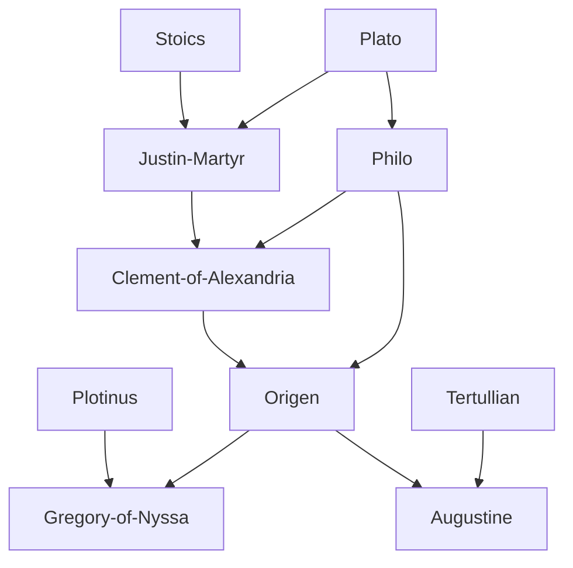

---
cssclasses:
  - Philosophy
subclasses:
  - Philosophy-of-Religion
  - Medieval-and-Renaissance-Philosophy
  - Ancient-Greek-and-Roman-Philosophy
aliases:
  - patristics
  - church fathers
  - christian philosophy
  - apologetics
  - logos theology
  - faith reason
  - gnosticism
  - revelation
  - justin martyr
  - tertullian
  - origen
tags:
  - Conceptual
authors:
  - "[[Martyr]]"
  - "[[Tertullian]]"
  - "[[Alexandria]]"
  - "[[Origen]]"
  - "[[Nyssa]]"
  - "[[Paul]]"
movements:
  - "[[Patristics]]"
  - "[[Christian Philosophy]]"
  - "[[Gnosticism]]"
reference: "[[The search for thought - Unit 6 Chapter 1.pdf]]"
---

#### Central Problem

The emergence of Christianity poses a fundamental philosophical problem: what is the relationship between religious faith, grounded in divine revelation, and philosophical inquiry, grounded in human reason? Religion seems to exclude investigation by its very nature—it consists in accepting a truth testified from above, independent of any research. Yet once one acknowledges the revealed truth, the need immediately arises to approach it, understand its authentic meaning, and make it "flesh of one's flesh and blood of one's blood."

This tension generates the central questions of Christian philosophy: Can the truths of faith be understood through rational concepts? Is Greek philosophy compatible with or opposed to Christian revelation? Should philosophical inquiry serve faith, or does faith render philosophy obsolete? The Church Fathers confronted these questions while defending Christianity against external attacks (pagan critics, persecutions) and internal threats (heresies, Gnosticism), all while attempting to formulate a coherent doctrinal system.

Unlike Greek philosophy, which was an autonomous search that first established its own problems and terms, Christian philosophy begins with its fundamental truths already given through revelation. Yet this constraint does not diminish its vital significance: it is through philosophical reflection that the Christian message has renewed and preserved its spiritual efficacy through the centuries.

#### Main Thesis

The Patristic writers establish that Christianity represents the culmination and fulfillment of Greek philosophy, not its rejection. [[Justin Martyr]] articulates this most clearly: the *Logos* (reason/word) that became incarnate in Christ is the same rational principle that illuminated all human beings throughout history. Those who lived according to reason—including Socrates, Heraclitus, and Abraham—were "Christians before Christ."

**The Logos Doctrine:** Drawing on Stoic philosophy and the Gospel of John ("In the beginning was the Word, and the Word was with God, and the Word was God"), the Fathers identify Christ with the divine *Logos* that mediates between the transcendent God and the created world. This Logos is present as "seeds" (*lógoi spermatikói*) in all rational beings, enabling partial knowledge of truth even before Christ's revelation.

**Faith and Reason:** Two opposing tendencies emerge. Eastern apologetics (Justin, Clement, Origen) emphasizes continuity between Christianity and Greek philosophy, presenting Christian doctrine as "the only sure and useful philosophy." Western apologetics ([[Tertullian]]) emphasizes discontinuity, condemning philosophy as the "patriarch of heresies" and insisting that faith excludes further seeking: once you have found, you stop searching.

**The Trinity:** [[Gregory of Nyssa]] derives the doctrine of the Trinity from God's perfection itself. In humans, reason is limited and mutable; in God, it is immutable and eternal, subsisting as a distinct person (the Son/Logos). Similarly, the Spirit proceeds from Father and Son as a third person sharing their substance and eternity.

**Universal Salvation:** [[Origen]] develops the doctrine of *apocatastasis*—the eventual return of all souls to God. Fallen intelligences descended into bodies through their own fault, but through a long process of purification across multiple worlds, all beings will ultimately be restored to their original condition.

#### Historical Context

Christianity emerged within the Roman Empire during a period of religious syncretism and philosophical eclecticism. The new faith faced persecution from the state, hostility from pagans and Jews alike, and internal divisions from heretical movements—particularly Gnosticism, which sought to absorb Christianity into its dualistic framework emphasizing esoteric knowledge (*gnosis*) over faith.

The Patristic period spans roughly from the 1st to the 8th century CE, traditionally divided into three phases: (1) defense against pagan and Gnostic adversaries (to c. 200); (2) doctrinal formulation (c. 200-450); (3) systematization and compilation (c. 450-750). The period closes with John of Damascus (d. c. 754) for the Greek Church and Bede the Venerable (d. 735) for the Latin Church.

Key historical events shaped doctrinal development: the persecutions under various emperors prompted apologetic writings; the Arian controversy (denying Christ's full divinity) led to the Council of Nicaea (325), which affirmed the Son's consubstantiality with the Father; Emperor Justinian's condemnation of [[Origen]] (543) led to the loss of many of his writings.

The sacred scriptures—Hebrew Bible (Old Testament) and Greek New Testament—provided the foundational texts requiring interpretation. The Gospels presented Christ's life and teaching; Paul's Letters established key doctrinal concepts (original sin, grace, justification by faith, the Church as Christ's body); John's Gospel offered the first philosophical interpretation of Christ as the divine Logos.

#### Philosophical Lineage

#### Key Thinkers

| Thinker | Dates | Movement | Main Work | Core Concept |
|---------|-------|----------|-----------|--------------|
| [[Justin Martyr]] | c. 100-165 CE | [[Apologetics]] | *Apologies*, *Dialogue with Trypho* | Logos spermatikos |
| [[Tertullian]] | c. 155-220 CE | [[Latin Apologetics]] | *Against Heretics* | Faith excludes philosophy |
| [[Clement of Alexandria]] | c. 150-215 CE | [[Alexandrian School]] | *Stromata*, *Pedagogue* | Spark of divine Logos |
| [[Origen]] | c. 185-254 CE | [[Alexandrian School]] | *On First Principles*, *Against Celsus* | Apocatastasis |
| [[Gregory of Nyssa]] | c. 335-394 CE | [[Cappadocian Fathers]] | *Great Catechetical Discourse* | Trinitarian theology |
| [[Basil the Great]] | c. 330-379 CE | [[Cappadocian Fathers]] | *Against Eunomius* | Nicene orthodoxy |

#### Key Concepts

| Concept | Definition | Related to |
|---------|------------|------------|
| Logos | Divine Word/Reason; the second person of Trinity; mediator between God and creation; identified with Christ in John's Gospel | [[John]], [[Justin Martyr]], [[Origen]] |
| Logos spermatikos | "Seminal reason"; seeds of divine Logos present in all rational beings, enabling partial knowledge of truth | [[Justin Martyr]], [[Stoics]] |
| Revelation | Divine self-disclosure of truth through Scripture and Christ; the foundation of religious knowledge | [[Christianity]], [[Patristics]] |
| Gnosis | "Knowledge"; for Gnostics, the salvific intellectual apprehension of divine mysteries, superior to mere faith | [[Gnosticism]], [[Valentinus]] |
| Apocatastasis | Universal restoration; doctrine that all souls will eventually return to God after purification | [[Origen]], [[Gregory of Nyssa]] |
| Original sin | Inherited guilt from Adam's transgression; requires redemption through Christ's grace | [[Paul]], [[Augustine]] |
| Grace | Gratuitous divine aid enabling salvation; unmerited gift compensating for human inability | [[Paul]], [[Augustine]] |
| Trinity | One God in three persons (Father, Son, Holy Spirit); same substance, distinct hypostases | [[Gregory of Nyssa]], [[Nicaea]] |
| Allegory | Interpretive method reading Scripture symbolically rather than literally | [[Origen]], [[Philo]] |
| Fideism | Position that faith is independent of or superior to reason; associated with Tertullian | [[Tertullian]], [[Faith and Reason]] |

#### Authors Comparison

| Theme | [[Justin Martyr]] | [[Tertullian]] | [[Origen]] |
|-------|-------------------|----------------|------------|
| Philosophy's value | "Only sure philosophy" | "Patriarch of heresies" | Instrument of interpretation |
| Faith and reason | Continuous, harmonious | Opposed, exclusive | Hierarchical, complementary |
| Greek philosophy | Partial truth via Logos-seeds | Source of all errors | Preparatory knowledge |
| Hermeneutics | Typological | Literal, rigorist | Allegorical |
| Salvation | Through Logos-participation | Through faith alone | Universal restoration |
| Orthodoxy | Foundational apologist | Later joined Montanism | Condemned posthumously |
| Cultural stance | Synthesis with Hellenism | Rejection of paganism | Critical appropriation |

#### Influences & Connections

- **Predecessors:** [[Justin Martyr]] ← influenced by ← [[Plato]], [[Stoics]], [[Philo]]
- **Predecessors:** [[Origen]] ← influenced by ← [[Philo]], [[Clement of Alexandria]], [[Middle Platonism]]
- **Contemporaries:** [[Origen]] ↔ opposed by ↔ [[Gnostics]], [[Arius]]
- **Followers:** [[Origen]] → influenced → [[Gregory of Nyssa]], [[Augustine]], [[Evagrius]]
- **Opposing views:** [[Justin Martyr]] ← opposed to ← [[Gnostics]]; [[Tertullian]] ← opposed to ← all philosophers

#### Summary Formulas

- **[[Justin Martyr]]:** Christianity is the fulfillment of Greek philosophy; all who lived according to the Logos were Christians before Christ, possessing "seeds" of the truth that Christ's incarnation brought to completion.
- **[[Tertullian]]:** Philosophy is the source of all heresies; once faith is found, inquiry ceases—seek until you find, then stop seeking.
- **[[Origen]]:** Scripture requires allegorical interpretation; all souls fell from the intelligible world through their own fault, but all will eventually return to God through purification across multiple worlds.
- **[[Gregory of Nyssa]]:** The Trinity derives from God's perfection; what is mutable in humans is eternal in God, subsisting as distinct persons sharing one substance.

#### Timeline

| Year | Event |
|------|-------|
| c. 30-33 CE | Crucifixion and resurrection of Jesus Christ |
| c. 50-60 CE | [[Paul]] writes his major Letters (Romans, Corinthians, Galatians) |
| c. 90-100 CE | Gospel of [[John]] composed, introducing Logos theology |
| 124 CE | Quadratus presents first Christian apology to Emperor Hadrian |
| c. 150 CE | [[Justin Martyr]] writes *First Apology* addressed to Antoninus Pius |
| 165 CE | Martyrdom of [[Justin Martyr]] in Rome |
| c. 180 CE | Panteno heads Alexandrian catechetical school |
| c. 200 CE | [[Tertullian]] writes major apologetic works |
| 233 CE | [[Origen]] flees to Caesarea, establishes new school |
| 254 CE | Death of [[Origen]] following torture under Decius |
| 325 CE | Council of Nicaea condemns Arianism, affirms Christ's divinity |
| c. 380 CE | [[Gregory of Nyssa]] writes *Great Catechetical Discourse* |
| 543 CE | Emperor Justinian condemns [[Origen]]'s doctrines |

#### Notable Quotes

> "We have learned that Christ is the firstborn of God, and that He is the Reason [Logos] of which every race of men partakes. And those who lived according to Reason are Christians, even though they were accounted atheists—such as Socrates and Heraclitus among the Greeks." — [[Justin Martyr]]

> "What has Athens to do with Jerusalem? What has the Academy to do with the Church?" — [[Tertullian]]

> "In the beginning was the Word, and the Word was with God, and the Word was God... All things were made through Him, and without Him nothing was made that has been made." — Gospel of [[John]]

#### See Also

- [[Neoplatonism]]
- [[Gnosticism]]
- [[Alexandrian School]]
- [[Cappadocian Fathers]]
- [[Faith and Reason]]
- [[Logos]]
- [[Trinity]]
- [[Biblical Hermeneutics]]
- [[Augustine]]
- [[Scholasticism]]

> [!NOTE]
> *This summary has been created to present the key points from the source text, which was automatically extracted using LLM. Please note that the summary may contain errors. It serves as an essential starting point for study and reference purposes.*
