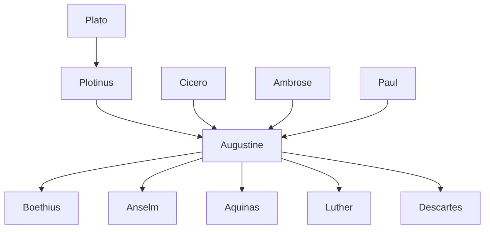

---
cssclasses:
  - Philosophy
subclasses:
  - Medieval-and-Renaissance-Philosophy
  - Metaphysics
  - Epistemology
aliases:
  - augustine
  - confessions
  - city god
  - illumination
  - time consciousness
  - evil privation
  - faith reason
  - grace predestination
  - original sin
  - two cities
tags:
  - Conceptual
authors:
  - "[[Augustine]]"
  - "[[Plotinus]]"
  - "[[Ambrose]]"
  - "[[Pelagius]]"
  - "[[Boethius]]"
movements:
  - "[[Patristics]]"
  - "[[Christian Philosophy]]"
  - "[[Neoplatonism]]"
reference: "[[The search for thought - Unit 6 Chapter 2.pdf]]"
---

#### Central Problem

[[Augustine]] confronts the fundamental question of human existence: how can human beings, caught between their restless searching and their need for stable truth, find their way to God and to genuine self-understanding? Unlike Greek philosophy, which began with the cosmos, Augustine begins with the human soul—the "inner person" (*homo interior*)—in its singular, unrepeatable relation to God.

The driving questions emerge from Augustine's own spiritual journey: Why does the soul remain restless? How can we attain certainty against the Skeptics' doubts? What is the relationship between faith and reason? If God is good and omnipotent, whence comes evil? How can human freedom be reconciled with divine grace? What is the nature of time, that most familiar yet mysterious of realities?

These questions are not abstract puzzles but existential urgencies: "I myself had become for myself a great problem" (*Factus eram ipse mihi magna quaestio*). Augustine's philosophy emerges from confession—the simultaneous acknowledgment of one's sins and of God as God—turning inward to find truth that transcends the self.

#### Main Thesis

**The Unity of Faith and Reason:** Augustine articulates the famous formulas *crede ut intelligas* ("believe in order to understand") and *intellige ut credas* ("understand in order to believe"). Faith and reason are complementary dimensions of the single human relation to God. Faith without understanding is blind acceptance; understanding without faith lacks the illumination needed to grasp divine truth.

**The Theory of Illumination:** Against skepticism, Augustine argues that certain knowledge is possible. Even the skeptic who doubts must exist to doubt: *si fallor, sum* ("if I am deceived, I am"). Yet human reason, being mutable and imperfect, cannot itself be the source of immutable truths (mathematical, logical, ethical principles). These derive from God, who illuminates the mind as the sun illuminates the eye. The ideas are not in a separate Platonic realm but in the divine mind—the *Logos*—through which God creates.

**Evil as Privation:** Rejecting Manichean dualism, Augustine holds that evil has no substantial existence. Since God creates all that is, and all that is is good (being = good), evil can only be the privation or corruption of good—a deficiency, not a thing. Moral evil (*malum culpae*) arises from the will's perverse turning away from God toward lesser goods; physical evil (*malum poenae*) is punishment for original sin.

**Time as Distension of the Soul:** Time cannot be measured as past (no longer), future (not yet), or present (an extensionless instant). Time exists only in the soul's *distensio*—its stretching toward what it remembers (present of past), attends to (present of present), and expects (present of future).

**Grace and Predestination:** Against Pelagianism, Augustine insists that fallen humanity is a "mass of damnation" incapable of salvation without divine grace. The will is truly free only when liberated from sin by grace. Yet Augustine's emphasis on predestination creates tensions with human responsibility that persist throughout Christian thought.

**The Two Cities:** History is the arena of struggle between two "cities": the *civitas Dei* (city of God), animated by love of God even to contempt of self, and the *civitas terrena* (earthly city), animated by love of self even to contempt of God. These are not identical with Church and State but represent two orientations of the will, intermingled until the end of time.

#### Historical Context

[[Augustine]] (354-430 CE) lived through the twilight of the Roman Empire. Born in Tagaste (modern Algeria) to a pagan father and Christian mother (Monica), he received classical Latin education and pursued rhetoric. His spiritual journey led through Manicheanism, academic skepticism, and Neoplatonism before his conversion to Christianity in Milan (386), influenced by Bishop [[Ambrose]] and his reading of [[Plotinus]].

The sack of Rome by Alaric's Goths (410) provoked pagan accusations that Christianity had weakened the Empire. Augustine's *City of God* (413-426) responds by developing a comprehensive theology of history. As Bishop of Hippo (395-430), Augustine combated Manicheanism, Donatism (which denied the validity of sacraments administered by unworthy priests), and Pelagianism (which denied original sin and the necessity of grace). He died in 430 as Vandals besieged Hippo.

Augustine's thought synthesizes biblical revelation, Neoplatonic philosophy, and the previous Patristic tradition, transforming abstract theological concepts into elements of lived interiority. His emphasis on the will, consciousness, and subjective experience anticipates modern philosophy's turn to the subject.

#### Philosophical Lineage

#### Key Thinkers

| Thinker | Dates | Movement | Main Work | Core Concept |
|---------|-------|----------|-----------|--------------|
| [[Augustine]] | 354-430 CE | [[Patristics]] | *Confessions*, *City of God* | Illumination, evil as privation |
| [[Ambrose]] | c. 340-397 CE | [[Latin Patristics]] | *De Officiis* | Moral theology |
| [[Pelagius]] | c. 354-420 CE | [[Pelagianism]] | Lost works | Human capacity for good |
| [[Boethius]] | c. 480-526 CE | [[Late Antiquity]] | *Consolation of Philosophy* | Eternity and providence |
| [[Pseudo-Dionysius]] | c. 5th-6th c. CE | [[Mystical Theology]] | *Divine Names* | Negative theology |

#### Key Concepts

| Concept | Definition | Related to |
|---------|------------|------------|
| Illumination | Divine action enabling human knowledge of immutable truths; God illuminates the mind as sun illuminates eyes | [[Augustine]], [[Epistemology]] |
| Evil as privation | Evil has no substantial existence but is deficiency or corruption of good; moral evil is will's turning from God | [[Augustine]], [[Theodicy]] |
| Distensio animi | Time as "distension of the soul"—the mind's extension through memory, attention, and expectation | [[Augustine]], [[Philosophy of Time]] |
| Original sin | Inherited guilt from Adam's transgression; humanity as "mass of damnation" requiring grace | [[Augustine]], [[Paul]] |
| Grace | Unmerited divine gift enabling salvation; liberates will from bondage to sin | [[Augustine]], [[Soteriology]] |
| Predestination | God's eternal decree determining who receives salvific grace; creates tension with free will | [[Augustine]], [[Calvinism]] |
| Two cities | *Civitas Dei* and *civitas terrena*—two communities defined by opposing loves (of God vs. of self) | [[Augustine]], [[Political Theology]] |
| Confession | Dual acknowledgment: of God as God (praise) and of one's sins as sins (penitence) | [[Augustine]], [[Spiritual Practice]] |
| Inner person | *Homo interior*—the soul in its truth and simplicity; locus of encounter with divine truth | [[Augustine]], [[Anthropology]] |
| Traducianist | Theory that souls are transmitted from parents through generation, explaining transmission of original sin | [[Augustine]], [[Psychology]] |

#### Authors Comparison

| Theme | [[Plotinus]] | [[Augustine]] | [[Pelagius]] |
|-------|--------------|---------------|--------------|
| Source of truth | The One, via intellect | God, via illumination | Human reason |
| Nature of evil | Non-being, matter | Privation of good, will | Bad example, habit |
| Human capacity | Return through philosophy | Requires divine grace | Natural virtue possible |
| Role of will | Subordinate to intellect | Central, but wounded | Free and capable |
| Time | Eternity degraded | Distension of soul | Linear succession |
| Salvation | Philosophical ascent | Faith + grace | Moral effort |
| Influence | Shapes Augustine's thought | Orthodox Christianity | Condemned as heresy |

#### Influences & Connections

- **Predecessors:** [[Augustine]] ← influenced by ← [[Plotinus]], [[Cicero]], [[Ambrose]], [[Paul]]
- **Contemporaries:** [[Augustine]] ↔ opposed by ↔ [[Pelagius]], [[Donatists]], [[Manicheans]]
- **Followers:** [[Augustine]] → influenced → [[Boethius]], [[Anselm]], [[Aquinas]], [[Luther]], [[Calvin]]
- **Later reception:** [[Augustine]] → influenced → [[Descartes]], [[Pascal]], [[Kierkegaard]], [[Heidegger]]
- **Opposing views:** [[Augustine]] ← criticized by ← [[Pelagius]] (on grace), [[Julian of Eclanum]] (on original sin)

#### Summary Formulas

- **[[Augustine]] on knowledge:** In the inner person dwells truth; return to yourself—and if you find your nature mutable, transcend yourself toward the immutable God who illuminates the mind.
- **[[Augustine]] on evil:** Evil is not a substance but privation of good; moral evil arises from the will's perverse turning from God to creatures; physical evil is punishment for original sin.
- **[[Augustine]] on time:** Time is distension of the soul—present memory of past, present attention to present, present expectation of future; only the soul's abiding presence makes time's flow intelligible.
- **[[Augustine]] on grace:** The will is free only when liberated by grace from bondage to sin; without grace, humanity remains a "mass of damnation" incapable of meriting salvation.

#### Timeline

| Year | Event |
|------|-------|
| 354 CE | [[Augustine]] born in Tagaste, North Africa |
| 372 CE | [[Augustine]] reads Cicero's *Hortensius*, turns to philosophy |
| 374 CE | [[Augustine]] joins the Manicheans |
| 384 CE | [[Augustine]] receives chair of rhetoric in Milan |
| 386 CE | Conversion to Christianity; retreat to Cassiciacum |
| 387 CE | [[Augustine]] baptized by [[Ambrose]]; death of Monica |
| 391 CE | [[Augustine]] ordained priest in Tagaste |
| 395 CE | [[Augustine]] consecrated Bishop of Hippo |
| 397-401 CE | [[Augustine]] writes *Confessions* |
| 410 CE | Sack of Rome by Alaric's Goths |
| 411 CE | Beginning of anti-Pelagian controversy |
| 413-426 CE | [[Augustine]] writes *City of God* |
| 430 CE | Death of [[Augustine]] during Vandal siege of Hippo |

#### Notable Quotes

> "You have made us for yourself, O Lord, and our heart is restless until it rests in you." — [[Augustine]]

> "If I am deceived, I am. For one who does not exist cannot be deceived." — [[Augustine]]

> "Do not go outside yourself; return into yourself. Truth dwells in the inner person." — [[Augustine]]

#### See Also

- [[Neoplatonism]]
- [[Patristics]]
- [[Problem of Evil]]
- [[Free Will]]
- [[Divine Grace]]
- [[Philosophy of Time]]
- [[Political Theology]]
- [[Medieval Philosophy]]
- [[Christian Mysticism]]
- [[Predestination]]

> [!NOTE]
> *This summary has been created to present the key points from the source text, which was automatically extracted using LLM. Please note that the summary may contain errors. It serves as an essential starting point for study and reference purposes.*
