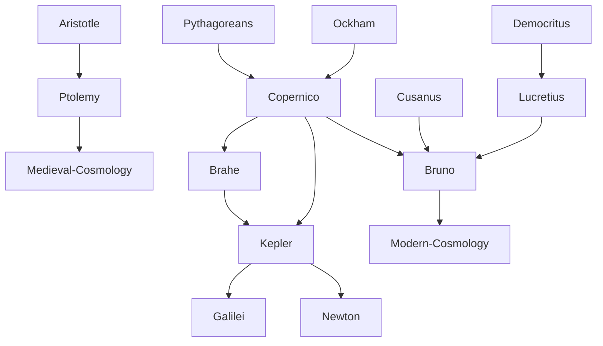

---
cssclasses:
  - Philosophy
  - Physical-Sciences
subclasses:
  - Philosophy-of-Science
  - Epistemology
  - Medieval-and-Renaissance-Philosophy
aliases:
  - scientific revolution
  - copernican revolution
  - heliocentrism
  - geocentrism
  - infinite universe
  - experimental method
  - mathematical physics
  - astronomy
  - cosmology
  - new science
  - nature laws
tags:
  - Conceptual
  - Constructive
authors:
  - "[[Copernico]]"
  - "[[Bruno]]"
  - "[[Kepler]]"
  - "[[Brahe]]"
  - "[[Galilei]]"
movements:
  - "[[Scientific Revolution]]"
  - "[[Renaissance Naturalism]]"
  - "[[Copernicanism]]"
reference: "[[03 The search for thought - Unit 2 Chapter 1.pdf]]"
---

#### Central Problem

The chapter addresses the fundamental historiographical question: what factors produced the birth of modern science, and why did this epochal event occur only in the early modern period? The Scientific Revolution, conventionally dated between [[Copernico]]'s *On the Revolutions of the Heavenly Bodies* (1543) and [[Newton]]'s *Mathematical Principles of Natural Philosophy* (1687), represents one of the most radically innovative events in Western history.

The central problem encompasses multiple dimensions: What were the circumstances, events, and figures that favored the advent of science? What relationship exists between the new knowledge and old culture? Why was science born only in the modern age and not before? What forces opposed its birth and what forces ensured its eventual triumph?

A secondary but crucial problem concerns the astronomical revolution: how did humanity transition from the closed, finite, geocentric universe of Aristotle and Ptolemy to the open, infinite, heliocentric universe of the moderns? This transformation involved not merely scientific observations but profound philosophical and theological implications.

#### Main Thesis

The chapter presents two interconnected theses about the nature and origins of modern science:

**The Conceptual Framework of Science:** Modern science rests on two fundamental conceptions:
1. Nature as an objective, causally structured order of relations governed by laws — not an animated organism full of sympathies and antipathies, but a reality stripped of anthropomorphic attributes
2. Science as experimental-mathematical knowledge that is intersubjectively valid, aiming at progressive understanding and human mastery of the world

**The Genesis of Science:** Science did not emerge from either "circumstances" alone or "genius" alone, but from scientists operating within specific historical-cultural conditions. Key enabling factors included:
- The rise of urban-bourgeois civilization with new technical demands
- The alliance between craftsmen and scholars
- Renaissance culture's laicization of knowledge and recovery of ancient texts
- The contributions of Aristotelianism, natural philosophy, and magic
- The Platonic-Pythagorean conviction that nature is written in mathematical terms

**The Astronomical Revolution:** The transition "from the closed world to the infinite universe" (Koyre) was accomplished not by [[Copernico]] alone but primarily by [[Bruno]], who drew out the revolutionary implications: destruction of the cosmic walls, plurality of inhabited worlds, identity of celestial and terrestrial matter, geometrization of homogeneous space, and infinity of the universe.

#### Historical Context

The Scientific Revolution emerged from the transformation of European society at the beginning of the modern age. The formation of city-states and national monarchies, alongside the consolidation of urban-bourgeois civilization, created new technical demands — ballistics, metallurgy, architecture, navigation, cartography, hydraulics — that stimulated the creation of objective knowledge.

The late medieval Ockhamist school had already begun critiquing Aristotelian theories about celestial and projectile motion, spreading an empiricist mentality favorable to naturalistic research. The Renaissance contributed through its secularization of knowledge, recovery of ancient scientific texts (atomism, Pythagorean heliocentrism, Archimedes), naturalism, and the Platonic-Pythagorean conviction that nature is geometrically structured.

The old Aristotelian-Ptolemaic cosmology had been integrated with Christian theology: Earth at the center suited doctrines of creation, incarnation, and redemption that presupposed Earth as the privileged stage of sacred history. The new science therefore faced opposition from official culture, Church authorities (who saw their cosmological framework and biblical authority challenged), and practitioners of occult sciences.

#### Philosophical Lineage

#### Key Thinkers

| Thinker | Dates | Movement | Main Work | Core Concept |
|---------|-------|----------|-----------|--------------|
| [[Copernico]] | 1473-1543 | [[Copernicanism]] | *On the Revolutions of the Heavenly Bodies* | Heliocentrism |
| [[Brahe]] | 1546-1601 | [[Astronomy]] | Astronomical observations | Tychonic system, orbit concept |
| [[Kepler]] | 1571-1630 | [[Copernicanism]] | *Astronomia nova*, *Harmonices mundi* | Laws of planetary motion |
| [[Bruno]] | 1548-1600 | [[Renaissance Naturalism]] | *On the Infinite Universe and Worlds* | Infinite universe, plurality of worlds |
| [[Galilei]] | 1564-1642 | [[Scientific Revolution]] | *Dialogue*, *Discourses* | Experimental-mathematical method |

#### Key Concepts

| Concept | Definition | Related to |
|---------|------------|------------|
| Scientific Revolution | Radical transformation of knowledge from Copernico (1543) to Newton (1687), establishing experimental-mathematical science | [[Philosophy of Science]], [[Modernity]] |
| Nature as objective order | Nature stripped of anthropomorphic attributes, studied as causal relations between facts governed by laws | [[Galilei]], [[Mechanism]] |
| Efficient causality | The only scientifically admissible cause — the forces that produce a fact, excluding final causes | [[Galilei]], [[Anti-finalism]] |
| Experimental method | Knowledge based on observation, with hypotheses justified empirically through controlled experiments | [[Galilei]], [[Empiricism]] |
| Mathematization | Quantification of natural data through calculation and measurement as essential condition for studying nature | [[Galilei]], [[Kepler]] |
| Intersubjective validity | Scientific procedures are public and discoveries universally controllable, unlike occult knowledge | [[Scientific Revolution]] |
| Geocentrism | Ancient cosmology placing Earth immobile at center of finite, hierarchical universe | [[Ptolemy]], [[Aristotle]] |
| Heliocentrism | Sun at center with planets (including Earth) revolving around it | [[Copernico]], [[Kepler]] |
| Infinite universe | Cosmos without boundaries, containing innumerable suns and inhabited worlds | [[Bruno]], [[Cosmology]] |
| Geometrization of space | Replacement of Aristotelian hierarchical space with homogeneous, Euclidean, infinite space | [[Bruno]], [[Modern Physics]] |

#### Authors Comparison

| Theme | [[Copernico]] | [[Bruno]] | [[Kepler]] |
|-------|---------------|-----------|------------|
| Universe structure | Finite, spherical, closed by sphere of fixed stars | Infinite, open, without center or boundaries | Finite, unique solar system |
| Motivation | Mathematical simplification of celestial calculations | Theological: infinite God requires infinite creation | Mathematical harmony reflecting divine Trinity |
| Celestial motions | Circular, uniform (retained from ancients) | No privileged motion types | Elliptical orbits (correcting Copernico) |
| Method | Mathematical-theoretical | Philosophical-speculative | Observational-mathematical |
| Plurality of worlds | Single solar system | Innumerable inhabited worlds | Single providential system for humanity |
| Scientific status | Astronomer seeking better calculation model | Philosopher drawing cosmological conclusions | Astronomer discovering mathematical laws |

#### Influences & Connections

- **Predecessors:** [[Copernico]] ← influenced by ← [[Pythagoreans]], [[Aristarchus]], ancient heliocentric theories
- **Predecessors:** [[Bruno]] ← influenced by ← [[Lucretius]], [[Democritus]], [[Cusanus]]
- **Contemporaries:** [[Brahe]] ↔ collaboration with ↔ [[Kepler]]
- **Followers:** [[Copernico]] → influenced → [[Bruno]], [[Kepler]], [[Galilei]]
- **Followers:** [[Bruno]] → influenced → [[Modern Cosmology]], [[Spinoza]]
- **Opposing views:** [[Scientific Revolution]] ← opposed by ← [[Aristotelians]], [[Church]], [[Occult Sciences]]

#### Summary Formulas

- **[[Copernico]]:** By placing the Sun at the center and Earth among the planets, the heliocentric hypothesis simplifies astronomical calculations, though the universe remains finite and spherical.
- **[[Bruno]]:** An infinite God must create an infinite universe — open in every direction, without walls or center, containing innumerable suns and inhabited worlds, unified in structure and homogeneous in space.
- **[[Kepler]]:** The universe embodies divine mathematical harmony; planetary orbits are ellipses with the Sun at one focus, and areas swept by the radius vector are proportional to time.
- **Scientific Revolution:** Nature is an objective, causally ordered system of relations governed by laws, knowable through experimental-mathematical methods that yield intersubjectively valid knowledge enabling human mastery of the world.

#### Timeline

| Year | Event |
|------|-------|
| 1473 | [[Copernico]] born in Torun, Poland |
| 1543 | [[Copernico]] publishes *On the Revolutions of the Heavenly Bodies* |
| 1546 | [[Brahe]] born in Denmark |
| 1548 | [[Bruno]] born in Nola |
| 1571 | [[Kepler]] born near Stuttgart |
| 1576 | [[Bruno]] begins European wanderings |
| 1584-1585 | [[Bruno]] publishes Italian dialogues including *On the Infinite Universe and Worlds* |
| 1600 | [[Bruno]] burned at the stake in Rome |
| 1609 | [[Kepler]] publishes first two laws of planetary motion |
| 1619 | [[Kepler]] publishes third law of planetary motion |
| 1630 | [[Kepler]] dies in Regensburg |
| 1687 | [[Newton]] publishes *Mathematical Principles of Natural Philosophy* |
| 1757 | Church withdraws condemnation of Copernican writings |
| 1835 | *On the Revolutions* removed from Index of Forbidden Books |

#### Notable Quotes

> "There are innumerable suns, there are infinite earths, which similarly revolve around those suns, as we see these seven revolve around this sun near to us." — [[Bruno]]

> "I have undertaken the task of rereading all the works of philosophers I was able to obtain, to seek whether any of them had ever thought that the spheres of the universe could move according to motions different from those proposed by mathematics teachers in schools." — [[Copernico]]

> "Knowledge is power." — [[Bacon]]

#### See Also

- [[Galilei]]
- [[Newton]]
- [[Mechanism]]
- [[Empiricism]]
- [[Rationalism]]
- [[Philosophy of Science]]
- [[Cosmology]]
- [[Infinite Universe]]
- [[Heliocentrism]]
- [[Renaissance]]

> [!NOTE]
> *This summary has been created to present the key points from the source text, which was automatically extracted using LLM. Please note that the summary may contain errors. It serves as an essential starting point for study and reference purposes.*
