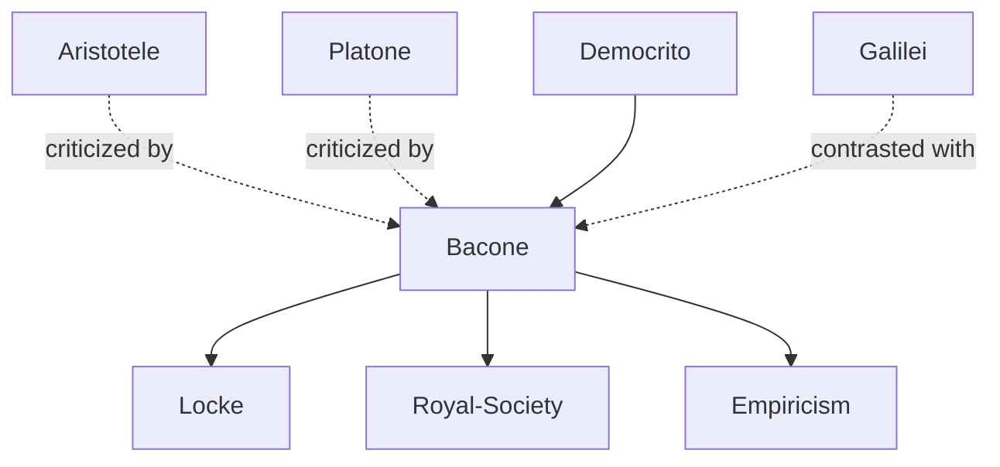

---
cssclasses:
  - Philosophy
  - History
subclasses:
  - Philosophy-of-Science
  - Epistemology
  - 17th-18th-Century-Philosophy
aliases:
  - francis bacon
  - novum organum
  - knowledge power
  - idola
  - inductive method
  - scientific method
  - tables induction
  - new atlantis
  - prejudices mind
  - interpretation nature
  - crucial instance
  - empiricism
tags:
  - Empirical
  - Conceptual
authors:
  - "[[Bacone]]"
  - "[[Aristotele]]"
  - "[[Galilei]]"
  - "[[Gilbert]]"
movements:
  - "[[Scientific Revolution]]"
  - "[[Empiricism]]"
  - "[[Modern Science]]"
reference: "[[03 The search for thought - Unit 2 Chapter 3.pdf]]"
---

#### Central Problem

The chapter addresses several interconnected problems concerning the proper method for scientific inquiry and the relationship between knowledge and human power. While Galilei clarified the method of scientific research, Bacon was the first to envision the power that science offers humanity over the world. Bacon conceived science essentially as directed toward realizing human dominion over nature—the *regnum hominis*—and foresaw the fruitfulness of its practical applications, making him the philosopher and prophet of technology.

The central methodological problem is: how can the human mind free itself from the prejudices and preconceptions (*idola*) that prevent it from correctly interpreting nature? The traditional Aristotelian logic, according to Bacon, is suitable only for prevailing in verbal disputes, not for conquering nature. A new logic is needed—one that can serve as an effective instrument for discovering the causes of natural phenomena and extending human dominion.

A further problem concerns the relationship between theory and practice: Bacon rejects both pure empiricism (the mere accumulation of facts) and pure rationalism (abstract reasoning divorced from experience). The challenge is to find a method that properly combines sensory experience with intellectual discipline—an induction that proceeds methodically and by degrees from particular facts to general principles.

#### Main Thesis

Bacon's fundamental thesis is encapsulated in the formula **"Knowledge is power"** (*sapere è potere*): human knowledge and human power coincide. Ignorance of causes makes it impossible to achieve effects. Nature cannot be conquered except by obeying it; what stands as cause in observation serves as rule in operation. The human intellect needs effective instruments to penetrate nature and dominate it—just as the hand cannot perform work without adequate tools, so the mind requires experiments, which must be devised and technically adapted to the purpose to be realized.

**On the Idola:** Before the mind can properly interpret nature, it must be purified of four types of prejudices:
- *Idola tribus* (Idols of the Tribe): common to all humanity, arising from the nature of human understanding itself, which tends to impose more order on nature than actually exists
- *Idola specus* (Idols of the Cave): peculiar to each individual, arising from education, habits, and circumstances
- *Idola fori* (Idols of the Marketplace): arising from language and the imprecise use of words in social commerce
- *Idola theatri* (Idols of the Theatre): arising from philosophical doctrines of the past, which are like theatrical fictions

**On Method:** Bacon distinguishes his scientific induction from Aristotelian induction. The latter is merely enumeration of particular cases, offering precarious conclusions exposed to refutation by contrary instances. Scientific induction, instead, is founded on the selection and elimination of particular cases—repeated successively under experimental control—until arriving at the true nature and true law of the phenomenon. This requires three types of tables (presence, absence, degrees), followed by exclusion of incompatible causes, formulation of a first hypothesis (*vindemiatio prima*), and testing through "prerogative instances," culminating in the "crucial instance" that definitively identifies the true cause.

**On Form:** The entire inductive process aims to establish the cause of natural things, which Bacon calls the "form"—understood both as the structure that essentially constitutes a natural phenomenon and as the law governing its generation or production.

#### Historical Context

Francis Bacon (1561-1626) lived during the reign of Elizabeth I and James I of England, a period of growing English power following the defeat of the Spanish Armada (1588). He pursued a political career, becoming Attorney General (1607), Lord Keeper (1617), and Lord Chancellor (1618), receiving the titles Baron of Verulam and Viscount of St. Albans. In 1621, Parliament accused him of corruption for accepting monetary gifts in the exercise of his functions. He confessed guilt and was condemned, though the king pardoned his fine and imprisonment. His political career ended, and he retired to Gorhambury, dedicating his final years to study until his death in 1626.

The intellectual context was marked by the Counter-Reformation's attempt to control knowledge and by the persistence of Aristotelian scholasticism in universities. Bacon wrote during the same period as Galilei but developed a different approach to scientific method—one that emphasized systematic collection and organization of empirical data rather than mathematical-deductive reasoning. His work responded to both the promise of new discoveries (the printing press, gunpowder, compass) and the limitations of traditional philosophy, which he saw as sterile verbal disputes incapable of advancing human welfare.

#### Philosophical Lineage

#### Key Thinkers

| Thinker | Dates | Movement | Main Work | Core Concept |
|---------|-------|----------|-----------|--------------|
| [[Bacone]] | 1561-1626 | [[Empiricism]] | *Novum Organum* | Knowledge is power; inductive method |
| [[Aristotele]] | 384-322 BCE | [[Peripatetic School]] | *Organon* | Syllogistic logic; four causes |
| [[Galilei]] | 1564-1642 | [[Scientific Revolution]] | *Dialogue* | Mathematical-experimental method |
| [[Gilbert]] | 1544-1603 | [[Scientific Revolution]] | *De Magnete* | Experimental study of magnetism |

#### Key Concepts

| Concept | Definition | Related to |
|---------|------------|------------|
| Sapere è potere | "Knowledge is power"—human knowledge and power coincide; ignorance of causes prevents achieving effects; nature is conquered only by obeying it | [[Bacone]], [[Scientific Revolution]] |
| Idola tribus | Idols of the Tribe: prejudices common to all humanity arising from human nature itself, which imposes more order on nature than exists | [[Bacone]], [[Epistemology]] |
| Idola specus | Idols of the Cave: prejudices peculiar to each individual, arising from education, habits, and personal circumstances | [[Bacone]], [[Epistemology]] |
| Idola fori | Idols of the Marketplace: prejudices arising from language and imprecise words used in social commerce and communication | [[Bacone]], [[Philosophy of Language]] |
| Idola theatri | Idols of the Theatre: prejudices arising from philosophical doctrines of the past, which are like theatrical fictions or stage plays | [[Bacone]], [[Epistemology]] |
| Scientific induction | Method based on selection and elimination of particular cases under experimental control, proceeding by degrees to discover true causes | [[Bacone]], [[Scientific Method]] |
| Tables | Systematic catalogations of instances: tables of presence, absence, and degrees (comparative), organizing empirical data for analysis | [[Bacone]], [[Scientific Method]] |
| Vindemiatio prima | First hypothesis or "first vintage"—preliminary conjecture about the nature of a phenomenon formulated after analyzing the tables | [[Bacone]], [[Scientific Method]] |
| Crucial instance | Decisive experiment that demonstrates necessary connection between a phenomenon and one of its possible causes, definitively identifying the true cause | [[Bacone]], [[Scientific Method]] |
| Form | The cause of natural things, understood both as structure constituting a phenomenon and as law governing its generation or production | [[Bacone]], [[Metaphysics]] |

#### Authors Comparison

| Theme | [[Bacone]] | [[Galilei]] | [[Aristotele]] |
|-------|------------|-------------|----------------|
| Purpose of science | Domination of nature for human benefit | Understanding natural laws | Contemplation of truth |
| Method | Inductive: systematic collection and elimination of cases | Combined inductive-deductive; mathematical demonstrations | Syllogistic deduction from first principles |
| Role of mathematics | No significant function; even harmful to natural philosophy | Central: language of nature; key to physical reality | Useful but separate from natural philosophy |
| Cause sought | Formal cause (structure and law) | Efficient cause; laws governing phenomena | All four causes, especially final cause |
| View of Aristotle | Criticized for sterile verbal logic | Respected but his followers criticized | Founder of systematic philosophy |
| Experiments | Central: "prerogative instances," crucial instances | Central: "cimento" (experimental verification) | Observation but not systematic experimentation |

#### Influences & Connections

- **Predecessors:** [[Bacone]] ← influenced by ← ancient atomists (Democritus), Renaissance naturalists
- **Contemporaries:** [[Bacone]] ↔ contrasted with ↔ [[Galilei]] (different methodological emphases)
- **Followers:** [[Bacone]] → influenced → [[Locke]], Royal Society, British empiricism, Encyclopedists
- **Opposing views:** [[Bacone]] ← criticized ← [[Aristotele]] (sterile syllogistic logic), [[Platone]] ("subtle caviler, swollen poet, mad theologian")

#### Summary Formulas

- **[[Bacone]]:** Knowledge is power—science must serve human dominion over nature; the mind must be purified of four types of idola (tribe, cave, marketplace, theatre) before it can properly interpret nature through systematic inductive method.

- **[[Bacone]] on method:** Scientific induction differs from Aristotelian enumeration by proceeding methodically through tables of presence, absence, and degrees, eliminating incompatible causes until arriving at the form (structure and law) of phenomena through crucial instances.

- **[[Bacone]] vs. [[Galilei]]:** While Galilei combined observation with mathematical demonstration, privileging quantitative aspects and efficient causes, Bacon emphasized systematic empirical collection without recognizing mathematics' role, seeking formal causes understood as structure and law.

#### Timeline

| Year | Event |
|------|-------|
| 1561 | [[Bacone]] born in London |
| 1597 | First edition of *Essays* published |
| 1603 | James I Stuart ascends to throne; Bacon's political career advances |
| 1607 | [[Bacone]] appointed Attorney General |
| 1609 | *The Wisdom of the Ancients* published |
| 1617 | [[Bacone]] appointed Lord Keeper |
| 1618 | [[Bacone]] appointed Lord Chancellor |
| 1620 | *Novum Organum* published |
| 1621 | [[Bacone]] convicted of corruption; political career ends |
| 1622 | *Natural History* published |
| 1623 | *De Dignitate et Augmentis Scientiarum* published |
| 1626 | [[Bacone]] dies at Gorhambury |
| 1627 | *New Atlantis* published posthumously |

#### Notable Quotes

> "Human knowledge and human power coincide: ignorance of the cause makes it impossible to achieve the effect. Nature is not conquered except by obeying it; and what stands as cause in observation serves as rule in operation." — [[Bacone]]

> "The Idols of the Tribe are founded in human nature itself and in the very tribe or race of humanity. For it is falsely asserted that the human sense is the measure of things. On the contrary, all perceptions, both of the sense and of the mind, are relative to man, not to the universe." — [[Bacone]]

> "There are three kinds of ambition. The first is of those who work to increase their personal power in their country: this is vulgar and degenerate. The second is of those who seek to increase the power of their country in the world: this has more dignity but no less cupidity. The third is of those who seek to establish and exalt the power and dominion of humanity itself over the universe: this ambition is without doubt healthier and nobler than the other two." — [[Bacone]]

#### See Also

- [[Scientific Revolution]]
- [[Empiricism]]
- [[Inductive Method]]
- [[Novum Organum]]
- [[New Atlantis]]
- [[Idola]]
- [[Philosophy of Science]]
- [[Galilei]]
- [[Scientific Method]]
- [[British Empiricism]]
- [[Royal Society]]
- [[Technology]]

> [!NOTE]
> *This summary has been created to present the key points from the source text, which was automatically extracted using LLM. Please note that the summary may contain errors. It serves as an essential starting point for study and reference purposes.*
