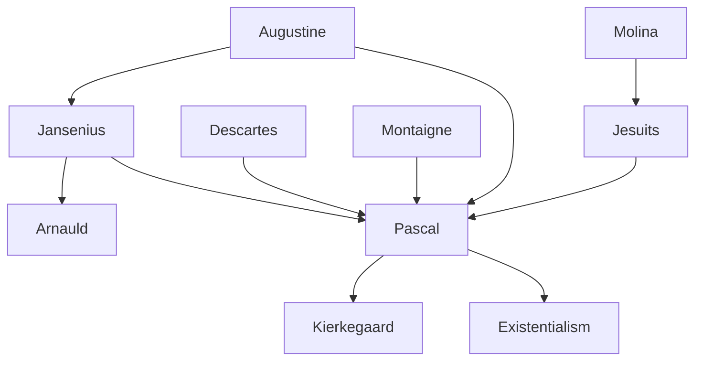

---
cssclasses:
  - Philosophy
subclasses:
  - 17th-18th-Century-Philosophy
  - Philosophy-of-Religion
  - Epistemology
aliases:
  - pascal
  - jansenism
  - wager argument
  - divertissement
  - hidden god
  - esprit finesse
  - heart reasons
  - original sin
  - human condition
  - apologetics
  - fallen king
  - geometric spirit
tags:
  - Conceptual
  - Constructive
authors:
  - "[[Pascal]]"
  - "[[Descartes]]"
  - "[[Augustine]]"
  - "[[Jansenius]]"
  - "[[Arnauld]]"
  - "[[Montaigne]]"
movements:
  - "[[Jansenism]]"
  - "[[Rationalism]]"
  - "[[Augustinianism]]"
reference: "[[03 The search for thought - Unit 4 Chapter 1.pdf]]"
---

#### Central Problem

What is the meaning of human existence, and how can human beings find certainty about their nature, destiny, and relationship to God? [[Pascal]] confronts the fundamental existential questions: "I do not know who put me in the world, nor what the world is, nor what I am myself. I am in a terrifying ignorance of everything." Unlike thinkers who turn to science or metaphysics for answers, Pascal argues that neither the common mentality of *divertissement* (distraction), nor scientific knowledge, nor philosophical reasoning can resolve the mystery of human existence.

The central tension emerges from the paradoxical condition of humanity: humans are simultaneously great and miserable, capable of thought yet incapable of attaining truth or happiness, positioned midway between the infinitely large and infinitely small, between all and nothing. This "monster incomprehensible to itself" cannot be explained by philosophy alone — it requires the light of Christian revelation, specifically the doctrine of original sin, to make sense of why one being can harbor such contradictory qualities.

How should we respond to the impossibility of rationally demonstrating God's existence while recognizing our need for the divine? This leads to Pascal's famous wager argument and his distinction between the "God of the philosophers" and the "God of Abraham, Isaac, and Jacob."

#### Main Thesis

[[Pascal]] develops a comprehensive apologetic strategy arguing that Christianity alone provides the key to the human mystery:

**The Failure of Divertissement:** Ordinary human life consists of *divertissement* — distraction, diversion, flight from oneself through occupations, entertainments, and social activities. This constant busy-ness is not genuine pursuit of happiness but flight from our constitutional unhappiness and the supreme questions about life and death. "Men, not having been able to cure death, misery, ignorance, have decided, in order to be happy, not to think about them."

**The Limits of Science:** Despite being a distinguished scientist himself (inventor of the calculating machine, pioneer in probability theory, researcher on the vacuum), Pascal maintains that science faces structural limitations: (1) dependence on experience constrains reason's powers; (2) scientific first principles are indemonstrable; (3) science is utterly impotent before existential problems. "The knowledge of external things will not console me for ignorance of morality in times of affliction."

**The Limits of Philosophy:** Philosophy nobly addresses the great questions but fails to solve them. Metaphysical proofs of God convince only those who already believe, producing merely a cold "God of philosophers and scholars" rather than the living "God of Abraham." Philosophy cannot explain the paradoxical human condition of simultaneous greatness and misery, oscillating between dogmatism (exalting human greatness) and skepticism (emphasizing human misery).

**The Christian Solution:** Only the Christian doctrine of the Fall explains why one being harbors contradictory qualities. Humanity is like a "dethroned king" (*roi déchu*) who, in exile, retains memory of former splendors and feels tormented by nostalgia for lost dignity. The infinite void within us can be filled only by an infinite object — God himself.

**The Wager:** Since reason cannot determine whether God exists, we must "wager." Betting on God's existence: if we win, we gain everything (eternal beatitude); if we lose, we lose nothing (merely finite worldly pleasures). Betting against God: if we win, we gain only finite goods; if we lose, we lose everything infinite. The rational choice is clear.

**Heart over Reason:** The ultimate organ of faith is the *coeur* (heart) — the faculty of intuitive comprehension that grasps what discursive reason cannot reach. "The heart has its reasons which reason does not know." Faith is a gift of God, not a product of reasoning.

#### Historical Context

[[Pascal]] (1623-1662) lived during the aftermath of the Wars of Religion and the height of the Counter-Reformation. The Catholic Church maintained dominance through mechanisms of censorship while Cartesian rationalism was transforming European thought. Pascal's scientific career was brilliant — at sixteen he composed an *Essay on Conics*, at eighteen invented a calculating machine, and made classic experiments on the vacuum.

In 1654, Pascal experienced a profound religious conversion, documented in the *Memorial* found sewn into his clothing after death: "God of Abraham, God of Isaac, God of Jacob. Not of philosophers and scholars." He joined the "solitaires" of Port-Royal, a religious community reconstructed by the abbot of Saint-Cyran and associated with the Jansenist movement.

[[Jansenius]] (1585-1638), Bishop of Ypres, had published *Augustinus* (1640), attempting Catholic reform through return to Augustine's fundamental theses, especially on grace. According to Jansenism, original sin removed human freedom of will, making humans incapable of good and necessarily inclined to evil. Only God grants the elect the grace of salvation — and the elect are few. This rigorist position opposed the laxer morality of the Jesuits, who followed [[Molina]]'s doctrine of "sufficient grace" available to all.

In 1653, Pope Innocent X condemned five propositions summarizing Jansenist doctrine. Pascal intervened in the controversy by publishing the *Provincial Letters* (1656-1657), masterpieces of depth and humor defending Jansenism against Jesuit casuistry. His unfinished *Apology for the Christian Religion* was published posthumously as the *Pensées* (1669).

#### Philosophical Lineage

#### Key Thinkers

| Thinker | Dates | Movement | Main Work | Core Concept |
|---------|-------|----------|-----------|--------------|
| [[Pascal]] | 1623-1662 | [[Jansenism]] | *Pensées* | Heart vs reason, the wager |
| [[Jansenius]] | 1585-1638 | [[Augustinianism]] | *Augustinus* | Efficacious grace for the elect |
| [[Arnauld]] | 1612-1694 | [[Jansenism]] | *Port-Royal Logic* | Defense of Jansenism |
| [[Augustine]] | 354-430 | [[Patristics]] | *Confessions* | Original sin, grace |
| [[Montaigne]] | 1533-1592 | [[Skepticism]] | *Essays* | Relativism of customs |
| [[Molina]] | 1535-1600 | [[Scholasticism]] | *Concordia* | Sufficient grace for all |

#### Key Concepts

| Concept | Definition | Related to |
|---------|------------|------------|
| Divertissement | Flight from oneself through occupations and entertainments; distraction from existential questions | [[Pascal]], [[Existentialism]] |
| Esprit de géométrie | The geometric or scientific spirit; discursive, demonstrative reasoning about external objects | [[Pascal]], [[Descartes]] |
| Esprit de finesse | The spirit of finesse; intuitive comprehension of human realities through the heart | [[Pascal]], [[Intuitionism]] |
| Coeur (Heart) | Faculty of intuitive knowledge that grasps first principles and God; "The heart has its reasons" | [[Pascal]], [[Augustine]] |
| The Wager | Argument that betting on God's existence is rationally preferable given infinite potential gain | [[Pascal]], [[Decision Theory]] |
| Hidden God | The doctrine that God simultaneously reveals and conceals himself, appearing neither too clearly nor too obscurely | [[Pascal]], [[Negative Theology]] |
| Roi déchu | "Dethroned king" — metaphor for humanity's condition after the Fall, retaining memory of lost greatness | [[Pascal]], [[Original Sin]] |
| Medial position | Human existence positioned between infinitely great and infinitely small, all and nothing | [[Pascal]], [[Anthropology]] |
| Efficacious grace | Grace that actually produces salvation, given only to the elect (Jansenist position) | [[Jansenius]], [[Augustine]] |
| Sufficient grace | Grace available to all that becomes efficacious through human cooperation (Molinist position) | [[Molina]], [[Jesuits]] |

#### Authors Comparison

| Theme | [[Pascal]] | [[Descartes]] | [[Montaigne]] |
|-------|------------|---------------|---------------|
| Role of reason | Limited; cannot solve existential problems | Unlimited; foundation of all knowledge | Limited; reveals human inconsistency |
| Knowledge of God | Through heart, not reason | Through rational proof (ontological) | Unknowable; suspend judgment |
| Human condition | Paradox of greatness and misery | Rational being capable of certainty | Uncertain, variable, limited |
| First principles | Known by heart/intuition, not demonstration | Known by clear and distinct perception | Relative to custom and culture |
| Science | Important but existentially irrelevant | Foundation of mastery over nature | One opinion among many |
| Faith and reason | Faith transcends and completes reason | Faith and reason compatible, separate domains | Faith accepted; reason limited |

#### Influences & Connections

- **Predecessors:** [[Pascal]] ← influenced by ← [[Augustine]] (original sin, grace), [[Montaigne]] (skeptical critique), [[Jansenius]] (theology of grace)
- **Contemporaries:** [[Pascal]] ↔ controversy with ↔ [[Jesuits]] (Provincial Letters), [[Pascal]] ↔ dialogue with ↔ [[Arnauld]] (Port-Royal)
- **Followers:** [[Pascal]] → influenced → [[Kierkegaard]] (leap of faith, existence), [[Existentialism]] (absurdity, authentic existence)
- **Opposing views:** [[Pascal]] ← critical of ← [[Descartes]] (God as clockmaker), [[Pascal]] ← opposed to ← [[Molina]] and [[Jesuits]] (lax morality, sufficient grace)

#### Summary Formulas

- **[[Pascal]]:** The human being, a "thinking reed" positioned between all and nothing, great in thought yet miserable in condition, can only understand itself through the Christian doctrine of the Fall; reason must submit to the heart, which alone senses God.

- **[[Jansenius]]:** Original sin destroyed human freedom; only God's efficacious grace, granted to the few elect, can save — the mass of humanity remains in perdition by just divine decree.

- **On Divertissement:** Human beings flee from themselves through constant distraction because they cannot bear to confront their constitutional misery and the terrifying questions of existence.

- **On the Wager:** Since reason cannot determine God's existence, prudence dictates wagering on God — if you win, you gain infinite beatitude; if you lose, you lose only finite worldly pleasures.

#### Timeline

| Year | Event |
|------|-------|
| 1623 | [[Pascal]] born in Clermont |
| 1640 | [[Jansenius]]' *Augustinus* published posthumously |
| 1640 | [[Pascal]] publishes *Essay on Conics* at age sixteen |
| 1642 | [[Pascal]] invents the calculating machine |
| 1646 | [[Pascal]]'s "first conversion" — approaches Jansenism |
| 1651-1652 | [[Pascal]]'s treatises on the vacuum and equilibrium of liquids |
| 1653 | Pope Innocent X condemns five Jansenist propositions |
| 1654 | [[Pascal]]'s "second conversion" — joins Port-Royal solitaires |
| 1656-1657 | [[Pascal]] publishes the *Provincial Letters* |
| 1662 | [[Pascal]] dies in Paris at age thirty-nine |
| 1669 | *Pensées* published by Port-Royal friends |

#### Notable Quotes

> "The heart has its reasons which reason does not know." — [[Pascal]]

> "Man is but a reed, the weakest thing in nature; but he is a thinking reed." — [[Pascal]]

> "The eternal silence of these infinite spaces frightens me." — [[Pascal]]

#### See Also

- [[Jansenism]]
- [[Original Sin]]
- [[Grace]]
- [[Existentialism]]
- [[Skepticism]]
- [[Apologetics]]
- [[Faith and Reason]]
- [[Probability Theory]]
- [[Port-Royal]]
- [[Provincial Letters]]

> [!NOTE]
> *This summary has been created to present the key points from the source text, which was automatically extracted using LLM. Please note that the summary may contain errors. It serves as an essential starting point for study and reference purposes.*
