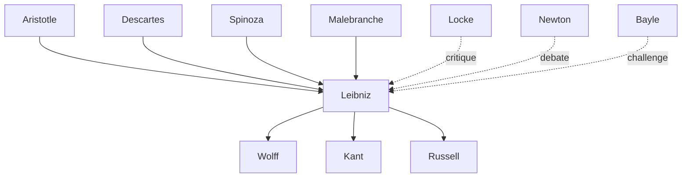

---
cssclasses:
  - Philosophy
subclasses:
  - Metaphysics
  - 17th-18th-Century-Philosophy
  - Epistemology
aliases:
  - leibniz
  - monad
  - monads
  - monadology
  - preestablished harmony
  - sufficient reason
  - identity indiscernibles
  - truths reason
  - theodicy
  - best possible
  - vis viva
  - apperception
  - petites perceptions
  - innate ideas
  - contingent truths
  - necessary truths
  - principle contradiction
  - compossibility
  - individual substance
  - universal mind
tags:
  - Conceptual
authors:
  - "[[Leibniz]]"
  - "[[Descartes]]"
  - "[[Spinoza]]"
  - "[[Locke]]"
  - "[[Newton]]"
  - "[[Aristotle]]"
  - "[[Bayle]]"
  - "[[Voltaire]]"
  - "[[Kant]]"
movements:
  - "[[Rationalism]]"
  - "[[Monadism]]"
reference: "[[03 The search for thought - Unit 4 Chapter 3.pdf]]"
---

#### Central Problem

How can we reconcile the rationalist demand for a fully intelligible universe with human freedom, divine providence, and the apparent existence of evil? [[Leibniz]] confronts the challenge of developing a metaphysical system that preserves both the rational order of reality and the contingency necessary for moral responsibility—against [[Spinoza]]'s necessitarianism that eliminates genuine freedom and divine choice.

The problem extends to the nature of substance itself: if [[Descartes]]' dualism of thinking and extended substance proves untenable, and [[Spinoza]]'s monism reduces everything to a single necessary substance, what alternative conception of reality can ground both the unity and multiplicity of the world while maintaining the activity and individuality of finite beings?

#### Main Thesis

[[Leibniz]] argues that reality consists of infinitely many simple, immaterial substances called monads—each a unique "mirror of the universe" whose internal development unfolds according to pre-established harmony without causal interaction. This world is contingent, not necessary: God freely chose it from infinitely many possible worlds as the best possible—the optimal combination of perfection and variety, even though it contains evil.

Key claims include:
- **Contingency over necessity:** Unlike [[Spinoza]], [[Leibniz]] maintains that this world exists because God freely chose it, not by logical necessity
- **Sufficient reason:** Everything has a reason why it is so rather than otherwise—for contingent truths, this reason lies in God's wisdom choosing the best
- **Monadological pluralism:** Reality consists of infinitely many simple substances (monads) with perception and appetition, not Cartesian extended matter
- **Pre-established harmony:** Mind and body, and all monads, correspond without causal interaction through divine pre-coordination
- **Innate ideas:** Against [[Locke]]'s empiricism, the mind contains innate structures and dispositions that experience merely activates

#### Historical Context

[[Leibniz]] developed his philosophy during the late 17th and early 18th centuries, a period of intense philosophical debate about the legacy of [[Descartes]]. The Cartesian system had generated fundamental problems—particularly the mind-body problem and the difficulty of explaining how two radically different substances (thinking and extended) could interact.

[[Spinoza]]'s radical solution—collapsing the Cartesian duality into a single infinite substance of which minds and bodies are merely modes—had provoked strong reactions. His apparent elimination of divine freedom, human moral responsibility, and personal immortality made his philosophy dangerous in the eyes of religious authorities and many philosophers.

Meanwhile, the rise of Newtonian physics raised questions about the relationship between mathematical physics and metaphysics. [[Newton]]'s concept of absolute space and action at a distance challenged rationalist demands for intelligibility. [[Locke]]'s empiricism in England questioned the rationalist reliance on innate ideas and purely a priori knowledge.

[[Leibniz]] sought a middle path: a rationalist metaphysics that could accommodate the new science while preserving divine providence, human freedom, and the reality of individual substances against both Cartesian dualism and Spinozistic monism.

#### Philosophical Lineage

#### Key Thinkers

| Thinker | Dates | Movement | Main Work | Core Concept |
|---------|-------|----------|-----------|--------------|
| [[Leibniz]] | 1646–1716 | [[Rationalism]] | *Monadology* | Monads, pre-established harmony |
| [[Descartes]] | 1596–1650 | [[Rationalism]] | *Meditations* | Substance dualism, extension |
| [[Spinoza]] | 1632–1677 | [[Rationalism]] | *Ethics* | Substance monism, necessity |
| [[Locke]] | 1632–1704 | [[Empiricism]] | *Essay Concerning Human Understanding* | Tabula rasa, empiricism |
| [[Newton]] | 1643–1727 | [[Natural Philosophy]] | *Principia* | Absolute space, mechanics |
| [[Bayle]] | 1647–1706 | [[Skepticism]] | *Historical and Critical Dictionary* | Problem of evil |
| [[Malebranche]] | 1638–1715 | [[Occasionalism]] | *Search After Truth* | Occasionalism, vision in God |
| [[Voltaire]] | 1694–1778 | [[Enlightenment]] | *Candide* | Critique of optimism |

#### Key Concepts

| Concept | Definition | Related to |
|---------|------------|------------|
| Monad | Simple, indivisible, immaterial substance without parts or windows, constituting the ultimate element of reality | [[Leibniz]], [[Metaphysics]] |
| Pre-established Harmony | God's coordination of all monads at creation so they correspond perfectly without causal interaction | [[Leibniz]], [[Mind-Body Problem]] |
| Principle of Sufficient Reason | Nothing exists or occurs without a reason explaining why it is so rather than otherwise | [[Leibniz]], [[Rationalism]] |
| Truths of Reason | Necessary truths whose opposite implies contradiction, known a priori | [[Leibniz]], [[Epistemology]] |
| Truths of Fact | Contingent truths about actual existence whose opposite is logically possible | [[Leibniz]], [[Epistemology]] |
| Identity of Indiscernibles | No two substances can be perfectly identical; every individual differs from every other | [[Leibniz]], [[Metaphysics]] |
| Apperception | Conscious perception or awareness of one's own mental states | [[Leibniz]], [[Philosophy of Mind]] |
| Petites Perceptions | Minute, unconscious perceptions below the threshold of awareness | [[Leibniz]], [[Philosophy of Mind]] |
| Vis Viva | Living force (mv²), the active principle in matter opposed to Cartesian extension | [[Leibniz]], [[Physics]] |
| Theodicy | Justification of God's goodness despite the existence of evil | [[Leibniz]], [[Philosophy of Religion]] |
| Individual Substance | Complete notion containing all predicates true of that individual throughout existence | [[Leibniz]], [[Logic]] |
| Compossibility | Compatibility of different possibilities that can coexist in the same possible world | [[Leibniz]], [[Modal Logic]] |

#### Authors Comparison

| Theme | [[Leibniz]] | [[Spinoza]] | [[Descartes]] |
|-------|-------------|-------------|---------------|
| Substance | Infinitely many simple monads | One infinite substance (God/Nature) | Two substances (mind, matter) |
| World's existence | Contingent, freely chosen by God | Necessary, follows from God's nature | Created by God's free will |
| Mind-body relation | Pre-established harmony | Parallelism (attributes of one substance) | Interactionism (pineal gland) |
| Freedom | Preserved through contingency and spontaneity | Denied (all is necessary) | Affirmed but problematic |
| Evil | Permitted for greater good; best possible world | No moral evil (natural necessity) | Privation of being |
| Innate ideas | Virtually innate, activated by experience | All ideas in God | Clear and distinct ideas innate |
| God | Personal, wise, chooses the best | Impersonal, identical with Nature | Infinite, perfect, guarantor of truth |

#### Life and Works

Leibniz was born in Leipzig in 1646. A precocious intellect, he earned his law degree at Altdorf in 1666 and briefly associated with Rosicrucians in Nuremberg. He served Duke Johann Friedrich of Hannover, traveling to Paris in 1672 where he met leading intellectuals. In 1676, he independently discovered infinitesimal calculus (sparking a priority dispute with Newton). As librarian to successive Dukes of Hannover, he pursued diplomatic missions, corresponded extensively with scholars across Europe, and founded the Berlin Academy of Sciences (1700). He died in 1716, largely forgotten, his vast correspondence and unpublished manuscripts containing his most important philosophical ideas.

**Major works:**
- *Discourse on Metaphysics* (1686)
- *New System of Nature* (1695)
- *New Essays on Human Understanding* (1703–04, published posthumously)
- *Essays on Theodicy* (1710)
- *Monadology* (1714)

#### The Contingent Order of the World

Against Spinoza's necessitarianism (where everything follows necessarily from God's nature), Leibniz defended the contingency of the created world. While Spinoza held that God could not have created differently, Leibniz argued that God freely chose this world from infinitely many possible worlds. This preserves divine freedom, human moral responsibility, and the meaningfulness of praise and blame.

The actual world exists not by logical necessity but because God judged it the best among possible alternatives. This "optimism" grounds both metaphysics and ethics in divine wisdom and goodness.

#### Truths of Reason and Truths of Fact

Leibniz distinguished two fundamental types of truth:

**Truths of Reason (Necessary Truths):**
- Their opposite implies contradiction
- Reducible to identical propositions (A = A)
- Governed by the principle of contradiction
- Known a priori, independent of experience
- Example: mathematical and logical truths

**Truths of Fact (Contingent Truths):**
- Their opposite is logically possible
- Cannot be reduced to identities in finite steps
- Governed by the principle of sufficient reason
- Known through experience
- Example: "Caesar crossed the Rubicon"

The **principle of sufficient reason** states that nothing happens without a reason that determines why it is so and not otherwise. For contingent truths, this reason lies in God's choice of the best, not in logical necessity.

#### Individual Substance and Complete Notion

Leibniz's concept of individual substance derives from his logical analysis. Every true proposition has the predicate "contained" in the subject. For individual substances like Alexander or Caesar, this means their complete notion contains all predicates true of them—past, present, and future.

This raises the problem of determinism: if Caesar's notion contains "crossing the Rubicon," how is his action free? Leibniz responds that while the action is certain (being contained in the notion), it is not necessary—it follows from reasons, not logical compulsion. God sees all of Caesar's actions in his complete notion, but Caesar performs them spontaneously according to his own nature.

#### Physics and Metaphysics: The Concept of Force

Leibniz criticized both Cartesian mechanism (matter as mere extension) and ancient atomism:

**Against Atomism:**
- Atoms (indivisible extended units) are self-contradictory—anything extended is divisible
- The law of continuity forbids minimal units or discrete leaps in nature

**Against Cartesian Mechanism:**
- Extension alone cannot explain motion or activity
- Matter requires an intrinsic principle of action

Leibniz's solution: **vis viva** (living force), measured as mv² rather than Descartes's momentum (mv). This active force, connecting physics and metaphysics, anticipates the concept of energy. Force is the essence of substance—not passive extension but active striving.

The **law of continuity** (natura non facit saltus—nature makes no leaps) governs all natural processes, ensuring gradual transitions without gaps or discontinuities.

#### The Monadological Universe

Monads are the ultimate constituents of reality—simple, unextended, immaterial substances:

**Characteristics of Monads:**
- Simple (without parts) and thus indestructible except by divine annihilation
- "Without windows"—no causal interaction with other monads
- Each mirrors the entire universe from its unique perspective
- Differentiated by their degree of perception and appetition

**Identity of Indiscernibles:** No two monads are perfectly identical. Even apparently similar things differ in their internal states and perspectives.

**Perception, Apperception, and Appetition:**
- *Perception*: the monad's representation of the many in the one
- *Apperception*: conscious, reflective awareness (present only in rational souls)
- *Appetition*: the tendency toward new perceptions, the internal principle of change
- *Petites perceptions*: unconscious micro-perceptions constituting the continuum of mental life

**Hierarchy of Monads:**
1. Bare monads (matter)—confused perceptions without memory
2. Animal souls—perception with memory
3. Rational spirits—apperception, reason, self-consciousness

#### Pre-established Harmony

Since monads have no windows, how do they correspond? Leibniz's answer: **pre-established harmony**. God, like a perfect clockmaker, synchronized all monads at creation so their internal developments correspond without interaction.

This solves the mind-body problem: soul and body don't causally interact but run in parallel, pre-coordinated by God. Unlike Malebranche's occasionalism (requiring constant divine intervention), harmony was established once at creation.

The harmony also explains knowledge: our perceptions correspond to external reality not through causal contact but through God's harmonization of all perspectives.

#### Innatism Against Locke

Against Locke's empiricist claim that the mind is a blank slate (tabula rasa), Leibniz defended innate ideas in the *New Essays on Human Understanding*:

**Leibniz's Innatism:**
- The mind is not blank but has innate dispositions and structures
- Ideas are "virtually" innate—present as tendencies that experience activates
- Necessary truths (logic, mathematics, metaphysics) cannot derive from experience
- The intellect itself is innate to the mind

Leibniz modifies the scholastic principle: "Nothing is in the intellect that was not first in the senses—**except the intellect itself**."

#### Theodicy: God and the Problem of Evil

In *Essays on Theodicy* (1710), Leibniz addressed Pierre Bayle's skeptical challenge: how can an omnipotent, omniscient, benevolent God permit evil?

**Leibniz's Solution:**
- God wills the best possible world, not a perfect one
- This world contains evil but is nonetheless optimal
- Evil is necessary for greater goods (especially human freedom)
- God "permits" evil without willing it directly

**Types of Evil:**
- *Metaphysical evil*: finitude and limitation inherent in creatures
- *Physical evil*: suffering, often consequence of moral evil
- *Moral evil*: sin, freely chosen by creatures

**The Best of All Possible Worlds:**
- Not the happiest world, but the one with the best balance of perfection
- God could eliminate evil only by eliminating freedom or creating nothing
- Natural laws and human freedom are goods worth their costs

**Compossibility:** Not all possible perfections can coexist. God chooses the optimal combination—the world with maximum perfection and minimum evil.

**Criticism:** Voltaire satirized Leibnizian optimism in *Candide* (1759) through the naïve Dr. Pangloss, who maintains optimism despite cascading disasters. Kant later argued that rational theodicy fails and must yield to moral faith.

#### Historical Significance

[[Leibniz]]'s philosophy represents a sophisticated rationalist alternative to both Cartesian mechanism and Spinozistic monism. His contributions span:

- **Metaphysics**: monadology as an alternative to materialism and Spinozism
- **Logic**: the complete notion of substance, anticipating predicate logic
- **Physics**: the concept of force and conservation principles
- **Epistemology**: defense of innate ideas and the distinction of truth-types
- **Theology**: the most developed philosophical theodicy in Western thought
- **Mathematics**: infinitesimal calculus (independently of Newton)

His influence extends through [[Wolff]]'s systematization to [[Kant]]'s critical philosophy, and his logical ideas anticipate developments in modern symbolic logic.

#### Influences & Connections

- **Predecessors:** [[Leibniz]] ← influenced by ← [[Aristotle]], [[Descartes]], [[Spinoza]], [[Malebranche]]
- **Contemporaries:** [[Leibniz]] ↔ debate with ↔ [[Newton]], [[Locke]], [[Bayle]]
- **Followers:** [[Leibniz]] → influenced → [[Wolff]], [[Kant]], [[Russell]]
- **Critics:** [[Leibniz]] ← criticized by ← [[Voltaire]] (*Candide*), [[Kant]] (theodicy)

#### Summary Formulas

- **[[Leibniz]]:** Reality consists of infinitely many simple, immaterial monads coordinated by pre-established harmony; this contingent world is the best God could choose from infinite possibilities.
- **Principle of Sufficient Reason:** Nothing exists without a reason; for necessary truths, the reason is logical; for contingent truths, it is God's choice of the best.
- **Monadology:** Monads are windowless, simple substances with perception and appetition that mirror the universe from their unique perspectives.
- **Theodicy:** Evil exists because eliminating it would require eliminating freedom; God permits evil for the greater good of a world with free, responsible beings.

#### Timeline

| Year | Event |
|------|-------|
| 1646 | [[Leibniz]] born in Leipzig |
| 1666 | Earns law degree at Altdorf; associates with Rosicrucians |
| 1672 | Travels to Paris; meets leading intellectuals |
| 1676 | Independently discovers infinitesimal calculus |
| 1686 | Writes *Discourse on Metaphysics* |
| 1695 | Publishes *New System of Nature* |
| 1700 | Founds Berlin Academy of Sciences |
| 1703–04 | Writes *New Essays on Human Understanding* (response to [[Locke]]) |
| 1710 | Publishes *Essays on Theodicy* |
| 1714 | Writes *Monadology* |
| 1716 | [[Leibniz]] dies in Hannover |
| 1759 | [[Voltaire]] publishes *Candide*, satirizing Leibnizian optimism |

#### Notable Quotes

> "Nothing is in the intellect that was not first in the senses—except the intellect itself." — [[Leibniz]], *New Essays on Human Understanding*

> "Why is there something rather than nothing? For nothing is simpler and easier than something." — [[Leibniz]], *Principles of Nature and Grace*

> "Monads have no windows through which anything could enter or leave." — [[Leibniz]], *Monadology*

#### Connections

```mermaid
flowchart TD
    LeibnizPhil[Leibniz Philosophy] --> AgainstSpinoza[Against Spinoza]
    LeibnizPhil --> AgainstDescartes[Against Descartes]
    LeibnizPhil --> AgainstLocke[Against Locke]
    
    AgainstSpinoza --> ContingencyNecessity[Contingency vs Necessity]
    AgainstSpinoza --> DivineFreedom[Divine Freedom]
    AgainstSpinoza --> PersonalGod[Personal God]
    
    AgainstDescartes --> ForceExtension[Force vs Extension]
    AgainstDescartes --> MonadResCogitans[Monad vs Res Cogitans]
    AgainstDescartes --> HarmonyInteraction[Pre-established Harmony vs Interactionism]
    
    AgainstLocke --> InnatismEmpiricism[Innatism vs Empiricism]
    AgainstLocke --> NecessaryTruths[Necessary Truths from Reason]
    
    LeibnizPhil --> KeyDoctrines[Key Doctrines]
    KeyDoctrines --> Monadology[Monadology]
    KeyDoctrines --> SufficientReason[Sufficient Reason]
    KeyDoctrines --> PreestablishedHarmony[Pre-established Harmony]
    KeyDoctrines --> Theodicy[Theodicy]
    KeyDoctrines --> IdentityIndiscernibles[Identity of Indiscernibles]
    
    Monadology --> MonadHierarchy[Hierarchy]
    MonadHierarchy --> BareMonads[Bare Monads Matter]
    MonadHierarchy --> AnimalSouls[Animal Souls Memory]
    MonadHierarchy --> RationalSpirits[Rational Spirits Apperception]
    
    Theodicy --> ProblemEvil[Problem of Evil]
    ProblemEvil --> BestWorld[Best Possible World]
    ProblemEvil --> FreedomEvil[Freedom Requires Evil Possibility]
    ProblemEvil --> CompossibilityLimits[Compossibility Limits Perfection]

    class LeibnizPhil,AgainstSpinoza,AgainstDescartes,AgainstLocke,ContingencyNecessity,DivineFreedom,PersonalGod,ForceExtension,MonadResCogitans,HarmonyInteraction,InnatismEmpiricism,NecessaryTruths,KeyDoctrines,Monadology,SufficientReason,PreestablishedHarmony,Theodicy,IdentityIndiscernibles,MonadHierarchy,BareMonads,AnimalSouls,RationalSpirits,ProblemEvil,BestWorld,FreedomEvil,CompossibilityLimits internal-link;
```

#### See Also

- [[Rationalism]]
- [[Monadism]]
- [[Descartes]]
- [[Spinoza]]
- [[Locke]]
- [[Pre-established Harmony]]
- [[Theodicy]]
- [[Mind-Body Problem]]
- [[Innate Ideas]]
- [[Kant]]

> [!NOTE]
> *This summary has been created to present the key points from the source text, which was automatically extracted using LLM. Please note that the summary may contain errors. It serves as an essential starting point for study and reference purposes.*
