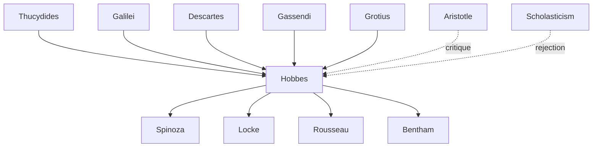

---
cssclasses:
  - Philosophy
subclasses:
  - Social-and-Political-Philosophy
  - 17th-18th-Century-Philosophy
  - Ethics
aliases:
  - hobbes
  - leviathan
  - state of
  - social contract
  - war of
  - absolute sovereignty
  - materialism
  - mechanicism
  - natural law
  - political philosophy
  - homo homini
  - bellum omnium
tags:
  - Conceptual
  - Constructive
authors:
  - "[[Hobbes]]"
  - "[[Descartes]]"
  - "[[Aristotle]]"
  - "[[Gassendi]]"
  - "[[Galilei]]"
  - "[[Grotius]]"
  - "[[Locke]]"
  - "[[Vico]]"
movements:
  - "[[Materialism]]"
  - "[[Social Contract Theory]]"
  - "[[Absolutism]]"
reference: "[[03 The search for thought - Unit 5 Chapter 1.pdf]]"
---

#### Central Problem

How can human beings, naturally driven by self-interest, competition, and mutual fear, escape the precarious "state of nature" (a condition of perpetual war of all against all) and establish a stable, peaceful civil society? [[Hobbes]] confronts the fundamental challenge of political philosophy: grounding the legitimacy and necessity of absolute sovereign power on purely rational and secular principles, without recourse to divine authority or traditional customs.

The problem extends to the nature of reason itself: if human knowledge is limited to bodies and their motions, how can we construct a rigorous political science that yields necessary conclusions comparable to geometry? And if good and evil are merely subjective preferences, how can we establish objective norms for social coexistence?

#### Main Thesis

[[Hobbes]] argues that human beings, by nature egoistic and competitive, find themselves in a "state of nature" characterized by war of all against all (*bellum omnium contra omnes*), where life is "solitary, poor, nasty, brutish, and short." To escape this condition, rational calculation (*reason as calculus*) leads humans to establish, through a social contract, an absolute sovereign (the *Leviathan*) to whom they transfer all their natural rights in exchange for peace and security.

Key claims include:
- **Materialism:** Only bodies exist; all phenomena (including thought and sensation) are motions of matter
- **Reason as calculation:** Reasoning is adding and subtracting concepts; language enables generalization
- **Natural egoism:** Humans are not naturally social; self-interest and fear of death drive all action
- **State of nature as war:** Without common power, the natural condition is conflict; no justice or injustice exists
- **Laws of nature:** Reason prescribes rules for self-preservation: seek peace, renounce unlimited right, keep covenants
- **Social contract:** Individuals mutually transfer their rights to an absolute sovereign
- **Absolutism:** The sovereign's power is unlimited, indivisible, and the source of all law and morality

#### Historical Context

[[Hobbes]] wrote during the tumultuous period of the English Civil War (1642–1651), which pitted Parliamentarians against Royalists and culminated in the execution of King Charles I (1649) and the establishment of Cromwell's Commonwealth. This experience of civil strife and political instability profoundly shaped his conviction that only absolute sovereign power could prevent society from degenerating into chaos.

His philosophy emerged in dialogue with the new mechanical philosophy of [[Galilei]] and [[Descartes]], the libertine circles in Paris (where he spent years in exile), and the nascent tradition of natural law theory represented by [[Grotius]]. Unlike [[Descartes]]' dualistic rationalism, [[Hobbes]] developed a thoroughgoing materialism that extended to the human mind and political organization.

The Restoration of the monarchy (1660) vindicated some of [[Hobbes]]' concerns about political order, though his materialist views on religion made him controversial across political divides.

#### Philosophical Lineage

#### Key Thinkers

| Thinker | Dates | Movement | Main Work | Core Concept |
|---------|-------|----------|-----------|--------------|
| [[Hobbes]] | 1588–1679 | [[Social Contract Theory]] | *Leviathan* | Absolute sovereignty, state of nature |
| [[Grotius]] | 1583–1645 | [[Natural Law Theory]] | *On the Law of War and Peace* | Natural sociability, natural rights |
| [[Descartes]] | 1596–1650 | [[Rationalism]] | *Meditations* | Dualism, cogito |
| [[Galilei]] | 1564–1642 | [[Mechanical Philosophy]] | *Dialogue* | Mathematical physics |
| [[Locke]] | 1632–1704 | [[Empiricism]] | *Two Treatises of Government* | Limited government, property |
| [[Vico]] | 1668–1744 | [[Historical Philosophy]] | *New Science* | Verum-factum principle |

#### Key Concepts

| Concept | Definition | Related to |
|---------|------------|------------|
| State of Nature | The hypothetical pre-political condition of humanity, characterized by war of all against all and the absence of justice | [[Hobbes]], [[Social Contract Theory]] |
| Bellum Omnium Contra Omnes | War of all against all; the natural condition when no common power exists to keep humans in awe | [[Hobbes]], [[Political Philosophy]] |
| Homo Homini Lupus | "Man is wolf to man"; expresses the natural hostility between humans in the state of nature | [[Hobbes]], [[Political Philosophy]] |
| Natural Right (Ius Naturale) | The liberty each person has to use their power for self-preservation; the right of all to all things | [[Hobbes]], [[Natural Law Theory]] |
| Law of Nature (Lex Naturalis) | A precept discovered by reason that forbids actions destructive to life; prescribes seeking peace | [[Hobbes]], [[Ethics]] |
| Social Contract | The mutual transfer of natural rights to a sovereign, creating civil society and ending the state of nature | [[Hobbes]], [[Social Contract Theory]] |
| Leviathan | The absolute sovereign (individual or assembly) that holds all power transferred by the social contract | [[Hobbes]], [[Absolutism]] |
| Reason as Calculus | Reasoning consists in adding and subtracting concepts; enabled by language and conventional signs | [[Hobbes]], [[Epistemology]] |
| Materialism | The doctrine that only bodies (extended matter in motion) exist; mind and thought are material motions | [[Hobbes]], [[Metaphysics]] |
| Determinism | All events, including human actions and volitions, are necessarily caused by prior causes | [[Hobbes]], [[Philosophy of Action]] |

#### Authors Comparison

| Theme | [[Hobbes]] | [[Grotius]] | [[Locke]] |
|-------|------------|-------------|-----------|
| Human nature | Egoistic, asocial, competitive | Naturally social, rational | Rational, with natural rights |
| State of nature | War of all against all | Relatively peaceful, with natural law | State of liberty, not license |
| Natural law | Rules for self-preservation discovered by reason | Universal moral principles independent of God | Divine law accessible to reason |
| Social contract | Transfers all rights to absolute sovereign | Founds legitimate authority on consent | Establishes limited government |
| Sovereign power | Absolute, indivisible, above the law | Limited by natural law | Limited by natural rights |
| Property | Created by the state, not natural | Natural right | Natural right, pre-political |
| Right of resistance | None; obedience absolute | Permitted against tyranny | Permitted against tyranny |

#### Life and Works

Thomas Hobbes was born on April 5, 1588, in Westport, England. He studied at Oxford but credited his intellectual formation to extensive contacts with European cultural circles during travels on the continent. He resided long in Paris, where he frequented [[Gassendi]] and French libertine circles. He was friends with [[Galilei]] and Father Mersenne, through whom he sent his *Objections* to [[Descartes]]' *Meditations*.

**Major works:**
- *De Cive* (*The Citizen*, 1642)
- *Leviathan* (1651) — his masterwork on political philosophy
- *De Corpore* (*On the Body*, 1655)
- *De Homine* (*On Man*, 1658)

He spent his final years in polemics, including debates with Bishop Bramhall defending the corporeality of God. He died in London on December 4, 1679, at age 91.

#### Reason and Calculation

For [[Hobbes]], reason is the capacity to foresee and plan one's conduct using language—conventional signs that enable generalization. Unlike animals (who also learn from experience), humans can project far into the future because language allows them to form general concepts.

**Reasoning as calculation:** All reasoning is adding or subtracting concepts. Example: "man = body + animate + rational." The general form is the hypothetical syllogism, which reveals causal connections.

**A priori vs. a posteriori demonstration:**
- *A priori* (cause → effect): yields necessary conclusions; possible only for human-made objects (mathematics, ethics, politics)
- *A posteriori* (effect → cause): yields probable conclusions; applies to natural objects whose causes we cannot know

This distinction anticipates [[Vico]]'s *verum-factum* principle: we can truly know only what we make.

#### Materialism

[[Hobbes]]' materialism holds that only bodies exist—whatever can act or be acted upon must be corporeal. The word "incorporeal" is meaningless; even God, if He exists, must be corporeal.

**Implications:**
- Sensation is motion produced in sense organs by external bodies
- Imagination is residual motion (inertia) from sensation
- The thinking soul is material; thought is corporeal motion
- The mind is not a separate substance (contra [[Descartes]])

**Division of philosophy:**
- *Natural philosophy*: studies natural bodies
- *Civil philosophy*: studies artificial bodies (human societies)
  - *Ethics*: emotions, needs, customs
  - *Politics*: civil duties

#### Ethical Materialism

Good and evil are not objective properties but subjective valuations relative to individual desires:
- *Good*: what one desires
- *Evil*: what one hates

**Deliberation and will:** When conflicting desires alternate in the mind, we are in deliberation, which ends with an act of will. But will itself is determined by prior causes—there is no free will, only freedom of action (absence of external impediments).

**No summum bonum:** Life is ceaseless motion; there is no final end or highest good. To stop desiring would be to stop living.

#### The State of Nature

The state of nature is a rational hypothesis (not historical fact) describing human condition without common power:

**Two "certain postulates" of human nature:**
1. Natural desire: each claims exclusive use of common goods
2. Natural reason: each flees violent death as the greatest evil

**Consequences:**
- Natural equality (in vulnerability—anyone can kill anyone)
- Competition for scarce goods
- Mutual fear and distrust
- War of all against all (*bellum omnium contra omnes*)
- Life is "solitary, poor, nasty, brutish, and short"

**No justice in state of nature:** Without law (which requires common power), nothing is just or unjust; all have right to everything (*ius omnium in omnia*), including others' lives—*homo homini lupus*.

#### The Laws of Nature

Reason, as calculative foresight, discovers rules for self-preservation—the laws of nature:

**First law:** Seek peace when possible; when impossible, use all advantages of war (*pax est quaerenda*)

**Second law:** Renounce your right to all things when others do likewise; accept equal liberty (*ius in omnia est retinendum*)—the Golden Rule

**Third law:** Keep covenants (*pacta servanda sunt*)

These are not absolute moral commands but prudential rules—means that prove effective for survival. They differ from [[Grotius]]' conception of natural law as eternal moral truths independent of circumstances.

#### The State and Absolutism

Since laws of nature alone cannot guarantee peace (lacking enforcement power), humans must establish a sovereign through social contract:

**The contract:**
- Mutual agreement among individuals to transfer all rights to one person (or assembly)
- The sovereign is not party to the contract—hence unlimited
- Creates a "civil person" uniting all wills into one

**Characteristics of sovereign power:**
1. *Irreversible*: citizens cannot withdraw consent
2. *Indivisible*: no separation of powers
3. *Source of morality*: sovereign determines good and evil
4. *Above the law*: sovereign has no obligations to subjects
5. *Absolute*: includes right to command even unjust orders

The Leviathan is a "mortal god"—all-powerful within the temporal realm, terrifying subjects into obedience for their own good.

#### Influences & Connections

- **Predecessors:** [[Hobbes]] ← influenced by ← [[Thucydides]], [[Galilei]], [[Gassendi]], [[Descartes]] (method)
- **Contemporaries:** [[Hobbes]] ↔ debate with ↔ [[Descartes]], [[Bramhall]], [[Grotius]]
- **Followers:** [[Hobbes]] → influenced → [[Spinoza]], [[Locke]], [[Rousseau]], [[Bentham]]
- **Opposing views:** [[Hobbes]] ← criticized by ← [[Locke]] (limited government), [[Rousseau]] (natural goodness)

#### Summary Formulas

- **[[Hobbes]]:** In the state of nature, war of all against all prevails; reason dictates establishing an absolute sovereign through social contract to secure peace and self-preservation.
- **Materialism:** Only bodies exist; thought, sensation, and will are motions of matter; there is no incorporeal substance.
- **State of Nature:** Without common power, humans exist in perpetual conflict where life is solitary, poor, nasty, brutish, and short.
- **Leviathan:** The absolute sovereign, created by social contract, holds unlimited power as the only guarantee of peace and civil order.

#### Timeline

| Year | Event |
|------|-------|
| 1588 | [[Hobbes]] born in Westport, England |
| 1608 | Graduates from Oxford; becomes tutor to William Cavendish |
| 1629 | Translates Thucydides' *History of the Peloponnesian War* |
| 1634–1636 | Travels in Europe; meets [[Galilei]] and Mersenne's circle |
| 1640 | *Elements of Law*; flees to Paris |
| 1641 | Sends *Objections* to [[Descartes]]' *Meditations* |
| 1642 | Publishes *De Cive* (*The Citizen*) |
| 1651 | Publishes *Leviathan*; returns to London |
| 1655 | Publishes *De Corpore* (*On the Body*) |
| 1658 | Publishes *De Homine* (*On Man*) |
| 1679 | [[Hobbes]] dies in London at age 91 |

#### Notable Quotes

> "The life of man [in the state of nature is] solitary, poor, nasty, brutish, and short." — [[Hobbes]], *Leviathan*

> "During the time men live without a common power to keep them all in awe, they are in that condition which is called war; and such a war as is of every man against every man." — [[Hobbes]], *Leviathan*

> "The only way to erect such a common power... is to confer all their power and strength upon one man, or upon one assembly of men." — [[Hobbes]], *Leviathan*

#### See Also

- [[Social Contract Theory]]
- [[Absolutism]]
- [[Materialism]]
- [[Natural Law Theory]]
- [[Locke]]
- [[Rousseau]]
- [[Leviathan]]
- [[State of Nature]]
- [[Political Philosophy]]
- [[English Civil War]]

> [!NOTE]
> *This summary has been created to present the key points from the source text, which was automatically extracted using LLM. Please note that the summary may contain errors. It serves as an essential starting point for study and reference purposes.*
