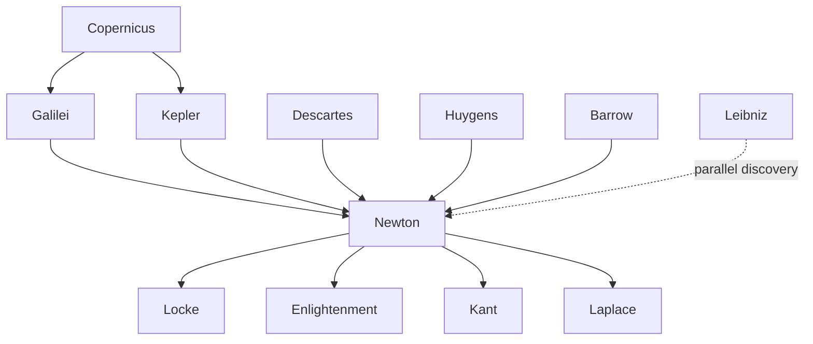

---
cssclasses:
  - Philosophy
  - Physical-Sciences
subclasses:
  - Philosophy-of-Science
  - 17th-18th-Century-Philosophy
  - Epistemology
aliases:
  - newton
  - newtonian physics
  - classical mechanics
  - universal gravitation
  - principia mathematica
  - calculus fluxions
  - scientific method
  - hypotheses non
  - absolute space
  - corpuscular theory
  - laws motion
  - inertia
tags:
  - Empirical
  - Constructive
authors:
  - "[[Newton]]"
  - "[[Galilei]]"
  - "[[Descartes]]"
  - "[[Huygens]]"
  - "[[Kepler]]"
  - "[[Leibniz]]"
  - "[[Locke]]"
  - "[[Kant]]"
movements:
  - "[[Scientific Revolution]]"
  - "[[Empiricism]]"
  - "[[Mechanical Philosophy]]"
reference: "[[03 The search for thought - Unit 5 Chapter 2.pdf]]"
---

#### Central Problem

How can natural philosophy achieve certain knowledge of the physical world while avoiding unfounded metaphysical speculation? [[Newton]] confronts the challenge of unifying terrestrial and celestial mechanics under mathematical laws while developing a methodology that grounds scientific claims in observable phenomena and mathematical demonstration rather than hypothetical causes.

The problem extends to the relationship between mathematics and physics: how can abstract mathematical tools (especially the new calculus of infinitesimals) be rigorously applied to describe continuous physical change—motion, acceleration, and gravitational attraction—across the entire universe?

#### Main Thesis

[[Newton]] establishes that the same mathematical laws govern both terrestrial and celestial phenomena, unified under the principle of universal gravitation: bodies attract each other proportionally to the product of their masses and inversely to the square of the distance between them. His methodology, encapsulated in the famous dictum *hypotheses non fingo* ("I frame no hypotheses"), demands that scientific explanations remain grounded in observable phenomena and mathematical demonstration, rejecting occult qualities and metaphysical speculation.

Key claims include:
- **Universal gravitation:** The same force that causes objects to fall on Earth keeps planets in their orbits
- **Three laws of motion:** Inertia, force-acceleration proportionality, and action-reaction form the foundation of classical mechanics
- **Calculus of fluxions:** Mathematical tools for analyzing continuous change (derivatives and integrals)
- **Absolute space and time:** Framework for measuring motion independent of material reference points
- **Methodological empiricism:** Scientific propositions must be induced from phenomena and verified by experiment
- **Corpuscular theory of light:** Light consists of particles emitted from luminous bodies

#### Historical Context

[[Newton]] completed the Scientific Revolution initiated by [[Copernicus]] and [[Galilei]], establishing the paradigm of "classical physics" that dominated until [[Einstein]]. Born in 1642 (the year of [[Galilei]]'s death), he inherited a rich tradition of mechanical philosophy, astronomical observation, and mathematical innovation.

The seventeenth century had seen [[Galilei]]'s mathematical treatment of motion, [[Kepler]]'s laws of planetary motion, [[Descartes]]' mechanistic physics, and [[Huygens]]' work on oscillation and centrifugal force. [[Newton]] synthesized these advances into a unified system while developing new mathematical tools (calculus) necessary for rigorous treatment of continuous change.

His *Principia Mathematica* (1687) became the model of scientific achievement, influencing not only physics but also philosophy. [[Locke]]'s empiricism, Enlightenment thought, and [[Kant]]'s critical philosophy all took Newtonian science as their paradigm. [[Newton]]'s methodology became the standard against which all claims to scientific knowledge were measured.

#### Philosophical Lineage

#### Key Thinkers

| Thinker | Dates | Movement | Main Work | Core Concept |
|---------|-------|----------|-----------|--------------|
| [[Newton]] | 1642–1727 | [[Scientific Revolution]] | *Principia Mathematica* | Universal gravitation, laws of motion |
| [[Galilei]] | 1564–1642 | [[Scientific Revolution]] | *Dialogue* | Mathematical physics, inertia |
| [[Descartes]] | 1596–1650 | [[Rationalism]] | *Principles of Philosophy* | Mechanistic physics, extension |
| [[Huygens]] | 1629–1695 | [[Mechanical Philosophy]] | *Horologium Oscillatorium* | Centrifugal force, wave theory |
| [[Kepler]] | 1571–1630 | [[Scientific Revolution]] | *Astronomia Nova* | Laws of planetary motion |
| [[Leibniz]] | 1646–1716 | [[Rationalism]] | *Monadology* | Calculus (independent discovery) |

#### Key Concepts

| Concept | Definition | Related to |
|---------|------------|------------|
| Universal Gravitation | Bodies attract proportionally to mass product and inversely to distance squared | [[Newton]], [[Mechanics]] |
| Principle of Inertia | Bodies persist in rest or uniform motion unless acted upon by external force | [[Newton]], [[Galilei]], [[Descartes]] |
| Force | That which produces acceleration (change in velocity); F = ma | [[Newton]], [[Dynamics]] |
| Mass | Quantity of matter, constant for a given object (distinct from weight) | [[Newton]], [[Mechanics]] |
| Fluxions | Newton's term for derivatives; rates of change of continuously varying quantities | [[Newton]], [[Calculus]] |
| Absolute Space | Immovable, homogeneous container independent of bodies; reference for true motion | [[Newton]], [[Metaphysics]] |
| Absolute Time | True mathematical time flowing uniformly, independent of external events | [[Newton]], [[Metaphysics]] |
| Hypotheses Non Fingo | "I frame no hypotheses"—rejection of speculative causes beyond observable phenomena | [[Newton]], [[Methodology]] |
| Corpuscular Theory | Light consists of particles emitted from luminous bodies | [[Newton]], [[Optics]] |
| Induction | Generalizing from observed cases to universal laws | [[Newton]], [[Scientific Method]] |

#### Authors Comparison

| Theme | [[Newton]] | [[Descartes]] | [[Leibniz]] |
|-------|------------|---------------|-------------|
| Method | Induction from phenomena; mathematics | Deduction from clear ideas | A priori and a posteriori |
| Space | Absolute, independent of bodies | Identical with extension (plenum) | Relational, order of coexistences |
| Time | Absolute, mathematical, uniform | Duration of motion | Relational, order of successions |
| Force | Real cause of acceleration | Motion transfer by contact | Vis viva (living force) |
| Light | Corpuscular (particles) | Pressure in ether | Wave-like properties |
| God's role | Initial impulse; maintains order | Created laws of motion | Pre-established harmony |
| Metaphysics | Minimal; hypotheses non fingo | Foundation of physics | Foundation of physics |

#### Life and Works

Isaac Newton was born on Christmas Day 1642 in Woolsthorpe, Lincolnshire—the same year [[Galilei]] died. He entered Trinity College, Cambridge in 1661, studying under mathematician Isaac Barrow. During the plague years (1665–1667), forced to return home, he developed his fundamental ideas on calculus, optics, and gravitation.

Returning to Cambridge, he succeeded Barrow as Lucasian Professor of Mathematics (1669). He invented the reflecting telescope, discovered the composition of white light, and developed the calculus of fluxions (independently of [[Leibniz]], leading to a bitter priority dispute).

**Major works:**
- *Philosophiae Naturalis Principia Mathematica* (1687) — foundation of classical mechanics
- *Opticks* (1704) — theory of light and color
- *Arithmetica Universalis* (1707)

He served in Parliament (1689–1690), became Warden then Master of the Royal Mint, and was elected President of the Royal Society (1703). Knighted in 1705, he died on March 20, 1727, and was buried in Westminster Abbey.

#### The Calculus of Fluxions

[[Newton]] developed calculus to solve the problem of "fluent quantities and their fluxions"—continuously varying magnitudes and their instantaneous rates of change. This addressed urgent physical problems: calculating velocity (first fluxion), acceleration (second fluxion), and areas under curves.

The calculus unified:
- **Tangent problem:** Finding the direction (derivative) of a curve at each point
- **Quadrature problem:** Finding the area (integral) bounded by a curve

[[Newton]]'s approach brought infinity into mathematics—previously suspect territory. Though preceded by [[Archimedes]], [[Cavalieri]], [[Fermat]], [[Wallis]], and [[Barrow]], [[Newton]] (along with [[Leibniz]]) provided the first systematic exposition of derivatives, integrals, and their inverse relationship.

#### Universal Gravitation

[[Newton]]'s revolutionary insight unified terrestrial and celestial mechanics: the force causing apples to fall is identical to the force keeping the Moon in orbit. Both are instances of gravitational attraction.

**The Law:** Bodies attract each other proportionally to the product of their masses and inversely to the square of their distance.

**Historical development:**
- [[Copernicus]]: gravity as attraction between celestial bodies
- [[Huygens]]: formula for centrifugal force
- [[Borelli]] (1666): centripetal force balances centrifugal force
- [[Newton]]: unified formula encompassing all cases

**Confirmation:** [[Newton]] initially failed to verify his law using Snellius's incorrect Earth radius measurement (1617). Only after Picard provided the correct measurement (1682) did the calculations confirm the theory. [[Newton]] then published his *Propositions on Motion* (1684) and the *Principia* (1687).

**Theological element:** While explaining orbital mechanics mechanically, [[Newton]] invoked divine action for the initial velocity imparted to planets. [[Laplace]] later proposed a naturalistic explanation through planetary formation from solar matter.

#### Classical Dynamics

[[Newton]] established the three fundamental laws of motion:

**First Law (Inertia):** Every body perseveres in its state of rest or uniform rectilinear motion unless compelled to change by impressed forces. (Generalized from [[Leonardo]], [[Galilei]], [[Descartes]])

**Second Law (F=ma):** Force is proportional to acceleration (change of velocity per unit time), not to velocity itself. (Extended [[Galilei]]'s work on falling bodies)

**Third Law (Action-Reaction):** Every action has an equal and opposite reaction. (Generalized from particular cases in [[Huygens]] and [[Wallis]])

**Fundamental distinction:** [[Newton]] first clearly distinguished *mass* (invariant quantity of matter) from *weight* (force varying by location).

**Absolute space and time:** [[Newton]] posited absolute space—immobile, homogeneous, independent of bodies—and absolute time—flowing uniformly regardless of external events. These provide the framework for defining true motion versus relative motion.

#### Optics

[[Newton]] developed the corpuscular theory of light against [[Huygens]]' wave theory:
- Light consists of particles ("corpuscles") of varying sizes corresponding to different colors
- Color perception results from different vibration frequencies in the optic nerve
- White light is composed of rays of different refrangibilities (demonstrated by prism experiments)

The question of light's finite velocity was settled by [[Römer]] (1675) through observations of Jupiter's moons—light travels at approximately 300,000 km/second.

#### Scientific Method

[[Newton]]'s methodology, crystallized in *hypotheses non fingo*, aims at purely descriptive science grounded in phenomena:

**Four Rules of Reasoning:**

1. **Parsimony:** Admit only causes necessary to explain phenomena—nature does nothing in vain
2. **Same cause for same effects:** Similar effects should be attributed to the same cause
3. **Universal qualities:** Properties found in all examined bodies should be attributed to all bodies
4. **Induction:** Propositions induced from phenomena are true (or approximately true) until new phenomena modify or refute them

These rules authorize scientific induction while rejecting hypotheses about "occult qualities" or hidden causes beyond observational verification.

#### Influences & Connections

- **Predecessors:** [[Newton]] ← influenced by ← [[Galilei]], [[Kepler]], [[Descartes]], [[Huygens]], [[Barrow]]
- **Contemporaries:** [[Newton]] ↔ priority dispute with ↔ [[Leibniz]] (calculus)
- **Followers:** [[Newton]] → influenced → [[Locke]], [[Voltaire]], [[Kant]], [[Laplace]]
- **Opposing views:** [[Newton]] ← criticized by ← [[Leibniz]] (absolute space), [[Berkeley]] (infinitesimals)

#### Summary Formulas

- **[[Newton]]:** Universal gravitation unifies terrestrial and celestial mechanics; science must describe phenomena mathematically without hypothesizing occult causes.
- **Gravitation:** Bodies attract proportionally to mass product and inversely to distance squared—the same law governs falling apples and orbiting planets.
- **Dynamics:** Inertia, force-acceleration proportionality, and action-reaction form the foundation of classical mechanics.
- **Method:** *Hypotheses non fingo*—scientific propositions must be induced from phenomena and verified experimentally.

#### Timeline

| Year | Event |
|------|-------|
| 1642 | [[Newton]] born in Woolsthorpe; [[Galilei]] dies |
| 1661 | Enters Trinity College, Cambridge |
| 1665–1667 | Plague years; develops calculus, optics, gravitation ideas |
| 1669 | Succeeds Barrow as Lucasian Professor |
| 1675 | [[Römer]] measures speed of light |
| 1682 | Picard provides correct Earth radius measurement |
| 1687 | Publishes *Principia Mathematica* |
| 1689–1690 | Member of Parliament |
| 1703 | Elected President of Royal Society |
| 1704 | Publishes *Opticks* |
| 1705 | Knighted by Queen Anne |
| 1727 | [[Newton]] dies; buried in Westminster Abbey |

#### Notable Quotes

> "Hypotheses non fingo" ("I frame no hypotheses") — [[Newton]], *Principia Mathematica*

> "If I have seen further, it is by standing on the shoulders of giants." — [[Newton]], Letter to Hooke

> "Nature does nothing in vain, and more is in vain when less will serve." — [[Newton]], *Principia Mathematica*

#### See Also

- [[Scientific Revolution]]
- [[Classical Mechanics]]
- [[Universal Gravitation]]
- [[Calculus]]
- [[Empiricism]]
- [[Locke]]
- [[Kant]]
- [[Philosophy of Science]]
- [[Leibniz]]
- [[Enlightenment]]

> [!NOTE]
> *This summary has been created to present the key points from the source text, which was automatically extracted using LLM. Please note that the summary may contain errors. It serves as an essential starting point for study and reference purposes.*
