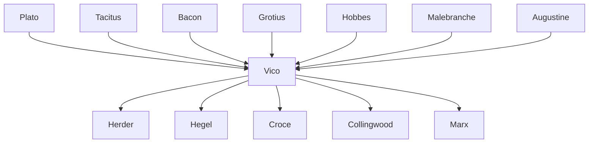

---
cssclasses:
  - Philosophy
  - History
subclasses:
  - Epistemology
  - 17th-18th-Century-Philosophy
  - Hermeneutics
aliases:
  - vico
  - philosophy history
  - scienza nuova
  - verum factum
  - ideal eternal
  - three ages
  - poetic wisdom
  - providence history
  - corsi ricorsi
  - civil world
  - fantasia
  - philology philosophy
tags:
  - Conceptual
  - Constructive
authors:
  - "[[Vico]]"
  - "[[Descartes]]"
  - "[[Plato]]"
  - "[[Tacitus]]"
  - "[[Bacon]]"
  - "[[Grotius]]"
  - "[[Hobbes]]"
movements:
  - "[[Philosophy of History]]"
  - "[[Anti-Cartesianism]]"
  - "[[Neapolitan Enlightenment]]"
reference: "[[04 The search for thought - Unit 6 Chapter 1.pdf]]"
---

#### Central Problem

The central problem addressed by Giambattista Vico concerns the possibility and method of knowledge regarding the historical world. While modern philosophy since Descartes had focused predominantly on the natural world and mathematical certainty, Vico raises a fundamental question: Can humans achieve genuine knowledge of history, and if so, how? This question emerges from Vico's recognition that Cartesian rationalism, with its criterion of clear and distinct ideas, cannot provide adequate foundations for understanding the "civil world" — the realm of human institutions, customs, laws, and nations.

Vico challenges the Cartesian assumption that the cogito provides certain knowledge. He argues that self-consciousness (coscienza) is not the same as scientific knowledge (scienza), because true knowledge requires understanding the causes and genesis of things. Since humans did not create themselves, they cannot truly know their own metaphysical nature. This epistemological crisis opens the door to a new inquiry: what can humans genuinely know? Vico's revolutionary answer is that humans can know what they themselves have made — and this leads directly to history as the proper domain of human knowledge.

The deeper problem concerns the meaning and order of historical events. Is history merely a chaotic succession of contingent happenings, or does it possess an intelligible structure? If history has order, what is its source — human action, divine providence, fate, or chance? Vico rejects both the fatalism of Stoics and Spinoza (which denies human freedom) and the randomness posited by Epicureans (which denies providential order), seeking instead a conception that preserves both human agency and transcendent meaning.

#### Main Thesis

Vico's fundamental thesis is encapsulated in his famous principle: **verum ipsum factum** — "the true is the made itself." Truth and making are convertible: one can only know with certainty what one has made. This principle, derived from analysis of ancient Latin wisdom, establishes both the limits and the possibilities of human knowledge.

**The Limits of Human Knowledge:** Since God alone created nature, only God can have perfect knowledge (intelligere) of the natural world. Humans, possessing finite minds with things external to them, can only think (cogitare) about nature — gathering external elements without penetrating to the internal essence. God's knowledge is like a sculpture (solid, three-dimensional, complete); human knowledge of nature is like a painting (flat, partial, from outside).

**The "New Science" of History:** However, humans can achieve genuine knowledge of the "mondo civile" — the world of nations, institutions, customs, and laws — because this world was made by humans themselves. Vico thus proposes a "new science" that does for the historical world what Bacon attempted for the natural world: discovering its order and laws.

**The Unity of Philology and Philosophy:** This new science must combine philology (the study of languages, customs, laws, and all transmitted manifestations of civilization — providing "consciousness of the certain") with philosophy (the study of causes and laws — providing "science of the true"). The two must complement each other: philosophers must verify their reasoning with philological authority, while philologists must test their findings against philosophical reason.

**The Ideal Eternal History:** History moves in time but tends toward an eternal, universal order. This "storia ideale eterna" (ideal eternal history) is the providential structure that gives meaning to temporal events. It is neither external fate nor mere immanent necessity, but rather a normative "ought-to-be" that guides and solicits human action without determining it. The ideal eternal history consists of three ages: the age of gods, the age of heroes, and the age of humans.

**Providence and Human Freedom:** The providential order works through an "eterogenesi dei fini" (heterogenesis of ends) — humans pursue particular selfish goals, but providence converts these into means for universal ends: from lust come marriages and families, from ambition come cities, from the abuse of noble liberty come popular laws and freedom.

#### Historical Context

Vico lived and worked in Naples during the late seventeenth and early eighteenth centuries (1668-1744), a period when Cartesian rationalism dominated European philosophy. Naples was under Spanish rule, and the Italian intellectual climate was marked by both scholastic traditions and the new influences of Enlightenment thought spreading from France and England.

Vico's career was marked by relative obscurity and financial hardship. He held the modest chair of rhetoric at the University of Naples from 1699, unsuccessfully aspiring to a more prestigious and better-paid chair of jurisprudence in 1723. He spent formative years (1689-1695) as a tutor at the castle of Vatolla in Cilento, where the rich library of the Marquis Rocca allowed him to develop his vast erudition.

The complexity and originality of Vico's thought, combined with his erudite and difficult writing style, meant that recognition came only posthumously. He was writing against the dominant currents of his time — the mathematical-mechanical worldview of Descartes and Newton, the abstract natural law theories of Grotius and Pufendorf, and the nascent Enlightenment with its emphasis on reason and progress. His work anticipated later developments in hermeneutics, philosophy of history, and aesthetics that would only be fully appreciated in the nineteenth and twentieth centuries.

The intellectual sources of Vico's thought include the seventeenth-century philosophy he both drew upon and criticized: Hobbes's idea that we know what we make; Malebranche's notion of God as mover of the human mind; various forms of Neoplatonism; and the humanistic tradition of philological scholarship.

#### Philosophical Lineage

#### Key Thinkers

| Thinker | Dates | Movement | Main Work | Core Concept |
|---------|-------|----------|-----------|--------------|
| [[Vico]] | 1668-1744 | [[Philosophy of History]] | *Scienza Nuova* | Verum ipsum factum |
| [[Descartes]] | 1596-1650 | [[Rationalism]] | *Meditations* | Cogito, clear and distinct ideas |
| [[Plato]] | 428-348 BCE | [[Ancient Philosophy]] | *Republic* | Ideal paradigms, man as he ought to be |
| [[Tacitus]] | 56-120 CE | [[Roman Historiography]] | *Annals* | Man as he is, practical wisdom |
| [[Bacon]] | 1561-1626 | [[Empiricism]] | *Novum Organum* | Inductive method for nature |
| [[Grotius]] | 1583-1645 | [[Natural Law]] | *De Iure Belli ac Pacis* | Rational natural law |
| [[Hobbes]] | 1588-1679 | [[Social Contract Theory]] | *Leviathan* | Verum-factum in mathematics and politics |

#### Key Concepts

| Concept | Definition | Related to |
|---------|------------|------------|
| Verum ipsum factum | The true is identical with the made; one can only know what one has created | [[Vico]], [[Epistemology]] |
| Scienza nuova | The new science of the historical-civil world, combining philology and philosophy | [[Vico]], [[Philosophy of History]] |
| Storia ideale eterna | The ideal eternal history — the providential paradigm over which temporal histories run | [[Vico]], [[Providence]] |
| Degnità (Axioms) | Self-evident truths or axioms that serve as foundations of the new science | [[Vico]], [[Method]] |
| Three Ages | Age of gods (theocratic), age of heroes (aristocratic), age of humans (democratic) | [[Vico]], [[Historical Cycles]] |
| Sapienza poetica | Poetic wisdom — the autonomous, pre-rational mode of knowing through imagination and myth | [[Vico]], [[Aesthetics]] |
| Universali fantastici | Fantastic universals — poetic images representing universal types (Achilles=courage) | [[Vico]], [[Mythology]] |
| Corsi e ricorsi | Courses and recourses — the cyclical pattern of historical development and decline | [[Vico]], [[Historical Cycles]] |
| Senso comune | Common sense — the pre-reflective certainties shared by peoples and nations | [[Vico]], [[Epistemology]] |
| Eterogenesi dei fini | Heterogenesis of ends — private selfish aims transformed into universal goods by providence | [[Vico]], [[Providence]] |

#### Authors Comparison

| Theme | [[Vico]] | [[Descartes]] | [[Bacon]] |
|-------|----------|---------------|-----------|
| Criterion of truth | Making (verum-factum) | Clear and distinct ideas | Empirical observation |
| Domain of knowledge | History, civil world | Mathematics, metaphysics | Natural world |
| Method | Philology + Philosophy | Mathematical deduction | Inductive method |
| Role of imagination | Creative, poetic wisdom | Source of error | Idols to overcome |
| View of ancients | Source of wisdom | Obstacles to progress | Mixed authority |
| Human nature | Historical, developing | Fixed rational essence | Improvable through science |
| Religion | Essential for civilization | Metaphysical foundation | Separate from science |

#### Influences & Connections

- **Predecessors:** [[Vico]] ← influenced by ← [[Plato]], [[Tacitus]], [[Bacon]], [[Grotius]] (the "four authors")
- **Predecessors:** [[Vico]] ← drew concepts from ← [[Hobbes]] (verum-factum), [[Malebranche]] (God as mover of mind)
- **Contemporaries:** [[Vico]] ← contemporary of ← [[Leibniz]], [[Locke]], [[Newton]]
- **Followers:** [[Vico]] → influenced → [[Herder]], [[Hegel]] (philosophy of history)
- **Followers:** [[Vico]] → influenced → [[Croce]], [[Collingwood]] (idealist interpretations)
- **Opposing views:** [[Vico]] ← criticized ← [[Descartes]] (cogito does not provide science of self)
- **Opposing views:** [[Vico]] ← rejected ← [[Spinoza]], [[Stoics]] (fatalism), [[Epicureans]] (chance)

#### Summary Formulas

- **[[Vico]]:** The human mind can only truly know what it has itself made; therefore history, not nature, is the proper domain of human science, and it reveals a providential ideal order toward which nations progress through the three ages of gods, heroes, and humans.

- **[[Descartes]]:** (As criticized by Vico) The cogito provides only consciousness of existence, not scientific knowledge of essence, because self-knowledge requires knowing one's cause, and humans do not create themselves.

- **[[Bacon]]:** (As appropriated by Vico) Just as Bacon sought the laws of the natural world through inductive method, Vico seeks to be the "Bacon" of the historical world, discovering its order and principles.

#### Timeline

| Year | Event |
|------|-------|
| 1668 | [[Vico]] born in Naples |
| 1689-1695 | [[Vico]] serves as tutor at Vatolla, develops his learning |
| 1699 | [[Vico]] becomes professor of rhetoric at University of Naples |
| 1708 | [[Vico]] publishes *On the Method of Studies of Our Time* |
| 1710 | [[Vico]] publishes *De antiquissima Italorum sapientia* (verum-factum principle) |
| 1720 | [[Vico]] publishes *De uno universi iuris principio* |
| 1723 | [[Vico]] fails to obtain chair of jurisprudence |
| 1725 | [[Vico]] publishes first edition of *Scienza Nuova* |
| 1728 | [[Vico]] publishes his *Autobiography* |
| 1730 | [[Vico]] publishes second edition of *Scienza Nuova* |
| 1744 | [[Vico]] dies in Naples; third edition of *Scienza Nuova* published posthumously |

#### Notable Quotes

> "This world of nations has certainly been made by men, and its principles are therefore to be found within the modifications of our own human mind." — [[Vico]]

> "The criterion and rule of the true is to have made it." — [[Vico]]

> "Philosophy contemplates reason, whence comes the science of the true; philology observes the authority of human choice, whence comes the consciousness of the certain." — [[Vico]]

#### See Also

- [[Philosophy of History]]
- [[Hermeneutics]]
- [[Verum-Factum Principle]]
- [[Scienza Nuova]]
- [[Poetic Wisdom]]
- [[Historical Cycles]]
- [[Providence]]
- [[Anti-Cartesianism]]
- [[Italian Philosophy]]
- [[Enlightenment]]
- [[Romanticism]]

> [!NOTE]
> *This summary has been created to present the key points from the source text, which was automatically extracted using LLM. Please note that the summary may contain errors. It serves as an essential starting point for study and reference purposes.*
