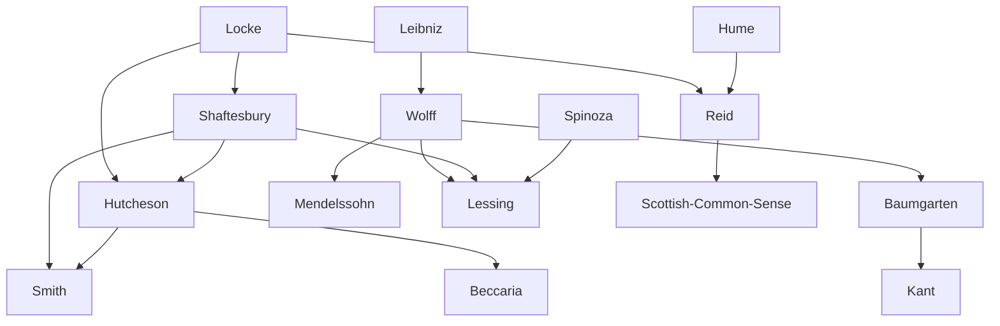

---
cssclasses:
  - Philosophy
  - History
subclasses:
  - 17th-18th-Century-Philosophy
  - Ethics
  - Aesthetics
aliases:
  - english enlightenment
  - italian enlightenment
  - german enlightenment
  - moral sense
  - deism
  - common sense
  - aesthetics
  - beccaria
  - wolff
  - lessing
  - sympathy ethics
  - sensationalism
  - natural religion
tags:
  - Conceptual
  - Constructive
authors:
  - "[[Shaftesbury]]"
  - "[[Hutcheson]]"
  - "[[Mandeville]]"
  - "[[Smith]]"
  - "[[Reid]]"
  - "[[Beccaria]]"
  - "[[Verri]]"
  - "[[Wolff]]"
  - "[[Baumgarten]]"
  - "[[Mendelssohn]]"
  - "[[Lessing]]"
movements:
  - "[[Enlightenment]]"
  - "[[Deism]]"
  - "[[Scottish Common Sense]]"
reference: "[[04 The search for thought - Unit 6 Chapter 4.pdf]]"
---

#### Central Problem

This chapter examines how Enlightenment philosophy developed distinctive national characteristics in England, Italy, and Germany, each shaped by specific historical, political, and cultural conditions. The central questions addressed are: What is the foundation of moral judgment—reason, sentiment, or self-interest? How should religious belief relate to rational inquiry? What are the proper principles of criminal justice? How should philosophy be systematically organized? And what is the nature and value of aesthetic experience?

The English Enlightenment, emerging in a post-revolutionary society with established parliamentary institutions, focused primarily on moral and religious questions rather than political critique. The Italian Enlightenment, delayed by political fragmentation and Counter-Reformation culture, concentrated on practical moral, juridical, and economic problems. The German Enlightenment, operating within absolutist states and academic settings, developed a systematic, rationalist methodology that sought to synthesize Leibnizian metaphysics with Enlightenment ideals.

#### Main Thesis

Each national Enlightenment tradition developed distinctive responses to the fundamental problem of grounding human conduct and knowledge on rational, natural principles rather than tradition or revelation.

**English Enlightenment:** The debate centered on whether morality derives from reason or sentiment. [[Shaftesbury]] posited a "rational sentiment" that reflects cosmic harmony and opposes fanaticism through irony. [[Hutcheson]] developed the concept of "moral sense" as an irreducible faculty approving actions conducive to "the greatest happiness of the greatest number." [[Mandeville]] provocatively argued the opposite—that "private vices" produce "public benefits," since society depends on self-interested passions rather than virtue. [[Smith]] synthesized these views through "sympathy"—the capacity to see ourselves as others see us—grounded in providential harmony. [[Reid]] and the Scottish school defended "common sense" against Humean skepticism, affirming that basic beliefs about external reality and causation are warranted by their universal acceptance.

**Italian Enlightenment:** Practical reform dominated. [[Beccaria]]'s *On Crimes and Punishments* applied social contract theory to argue that punishment must be proportionate, certain, and aimed at deterrence rather than retribution—condemning both torture and capital punishment. [[Pietro Verri]] developed a pessimistic hedonism: pleasure is merely the cessation of pain, and pain is the "motive principle of all humanity."

**German Enlightenment:** [[Wolff]] created a comprehensive philosophical system using mathematical method, dividing philosophy into theoretical (ontology, cosmology, psychology, rational theology) and practical branches, all grounded in the principles of non-contradiction and sufficient reason. [[Baumgarten]] founded aesthetics as a discipline, recognizing the autonomous value of sensible knowledge and beauty. [[Lessing]] culminated German Enlightenment with a philosophy of history as progressive education, in which revelation accompanies humanity's development toward the complete coincidence of positive religion with natural reason.

#### Historical Context

**England:** The Glorious Revolution (1688) had established parliamentary government and religious toleration, creating conditions fundamentally different from Continental absolutism. Locke and Newton provided the philosophical and scientific foundations. English Enlightenment thinkers thus focused less on political critique and more on refining moral and religious philosophy within an already relatively liberal society.

**Italy:** The peninsula suffered from economic backwardness, political fragmentation, unstable dynasties (Spanish, Austrian, Bourbon), and Counter-Reformation intellectual constraints. Only after the Treaty of Aix-la-Chapelle (1748) brought forty years of peace did reform become possible. Milan under the Habsburgs and Naples under the Bourbons became centers of "enlightened despotism" and reform. The journal "Il Caffè" (1764-1766), modeled on the English *Spectator*, became the vehicle for Milanese illuministi. [[Beccaria]]'s work achieved European fame and influenced criminal law reform across the continent.

**Germany:** Political fragmentation into numerous states, persistent feudalism, and devastating religious wars had left Germany culturally isolated until [[Leibniz]]. The absence of a strong commercial bourgeoisie meant intellectuals remained tied to universities and courts rather than engaged in public battles. Frederick II of Prussia embodied "enlightened despotism." [[Wolff]]'s expulsion from Halle (1723) by Pietist opponents, and his restoration under Frederick II (1740), symbolized the tension between traditional religion and philosophical reason.

The period culminated with [[Lessing]]'s *Education of the Human Race* (1780), which provided a philosophy of historical progress that would profoundly influence German Romanticism and Idealism.

#### Philosophical Lineage

#### Key Thinkers

| Thinker | Dates | Movement | Main Work | Core Concept |
|---------|-------|----------|-----------|--------------|
| [[Shaftesbury]] | 1671-1713 | [[Moral Sense Theory]] | *Characteristics* | Rational sentiment, irony against fanaticism |
| [[Hutcheson]] | 1694-1746 | [[Moral Sense Theory]] | *System of Moral Philosophy* | Moral sense, greatest happiness |
| [[Mandeville]] | 1670-1733 | [[Enlightenment]] | *Fable of the Bees* | Private vices, public benefits |
| [[Smith]] | 1723-1790 | [[Scottish Enlightenment]] | *Theory of Moral Sentiments* | Sympathy, impartial spectator |
| [[Reid]] | 1710-1796 | [[Scottish Common Sense]] | *Inquiry into the Human Mind* | Common sense against skepticism |
| [[Beccaria]] | 1738-1794 | [[Italian Enlightenment]] | *On Crimes and Punishments* | Proportionate punishment, no torture |
| [[Verri]] | 1728-1797 | [[Italian Enlightenment]] | *Discourse on Pleasure and Pain* | Pain as motive principle |
| [[Wolff]] | 1679-1754 | [[German Rationalism]] | *Philosophia rationalis* | Systematic method, perfection |
| [[Baumgarten]] | 1714-1762 | [[German Enlightenment]] | *Aesthetica* | Aesthetics, sensible perfection |
| [[Mendelssohn]] | 1729-1786 | [[German Enlightenment]] | *Jerusalem* | Church-state separation |
| [[Lessing]] | 1729-1781 | [[German Enlightenment]] | *Education of the Human Race* | Progressive revelation |

#### Key Concepts

| Concept | Definition | Related to |
|---------|------------|------------|
| Moral sense | Irreducible faculty that perceives virtue and vice as eyes perceive light and darkness | [[Hutcheson]], [[Shaftesbury]] |
| Sympathy | Capacity to see ourselves as others see us, enabling moral evaluation through an "impartial spectator" | [[Smith]], [[Scottish Enlightenment]] |
| Private vices, public benefits | Paradox that self-interested passions (luxury, vanity) drive economic prosperity rather than virtuous self-denial | [[Mandeville]], [[Enlightenment]] |
| Common sense | Universal beliefs (external world existence, causation) that provide foundation against skepticism | [[Reid]], [[Scottish Common Sense]] |
| Greatest happiness | Moral criterion: "the greatest happiness of the greatest number" as measure of best action | [[Hutcheson]], [[Beccaria]] |
| Certainty of punishment | Principle that deterrence depends more on punishment's certainty than its severity | [[Beccaria]], [[Criminal Justice]] |
| Philosophical freedom | Condition for progress: ability to publicly express philosophical opinions against tradition | [[Wolff]], [[German Enlightenment]] |
| Ontology | Science of being in general, based on non-contradiction and sufficient reason principles | [[Wolff]], [[Metaphysics]] |
| Aesthetics | Science of sensible knowledge; perfection of sensible cognition is beauty | [[Baumgarten]], [[Philosophy of Art]] |
| Education as revelation | Humanity develops through revelation that anticipates what reason will later comprehend autonomously | [[Lessing]], [[Philosophy of History]] |
| Hen kai Pan | "One and All"—Spinozist formula expressing God's immanence in the world's harmony | [[Lessing]], [[Spinoza]] |

#### Authors Comparison

| Theme | [[Shaftesbury]] | [[Mandeville]] | [[Smith]] | [[Beccaria]] | [[Wolff]] | [[Lessing]] |
|-------|-----------------|----------------|-----------|--------------|-----------|-------------|
| Human nature | Harmonious, oriented to good | Self-interested, vicious | Social, sympathetic | Rational, contractual | Perfectible through reason | Progressive through history |
| Moral foundation | Rational sentiment | Self-interest | Sympathy | Utility, social contract | Perfection | Striving toward truth |
| View of nature | Divine harmony | Amoral force | Providential order | Social utility | Mechanical order | Continuous creation |
| Religion | Natural religion | Critique of moralism | Deism | Secular justice | Rational theology | Progressive revelation |
| Social theory | Natural sociability | Vices produce prosperity | Spontaneous harmony | Contractual protection | Organized perfection | Educational development |
| Method | Irony, satire | Paradox, provocation | Empirical observation | Rational deduction | Mathematical demonstration | Speculative history |

#### Influences & Connections

- **Predecessors:** [[Shaftesbury]] ← influenced by ← [[Locke]], [[Cambridge Platonists]]
- **Predecessors:** [[Hutcheson]] ← influenced by ← [[Shaftesbury]], [[Locke]]
- **Predecessors:** [[Reid]] ← influenced by ← [[Locke]] (critically), responding to [[Hume]]
- **Predecessors:** [[Wolff]] ← influenced by ← [[Leibniz]], [[Scholasticism]]
- **Predecessors:** [[Lessing]] ← influenced by ← [[Wolff]], [[Shaftesbury]], [[Spinoza]]
- **Contemporaries:** [[Mendelssohn]] ↔ dialogue with ↔ [[Lessing]], [[Kant]]
- **Followers:** [[Hutcheson]] → influenced → [[Smith]], [[Beccaria]], [[Bentham]]
- **Followers:** [[Wolff]] → influenced → [[Baumgarten]], [[German academic philosophy]]
- **Followers:** [[Baumgarten]] → influenced → [[Kant]] (aesthetics, metaphysics textbook)
- **Followers:** [[Lessing]] → influenced → [[German Romanticism]], [[Hegel]]
- **Followers:** [[Reid]] → influenced → [[Scottish Common Sense School]]
- **Opposing views:** [[Mandeville]] ← criticized by ← [[Shaftesbury]], [[Hutcheson]]
- **Opposing views:** [[Reid]] ← opposed to ← [[Hume]], [[Berkeley]]

#### Summary Formulas

- **[[Shaftesbury]]:** Moral life is grounded in rational sentiment that reflects cosmic harmony; irony is the antidote to fanaticism.
- **[[Hutcheson]]:** The moral sense is an irreducible faculty perceiving virtue and approving actions conducive to the greatest happiness of the greatest number.
- **[[Mandeville]]:** Private vices produce public benefits; society prospers through self-interested passions, not through virtue.
- **[[Smith]]:** Sympathy—seeing ourselves as others see us—grounds moral judgment within a providentially ordered harmony of interests.
- **[[Reid]]:** Common sense provides warranted basic beliefs against skepticism; perception directly reveals external reality.
- **[[Beccaria]]:** Punishment must be proportionate, certain, and aimed at deterrence; torture and capital punishment are illegitimate and ineffective.
- **[[Verri]]:** Pleasure is merely the rapid cessation of pain; pain is the motive principle of all humanity.
- **[[Wolff]]:** Philosophy is the science of the possible; clear and distinct knowledge through mathematical method leads to human perfection and happiness.
- **[[Baumgarten]]:** Aesthetics is the science of sensible knowledge; beauty is the perfection of sensible cognition, autonomous from logical truth.
- **[[Mendelssohn]]:** Religion and morality reside in inner sentiment and cannot be coerced; church and state must be completely separated.
- **[[Lessing]]:** Human value lies in striving toward truth rather than possessing it; history is progressive education through revelation that will ultimately coincide with reason.

#### Timeline

| Year | Event |
|------|-------|
| 1705 | [[Mandeville]] publishes *Fable of the Bees* |
| 1711 | [[Shaftesbury]] publishes *Characteristics* |
| 1723 | [[Wolff]] expelled from Halle by Pietists |
| 1729 | [[Wolff]] publishes *Philosophia prima sive Ontologia* |
| 1740 | [[Wolff]] restored to Halle under Frederick II |
| 1748 | Treaty of Aix-la-Chapelle brings peace to Italy |
| 1750 | [[Baumgarten]] begins publishing *Aesthetica* |
| 1755 | [[Hutcheson]]'s *System of Moral Philosophy* published posthumously |
| 1759 | [[Smith]] publishes *Theory of Moral Sentiments* |
| 1764 | [[Reid]] publishes *Inquiry into the Human Mind* |
| 1764 | [[Beccaria]] publishes *On Crimes and Punishments* |
| 1764-1766 | "Il Caffè" journal published in Milan |
| 1766 | [[Lessing]] publishes *Laocoön* |
| 1773 | [[Verri]] publishes *Discourse on Pleasure and Pain* |
| 1776 | [[Smith]] publishes *Wealth of Nations* |
| 1780 | [[Lessing]] publishes *Education of the Human Race* |
| 1783 | [[Mendelssohn]] publishes *Jerusalem* |

#### Notable Quotes

> "If God held all truth in His right hand and in His left the ever-living striving after truth, with the condition that I should eternally err, and said to me: Choose, I would humbly fall at His left hand and say: Father, give; pure truth is for Thee alone." — [[Lessing]]

> "The greatest happiness of the greatest number is the measure of right and wrong." — [[Hutcheson]]

> "For punishment not to be violence by one or many against a private citizen, it must be essentially public, prompt, necessary, the minimum possible under the given circumstances, proportionate to crimes, and dictated by laws." — [[Beccaria]]

#### See Also

- [[Moral Sense Theory]]
- [[Scottish Enlightenment]]
- [[Scottish Common Sense]]
- [[Deism]]
- [[Utilitarianism]]
- [[Criminal Law Reform]]
- [[German Rationalism]]
- [[Aesthetics]]
- [[Philosophy of History]]
- [[Leibniz]]
- [[Hume]]
- [[Kant]]
- [[Romanticism]]

> [!NOTE]
> *This summary has been created to present the key points from the source text, which was automatically extracted using LLM. Please note that the summary may contain errors. It serves as an essential starting point for study and reference purposes.*
