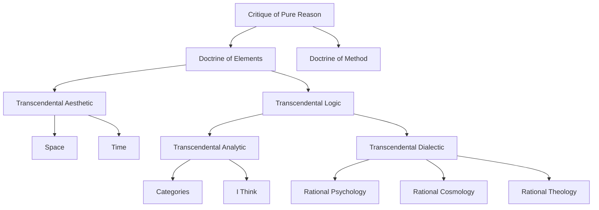

---
cssclasses:
  - Philosophy
subclasses:
  - Epistemology
aliases:
  - critique of
  - synthetic a
  - transcendental aesthetic
  - transcendental analytic
  - transcendental dialectic
  - copernican revolution
  - kantian epistemology
  - phenomenon noumenon
  - thing in
  - categories of
tags:
  - Conceptual
authors:
  - "[[Kant]]"
movements:
  - "[[German Idealism]]"
  - "[[Critical Philosophy]]"
  - "[[Transcendental Philosophy]]"
reference: "[[The Search for Thought, Unit 7, Chapter 2]]"
---

#### Central Problem

How is **synthetic a priori knowledge** possible? Kant investigates the conditions that make **universal and necessary knowledge** about the world achievable, resolving the conflict between **dogmatic rationalism** and **skeptical empiricism**. The central inquiry concerns the legitimate scope and limits of human reason in its pursuit of metaphysical truth.

#### Main Thesis

Knowledge results from the **synthesis** of sensible intuitions (given through space and time) and intellectual concepts (categories). Objects conform to our cognitive faculties, not vice versa (**Copernican Revolution**). This establishes that we can have **scientific knowledge** only of **phenomena** (reality as it appears), while **things-in-themselves** remain unknowable. Reason inevitably falls into illusion when it ventures beyond possible experience, making traditional metaphysics impossible as a science.

#### Historical Context

The *Critique of Pure Reason* (1781, second edition 1787) emerges as Kant's definitive response to the philosophical debates of the eighteenth century. Against the **dogmatism** of Wolffian rationalism, which claimed metaphysical knowledge without grounding it in experience, and against the **skepticism** of Hume, who denied necessary connections and universal principles, Kant pursues a **critical** middle path. The work addresses whether metaphysics can become a science comparable to mathematics and physics, whose synthetic a priori character Kant takes as established.

#### Philosophical Lineage

| Predecessor | Key Influence | Kant's Response |
|-------------|--------------|-----------------|
| Leibniz | Pre-established harmony; monads; innate ideas | Rejects confusion of concepts with intuitions; transforms innate ideas into a priori forms |
| Wolff | Systematic rationalist metaphysics | Critiques dogmatic metaphysics; retains systematic ambition within critical limits |
| Locke | Empiricist theory of ideas | Accepts that knowledge begins with experience; denies it all derives from experience |
| Hume | Skepticism about causality and necessity | Vindicates causality as a priori category; limits it to phenomena |
| Newton | Absolute space and time; mathematical physics | Explains the possibility of physics; reinterprets space and time as subjective forms |

#### Key Thinkers

| Thinker | Dates | Movement | Main Work | Core Concept |
|---------|-------|----------|-----------|-------------|
| [[Kant]] | 1724–1804 | [[Critical Philosophy]] | Critique of Pure Reason | Synthetic a priori |
| [[Hume]] | 1711–1776 | [[Empiricism]] | Enquiry Concerning Human Understanding | Skepticism about causality |
| [[Leibniz]] | 1646–1716 | [[Rationalism]] | Monadology | Pre-established harmony |
| [[Locke]] | 1632–1704 | [[Empiricism]] | Essay Concerning Human Understanding | Tabula rasa |
| [[Newton]] | 1643–1727 | [[Scientific Revolution]] | Principia Mathematica | Absolute space and time |

#### Key Concepts

| Concept | Definition | Related to |
|---------|------------|------------|
| **Synthetic a priori** | Judgments that are both universal/necessary and ampliative of knowledge | Copernican revolution, transcendental philosophy |
| **Phenomenon** | Object as it appears through our a priori forms of sensibility and understanding | Thing-in-itself, transcendental idealism |
| **Thing-in-itself** | Object as it exists independently of our cognition; unknowable but thinkable | Phenomenon, limits of reason |
| **Transcendental** | Concerning the a priori conditions of possible experience | Categories, pure intuitions |
| **Category** | Pure concept of understanding; necessary condition for thinking objects | I think, transcendental deduction |
| **Pure intuition** | A priori form of sensibility (space and time) | Transcendental aesthetic, mathematics |
| **I think (Apperception)** | Transcendental unity of self-consciousness; supreme principle underlying all synthesis | Categories, objective knowledge |
| **Transcendental Ideas** | Concepts of reason (soul, world, God) that guide inquiry but cannot constitute knowledge | Dialectic, regulative use |
| **Antinomy** | Pairs of contradictory propositions both seemingly demonstrable | Rational cosmology, limits of reason |
| **Regulative use** | Employment of ideas to guide rather than determine knowledge | Transcendental ideas, systematic unity |

#### The Critique of Pure Reason: Overview

The *Critique of Pure Reason* (1781) represents Kant's definitive response to the speculative tendencies of his era. Against **dogmatism** (which fails to ground knowledge in experience) and **skepticism** (which, following Hume, devalues all cognitive instruments), Kant pursues a critical investigation of knowledge to establish its solid foundation.

The work addresses four fundamental questions:
1. How is **pure mathematics** possible?
2. How is **pure physics** possible?
3. How is **metaphysics as natural disposition** possible?
4. How is **metaphysics as science** possible?

#### Synthetic A Priori Judgments

Kant distinguishes three types of judgments:

| Type | Characteristics | Examples |
|------|-----------------|----------|
| **Analytic a priori** | Universal, necessary; predicate contained in subject; explicative but not ampliative | "All bodies are extended" |
| **Synthetic a posteriori** | Ampliative; predicate adds to subject; based on experience; particular and contingent | "This body is heavy" |
| **Synthetic a priori** | Universal, necessary AND ampliative; foundation of science | Mathematical propositions, laws of physics |

**Synthetic a priori judgments** constitute the true foundation of science because they combine:
- The **universality and necessity** of a priori knowledge
- The **ampliative character** of synthetic judgments

Examples: "7 + 5 = 12" (arithmetic), "The straight line is the shortest distance between two points" (geometry), "In all changes of the corporeal world, the quantity of matter remains unchanged" (physics).

#### The Copernican Revolution

Kant proposes a revolutionary shift in perspective: instead of assuming that knowledge must conform to objects, he hypothesizes that **objects must conform to our knowledge**. Just as Copernicus explained celestial movements by assuming the observer moves rather than the heavens, Kant explains the possibility of a priori knowledge by assuming that objects conform to the subject's cognitive faculties.

This means that our mind does not passively receive reality but actively **constitutes** the object of experience through its a priori forms. The consequence is that we can know objects only as they **appear** to us (phenomena), not as they are **in themselves** (noumena).

#### Phenomenon and Thing-in-Itself

| Concept | Definition |
|---------|------------|
| **Phenomenon** | Reality as it appears through our a priori forms of sensibility and understanding |
| **Thing-in-itself (Noumenon)** | Reality as it exists independently of our cognitive apparatus; unknowable but thinkable |

The distinction establishes the **limits** of human knowledge: we can have scientific knowledge only of phenomena, while the thing-in-itself remains an unknown "X" that affects our senses.

#### Structure of the Critique

#### Transcendental Aesthetic: Space and Time

The **Transcendental Aesthetic** studies the a priori principles of **sensibility**—the faculty through which objects are **given** to us via intuition.

**Space** is the pure form of **external sense**:
1. Space is not an empirical concept derived from experience
2. Space is a necessary a priori representation underlying all external intuitions
3. Space is not a discursive concept but a **pure intuition**
4. Space is represented as an infinite given magnitude

**Time** is the pure form of **internal sense**:
1. Time is not an empirical concept
2. Time is a necessary representation underlying all intuitions
3. Time is not a general concept but a **pure intuition**
4. Time has only one dimension; different times are successive, not simultaneous

| Against | Position | Kant's Response |
|---------|----------|-----------------|
| Empiricism (Locke) | Space and time derived from experience | Space and time are conditions of experience itself |
| Objectivism (Newton) | Space and time as absolute containers | Space and time are subjective forms, not objective realities |
| Conceptualism (Leibniz) | Space and time as confused concepts of relations | Space and time are intuitions, not concepts |

**Mathematics** finds its foundation in these pure intuitions: **geometry** in the pure intuition of space, **arithmetic** in the pure intuition of time (succession).

#### Transcendental Analytic: The Categories

The **Transcendental Analytic** investigates the a priori conditions of the **understanding**—the faculty through which objects are **thought**.

Kant derives the **categories** (pure concepts of the understanding) from the logical forms of judgment:

| Logical Function | Category |
|------------------|----------|
| Quantity: Universal, Particular, Singular | Unity, Plurality, Totality |
| Quality: Affirmative, Negative, Infinite | Reality, Negation, Limitation |
| Relation: Categorical, Hypothetical, Disjunctive | Substance/Accident, Cause/Effect, Community |
| Modality: Problematic, Assertoric, Apodictic | Possibility, Existence, Necessity |

Unlike Aristotelian categories (which are merely empirical classifications), Kant's categories are the **necessary conditions** for thinking objects and thus for experience itself.

#### The Transcendental Deduction

The **transcendental deduction** justifies the objective validity of the categories: how can purely a priori concepts apply to objects of experience?

Kant's answer: categories have objective validity because **no experience is possible without them**. Just as space and time are conditions for objects being **given**, categories are conditions for objects being **thought**. Without the synthesis performed by the understanding through categories, there would be no unified experience of objects.

#### The I Think (Transcendental Apperception)

The **"I think"** must be able to accompany all representations. This **transcendental unity of apperception** is the supreme principle of all use of the understanding:

- It is an act of **spontaneity** (not derived from sensibility)
- It is **pure apperception** (not empirical self-awareness)
- It is **original apperception** (the foundation of all synthesis)

The "I think" is not a substance (soul) but the **formal unity** that makes all synthesis and thus all experience possible. It represents the **conditions of the possibility** of objective knowledge.

#### The Schematism

**Schemas** are the mediating representations that allow categories (purely intellectual) to apply to intuitions (purely sensible). Time serves as the **universal medium**:

| Category | Schema |
|----------|--------|
| Substance | Permanence in time |
| Causality | Succession according to a rule |
| Community | Simultaneity |

#### The Principles of Pure Understanding

The **Analytic of Principles** establishes the supreme principles of empirical knowledge:

1. **Axioms of Intuition**: All intuitions are extensive magnitudes
2. **Anticipations of Perception**: The real has an intensive magnitude (degree)
3. **Analogies of Experience**: Experience is possible only through necessary connection of perceptions
4. **Postulates of Empirical Thought**: Criteria for possibility, actuality, and necessity

The **Second Analogy** (principle of causality) directly responds to Hume: the objective succession of phenomena requires the category of causality. Without it, we could not distinguish objective from merely subjective succession.

#### Transcendental Dialectic: The Critique of Metaphysics

The **Transcendental Dialectic** is the "logic of illusion"—it exposes the inevitable errors of reason when it ventures beyond possible experience.

**Transcendental Ideas** are concepts of reason that transcend all experience:
- **Soul** (totality of internal phenomena) → Rational Psychology
- **World** (totality of external phenomena) → Rational Cosmology  
- **God** (totality of all reality) → Rational Theology

#### Rational Psychology and the Paralogisms

The **paralogism** is a fallacious syllogism that transforms the formal unity of the "I think" into a substantial soul. The error consists in applying the category of **substance** to what is merely a logical condition of thought.

#### Rational Cosmology and the Antinomies

**Antinomies** are pairs of contradictory propositions that reason cannot resolve:

| Antinomy | Thesis | Antithesis |
|----------|--------|------------|
| First (Mathematical) | World has a beginning in time and limits in space | World is infinite in time and space |
| Second (Mathematical) | Every composite consists of simple parts | Nothing composite consists of simple parts |
| Third (Dynamic) | Causality through freedom exists | Everything happens through natural causality |
| Fourth (Dynamic) | A necessary being exists | No necessary being exists |

The antinomies demonstrate that **reason contradicts itself** when applying categories beyond possible experience. For the mathematical antinomies, both thesis and antithesis are false; for the dynamic antinomies, both can be true (in different domains).

#### Rational Theology and the Proofs of God's Existence

Kant critiques three traditional proofs:

1. **Ontological argument**: Illegitimately derives existence from the mere concept of a perfect being. Existence is not a predicate that adds content to a concept.

2. **Cosmological argument**: Relies on the ontological argument; illegitimately applies causality beyond experience.

3. **Physico-theological argument**: Relies on the cosmological argument; at best proves a designer, not a creator.

#### The Regulative Use of Ideas

Though ideas cannot provide **constitutive** knowledge of objects, they have an indispensable **regulative** function: they guide the understanding toward systematic unity and completeness in its investigations.

Ideas are like a *focus imaginarius*—a point toward which all lines of inquiry converge, though it lies beyond possible experience. They orient research without determining its objects.

#### The New Metaphysics

Kant replaces the old **dogmatic metaphysics** with a new **critical metaphysics**:

| Branch | Object |
|--------|--------|
| **Metaphysics of Nature** | A priori principles of theoretical knowledge |
| **Metaphysics of Morals** | A priori principles of practical action |

This new metaphysics is **transcendental**: it investigates not objects but our mode of knowing objects insofar as this is possible a priori.

#### Authors Comparison

| Theme | [[Kant]] | [[Hume]] | [[Leibniz]] |
|-------|----------|----------|-------------|
| **Source of knowledge** | Synthesis of intuitions and concepts | Experience alone | Reason alone |
| **Status of causality** | A priori category; necessary for experience | Psychological habit; no rational foundation | Logical principle; pre-established harmony |
| **Space and time** | Subjective a priori forms | Derived from experience | Confused perceptions of relations |
| **Metaphysics** | Possible as critique, not as dogmatic science | Impossible | Possible as rational science |
| **Limits of reason** | Confined to possible experience | Unable to reach beyond impressions | Unlimited in principle |

#### Influences & Connections

- **Backward influences**: Kant synthesizes **rationalist** (Leibniz, Wolff) and **empiricist** (Locke, Hume) traditions; he is also influenced by **Newton's** physics and **Rousseau's** moral philosophy
- **Forward influences**: The Critique inaugurates **German Idealism** (Fichte, Schelling, Hegel); influences **Neo-Kantianism** (Cohen, Natorp, Cassirer); shapes **analytic philosophy** through its distinction between analytic and synthetic; affects **phenomenology** (Husserl) and **existentialism** (Heidegger's reading of Kant)
- **Key debates**: The "thing-in-itself" problem; the deduction of categories; the relationship between theoretical and practical reason

#### Summary Formulas

- **Copernican Revolution**: "Objects must conform to our knowledge" — not vice versa
- **Synthesis formula**: "Thoughts without content are empty, intuitions without concepts are blind"
- **Transcendental Idealism**: We know only phenomena; things-in-themselves remain unknowable
- **Limits of reason**: Reason falls into illusion when it ventures beyond possible experience
- **Against Hume**: The objective succession of phenomena presupposes causality, not the reverse
- **Regulative ideas**: Ideas guide inquiry as a *focus imaginarius* without determining objects

#### Timeline

| Year | Event |
|------|-------|
| 1724 | Kant born in Königsberg |
| 1755 | Universal Natural History and Theory of the Heavens |
| 1770 | Inaugural Dissertation: On the Form and Principles of the Sensible and Intelligible World |
| 1781 | First edition of the *Critique of Pure Reason* |
| 1783 | *Prolegomena to Any Future Metaphysics* |
| 1787 | Second edition of the *Critique of Pure Reason* (major revisions to the Transcendental Deduction) |
| 1788 | *Critique of Practical Reason* |
| 1790 | *Critique of Judgment* |
| 1804 | Kant dies in Königsberg |

#### Notable Quotes

> "Thoughts without content are empty, intuitions without concepts are blind." — [[Kant]], *Critique of Pure Reason*, B75

> "I had to deny knowledge in order to make room for faith." — [[Kant]], *Critique of Pure Reason*, B xxx

> "Human reason has the peculiar fate in one species of its cognitions that it is burdened with questions which it cannot dismiss [...] but which it also cannot answer." — [[Kant]], *Critique of Pure Reason*, A vii

#### See Also

- [[Kant - Precritical Period to Criticism]]
- [[Critique of Practical Reason]]
- [[Critique of Judgment]]
- [[Hume - Skepticism]]
- [[Leibniz - Rationalism]]
- [[German Idealism]]
- [[Transcendental Philosophy]]
- [[Phenomenon and Noumenon]]
- [[Categories of Understanding]]

---

> [!warning] AI-Generated Content
> This note was generated with AI assistance. While efforts have been made to ensure accuracy, please verify important information independently.

> [!NOTE]
> *This summary has been created to present the key points from the source text, which was automatically extracted using LLM. Please note that the summary may contain errors. It serves as an essential starting point for study and reference purposes.*
