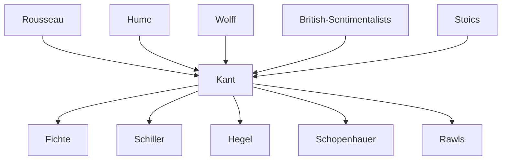

---
cssclasses:
  - Philosophy
subclasses:
  - Ethics
  - 17th-18th-Century-Philosophy
aliases:
  - critique practical
  - categorical imperative
  - kantian ethics
  - moral law
  - autonomy morality
  - duty ethics
  - practical postulates
  - kingdom ends
  - pure practical
  - deontological ethics
tags:
  - Conceptual
authors:
  - "[[Kant]]"
movements:
  - "[[Critical Philosophy]]"
  - "[[Deontological Ethics]]"
reference: "[[The Search for Thought - Unit 7 Chapter 3.pdf]]"
---

#### Central Problem

How can **pure reason** be **practical**? Kant investigates whether there exists an **unconditional moral law** valid for all rational beings, independent of experience and sensible inclinations. The central question concerns the foundation of morality: can ethics be grounded in reason alone, without reference to happiness, consequences, or divine commands? This inquiry seeks to establish the autonomy and universality of moral obligation.

#### Main Thesis

Morality is grounded in **pure practical reason** alone—reason that operates independently of experience and sensibility. The moral law is **unconditional** (categorical), **formal** (prescribing how to act, not what to do), and **autonomous** (self-legislated by rational beings). The **categorical imperative** commands universally: "Act only according to that maxim through which you can at the same time will that it become a universal law." While the moral law demands **virtue** (the supreme good), complete moral fulfillment (**the highest good** = virtue + happiness) requires **postulating** the immortality of the soul and the existence of God.

#### Historical Context

The *Critique of Practical Reason* (1788) follows the *Critique of Pure Reason* (1781) and the *Groundwork of the Metaphysics of Morals* (1785). Kant writes against the background of Enlightenment debates about the foundations of morality. Against **rationalist ethics** (Wolff), which derived morality from metaphysics; against **empiricist ethics** (Hume, British sentimentalists), which grounded morality in feeling; and against **theological ethics** (Crusius), which founded morality on divine commands—Kant seeks to establish morality on **pure practical reason** alone, thereby securing both its **freedom** and its **universality**.

#### Philosophical Lineage

#### Key Thinkers

| Thinker | Dates | Movement | Main Work | Core Concept |
|---------|-------|----------|-----------|--------------|
| [[Kant]] | 1724–1804 | [[Critical Philosophy]] | Critique of Practical Reason | Categorical imperative |
| [[Rousseau]] | 1712–1778 | [[Enlightenment]] | The Social Contract | General will, moral freedom |
| [[Hume]] | 1711–1776 | [[Empiricism]] | Enquiry Concerning the Principles of Morals | Moral sentiment |
| [[Wolff]] | 1679–1754 | [[Rationalism]] | Philosophia Practica Universalis | Perfection as moral principle |
| [[Hutcheson]] | 1694–1746 | [[British Sentimentalism]] | Inquiry into Beauty and Virtue | Moral sense |

#### Key Concepts

| Concept | Definition | Related to |
|---------|------------|------------|
| **Pure practical reason** | Reason that determines the will independently of experience and sensibility | Moral law, autonomy |
| **Categorical imperative** | Command that represents an action as objectively necessary in itself, without relation to any other end | Moral law, universality |
| **Hypothetical imperative** | Command that prescribes means to achieve a desired end; has form "if...then you ought" | Prudence, skill |
| **Maxim** | Subjective principle of action; rule an individual considers valid for their own will | Universalizability, moral testing |
| **Autonomy** | Self-legislation of the will; the will gives itself the moral law | Freedom, dignity |
| **Heteronomy** | Determination of the will by external principles; opposite of autonomy | Material ethics, eteronomous morals |
| **Kingdom of ends** | Ideal community of rational beings living according to self-legislated universal laws | Dignity, respect |
| **Highest good** | Union of virtue and happiness; the complete and perfect good | Postulates, immortality |
| **Postulate** | Proposition not theoretically demonstrable but necessarily presupposed from a practical standpoint | Immortality, God, freedom |
| **Respect for the law** | The only moral feeling; produced by reason itself when the moral law humiliates self-love | Moral motivation, duty |

#### Pure Practical Reason vs. Empirically Conditioned Reason

Kant distinguishes between:
- **Pure practical reason**: Operates independently of experience; determines the will through the moral law alone
- **Empirically conditioned practical reason**: Directed by sensible inclinations toward happiness and pleasure

The *Critique of Practical Reason* does not critique pure practical reason (which operates legitimately a priori) but rather the pretension of empirically conditioned reason to be the sole determinant of action.

#### The Unconditionedness of the Moral Law

The moral law is characterized by:

| Attribute | Meaning |
|-----------|---------|
| **Unconditionedness** | Independent of all sensible inclinations and contingent circumstances |
| **Freedom** | Presupposes human capacity for self-determination beyond instinctual drives |
| **Universality** | Valid for all rational beings without exception |
| **Necessity** | Commands categorically, not merely advisedly |

The equation **morality = unconditionedness = freedom = universality and necessity** represents the core of Kant's ethical analysis.

#### The Finitude of Moral Activity

Kant emphasizes human **finitude** in moral life:
- If humans were pure sensibility, morality would not exist (we would act only from instinct)
- If humans were pure reason, morality would be unnecessary (we would always be "holy")
- Morality exists precisely because of the **tension** between reason and sensibility

The moral law therefore assumes the form of an **imperative**—a command that may be disobeyed, requiring the sacrifice of sensible inclinations.

#### The Categorical Imperative: Three Formulations

##### First Formula (Universal Law)
> "Act only according to that maxim through which you can at the same time will that it become a universal law."

This formula prescribes the **universalizability test**: an action is moral only if its maxim can be willed as a universal law without contradiction.

##### Second Formula (Humanity as End)
> "Act so as to treat humanity, whether in your own person or in that of another, always as an end and never merely as a means."

This formula prescribes respect for **human dignity**—the recognition that rational beings are ends-in-themselves, not mere instruments.

##### Third Formula (Autonomy)
> "Act so that your will can regard itself at the same time as making universal law through its maxim."

This formula emphasizes **autonomy**: the moral subject is both legislator and subject of the moral law.

#### Formality and the Duty-for-Duty's-Sake

The moral law is **formal**, not material:
- It does not prescribe **what** to do, but **how** to act
- It commands universally, without reference to particular contents
- Material principles would compromise both freedom (objects would determine the will) and universality (interests are subjective)

**Rigorism**: Moral worth lies in acting **for the sake of duty alone**, not from inclination or for expected results. Even benevolent feelings, while positive, cannot ground moral worth.

#### Legality vs. Morality

| Legality | Morality |
|----------|----------|
| External conformity to duty | Action done from duty |
| Concerns visible action | Concerns invisible intention |
| May coexist with self-interest | Requires pure moral motivation |

An action is truly **moral** only when performed **for the sake of duty**, with the sole intention of obeying the moral law.

#### The Good Will

The **good will** is the only thing unconditionally good in the world:
- All other goods (intelligence, courage, etc.) can be misused
- The good will is good in itself, not as a means to other ends
- It consists in the intention to conform to the moral law

#### The Copernican Revolution in Morals

Just as in epistemology objects conform to our cognitive faculties, in ethics the moral law originates from **practical reason itself**. Kant places the human being at the center of the moral universe as **legislator** of morality.

**Autonomy** is:
- **Negatively**: Independence from sensible inclinations
- **Positively**: Self-legislation of the will through universal law

#### Critique of Heteronomous Ethics

Kant rejects all ethics that derive moral principles from sources external to pure practical reason:

| Type | Examples | Problem |
|------|----------|---------|
| **External subjective** | Education (Montaigne), Civil government (Mandeville) | Contingent, not universal |
| **Internal subjective** | Physical feeling (Epicurus), Moral sense (Hutcheson) | Subjective, variable |
| **Internal objective** | Perfection (Wolff, Stoics) | Empty concept or circular |
| **External objective** | Divine will (Crusius, theologians) | Destroys freedom and autonomy |

#### The Dialectic: The Highest Good and the Postulates

##### The Antinomy of Practical Reason
- **Virtue** is the supreme good but not the complete good
- The **highest good** = virtue + happiness proportionate to virtue
- In this world, virtue and happiness are not necessarily conjoined
- Neither Stoics (reducing happiness to virtue) nor Epicureans (reducing virtue to happiness) solved this problem

##### The Postulates of Pure Practical Reason

| Postulate | Argument |
|-----------|----------|
| **Immortality of the Soul** | Complete conformity to the moral law (holiness) is achievable only in infinite progress; this requires infinite duration of existence |
| **Existence of God** | Happiness proportionate to virtue requires a holy and omnipotent cause that can unite nature and morality |
| **Freedom** | The moral law presupposes the capacity to act or not act according to duty; "You ought, therefore you can" |

The postulates are not **theoretical knowledge** but **practical presuppositions**—rationally grounded hopes, not demonstrated truths.

#### Freedom and the Solution to the Third Antinomy

The same action can be:
- **Determined** as an event in the phenomenal world (subject to natural causality)
- **Free** as a moral act in the noumenal world (subject to moral law)

As **phenomenal** being, man is determined by natural laws; as **noumenal** being, man is free to obey or disobey the moral law.

#### The Primacy of Practical Reason

Practical reason has **primacy** over theoretical reason:
- It admits propositions that theoretical reason cannot affirm
- However, postulates are not **knowledge** but **rational faith**
- If postulates were demonstrated certainties, morality would become heteronomous

#### Morality and Religion

Kant **reverses** the traditional relationship:
- Religion does not found morality; morality founds religion
- God is not at the **basis** of moral life but at its possible **completion**
- Morality is **autonomous** and **self-sufficient** through pure practical reason
- Religion provides the hope that virtue will be rewarded with happiness

#### Authors Comparison

| Theme | [[Kant]] | [[Hume]] | [[Wolff]] |
|-------|----------|----------|-----------|
| **Foundation of morality** | Pure practical reason | Moral sentiment | Rational perfection |
| **Moral motivation** | Duty for duty's sake | Feeling of approval | Knowledge of the good |
| **Universality** | A priori, categorical | Empirical, general | Rational, necessary |
| **Freedom** | Noumenal autonomy | Compatible with determinism | Rational self-determination |
| **Role of happiness** | Not the ground but the hope | Natural aim of action | Component of perfection |

#### Influences & Connections

- **Predecessors:** [[Kant]] ← influenced by ← [[Rousseau]] (moral freedom, dignity), [[Hume]] (awakening from dogmatism), [[Stoics]] (duty ethics), [[Wolff]] (systematic rationalism)
- **Contemporaries:** [[Kant]] ↔ dialogue with ↔ [[Jacobi]], [[Reinhold]], [[Schiller]] (aesthetic mediation of duty)
- **Followers:** [[Kant]] → influenced → [[Fichte]] (moral idealism), [[Hegel]] (critique and development), [[Schopenhauer]] (critique), [[Neo-Kantians]], [[Rawls]] (procedural ethics)
- **Opposing views:** [[Kant]] ← criticized by ← [[Hegel]] (empty formalism), [[Schopenhauer]] (denial of free will), [[Nietzsche]] (slave morality), [[Utilitarians]] (consequences matter)

#### Summary Formulas

- **[[Kant]]:** The moral law commands categorically: act only on maxims you can will as universal laws, respecting humanity as an end in itself.
- **Copernican Revolution in Ethics:** Man is the autonomous legislator of the moral world, not subject to external commands.
- **Duty-for-Duty's-Sake:** An action is moral only when performed from pure respect for the law, not from inclination or self-interest.
- **Postulates:** Immortality and God are not demonstrated truths but practically necessary presuppositions for the possibility of the highest good.
- **Primacy of Practical Reason:** Reason admits in its practical use what it cannot affirm theoretically.

#### Timeline

| Year | Event |
|------|-------|
| 1724 | [[Kant]] born in Königsberg |
| 1785 | *Groundwork of the Metaphysics of Morals* published |
| 1788 | *Critique of Practical Reason* published |
| 1793 | *Religion within the Boundaries of Mere Reason* published |
| 1797 | *Metaphysics of Morals* published |
| 1804 | [[Kant]] dies in Königsberg |

#### Notable Quotes

> "Duty! Sublime and mighty name, that embraces nothing charming or insinuating, but requires submission." — [[Kant]], *Critique of Practical Reason*

> "Act so that the maxim of your will could always hold at the same time as a principle of universal legislation." — [[Kant]], *Critique of Practical Reason*

> "Two things fill the mind with ever new and increasing admiration and reverence: the starry heavens above me and the moral law within me." — [[Kant]], *Critique of Practical Reason*

#### See Also

- [[Critique of Pure Reason]]
- [[Critique of Judgment]]
- [[Groundwork of the Metaphysics of Morals]]
- [[Categorical Imperative]]
- [[Deontological Ethics]]
- [[Autonomy]]
- [[Kingdom of Ends]]
- [[Moral Law]]
- [[Postulates of Practical Reason]]

---

> [!NOTE]
> *This summary has been created to present the key points from the source text, which was automatically extracted using LLM. Please note that the summary may contain errors. It serves as an essential starting point for study and reference purposes.*
