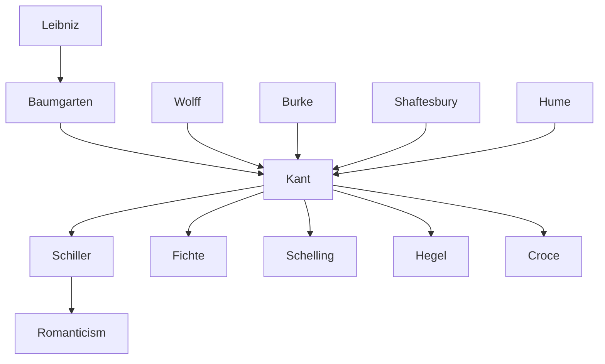

---
cssclasses:
  - Philosophy
subclasses:
  - Aesthetics
  - 17th-18th-Century-Philosophy
  - Epistemology
aliases:
  - critique of
  - third critique
  - aesthetic judgment
  - teleological judgment
  - reflective judgment
  - determinant judgment
  - beautiful
  - sublime
  - genius
  - purposiveness
  - taste
  - finality
tags:
  - Conceptual
  - Constructive
authors:
  - "[[Kant]]"
  - "[[Burke]]"
  - "[[Schiller]]"
movements:
  - "[[German Idealism]]"
  - "[[Critical Philosophy]]"
  - "[[Enlightenment]]"
reference: "[[04 The search for thought - Unit 7 Chapter 4.pdf]]"
---

#### Central Problem

The *Critique of Judgment* (1790) addresses a fundamental dualism left unresolved by Kant's first two Critiques. The *Critique of Pure Reason* established a mechanistic conception of reality where nature, from the phenomenal standpoint, appears as a causal and necessary structure leaving no room for human freedom. Conversely, the *Critique of Practical Reason* posited an indeterministic and teleological view of reality, postulating human freedom and God's existence as conditions of morality. This created what Kant called an "immeasurable abyss" between two radically different worlds: the phenomenal-deterministic world "known" by science and the noumenal-teleological world "postulated" by ethics.

The central problem becomes: How can the human subject bridge, at least subjectively, the gap between the realm of nature (governed by necessity and mechanical causation) and the realm of freedom (governed by moral purposes and final causes)? Kant investigates whether there exists a third faculty that can mediate between theoretical understanding and practical reason without claiming to provide objective knowledge of things-in-themselves.

This inquiry also addresses an epistemological problem: How can universal a priori categories from the understanding be applied to the heterogeneous multiplicity of particular empirical cases? The *Critique of Judgment* explores the conditions under which we can subsume particulars under universals when the universal is not already given but must be sought.

#### Main Thesis

Kant argues that **feeling** (*Gefühl*) constitutes a third autonomous faculty alongside cognition and volition. This faculty operates through what he calls **reflective judgment** (*Urteilskraft*), which mediates between understanding and reason. While determinant judgments subsume particulars under given universals (the categories), reflective judgments seek the universal starting from the particular, guided by the principle of nature's purposiveness.

The key theses of the *Critique of Judgment* include:

**The Distinction Between Determinant and Reflective Judgment:** Determinant judgments "determine" phenomenal objects through universal a priori forms (space, time, categories). Reflective judgments merely "reflect" upon an already constituted nature, interpreting it through our universal needs for purposiveness and harmony. The universal in reflective judgment is "sought" rather than "given."

**Subjective Purposiveness:** Reflective judgments express a human *need* (*Bedürfnis*) rather than objective knowledge. They articulate the finite human requirement to perceive an accord between nature and our spiritual demands. This purposiveness remains subjective—an agreement valid only for the subject, not an objective conciliation of the two worlds.

**Two Types of Reflective Judgment:** Aesthetic judgments concern beauty and involve an immediate, intuitive experience of nature's purposiveness (subjective or formal purposiveness). Teleological judgments think this purposiveness conceptually through the notion of ends (objective or real purposiveness).

**The Copernican Revolution in Aesthetics:** Beauty is not an objective ontological property of things but arises from the encounter of our mind with objects. Beauty exists only for and in relation to the mind—it is a "favor" we bestow upon nature rather than nature bestowing upon us.

**The Sublime and Moral Destiny:** The sublime reveals humanity's supersensible nature by showing that our reason and moral dignity exceed all natural magnitudes and powers.

#### Historical Context

The *Critique of Judgment* was published in 1790, completing Kant's critical system and responding to intellectual currents from both empiricism and rationalism. The work emerged against the backdrop of British empiricist aesthetics, particularly Edmund Burke's *Philosophical Enquiry into the Origin of Our Ideas of the Sublime and Beautiful* (1757), which influentially defined the sublime in terms of "delightful horror" experienced before overwhelming natural phenomena.

French moralists and British empiricists of the eighteenth century had begun treating sentiment as an autonomous domain separate from pure cognition or practical willing. Kant draws upon this tradition while fundamentally transforming it by seeking a priori principles for aesthetic and teleological judgment.

The broader context includes debates about taste, beauty, and genius that occupied Enlightenment thinkers. The rationalist tradition, especially in Germany, had treated beauty as "confused cognition of perfection" (Baumgarten, Wolff). Kant rejects this intellectualist account, insisting that aesthetic experience is founded on feeling and spontaneity rather than concepts.

The work also responds to tensions within Kant's own system. Having established the strict separation between phenomenal nature and noumenal freedom, Kant now addresses whether the subject can experience any connection between these domains, even if only subjectively, through the faculty of judgment.

#### Philosophical Lineage

#### Key Thinkers

| Thinker | Dates | Movement | Main Work | Core Concept |
|---------|-------|----------|-----------|--------------|
| [[Kant]] | 1724-1804 | [[Critical Philosophy]] | *Critique of Judgment* | Reflective judgment, purposiveness |
| [[Burke]] | 1729-1797 | [[British Empiricism]] | *Philosophical Enquiry* | Sublime as delightful horror |
| [[Baumgarten]] | 1714-1762 | [[Rationalism]] | *Aesthetica* | Aesthetics as science |
| [[Schiller]] | 1759-1805 | [[German Idealism]] | *On the Sublime* | Aesthetic education |
| [[Croce]] | 1866-1952 | [[Idealism]] | *Aesthetic* | Autonomy of art |

#### Key Concepts

| Concept | Definition | Related to |
|---------|------------|------------|
| Reflective Judgment | Judgment that seeks the universal starting from the particular, based on the principle of purposiveness | [[Kant]], [[Aesthetics]] |
| Determinant Judgment | Judgment that subsumes particulars under already given universals (categories) | [[Kant]], [[Epistemology]] |
| Purposiveness without Purpose | Beauty as formal harmony that does not serve any determinate, conceptually expressible end | [[Kant]], [[Aesthetics]] |
| Disinterestedness | Aesthetic pleasure unconcerned with the existence or possession of objects, focused only on their representation | [[Kant]], [[Aesthetics]] |
| Sublime Mathematical | Feeling evoked by immeasurable magnitudes that awakens the idea of infinity in reason | [[Kant]], [[Burke]] |
| Sublime Dynamic | Feeling evoked by overwhelming natural forces that reveals our moral dignity | [[Kant]], [[Ethics]] |
| Genius | Innate talent through which nature gives the rule to art; produces original, exemplary works | [[Kant]], [[Aesthetics]] |
| Common Sense (Sensus Communis) | Meta-individual principle of aesthetic feeling that grounds the universal communicability of taste | [[Kant]], [[Aesthetics]] |
| Free Beauty | Beauty apprehended without reference to any concept of what the object should be | [[Kant]], [[Aesthetics]] |
| Adherent Beauty | Beauty that presupposes a concept of the object's purpose and its perfection | [[Kant]], [[Aesthetics]] |
| Teleological Judgment | Reflective judgment that thinks nature's purposiveness conceptually through the notion of ends | [[Kant]], [[Metaphysics]] |
| Antinomy of Taste | Dialectical opposition between taste's non-conceptual basis and its claim to universal validity | [[Kant]], [[Aesthetics]] |

#### Authors Comparison

| Theme | [[Kant]] | [[Burke]] |
|-------|----------|-----------|
| Nature of beauty | Disinterested pleasure in form | Pleasure in proportion, smallness, delicacy |
| Nature of sublime | Reveals supersensible destiny | Delightful horror at danger |
| Basis of judgment | A priori structure of mind | Empirical psychology of passions |
| Universality | Grounded in common mental structure | Based on shared human nature |
| Relation to morality | Beauty as symbol of morality; sublime reveals moral dignity | Aesthetic separated from moral |
| Role of concepts | Beauty without concepts | Empirical description |

#### Influences & Connections

- **Predecessors:** [[Kant]] ← influenced by ← [[Burke]], [[Baumgarten]], [[Hume]], [[Shaftesbury]], [[Leibniz]]
- **Contemporaries:** [[Kant]] ↔ dialogue with ↔ [[Schiller]], [[Goethe]], [[Herder]]
- **Followers:** [[Kant]] → influenced → [[Schiller]], [[Fichte]], [[Schelling]], [[Hegel]], [[Schopenhauer]]
- **Followers:** [[Kant]] → influenced → [[Croce]], [[Gadamer]], [[Romanticism]]
- **Opposing views:** [[Kant]] ← criticized by ← [[Hegel]] (abstract formalism), [[Herder]] (rationalism)

#### Summary Formulas

- **[[Kant]]:** The *Critique of Judgment* establishes feeling as a third autonomous faculty mediating between understanding and reason; aesthetic and teleological judgments are reflective (not determinant), expressing humanity's subjective need for purposiveness rather than objective knowledge.
- **[[Kant]] on beauty:** The beautiful is that which pleases universally without concept, disinterestedly, as purposiveness without purpose—a product of the free play between imagination and understanding that reveals the common structure of human minds.
- **[[Kant]] on sublime:** The sublime confronts us with nature's immeasurable magnitude or overwhelming power, initially humiliating our sensible nature but ultimately revealing our supersensible moral dignity and freedom.
- **[[Kant]] on genius:** Genius is the innate talent through which nature prescribes rules to art; it produces original and exemplary works whose creation cannot be taught or explained conceptually.

#### Timeline

| Year | Event |
|------|-------|
| 1757 | [[Burke]] publishes *Philosophical Enquiry into the Sublime and Beautiful* |
| 1781 | [[Kant]] publishes *Critique of Pure Reason* |
| 1788 | [[Kant]] publishes *Critique of Practical Reason* |
| 1790 | [[Kant]] publishes *Critique of Judgment* |
| 1793 | [[Schiller]] publishes *On the Sublime* |
| 1795 | [[Schiller]] publishes *Letters on the Aesthetic Education of Man* |

#### Notable Quotes

> "The beautiful is that which, without a concept, is recognized as the object of a necessary satisfaction." — [[Kant]]

> "True sublimity must be sought only in the mind of the one who judges, and not in the natural object." — [[Kant]]

> "Genius is the talent (natural gift) that gives the rule to art. Since the talent, as an innate productive faculty of the artist, itself belongs to nature, one could also express this thus: Genius is the innate disposition of the mind through which nature gives the rule to art." — [[Kant]]

#### See Also

- [[Critique of Pure Reason]]
- [[Critique of Practical Reason]]
- [[Aesthetics]]
- [[Teleology]]
- [[German Idealism]]
- [[Romanticism]]
- [[Philosophy of Art]]
- [[Sublime]]
- [[Taste]]
- [[Genius]]

> [!NOTE]
> *This summary has been created to present the key points from the source text, which was automatically extracted using LLM. Please note that the summary may contain errors. It serves as an essential starting point for study and reference purposes.*
