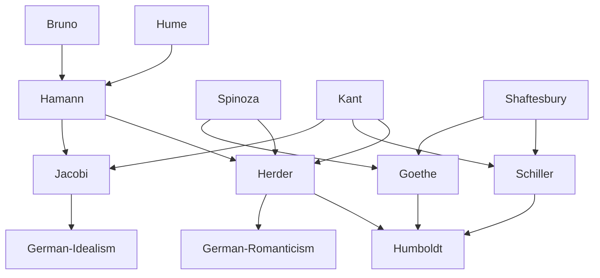

---
cssclasses:
  - Philosophy
subclasses:
  - 17th-18th-Century-Philosophy
  - Aesthetics
  - Philosophy-of-Religion
aliases:
  - philosophy faith
  - sturm drang
  - german romanticism
  - aesthetic education
  - pantheism
  - hamann
  - herder
  - jacobi
  - schiller aesthetics
  - goethe philosophy
  - humboldt language
  - fideism
tags:
  - Conceptual
authors:
  - "[[Hamann]]"
  - "[[Herder]]"
  - "[[Jacobi]]"
  - "[[Schiller]]"
  - "[[Goethe]]"
  - "[[Humboldt]]"
movements:
  - "[[Sturm und Drang]]"
  - "[[German Romanticism]]"
  - "[[Classicism]]"
reference: "[[04 The search for thought - Unit 8 Chapter 1.pdf]]"
---

#### Central Problem

In the final decades of the eighteenth century, a powerful philosophical current emerged in Germany that was openly polemical against both Enlightenment rationalism and Kantian criticism. The central problem these thinkers addressed was: What are the limits of reason, and what faculties can grasp those dimensions of reality—the divine, the infinite, life itself—that appear to lie beyond rational comprehension?

Kant's critical philosophy seemed to these thinkers either mute or hostile toward the demands of faith and religious tradition. By rigorously delimiting the competences of reason, Kant had excluded the possibility of theoretical knowledge of God, freedom, and immortality. Against this "finite reason," the philosophers of faith counterposed alternative organs of knowledge: faith, mystical intuition, sentiment, and feeling—faculties deemed capable of proceeding beyond reason's boundaries toward that higher reality which is the specific object of mystical and religious experience.

The further challenge was to reconcile the dualism of nature and spirit, matter and form, sensibility and reason that Kantian philosophy had established. Schiller and Goethe sought aesthetic and natural harmonizations of these oppositions, while Humboldt extended the inquiry into the nature of language, history, and the state.

#### Main Thesis

**Philosophy of Faith (Hamann, Herder, Jacobi):**

**Hamann** demolishes the pretensions of reason, calling it merely an *ens rationis*, an idol to which superstition assigns divine attributes. For Hamann, **faith rather than reason constitutes the human being in totality**. Drawing on Hume's notion of belief as the foundation of knowledge, but transforming it into mystical faith, Hamann posits an immediate revelation of nature and God without division between sensible and religious, human and divine. Following Bruno's *coincidentia oppositorum*, he holds that all opposites coincide in the human being—an unity faith alone can reveal.

**Herder** similarly criticizes Kant's dualisms of matter and form, nature and freedom, counterposing Spinoza's essential unity of spirit and nature. His central thesis is that **history is progressive development toward the complete realization of humanity**. Nature and history are both divine creations working together for the education of mankind toward humanity (*Humanität*). Just as God wisely orders the natural world, so too history follows a providential plan.

**Jacobi** develops a rigorous **theism** defending the validity of faith as sentiment of the unconditioned (God). He argues that every consistent rationalist philosophy, including Cartesianism and Leibnizianism, ultimately becomes Spinozism—and Spinozism is atheism, the identification of God with the world. To escape atheism, one must abandon rationalism and appeal to faith. Faith reveals the existence of ourselves, other things, and God: "We are all born in faith and in faith must remain."

**Sturm und Drang, Schiller, Goethe:**

**Schiller** finds in **art the principle that harmonizes nature and spirit**. Humans possess a sensible drive (material, temporal) and a formal drive (rational, free). Neither can be sacrificed without loss. The **play drive** (*Spieltrieb*) reconciles both, producing "living form"—beauty. This **aesthetic state** is a second creation of humanity, the condition of all artistic creation, guaranteeing its disinterestedness and freedom.

**Goethe** sees nature and God as intrinsically conjoined—"the existence is God himself." Against both materialism and Jacobi's radical transcendence, Goethe holds that spirit presupposes nature and vice versa. His naturalistic researches seek the **primal phenomenon** (*Urphänomenon*) in which divine force manifests. Art and nature differ only in degree, not in kind. Moral life consists not in reason's dominance over impulses but in **harmony among all human activities**.

**Humboldt** recognizes in the gradual realization of the **spirit of humanity** the purpose toward which all individuals and nations tend. Language is the activity of spiritual forces themselves—the inner sense reaching knowledge and expression. He restricts the state's function to security, excluding positive intervention in moral, religious, or intellectual development, which belongs to individuals' freedom.

#### Historical Context

This chapter covers the period roughly from the 1770s to the early 1800s, a transitional era between Enlightenment and Romanticism. The movement known as **Sturm und Drang** ("Storm and Stress," from Maximilian Klinger's 1776 drama) represented a literary-political reaction against Enlightenment rationalism, championing feeling, intuition, and the irrational against finite reason.

The influence of English empiricism (particularly Hume) and Continental rationalism (Spinoza, Leibniz) pervaded German debates. The publication of Kant's three Critiques (1781-1790) had redrawn the boundaries of philosophical inquiry, but his conclusions appeared unsatisfying to those seeking access to religious and metaphysical truths.

The young Schiller and Goethe were initially influenced by Sturm und Drang but were redirected by Kantian philosophy toward recognizing reason's value even in understanding non-rational dimensions. Their mature work represents a synthesis tending toward **classicism** while incorporating Romantic themes.

Herder's *Ideas for a Philosophy of the History of Humanity* (1784-1791) inaugurated a new philosophy of history emphasizing organic development and cultural specificity. Jacobi's *Letters on Spinoza* (1785) ignited the "pantheism controversy" (*Pantheismusstreit*) that shaped German philosophical debate for decades.

#### Philosophical Lineage

#### Key Thinkers

| Thinker | Dates | Movement | Main Work | Core Concept |
|---------|-------|----------|-----------|--------------|
| [[Hamann]] | 1730-1788 | [[Philosophy of Faith]] | *Metacritique* | Faith as coincidentia oppositorum |
| [[Herder]] | 1744-1803 | [[Sturm und Drang]] | *Ideas for a Philosophy of History* | History as education toward humanity |
| [[Jacobi]] | 1743-1819 | [[Philosophy of Faith]] | *Letters on Spinoza* | Faith as sentiment of the unconditioned |
| [[Schiller]] | 1759-1805 | [[Classicism]] | *Letters on Aesthetic Education* | Play drive, aesthetic state |
| [[Goethe]] | 1749-1832 | [[Classicism]] | *Faust* | Nature as living garment of divinity |
| [[Humboldt]] | 1767-1835 | [[German Idealism]] | *On Language* | Language as spiritual activity |

#### Key Concepts

| Concept | Definition | Related to |
|---------|------------|------------|
| Philosophy of Faith | Philosophical current opposing Enlightenment rationalism by positing faith, intuition, or sentiment as organs of higher knowledge | [[Hamann]], [[Jacobi]] |
| Coincidentia Oppositorum | Unity of opposites accessible only through faith, not rational concepts | [[Hamann]], [[Bruno]] |
| Humanität | The ideal form of humanity toward which individuals and nations progressively develop | [[Herder]], [[Humboldt]] |
| Spinozism | For Jacobi, the inevitable result of consistent rationalism; identified with atheism | [[Jacobi]], [[Spinoza]] |
| Play Drive (Spieltrieb) | Impulse reconciling sensible and formal drives, producing beauty and enabling the aesthetic state | [[Schiller]], [[Aesthetics]] |
| Aesthetic State | Condition of pure problematicity, free from determination by either nature or reason | [[Schiller]], [[Aesthetics]] |
| Primal Phenomenon (Urphänomenon) | Original phenomenon in which divine force manifests in a determinate type or form | [[Goethe]], [[Naturalism]] |
| Spirit of Humanity | Ideal human form never fully realized empirically but toward which all human activity tends | [[Humboldt]], [[Herder]] |
| Streben | Striving; the conception of humanity in terms of ceaseless effort, characteristic of Romantic thought | [[Goethe]], [[Fichte]] |
| Organic View of Nature | Conception of nature as living totality developing according to a progressive plan, opposed to mechanism | [[Herder]], [[Goethe]] |

#### Authors Comparison

| Theme | [[Hamann]] | [[Jacobi]] | [[Schiller]] | [[Goethe]] |
|-------|------------|------------|--------------|------------|
| Relation to Kant | Rejects reason's pretensions | Rejects rationalism | Develops Kant's aesthetics | Modifies Kant on teleology |
| Faith vs. Reason | Faith alone reveals unity | Faith alone reaches God | Art reconciles opposites | Nature reveals God |
| Pantheism | Accepts (Bruno) | Rejects as atheism | Pantheistic tendency | Accepts pantheism |
| Nature | Immediate revelation | Distinct from God | Reconciled with spirit | Living garment of God |
| Human ideal | Unity through faith | Certainty through faith | Aesthetic wholeness | Harmony of faculties |

#### Influences & Connections

- **Predecessors:** [[Hamann]] ← influenced by ← [[Hume]], [[Bruno]]; [[Herder]] ← influenced by ← [[Spinoza]], [[Kant]]; [[Schiller]] ← influenced by ← [[Shaftesbury]], [[Kant]]
- **Contemporaries:** [[Hamann]] ↔ dialogue with ↔ [[Kant]], [[Herder]], [[Jacobi]]; [[Schiller]] ↔ dialogue with ↔ [[Goethe]]
- **Followers:** [[Herder]] → influenced → [[German Romanticism]], [[Humboldt]]; [[Jacobi]] → influenced → [[Fichte]], [[Schelling]]
- **Opposing views:** [[Jacobi]] ← opposed to ← [[Spinoza]], [[Rationalism]]; [[Hamann]] ← opposed to ← [[Enlightenment]]

#### Summary Formulas

- **[[Hamann]]:** Reason is merely an idol; only faith can reveal the coincidence of opposites in which human beings stand in immediate relation to God.
- **[[Herder]]:** Nature and history are divine creations working together for the progressive education of humanity toward its full realization; the religious sense is humanity's highest faculty.
- **[[Jacobi]]:** Every consistent rationalist philosophy is Spinozism, and Spinozism is atheism; only faith as sentiment of the unconditioned can give us certainty of God.
- **[[Schiller]]:** The play drive reconciles sensible and rational impulses, producing beauty and the aesthetic state that liberates humanity for artistic creation.
- **[[Goethe]]:** Nature is the living garment of divinity; through the primal phenomenon, divine force manifests; moral life consists in harmony of all human faculties.
- **[[Humboldt]]:** Language is the activity of spiritual forces; the spirit of humanity is the ideal toward which individuals and nations tend; the state must be limited to guarantee freedom.

#### Timeline

| Year | Event |
|------|-------|
| 1776 | Klinger's *Sturm und Drang* gives movement its name |
| 1784 | [[Herder]] begins *Ideas for a Philosophy of the History of Humanity* |
| 1785 | [[Jacobi]] publishes *Letters on Spinoza*, igniting pantheism controversy |
| 1787 | [[Herder]] publishes *God*, dialogue on Spinoza |
| 1790 | [[Kant]] publishes *Critique of Judgment*, influencing Schiller and Goethe |
| 1793 | [[Schiller]] publishes *On Grace and Dignity* |
| 1795 | [[Schiller]] publishes *Letters on the Aesthetic Education of Man* |
| 1799 | [[Herder]] publishes *Metacritique of the Critique of Pure Reason* |
| 1808 | [[Goethe]] publishes *Faust* Part I |

#### Notable Quotes

> "What is the archi-praised reason with its universality, infallibility, exaltation, certainty and evidence? An ens rationis, an idol to which shameless and irrational superstition assigns divine attributes." — [[Hamann]]

> "We are all born in faith and in faith must remain, just as we are all born in society and in society must remain." — [[Jacobi]]

> "The existence is God himself." — [[Goethe]]

#### See Also

- [[German Idealism]]
- [[Romanticism]]
- [[Sturm und Drang]]
- [[Pantheism Controversy]]
- [[Spinoza]]
- [[Critique of Judgment]]
- [[Aesthetic Education]]
- [[Philosophy of Language]]
- [[Philosophy of History]]
- [[Fichte]]

> [!NOTE]
> *This summary has been created to present the key points from the source text, which was automatically extracted using LLM. Please note that the summary may contain errors. It serves as an essential starting point for study and reference purposes.*
