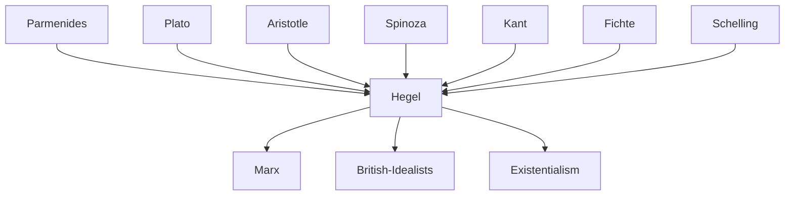

---
cssclasses:
  - Philosophy
  - Political-Science
subclasses:
  - Metaphysics
  - Social-and-Political-Philosophy
  - 19th-Century-Philosophy
aliases:
  - logic
  - objective spirit
  - ethical life
  - abstract right
  - morality
  - state
  - civil society
  - family
  - being essence
  - concept idea
  - sittlichkeit
tags:
  - Conceptual
authors:
  - "[[Hegel]]"
  - "[[Kant]]"
  - "[[Spinoza]]"
  - "[[Fichte]]"
  - "[[Aristotle]]"
movements:
  - "[[German Idealism]]"
reference: "[[04 The search for thought - Unit 9 Chapter 3.pdf]]"
---

#### Central Problem

Hegel's *Encyclopedia of the Philosophical Sciences* (1817, revised 1827, 1830) and *Science of Logic* (1812-1816) address the fundamental problem of articulating the complete structure of reality in its logical, natural, and spiritual dimensions. The central challenge is to demonstrate how thought and being are identical—how the categories of logic are not merely subjective forms but express reality itself in its essence.

Against Kant's critical philosophy, which left an unbridgeable gap between phenomena and things-in-themselves, Hegel argues that there is no reality external to or independent of thought. The "objective thoughts" of logic are not empty subjective forms but the very structure of the real. Against naive realism, empiricism, and the philosophy of faith, Hegel maintains that speculative reason can grasp the Absolute through mediated, rational knowledge rather than through immediate intuition or belief.

The *Lineamenti di filosofia del diritto* (1821) extends this problem to the practical sphere: how does the free will realize itself concretely in the world? How can the abstract opposition between individual morality and social institutions be overcome?

#### Main Thesis

Hegel's system articulates itself in three major divisions: Logic, Philosophy of Nature, and Philosophy of Spirit. The Logic studies the Idea "in and for itself"—the abstract conceptual framework of reality before its externalization in nature or spirit.

**The Logic:**

The Logic divides into three moments:
1. **Logic of Being**: Studies immediate, unreflected determinations (quality, quantity, measure). Being, as absolutely indeterminate, proves identical to nothing; their unity is becoming. The finite, in its insufficiency, passes endlessly into an "other" (bad infinity).
2. **Logic of Essence**: Studies mediated determinations—being reflecting upon itself. Essence is the "truth of being." Phenomena manifest an essence "behind" or "within" them. This logic corresponds historically to Plato through Kant.
3. **Logic of Concept**: Studies being that has become subject or spirit. The concept is not the abstract concept of understanding but the "living spirit of reality." It culminates in the Idea—the unity of subjective and objective, ideal and real.

**Philosophy of Nature:**

Nature is "the Idea in the form of otherness"—essentially exteriority. It represents a "fall" or "decay" of the Idea from itself. Hegel speaks of nature's "impotence" (*Ohnmacht*). It divides into mechanics, physics, and organic physics.

**Philosophy of Spirit:**

Spirit (the Idea returned to itself as subjectivity and freedom) develops through:

1. **Subjective Spirit**: The individual spirit (anthropology, phenomenology, psychology)
2. **Objective Spirit**: Spirit in social institutions, comprising:
   - **Abstract Right**: External manifestation of freedom (property, contract, wrong/punishment)
   - **Morality**: Subjective will of the good (purpose, intention, good and evil)
   - **Ethical Life** (*Sittlichkeit*): Concrete social morality realized in family, civil society, and State
3. **Absolute Spirit**: Art, religion, philosophy

**Critique of Kantian Morality:**

Hegel criticizes Kant's moral philosophy for its formalism and abstraction. The categorical imperative, prescribing only the form of action without content, risks becoming an instrument of immorality. Without concrete determination of what is truly good, the "good conscience" can degrade into "bad conscience." Romantic irony and the "beautiful soul" represent extreme forms of this abstract subjectivity.

**Ethical Life as Synthesis:**

Ethical life (*Sittlichkeit*) overcomes the opposition between external legal coercion (abstract right) and interior pursuit of abstract good (morality). It is "social morality"—the concrete realization of good in institutions. The individual finds in the *éthos* (customs, values, institutions) the determinate content for moral action, not as conformism but as rational recognition of substantive freedom.

#### Historical Context

Hegel wrote the *Science of Logic* (1812-1816) during the Napoleonic period and the *Encyclopedia* (1817, expanded 1827, 1830) and *Philosophy of Right* (1821) during the Restoration era in Prussia. The works engage with the entire Western philosophical tradition, from the Presocratics through German Idealism.

The Logic corresponds historically to distinct phases of philosophy: Being to the Presocratics (who posited principles without reflecting on the meaning of "principle"); Essence to Plato through Kant (who postulated invisible entities to explain appearances); Concept to Idealism (which recognizes that everything is ultimately Idea).

The Philosophy of Right engages with modern natural law theory (Hobbes, Locke, Rousseau), Kantian morality, and Romantic subjectivism. Hegel's defense of the rational State provoked controversy, with some viewing it as conservative justification of the Prussian monarchy and others seeing it as articulating the normative requirements of modern freedom.

#### Philosophical Lineage

#### Key Thinkers

| Thinker | Dates | Movement | Main Work | Core Concept |
|---------|-------|----------|-----------|--------------|
| [[Hegel]] | 1770-1831 | [[German Idealism]] | *Science of Logic*, *Encyclopedia* | Identity of logic and metaphysics, Sittlichkeit |
| [[Kant]] | 1724-1804 | [[Critical Philosophy]] | *Critique of Pure Reason* | Categories as subjective forms (criticized by Hegel) |
| [[Spinoza]] | 1632-1677 | [[Rationalism]] | *Ethics* | Substance without subject (transformed by Hegel) |
| [[Aristotle]] | 384-322 BCE | [[Ancient Philosophy]] | *Metaphysics* | Categories as predicates of being |
| [[Fichte]] | 1762-1814 | [[German Idealism]] | *Doctrine of Science* | Nature as non-I, moral striving |

#### Key Concepts

| Concept | Definition | Related to |
|---------|------------|------------|
| Objective Thoughts | Categories that are not merely subjective forms but express reality itself in its essence | [[Hegel]], [[Metaphysics]] |
| Being-Nothing-Becoming | The "beginning" of logic: indeterminate being = nothing; their unity = becoming | [[Hegel]], [[Logic]] |
| Bad Infinity (*schlechte Unendlichkeit*) | Endless progression of finite to finite without true resolution; the "spurious infinite" | [[Hegel]], [[Fichte]] |
| Essence | The "truth of being"; being reflected into itself; the ground or reason of existence | [[Hegel]], [[Metaphysics]] |
| Concept (*Begriff*) | Not abstract understanding but the "living spirit of reality"; subject-object unity | [[Hegel]], [[Idealism]] |
| Idea | Unity of subjective and objective, ideal and real, finite and infinite; the Absolute in actuality | [[Hegel]], [[Metaphysics]] |
| Abstract Right | External manifestation of freedom: property, contract, wrong and punishment | [[Hegel]], [[Philosophy of Law]] |
| Morality (*Moralität*) | Subjective will of the good; domain of intention and conscience; criticized for abstraction | [[Hegel]], [[Kant]] |
| Ethical Life (*Sittlichkeit*) | Concrete social morality realized in family, civil society, State; the "truth" of right and morality | [[Hegel]], [[Political Philosophy]] |
| Civil Society (*bürgerliche Gesellschaft*) | Sphere of particular interests, economic exchange, needs; mediated by corporations and police | [[Hegel]], [[Political Economy]] |
| State | The actuality of the ethical Idea; rational organization of freedom; "God walking on earth" | [[Hegel]], [[Political Philosophy]] |
| Beautiful Soul (*schöne Seele*) | Romantic figure that retreats into interiority, refusing to act for fear of "contamination" | [[Hegel]], [[Romanticism]] |

#### Authors Comparison

| Theme | [[Kant]] | [[Hegel]] | [[Spinoza]] |
|-------|----------|-----------|-------------|
| Categories | Subjective forms; empty without intuition | Objective thoughts; express reality itself | Attributes of one substance |
| Thing-in-itself | Unknowable limit of knowledge | Dissolved in speculative thought | No external reality to substance |
| Morality | Formal duty; categorical imperative | Must become concrete in Sittlichkeit | Geometric derivation from conatus |
| Freedom | Autonomy of rational will | Realized in ethical institutions | Recognition of necessity |
| State | Guarantor of external freedom | Actuality of ethical Idea | Not distinguished from civil society |
| War | Evil to be overcome; perpetual peace | Necessary moment; prevents "putrefaction" | Natural condition without contract |

#### Influences & Connections

- **Predecessors:** [[Hegel]] ← influenced by ← [[Kant]] (transformed), [[Fichte]] (subjective idealism), [[Schelling]] (identity philosophy)
- **Predecessors:** [[Hegel]] ← influenced by ← [[Spinoza]] (substance as causa sui), [[Aristotle]] (teleology, ethical life)
- **Contemporaries:** [[Hegel]] ↔ dialogue with ↔ [[Romantic Circle]] (critique of irony, beautiful soul)
- **Followers:** [[Hegel]] → influenced → [[Marx]] (civil society critique, dialectic), [[British Idealists]]
- **Opposing views:** [[Hegel]] ← criticized by ← [[Schopenhauer]] (obscurantism), [[Kierkegaard]] (system over existence)

#### Summary Formulas

- **[[Hegel]] (Logic):** Logic is metaphysics; the study of thought is the study of being, since "objective thoughts" express reality itself—categories emerge from concrete historical experience and constitute the framework of the world.

- **[[Hegel]] (Being-Nothing-Becoming):** Absolutely indeterminate being is identical to nothing; their dialectical unity is becoming—the first concrete thought, showing that the immediate is always already mediated.

- **[[Hegel]] (Ethical Life):** Sittlichkeit is the synthesis of abstract right (external coercion) and morality (interior pursuit of abstract good)—concrete social morality realized in family, civil society, and State where freedom becomes actual.

- **[[Hegel]] (Against Kant):** Kantian morality, prescribing only the form of action without concrete content, risks degrading into "bad conscience" where any crime can be justified by appeal to pure intention.

#### Timeline

| Year | Event |
|------|-------|
| 1807 | [[Hegel]] publishes *Phenomenology of Spirit* |
| 1812-1816 | [[Hegel]] publishes *Science of Logic* (3 volumes) |
| 1817 | [[Hegel]] publishes first edition of *Encyclopedia of the Philosophical Sciences* |
| 1818 | [[Hegel]] becomes professor at University of Berlin |
| 1821 | [[Hegel]] publishes *Elements of the Philosophy of Right* |
| 1827 | Second expanded edition of *Encyclopedia* |
| 1830 | Third edition of *Encyclopedia* |
| 1831 | Death of [[Hegel]] in Berlin |

#### Notable Quotes

> "A people without metaphysics is like a temple without an altar." — [[Hegel]]

> "In the tranquil regions of thought that has arrived at itself and is only within itself, the interests that move the life of peoples and individuals fall silent." — [[Hegel]]

> "War has the higher significance that through it the ethical health of peoples is preserved in their indifference toward the stabilization of finite determinacies, as the movement of winds preserves the sea from the putrefaction that a lasting calm would produce." — [[Hegel]]

#### See Also

- [[German Idealism]]
- [[Dialectic]]
- [[Absolute]]
- [[State]]
- [[Civil Society]]
- [[Natural Law]]
- [[Categorical Imperative]]
- [[Freedom]]
- [[Substance]]
- [[Philosophy of Right]]

> [!NOTE]
> *This summary has been created to present the key points from the source text, which was automatically extracted using LLM. Please note that the summary may contain errors. It serves as an essential starting point for study and reference purposes.*
