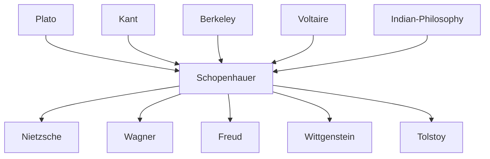

---
cssclasses:
  - Philosophy
subclasses:
  - 19th-Century-Philosophy
  - Metaphysics
  - Ethics
aliases:
  - schopenhauer
  - will to
  - world representation
  - pessimism
  - veil of
  - thing in
  - suffering
  - asceticism
  - denial of
  - noluntas
  - cosmic pessimism
  - eternal recurrence
tags:
  - Conceptual
authors:
  - "[[Schopenhauer]]"
  - "[[Kant]]"
  - "[[Plato]]"
  - "[[Fichte]]"
  - "[[Hegel]]"
movements:
  - "[[Post-Kantian Philosophy]]"
  - "[[Pessimism]]"
  - "[[Voluntarism]]"
reference: "[[05 The search for thought - Unit 1 Chapter 1.pdf]]"
---

#### Central Problem

How can we understand the true nature of reality beyond appearances, and what follows from such understanding for human existence and happiness? Arthur Schopenhauer confronts the fundamental tension between the phenomenal world of experience (what appears to us) and the noumenal reality (what things are in themselves). Building on Kant's critical philosophy but radically departing from it, Schopenhauer asks: if the world as we perceive it is merely representation shaped by our cognitive apparatus, what lies beneath this veil of appearances? And if we can access this deeper reality, what does it reveal about existence, suffering, and the possibility of liberation?

The problem extends beyond epistemology into existential and ethical domains. Schopenhauer challenges the prevailing optimism of German Idealism and Enlightenment progressivism, asking: is existence fundamentally good, rational, and purposeful, or is it characterized by suffering, irrationality, and meaninglessness? The answer to this question determines whether human life can achieve genuine fulfillment or whether liberation requires a radical negation of life itself.

#### Main Thesis

Schopenhauer maintains that reality has two fundamental aspects: the world as representation (Vorstellung) and the world as will (Wille). As representation, the world is phenomenal appearance structured by the subject's cognitive forms (space, time, causality), constituting what Indian philosophy calls the "veil of Maya" — an illusory dream concealing true reality. Unlike Kant, for whom phenomena constitute genuine empirical reality, Schopenhauer treats phenomena as mere illusion.

The breakthrough insight comes through introspection: by experiencing our own body from within (not merely observing it from without), we discover that our essence is will — an unconscious, blind, eternal striving without purpose or goal. By analogy, this will to live (Wille zum Leben) constitutes the thing-in-itself of the entire universe. The will objectifies itself first in eternal Ideas (Platonic archetypes) and then in the multiplicity of individual phenomena through space and time.

This metaphysics grounds Schopenhauer's cosmic pessimism: since will is endless striving, and striving implies lack and desire, existence is essentially suffering. Pleasure is merely the temporary cessation of pain; desire satisfied immediately generates new desire. Life oscillates like a pendulum between pain and boredom, with fleeting pleasure in between. Even love serves merely the will's drive to perpetuate the species, making individuals "puppets" of nature's blind purposes.

Liberation from suffering comes not through suicide (which affirms will by rejecting only particular conditions) but through progressive denial of will: first through art (temporary contemplation of Ideas), then through morality (justice and compassion overcoming egoism), and finally through asceticism — the complete renunciation of desire leading to nirvana-like extinction of will.

#### Historical Context

Schopenhauer (1788-1860) wrote during the dominance of German Idealism, positioning himself as its radical critic. Born in Danzig to a wealthy banking family, he studied at Göttingen under G.E. Schulze and attended Fichte's lectures in Berlin (1811). His doctoral thesis, *On the Fourfold Root of the Principle of Sufficient Reason* (1813), and his masterwork, *The World as Will and Representation* (1818), received virtually no attention during the Idealist heyday. Only after 1848, when revolutionary failures bred widespread pessimism across Europe, did his philosophy gain recognition.

Schopenhauer's intellectual formation drew from heterogeneous sources: Plato's theory of eternal Ideas; Kant's distinction between phenomenon and noumenon (read through post-Kantian interpreters); Enlightenment materialism and ideology's physiological approach to mind; Romantic themes of irrationalism, artistic supremacy, and the infinite; and crucially, Indian philosophy — the Vedas, Upanishads, and Buddhism — which he encountered through Friedrich Majer. While scholars debate the depth of Indian influence (recent research suggests his system developed independently, with Eastern thought providing confirmation and imagery rather than foundation), Schopenhauer pioneered Western philosophical engagement with Asian traditions.

His violent opposition to Hegel — whom he called a "charlatan" and "assassin of truth" — reflected not scholarly disagreement but fundamental incompatibility: where Hegel saw rational Spirit progressively realizing itself in history, Schopenhauer saw blind will eternally reproducing suffering. This anti-historicism made him, in Max Scheler's phrase, "the first deserter from Europe and its faith in history."

#### Philosophical Lineage

#### Key Thinkers

| Thinker | Dates | Movement | Main Work | Core Concept |
|---------|-------|----------|-----------|--------------|
| [[Schopenhauer]] | 1788-1860 | [[Pessimism]] | *The World as Will and Representation* | Will to live, cosmic pessimism |
| [[Kant]] | 1724-1804 | [[Critical Philosophy]] | *Critique of Pure Reason* | Phenomenon/noumenon distinction |
| [[Plato]] | 428-348 BCE | [[Ancient Philosophy]] | *Republic* | Theory of Ideas |
| [[Fichte]] | 1762-1814 | [[German Idealism]] | *Science of Knowledge* | Absolute Ego |
| [[Hegel]] | 1770-1831 | [[German Idealism]] | *Phenomenology of Spirit* | Absolute Spirit, dialectic |

#### Key Concepts

| Concept | Definition | Related to |
|---------|------------|------------|
| Will to live (Wille zum Leben) | The blind, unconscious, eternal striving that constitutes the thing-in-itself of all reality | [[Schopenhauer]], [[Voluntarism]] |
| Representation (Vorstellung) | The phenomenal world as it appears to a knowing subject through forms of space, time, and causality | [[Schopenhauer]], [[Kant]] |
| Veil of Maya | The illusory character of phenomenal appearance concealing true reality; borrowed from Indian philosophy | [[Schopenhauer]], [[Indian Philosophy]] |
| Principium individuationis | The principle by which space and time multiply the one will into many individual phenomena | [[Schopenhauer]], [[Metaphysics]] |
| Noluntas | The negation of will; the turning of will against itself that enables liberation from suffering | [[Schopenhauer]], [[Asceticism]] |
| Ideas | Eternal archetypes (Platonic forms) constituting the first objectification of will before spatio-temporal multiplication | [[Schopenhauer]], [[Plato]] |
| Cosmic pessimism | The doctrine that suffering is essential to existence because will is endless unfulfilled striving | [[Schopenhauer]], [[Pessimism]] |
| Fourfold root of sufficient reason | The four forms of causality: physical necessity, logical necessity, mathematical necessity, moral necessity | [[Schopenhauer]], [[Epistemology]] |

#### Authors Comparison

| Theme | [[Schopenhauer]] | [[Kant]] | [[Hegel]] |
|-------|------------------|----------|-----------|
| Phenomenon/noumenon | Phenomenon is illusion; noumenon accessible through inner experience | Phenomenon is empirical reality; noumenon unknowable | Appearance and essence dialectically united |
| Thing-in-itself | Will — blind, irrational striving | Unknowable limit-concept | Absolute Spirit knowing itself |
| History | Meaningless repetition; no progress | Progress toward eternal peace | Rational development of Spirit |
| Human nature | Driven by unconscious will; reason serves will | Rational moral agent | Spirit achieving self-consciousness |
| Ethics | Compassion (Mitleid) overcoming egoism | Categorical imperative; duty | Sittlichkeit in State |
| Ultimate reality | Irrational will | Unknown | Absolute Reason |

#### Influences & Connections

- **Predecessors:** [[Schopenhauer]] ← influenced by ← [[Kant]], [[Plato]], [[Berkeley]], [[Voltaire]], [[Indian Philosophy]]
- **Contemporaries:** [[Schopenhauer]] ← opposed to ← [[Hegel]], [[Fichte]], [[Schelling]]
- **Followers:** [[Schopenhauer]] → influenced → [[Nietzsche]], [[Wagner]], [[Freud]], [[Wittgenstein]], [[Tolstoy]], [[Thomas Mann]]
- **Opposing views:** [[Schopenhauer]] ← criticized by ← [[German Idealists]], [[Hegel]]

#### Summary Formulas

- **[[Schopenhauer]]:** The world is the self-objectification of a blind, irrational will to live; existence is therefore suffering, and liberation comes through progressive denial of will culminating in ascetic renunciation.

- **[[Kant]]:** The phenomenal world structured by space, time, and categories is genuinely knowable; the thing-in-itself remains forever inaccessible to theoretical reason.

- **[[Hegel]]:** Reality is the progressive self-realization of Absolute Spirit through dialectical development in nature and history.

#### Timeline

| Year | Event |
|------|-------|
| 1788 | [[Schopenhauer]] born in Danzig |
| 1811 | [[Schopenhauer]] attends [[Fichte]]'s lectures in Berlin |
| 1813 | [[Schopenhauer]] publishes doctoral thesis *On the Fourfold Root of the Principle of Sufficient Reason* |
| 1816 | [[Schopenhauer]] publishes *On Vision and Colors* defending [[Goethe]]'s theory |
| 1818 | [[Schopenhauer]] publishes *The World as Will and Representation* (dated 1819) |
| 1820 | [[Schopenhauer]] begins unsuccessful lectures at Berlin University |
| 1831 | [[Schopenhauer]] leaves Berlin due to cholera epidemic |
| 1836 | [[Schopenhauer]] publishes *On the Will in Nature* |
| 1841 | [[Schopenhauer]] publishes *The Two Fundamental Problems of Ethics* |
| 1851 | [[Schopenhauer]] publishes *Parerga and Paralipomena*; fame begins |
| 1860 | [[Schopenhauer]] dies in Frankfurt |

#### Notable Quotes

> "The world is my representation: this is a truth valid for every living and knowing being." — [[Schopenhauer]]

> "Life swings like a pendulum back and forth between pain and boredom, with pleasure as a fleeting interval." — [[Schopenhauer]]

> "Every volition springs from lack, from deficiency, and thus from suffering." — [[Schopenhauer]]

#### See Also

- [[Pessimism]]
- [[Voluntarism]]
- [[German Idealism]]
- [[Indian Philosophy]]
- [[Buddhism]]
- [[Kant]]
- [[Nietzsche]]
- [[Freud]]
- [[Philosophy of Will]]
- [[Asceticism]]

> [!NOTE]
> *This summary has been created to present the key points from the source text, which was automatically extracted using LLM. Please note that the summary may contain errors. It serves as an essential starting point for study and reference purposes.*
