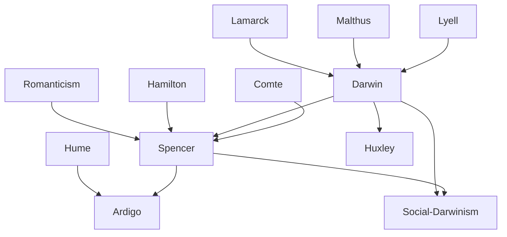

---
cssclasses:
  - Philosophy
  - Biological-Sciences
subclasses:
  - 19th-Century-Philosophy
  - Philosophy-of-Science
  - Metaphysics
aliases:
  - evolutionary positivism
  - evolution
  - natural selection
  - survival fittest
  - unknowable
  - cosmic evolution
  - progress
  - social darwinism
  - synthetic philosophy
  - agnosticism
  - adaptation
  - homogeneous heterogeneous
tags:
  - Conceptual
  - Empirical
authors:
  - "[[Darwin]]"
  - "[[Spencer]]"
  - "[[Ardigo]]"
  - "[[Lamarck]]"
  - "[[Huxley]]"
movements:
  - "[[Positivism]]"
  - "[[Evolutionism]]"
  - "[[Social Darwinism]]"
reference: "[[05 The search for thought - Unit 3 Chapter 2.pdf]]"
---

#### Central Problem

Evolutionary positivism confronts the challenge of extending the concept of evolution—derived from biological science—into a comprehensive philosophical worldview capable of explaining all reality. The central problem is twofold: first, how can the particular findings of biology (the transformation of species through natural selection) be generalized into a universal law governing all phenomena? Second, how can science and religion be reconciled given that both confront the ultimate mystery of existence?

The movement grapples with questions that arise once Darwin's theory dismantles the traditional view of fixed species created by God: What is the ultimate nature of reality if not divine creation? Is there purpose or direction in the universe, or only blind mechanical processes? How does consciousness emerge from matter? What becomes of human dignity if humans are merely evolved animals? And crucially: does evolution imply progress, and if so, what guarantees this progress?

A subsidiary problem concerns the relationship between scientific knowledge and ultimate reality. If science can only know phenomena (appearances), what lies beyond? The evolutionary positivists, particularly Spencer, attempt to carve out a domain for religion by positing an "Unknowable" reality that science cannot reach but that grounds all phenomena.

#### Main Thesis

Evolutionary positivism holds that evolution is the universal law governing all phenomena—from cosmic nebulae to human societies—and that this evolution necessarily tends toward greater complexity, differentiation, and (implicitly) progress. The main theses can be articulated through its principal representatives:

**Darwin's Theory of Natural Selection:** [[Darwin]] provides the scientific foundation by demonstrating that species are not fixed but transform through the mechanism of natural selection. Two key factors drive evolution: (a) random variations that occur in organisms, some of which prove advantageous; (b) the struggle for existence (derived from Malthus) that ensures only the fittest survive. Through heredity, advantageous traits accumulate over generations, eventually producing new species. Darwin explicitly extends this to humans in *The Descent of Man*, arguing that the difference between human and animal intelligence is one of degree, not kind.

**Spencer's Cosmic Evolutionism:** [[Spencer]] generalizes biological evolution into a law governing all reality. Evolution is defined as "an integration of matter and concomitant dissipation of motion; during which the matter passes from an indefinite, incoherent homogeneity to a definite, coherent heterogeneity." This applies universally: to the formation of the solar system from nebulae, to biological organisms, to human societies, to language, to art. Evolution proceeds necessarily (homogeneity being unstable) and progressively toward greater perfection and happiness.

**The Unknowable:** Spencer reconciles science and religion by positing an "Unknowable"—the ultimate reality that manifests in all phenomena but remains forever beyond human comprehension. Science investigates the manifestations; religion acknowledges the mystery. Both are legitimate within their domains. This "transfigured realism" holds that phenomena, while not identical to the Unknowable, correspond to it and are therefore real.

**Philosophy as Unified Knowledge:** Philosophy's task is to unify all scientific knowledge at the highest level of generality, formulating the law of evolution as the master principle that synthesizes the fundamental laws of physics (indestructibility of matter, continuity of motion, persistence of force).

#### Historical Context

Evolutionary positivism emerges in the second half of the nineteenth century, building on earlier biological theories of species transformation. [[Buffon]], [[Lamarck]], and [[Saint-Hilaire]] had proposed transformist hypotheses in the eighteenth and early nineteenth centuries, but these could not prevail against [[Cuvier]]'s catastrophism (the theory that successive cataclysms destroyed species, which were then separately created anew). Only when [[Lyell]]'s geology demonstrated gradual geological change did the scientific context favor evolutionary theory.

[[Darwin]]'s *Origin of Species* (1859) appeared at precisely the moment when the Romantic idea of progress—originally developed for human history—had achieved its maximum universality. The theory's immediate success (the first edition sold out in one day) reflects this cultural readiness. Darwin offered what the age demanded: a scientific basis for the belief in universal progress that would extend the historical optimism of Hegel and the social optimism of Comte to the entire natural world.

The term "agnosticism" was coined in 1869 by [[Huxley]] (Darwin's most enthusiastic defender) to describe the position that ultimate metaphysical questions cannot be answered—a stance Darwin himself adopted. This reflects the broader cultural negotiation between scientific naturalism and religious tradition that characterizes the period.

The concept of "Social Darwinism" emerged as Darwin's biological concepts (selection, struggle for existence) were extended to human society, often to justify existing class and racial inequalities as "natural." This ideological appropriation, while not Darwin's intention, demonstrates the cultural impact of evolutionary theory.

In Italy, [[Ardigò]] developed his own version of evolutionary positivism, modifying Spencer's concept while engaging in fierce polemics against the Hegelian idealism that would eventually triumph in Italian philosophy.

#### Philosophical Lineage

#### Key Thinkers

| Thinker | Dates | Movement | Main Work | Core Concept |
|---------|-------|----------|-----------|--------------|
| [[Darwin]] | 1809-1882 | [[Evolutionism]] | *Origin of Species* | Natural selection, survival of the fittest |
| [[Spencer]] | 1820-1903 | [[Evolutionary Positivism]] | *First Principles* | Unknowable, universal evolution |
| [[Huxley]] | 1825-1895 | [[Evolutionism]] | Various writings | Agnosticism, defense of Darwin |
| [[Ardigo]] | 1828-1920 | [[Italian Positivism]] | *Positive Psychology* | Indistinct to distinct, rejection of Unknowable |
| [[Lamarck]] | 1744-1829 | [[Transformism]] | Various writings | Inheritance of acquired characteristics |

#### Key Concepts

| Concept | Definition | Related to |
|---------|------------|------------|
| Natural Selection | Process by which organisms with advantageous variations survive and reproduce, accumulating beneficial traits over generations | [[Darwin]], [[Evolutionism]] |
| Survival of the Fittest | Spencer's term for Darwin's natural selection; organisms best adapted to environment survive | [[Spencer]], [[Darwin]] |
| Unknowable | Ultimate reality that manifests in phenomena but remains forever beyond human comprehension | [[Spencer]], [[Agnosticism]] |
| Evolution (Spencer) | Integration of matter with dissipation of motion; passage from indefinite incoherent homogeneity to definite coherent heterogeneity | [[Spencer]], [[Synthetic Philosophy]] |
| Agnosticism | Position that ultimate metaphysical questions (God, absolute) cannot be known | [[Huxley]], [[Spencer]] |
| Transfigured Realism | Doctrine that phenomena correspond to the Unknowable and are therefore real, not mere appearances | [[Spencer]], [[Epistemology]] |
| Struggle for Existence | Competition among organisms for limited resources driving natural selection | [[Darwin]], [[Malthus]] |
| Social Darwinism | Application of evolutionary concepts to society; justification of social hierarchy as "natural" | [[Spencer]], [[Sociology]] |
| Indistinct/Distinct | Ardigò's reformulation of evolution as passage from confused awareness to articulated knowledge | [[Ardigo]], [[Psychology]] |
| Industrial Regime | Spencer's term for modern society based on free cooperation, replacing military regime of coercion | [[Spencer]], [[Sociology]] |

#### Authors Comparison

| Theme | [[Darwin]] | [[Spencer]] | [[Ardigo]] |
|-------|------------|-------------|------------|
| Scope of evolution | Biological organisms | All reality (cosmic, biological, social, mental) | All reality, but psychologically conceived |
| Mechanism | Natural selection, random variation | Universal law of integration/differentiation | Passage from indistinct to distinct |
| Ultimate reality | Agnostic; science cannot pronounce | Unknowable; grounds phenomena | No Unknowable; only the "not yet known" |
| Progress | Biological improvement toward perfection | Necessary, universal progress | Progressive differentiation |
| Religion | Personal agnosticism | Reconciled with science via Unknowable | Rejected; naturalistic ethics |
| Role of purpose | Denied; blind mechanism | Implicit in progressive evolution | Denied; naturalistic explanation |
| Method | Empirical observation, experiment | Deductive synthesis from scientific laws | Empirico-psychological |

#### Influences & Connections

- **Predecessors:** [[Darwin]] ← influenced by ← [[Malthus]] (population theory), [[Lyell]] (gradualist geology), [[Lamarck]] (transformism)
- **Predecessors:** [[Spencer]] ← influenced by ← [[Hamilton]], [[Mansel]] (limits of knowledge), Romantic philosophy of progress
- **Contemporaries:** [[Darwin]] ↔ dialogue with ↔ [[Huxley]] (defender and popularizer), [[Wallace]] (co-discoverer)
- **Contemporaries:** [[Spencer]] ↔ correspondence with ↔ [[Mill]] (disagreements on method)
- **Followers:** [[Darwin]] → influenced → [[Spencer]], [[Haeckel]], evolutionary biology
- **Followers:** [[Spencer]] → influenced → [[Ardigo]], [[Social Darwinism]], sociology
- **Opposing views:** [[Darwin]] ← criticized by ← religious traditionalists, [[Cuvier]]'s catastrophism
- **Opposing views:** [[Spencer]] ← criticized by ← [[Mill]] (authoritarianism), later idealists

#### Summary Formulas

- **[[Darwin]]:** Species transform through natural selection: random variations that prove advantageous in the struggle for existence are preserved through heredity, accumulating over generations to produce new species; humans differ from animals in degree, not kind.

- **[[Spencer]]:** Evolution is the universal cosmic law by which all reality passes from indefinite incoherent homogeneity to definite coherent heterogeneity; the Unknowable grounds all phenomena while remaining forever beyond human comprehension; science and religion are reconciled as complementary approaches to this mystery.

- **[[Ardigo]]:** Evolution is the passage from the indistinct to the distinct; there is no metaphysical Unknowable but only what is not yet known; what is a priori for the individual is a posteriori for the species.

#### Timeline

| Year | Event |
|------|-------|
| 1809 | [[Darwin]] born; [[Lamarck]] publishes *Philosophie Zoologique* |
| 1830 | [[Lyell]] begins publishing *Principles of Geology* |
| 1855 | [[Spencer]] publishes *Principles of Psychology* |
| 1857 | [[Spencer]] publishes article "Progress, Its Law and Cause" |
| 1859 | [[Darwin]] publishes *Origin of Species* |
| 1862 | [[Spencer]] publishes *First Principles* |
| 1864-67 | [[Spencer]] publishes *Principles of Biology* |
| 1869 | [[Huxley]] coins term "agnosticism"; [[Ardigo]] publishes essay on Pomponazzi |
| 1871 | [[Darwin]] publishes *The Descent of Man* |
| 1879 | [[Ardigo]] publishes *The Morality of Positivists* |
| 1882 | [[Darwin]] dies |
| 1903 | [[Spencer]] dies |

#### Notable Quotes

> "We may conclude with some confidence that we can count on a future of incalculable length. And as natural selection works solely for the good of each individual, every physical and intellectual gift will tend to progress toward perfection." — [[Darwin]]

> "Evolution is an integration of matter and concomitant dissipation of motion; during which the matter passes from an indefinite, incoherent homogeneity to a definite, coherent heterogeneity." — [[Spencer]]

> "What is a priori for the individual is a posteriori for the species." — [[Spencer]]

#### See Also

- [[Positivism]]
- [[Natural Selection]]
- [[Social Darwinism]]
- [[Agnosticism]]
- [[Philosophy of Biology]]
- [[Progress]]
- [[Comte]]
- [[Lamarck]]
- [[Malthus]]
- [[Synthetic Philosophy]]

> [!NOTE]
> *This summary has been created to present the key points from the source text, which was automatically extracted using LLM. Please note that the summary may contain errors. It serves as an essential starting point for study and reference purposes.*
