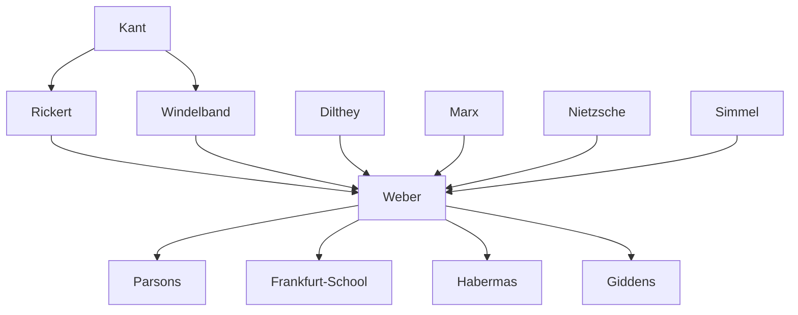

---
cssclasses:
  - Philosophy
  - Sociology
subclasses:
  - Epistemology
  - Social-and-Political-Philosophy
  - 19th-Century-Philosophy
aliases:
  - weber
  - ideal types
  - value freedom
  - disenchantment
  - verstehen sociology
  - rationalization
  - bureaucracy
  - protestant ethic
  - capitalism spirit
  - charismatic authority
  - causal imputation
  - methodology
tags:
  - Conceptual
  - Empirical
authors:
  - "[[Weber]]"
  - "[[Marx]]"
  - "[[Rickert]]"
  - "[[Dilthey]]"
  - "[[Comte]]"
movements:
  - "[[Neo-Kantianism]]"
  - "[[German Historicism]]"
  - "[[Sociology]]"
reference: "[[05 The search for thought - Unit 4 Chapter 3.pdf]]"
---

#### Central Problem

How can the human and social sciences achieve objective, scientifically valid knowledge while recognizing that their objects of study are fundamentally shaped by human values and cultural meanings? This methodological problem encompasses several interconnected questions: What distinguishes the historical-social sciences from the natural sciences? How can research grounded in subjective value-orientations produce universally valid results? What is the proper relationship between scientific description and value judgment?

Max Weber confronts these questions against the backdrop of the late nineteenth-century methodological debates (Methodenstreit) between the marginalists and the historical school of economics, and the broader controversy over the nature of the Geisteswissenschaften. Weber rejects both the positivist attempt to reduce social science to natural science and the romantic-historicist retreat into pure intuition and empathy. His solution involves a sophisticated account of how value-relevance (Wertbeziehung) shapes research without compromising scientific objectivity, and how causal explanation can operate in the domain of unique historical individuals.

Beyond methodology, Weber addresses the broader question of modernity itself: What are the distinctive features of modern Western civilization? What has been gained and lost through the progressive rationalization of life? These questions culminate in his famous analysis of the "disenchantment of the world" (Entzauberung der Welt) — the process by which magical and religious worldviews give way to scientific-technical rationality.

#### Main Thesis

Weber argues that the historical-social sciences are distinguished from natural sciences not by their object (spirit vs. nature, as Dilthey claimed) nor by their method (understanding vs. explanation), but by their orientation toward **individuality** — the study of phenomena in their unique, unrepeatable particularity rather than as instances of general laws. This individuality, however, is not an intrinsic property of objects but the result of a **selective choice** made by the researcher based on culturally relevant values.

**Value-Relevance and Objectivity:** The relation to values (Wertbeziehung) determines which aspects of infinite empirical reality become worthy of scientific attention. Values guide the selection of research problems but must not influence the evaluation of results. This distinction between value-relevance (theoretical relation to values) and value-judgment (practical evaluation) grounds Weber's principle of **value-freedom** (Wertfreiheit): science can only establish what is, never what ought to be.

**Causal Explanation in History:** Against Dilthey's intuitive Verstehen, Weber insists that understanding in the social sciences is essentially causal explanation of individual events. This operates through **judgments of objective possibility** — counterfactual reasoning that asks: if we mentally exclude certain causal factors, would the outcome have been significantly different? This distinguishes between "adequate causation" (essential factors) and "accidental causation" (incidental factors).

**Ideal Types:** Scientific concepts in social science take the form of ideal types — conceptual constructs that accentuate certain features of reality to serve as heuristic devices for understanding. These are neither descriptions of reality nor normative ideals, but methodological tools. They are explicitly one-sided, perspectival, and subject to revision as research interests change.

**The Protestant Ethic and Capitalism:** Reversing the Marxist schema of base and superstructure, Weber demonstrates how religious ideas (specifically Calvinist predestination and worldly asceticism) contributed to the emergence of the "spirit of capitalism" — showing that cultural factors can influence economic structures, not only vice versa.

**Disenchantment and Modernity:** Modern Western civilization is characterized by progressive rationalization — the dominance of purposive-rational action (Zweckrationalität), bureaucratization, and the loss of ultimate meaning. The "iron cage" of modernity represents both achievement and imprisonment: technical mastery over nature at the cost of meaning and enchantment.

#### Historical Context

Weber's work emerges at the height of German intellectual culture's engagement with questions of historical method and scientific status. The Methodenstreit in economics pitted the Austrian marginalists (Menger) against the German historical school (Schmoller, Roscher, Knies), raising fundamental questions about whether economics could be a generalizing science or must remain historically particular.

The broader philosophical context included Dilthey's attempt to ground the Geisteswissenschaften in psychological understanding (Verstehen), and the Neo-Kantian response — particularly Windelband's distinction between nomothetic and idiographic sciences, and Rickert's theory of value-relevance and cultural sciences. Weber absorbed these influences while developing his own distinctive synthesis.

Politically, Weber lived through the German Empire's rise, World War I, and the birth of the Weimar Republic. He participated in drafting the Weimar Constitution, including the controversial Article 48 granting emergency powers to the president. His political sociology reflects both democratic commitment and skeptical realism about mass politics and bureaucracy.

The intellectual ferment of pre-war Heidelberg, where Weber's home became a salon for leading thinkers (Simmel, Jaspers, Lukács, Bloch, Troeltsch), provided the crucible for his mature thought. His personal crisis — a severe nervous breakdown from 1897 that interrupted his academic career for years — also shaped his reflections on the tensions between scientific vocation and existential commitment.

#### Philosophical Lineage

#### Key Thinkers

| Thinker | Dates | Movement | Main Work | Core Concept |
|---------|-------|----------|-----------|--------------|
| [[Weber]] | 1864-1920 | [[German Historicism]] | *Economy and Society* | Ideal types, value-freedom |
| [[Rickert]] | 1863-1936 | [[Neo-Kantianism]] | *The Limits of Concept Formation* | Value-relation, cultural sciences |
| [[Dilthey]] | 1833-1911 | [[German Historicism]] | *Introduction to Human Sciences* | Verstehen, lived experience |
| [[Marx]] | 1818-1883 | [[Historical Materialism]] | *Capital* | Base-superstructure, ideology |
| [[Simmel]] | 1858-1918 | [[German Historicism]] | *Philosophy of Money* | Forms of sociation |
| [[Tönnies]] | 1855-1936 | [[Sociology]] | *Community and Society* | Gemeinschaft/Gesellschaft |

#### Key Concepts

| Concept | Definition | Related to |
|---------|------------|------------|
| Ideal type | Conceptual construct accentuating certain features of reality as heuristic device for understanding; neither description nor normative ideal | [[Weber]], methodology |
| Value-freedom (Wertfreiheit) | Principle that science describes what is, not what ought to be; excludes value-judgments from scientific conclusions | [[Weber]], [[Neo-Kantianism]] |
| Value-relevance (Wertbeziehung) | Theoretical relation to values that guides selection of research objects without determining conclusions | [[Rickert]], [[Weber]] |
| Objective possibility | Counterfactual reasoning determining causal significance by mentally excluding factors and assessing consequences | [[Weber]], causal imputation |
| Adequate causation | Causal factors whose hypothetical exclusion would significantly alter historical outcome | [[Weber]], methodology |
| Disenchantment (Entzauberung) | Process whereby world loses magical-sacred aura through progressive rationalization and intellectualization | [[Weber]], modernity |
| Purposive rationality (Zweckrationalität) | Action oriented to selecting efficient means for achieving given ends; characteristic of modern capitalism | [[Weber]], types of action |
| Charismatic authority | Legitimate domination based on exceptional personal qualities of leader; contrasts with traditional and legal-rational | [[Weber]], political sociology |
| Spirit of capitalism | Ethos of rational, systematic pursuit of profit as duty; historically rooted in Protestant worldly asceticism | [[Weber]], sociology of religion |
| Iron cage | Metaphor for constraining, dehumanizing aspects of modern rationalized society and bureaucracy | [[Weber]], critique of modernity |

#### Authors Comparison

| Theme | [[Weber]] | [[Marx]] | [[Dilthey]] |
|-------|-----------|----------|-------------|
| Science-values relation | Strict separation; value-freedom | Science serves revolutionary practice | Understanding as re-living (Nacherleben) |
| Historical causation | Multi-directional; ideal and material factors | Economic base determines superstructure | Psychological understanding, not causal |
| Method of social science | Causal explanation via ideal types | Historical materialism | Empathetic understanding (Verstehen) |
| Role of economy | One factor among many; reciprocal influence | Determinant in last instance | Subordinate to spiritual life |
| Capitalism | Product of religious and economic factors | Exploitative mode of production | Not central concern |
| Modernity | Rationalization; ambivalent "iron cage" | Alienation; historical necessity toward socialism | Crisis of objective knowledge |

#### Influences & Connections

- **Predecessors:** [[Weber]] ← influenced by ← [[Rickert]], [[Windelband]], [[Dilthey]], [[Marx]], [[Nietzsche]]
- **Contemporaries:** [[Weber]] ↔ dialogue with ↔ [[Simmel]], [[Troeltsch]], [[Jaspers]], [[Lukács]]
- **Followers:** [[Weber]] → influenced → [[Parsons]], [[Habermas]], [[Giddens]], [[Frankfurt School]]
- **Opposing views:** [[Weber]] ← criticized by ← [[Lukács]] (for value-freedom), [[Critical Theory]] (for positivism)

#### Summary Formulas

- **[[Weber]]:** The historical-social sciences achieve objectivity not despite but through explicit value-relevance; understanding is causal explanation via ideal types; modernity is progressive rationalization culminating in the disenchanted "iron cage."

- **[[Rickert]]:** Historical sciences differ from natural sciences by their individualizing method and constitutive relation to cultural values, which determine what is historically significant.

- **[[Marx]]:** The economic base of society determines the ideological superstructure; cultural phenomena are ultimately reducible to material conditions of production.

- **[[Dilthey]]:** The human sciences require a distinctive method of empathetic understanding (Verstehen) that grasps meaning through re-living the experiences of historical actors.

#### Timeline

| Year | Event |
|------|-------|
| 1864 | [[Weber]] born in Erfurt, Thuringia |
| 1889 | [[Weber]] doctoral thesis on medieval trading companies |
| 1894 | Dreyfus Affair begins in France |
| 1897 | [[Weber]] suffers severe nervous breakdown |
| 1903-1906 | [[Weber]] writes main methodological essays on historical-social sciences |
| 1904-1905 | [[Weber]] publishes *The Protestant Ethic and the Spirit of Capitalism* |
| 1904 | [[Weber]] visits United States; founds journal *Archive for Social Science* |
| 1908 | [[Weber]] co-founds German Sociological Society |
| 1917 | [[Weber]] delivers lecture "Science as a Vocation" |
| 1919 | [[Weber]] delivers lecture "Politics as a Vocation"; teaches at Munich |
| 1920 | [[Weber]] dies in Munich; *Economy and Society* published posthumously |

#### Notable Quotes

> "Not the real interconnection of 'things,' but the conceptual interconnection of problems stands at the basis of the fields of work of the sciences: where a new problem is approached with a new method, and truths are discovered that open new significant viewpoints, there a new 'science' arises." — [[Weber]]

> "There is no absolutely 'objective' scientific analysis of cultural life or of 'social phenomena' independent of special and 'one-sided' viewpoints according to which — expressly or tacitly, consciously or unconsciously — they are selected, analyzed, and organized." — [[Weber]]

> "The disenchantment of the world means the consciousness or belief that one need only will it to experience everything at any time; that there are in principle no mysterious incalculable forces at work, but rather that one can, in principle, master everything by calculation." — [[Weber]]

#### See Also

- [[Neo-Kantianism]]
- [[German Historicism]]
- [[Verstehen]]
- [[Sociology of Religion]]
- [[Historical Materialism]]
- [[Bureaucracy]]
- [[Rationalization]]
- [[Modernity]]
- [[Charisma]]
- [[Protestant Ethic]]

> [!NOTE]
> *This summary has been created to present the key points from the source text, which was automatically extracted using LLM. Please note that the summary may contain errors. It serves as an essential starting point for study and reference purposes.*
