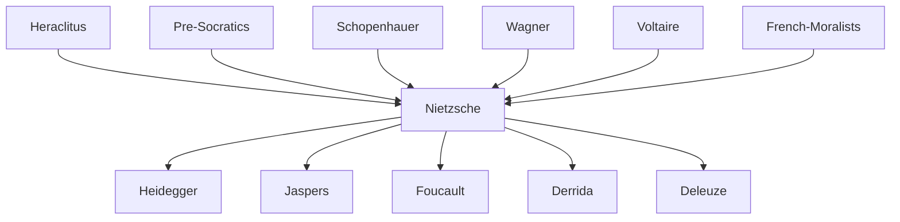

---
cssclasses:
  - Philosophy
subclasses:
  - 19th-Century-Philosophy
  - Metaphysics
  - Ethics
aliases:
  - nietzsche
  - death god
  - dionysian
  - apollonian
  - overman
  - nihilism
  - genealogy morals
  - will power
  - tragic philosophy
  - eternal return
  - free spirit
  - revaluation values
tags:
  - Conceptual
authors:
  - "[[Nietzsche]]"
  - "[[Schopenhauer]]"
  - "[[Wagner]]"
movements:
  - "[[Nihilism]]"
  - "[[Existentialism]]"
  - "[[Life Philosophy]]"
reference: "[[05 The search for thought - Unit 6 Chapter 1.pdf]]"
---

#### Central Problem

Nietzsche confronts the fundamental crisis of Western civilization: the collapse of all absolute values, metaphysical certainties, and religious foundations that have sustained human existence for millennia. How can humanity live authentically once it recognizes that the cosmos is fundamentally chaotic, purposeless, and devoid of transcendent meaning? What happens when the "death of God" removes all stable points of reference?

The central tension in Nietzsche's thought lies between the human need for meaning, order, and value on one hand, and the reality of an indifferent, irrational universe on the other. Traditional philosophy and religion have constructed elaborate "lies" to make existence bearable, but the honest thinker must now face the terrifying consequences of unmasking these illusions. The question becomes: can a new type of human being emerge who affirms life without the crutch of metaphysical comfort?

This leads to Nietzsche's critique of the entire Western philosophical tradition from Plato onward, which he sees as fundamentally life-denying, having invented a "true world" to depreciate the only world we actually have. The task of philosophy is no longer to seek eternal truths but to expose the human, "all too human" origins of our supposedly transcendent values.

#### Main Thesis

Nietzsche's philosophy constitutes a radical critique of Western civilization that simultaneously destroys traditional certainties and points toward a new type of humanity.

**Apollonian and Dionysian:** In *The Birth of Tragedy*, Nietzsche identifies two fundamental impulses in Greek culture: the Apollonian (form, order, individuation, dream, sculpture) and the Dionysian (chaos, ecstasy, dissolution of individuality, music). The greatness of Attic tragedy lay in the fusion of these opposites. The decline of tragedy—and of Western culture—began when the Apollonian spirit of Socratic rationalism suppressed the Dionysian depths of life.

**Acceptance of Life:** Against Schopenhauer's pessimistic asceticism, Nietzsche embraces a total affirmation of existence. Dionysus symbolizes the "yes" to life in all its aspects—joy and suffering, creation and destruction. Life is not to be judged against some otherworldly standard but affirmed as the sole reality.

**Death of God:** God represents not merely the Christian deity but all metaphysical certainties, moral absolutes, and otherworldly values. The announcement that "God is dead" signals the collapse of the entire Platonic-Christian framework that has dominated Western thought. This event creates existential vertigo—the loss of all orientation—but also liberates humanity for self-creation.

**Genealogical Method:** Nietzsche develops a "chemistry of ideas and sentiments" that traces supposedly eternal values back to their human, historical origins. This demystifying critique reveals that our "highest" values often spring from "base" motives—resentment, weakness, the will to power.

**Philosophy of the Morning:** The "free spirit" who has liberated himself from metaphysical illusions lives experimentally, without predetermined certainties, embracing life as transitoriness and open possibility.

**History and Life:** Against excessive historicism that paralyzes action, Nietzsche argues that history must serve life. He distinguishes three modes: monumental history (seeking models for action), antiquarian history (preserving tradition), and critical history (judging and breaking with the past).

#### Historical Context

Friedrich Nietzsche (1844-1900) lived during a period of profound transformation in European culture. The scientific revolution, particularly Darwinism, challenged religious worldviews. Industrialization and nationalism were reshaping society. The optimistic faith in progress characteristic of the nineteenth century would soon collapse in the catastrophe of World War I.

Nietzsche received his doctorate from Leipzig, where he discovered Schopenhauer's philosophy, which deeply influenced his early work. At the remarkably young age of 24, he was appointed professor of classical philology at Basel (1869). There he befriended the historian Jacob Burckhardt and became an ardent admirer of Richard Wagner, whose music he saw as embodying the rebirth of tragic culture.

The Franco-Prussian War (1870-1871) and the founding of the German Reich formed the political backdrop of his early career. His health deteriorated throughout the 1870s, forcing him to resign his professorship in 1879. The following decade saw his most productive period, despite constant illness and isolation. His mental collapse in January 1889 (possibly related to syphilis) ended his philosophical work; he spent the last eleven years of his life in the care of his mother and sister.

The reception of Nietzsche's thought has been deeply controversial. His sister Elisabeth manipulated his posthumous writings and promoted connections with Nazi ideology, though contemporary scholarship has decisively rejected such interpretations while acknowledging genuinely anti-democratic elements in his work.

#### Philosophical Lineage

#### Key Thinkers

| Thinker | Dates | Movement | Main Work | Core Concept |
|---------|-------|----------|-----------|--------------|
| [[Nietzsche]] | 1844-1900 | [[Life Philosophy]] | *Thus Spoke Zarathustra* | Death of God, Overman |
| [[Schopenhauer]] | 1788-1860 | [[Pessimism]] | *The World as Will* | Will, pessimism, asceticism |
| [[Wagner]] | 1813-1883 | [[Romanticism]] | *The Ring of the Nibelung* | Total artwork, myth |
| [[Burckhardt]] | 1818-1897 | [[Historicism]] | *Civilization of the Renaissance* | Cultural history |
| [[Heidegger]] | 1889-1976 | [[Phenomenology]] | *Nietzsche* (lectures) | Metaphysics of will to power |

#### Key Concepts

| Concept | Definition | Related to |
|---------|------------|------------|
| Apollonian | Impulse toward form, order, individuation, clarity; expressed in sculpture and epic poetry | [[Nietzsche]], [[Aesthetics]] |
| Dionysian | Impulse toward ecstasy, dissolution, chaos, life-force; expressed in music and tragedy | [[Nietzsche]], [[Aesthetics]] |
| Death of God | The collapse of all metaphysical certainties and absolute values that have sustained Western civilization | [[Nietzsche]], [[Nihilism]] |
| Free spirit | One who has liberated himself from traditional beliefs and lives experimentally, without fixed certainties | [[Nietzsche]], [[Enlightenment]] |
| Philosophy of the morning | A mode of thinking based on life as transitoriness and free experimentation, opposing metaphysical dogma | [[Nietzsche]], [[Epistemology]] |
| Genealogical method | Critical-historical analysis tracing values and concepts to their human, contingent origins | [[Nietzsche]], [[Ethics]] |
| Millennial lies | The metaphysical, religious, and moral fictions humanity has constructed to make existence bearable | [[Nietzsche]], [[Metaphysics]] |
| Monumental history | Historical approach seeking heroic models from the past to inspire present action | [[Nietzsche]], [[History]] |
| Antiquarian history | Historical approach preserving and venerating tradition as justification for present existence | [[Nietzsche]], [[History]] |
| Critical history | Historical approach judging and breaking with the past to enable new creation | [[Nietzsche]], [[History]] |

#### Authors Comparison

| Theme | [[Nietzsche]] | [[Schopenhauer]] | [[Plato]] |
|-------|--------------|------------------|----------|
| Nature of reality | Chaotic, purposeless becoming | Blind will, suffering | Ordered forms, Good |
| Response to suffering | Dionysian affirmation | Ascetic denial | Contemplation of truth |
| Role of art | Metaphysical justification of existence | Temporary release from will | Imitation, deception |
| Morality | Genealogical critique, revaluation | Compassion-based | Absolute good, virtue |
| Knowledge | Perspectival, life-serving | Denial of individuation | Access to eternal forms |
| Religion | Death of God, illusion | Resigned atheism | Divine order |
| Ultimate goal | Overman, affirmation | Nirvana, nothingness | Knowledge of Good |

#### Influences & Connections

- **Predecessors:** [[Nietzsche]] ← influenced by ← [[Schopenhauer]], [[Wagner]], [[Heraclitus]], [[Pre-Socratics]]
- **Predecessors:** [[Nietzsche]] ← influenced by ← [[Voltaire]], [[French Moralists]]
- **Contemporaries:** [[Nietzsche]] ↔ dialogue with ↔ [[Burckhardt]], [[Rohde]], [[Overbeck]]
- **Contemporaries:** [[Nietzsche]] ↔ break with ↔ [[Wagner]]
- **Followers:** [[Nietzsche]] → influenced → [[Heidegger]], [[Jaspers]], [[Löwith]]
- **Followers:** [[Nietzsche]] → influenced → [[Foucault]], [[Derrida]], [[Deleuze]]
- **Opposing views:** [[Nietzsche]] ← criticized by ← [[Christianity]], [[Platonism]], [[Positivism]]

#### Summary Formulas

- **[[Nietzsche]]:** God is dead—humanity has killed the metaphysical foundations of Western civilization; from the ashes of this destruction, the Overman must create new values through the Dionysian affirmation of earthly existence.
- **[[Schopenhauer]]:** The world is blind will and suffering; only through ascetic denial and aesthetic contemplation can we achieve temporary liberation—a position Nietzsche explicitly rejects.
- **On the Dionysian:** The Dionysian spirit represents the total acceptance of life as an eternal play of creation and destruction, joy and suffering, beyond the categories of good and evil.
- **On the Death of God:** The "death of God" is both a historical event (the collapse of Christian-Platonic culture) and a philosophical insight (the exposure of all metaphysical certainties as human constructions).

#### Timeline

| Year | Event |
|------|-------|
| 1844 | [[Nietzsche]] born in Röcken, Prussia |
| 1865 | Discovers [[Schopenhauer]]'s philosophy in Leipzig |
| 1869 | Appointed professor at Basel; meets [[Wagner]] |
| 1872 | Publishes *The Birth of Tragedy* |
| 1873-1876 | Publishes the four *Untimely Meditations* |
| 1878 | *Human, All Too Human*; break with [[Wagner]] |
| 1879 | Resigns Basel professorship due to illness |
| 1881 | *Daybreak* published |
| 1882 | *The Gay Science*; meets Lou Salomé |
| 1883-1885 | Publishes *Thus Spoke Zarathustra* |
| 1886 | *Beyond Good and Evil* |
| 1887 | *On the Genealogy of Morals* |
| 1888 | *Twilight of the Idols*, *The Antichrist*, *Ecce Homo* |
| 1889 | Mental collapse in Turin (January 3) |
| 1900 | [[Nietzsche]] dies in Weimar |

#### Notable Quotes

> "God is dead! God remains dead! And we have killed him! How shall we console ourselves, we murderers of all murderers?" — [[Nietzsche]]

> "I know my fate. One day my name will be associated with the memory of something tremendous—a crisis without equal on earth, the most profound collision of conscience." — [[Nietzsche]]

> "I am not a man, I am dynamite." — [[Nietzsche]]

#### See Also

- [[Nihilism]]
- [[Existentialism]]
- [[Death of God]]
- [[Overman]]
- [[Will to Power]]
- [[Eternal Return]]
- [[Tragedy]]
- [[Dionysus]]
- [[Genealogy of Morals]]
- [[Postmodernism]]

> [!NOTE]
> *This summary has been created to present the key points from the source text, which was automatically extracted using LLM. Please note that the summary may contain errors. It serves as an essential starting point for study and reference purposes.*
