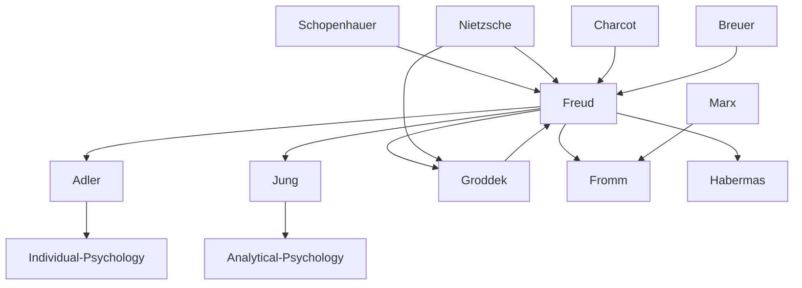

---
cssclasses:
  - Psychology
  - Philosophy
subclasses:
  - 19th-Century-Philosophy
  - 20th-Century-Philosophy
  - Philosophy-of-Mind
aliases:
  - psychoanalysis
  - unconscious
  - freud
  - libido
  - dream interpretation
  - oedipus complex
  - ego superego
  - repression
  - jung archetypes
  - transference
  - neurosis
  - id ego
  - collective unconscious
  - sublimation
tags:
  - Conceptual
  - Empirical
authors:
  - "[[Freud]]"
  - "[[Jung]]"
  - "[[Adler]]"
  - "[[Breuer]]"
  - "[[Charcot]]"
  - "[[Groddek]]"
movements:
  - "[[Psychoanalysis]]"
  - "[[Depth Psychology]]"
  - "[[Analytical Psychology]]"
reference: "[[05 The search for thought - Unit 7 Chapter 2.pdf]]"
---

#### Central Problem

The chapter addresses the revolutionary discovery of the unconscious and its implications for understanding human psychology, behavior, and culture. The central question is: what is the true nature of the human psyche, and how can we access and understand those mental processes that lie beyond conscious awareness?

Before Freud, Western thought generally identified the "psyche" with consciousness. The prevailing positivist-materialist medical framework interpreted all personality disturbances in somatic terms, dismissing psychoneurotic states (such as hysteria) that had no corresponding organic lesion. This left unexplained a vast range of psychological phenomena: dreams, slips of tongue, neurotic symptoms, and irrational behaviors that seemed to have no physical cause.

The fundamental challenge was to develop both a theoretical framework for understanding unconscious mental processes and practical therapeutic techniques for accessing repressed material. This required overcoming the "resistances" that bar access to consciousness and finding ways to decode the disguised messages of the unconscious as they appear in dreams, symptoms, and everyday life.

#### Main Thesis

Freud's revolutionary thesis holds that the unconscious constitutes the primary, abyssal reality of the psyche, of which consciousness (like the tip of an iceberg) is merely the visible manifestation. The unconscious is not simply the lower limit of the conscious but rather the fundamental psychological reality that drives human behavior.

**The Structure of the Psyche:** Freud developed two "topographies" (topiche) of the mind:
- **First topography:** Distinguishes three systems — the conscious (Cs), the preconscious (Pcs), and the unconscious (Ucs). The preconscious contains temporarily unconscious memories accessible through attention; the unconscious proper (the "repressed") contains elements kept unconscious by the force of repression.
- **Second topography:** Distinguishes three "instances" — the Id (Es), the Ego (Io), and the Superego (Super-io). The Id is the impersonal, chaotic "cauldron of seething excitations" governed by the pleasure principle. The Superego represents internalized moral prohibitions from parental figures. The Ego mediates between these "severe masters" and external reality.

**Dream Interpretation:** Dreams are "the royal road to knowledge of the unconscious" — they represent the "(disguised) fulfillment of a (repressed) wish." The manifest content (the dream as experienced) conceals latent content (the underlying desires) through censorship mechanisms.

**Sexuality and Development:** Freud expanded the concept of sexuality beyond mere genitality to encompass libido — a migratory energy that localizes on different "erogenous zones" through developmental stages: oral, anal, and genital (including the phallic phase). The Oedipus complex — libidinal attachment to the opposite-sex parent and ambivalence toward the same-sex parent — is central to personality formation.

**Civilization and Its Discontents:** Civilization exacts a "cost" in libidinal terms, diverting pleasure-seeking into social and work performance. The collective Superego manifests in social norms and prohibitions. However, Freud does not reject civilization — he sees it as a lesser evil compared to an unregulated humanity that would be even more dangerous.

#### Historical Context

Psychoanalysis emerged in late 19th-century Vienna within the context of positivist medicine. The medical establishment, operating under materialist assumptions, dismissed conditions like hysteria that lacked organic lesions. However, Jean-Martin Charcot (1825-1893) in Paris was using hypnosis to control hysterical symptoms, while Josef Breuer (1842-1925) in Vienna went further, using hypnosis to recall forgotten painful events.

Freud (1856-1939) studied with Charcot in Paris (1885) and with the Nancy school (Liébeault and Bernheim) before collaborating with Breuer on studies of hysteria. The famous case of "Anna O." — a woman whose hydrophobia was traced to a repressed childhood memory of seeing her governess's dog drink from a glass — demonstrated the therapeutic value of bringing repressed material to consciousness (the "cathartic method").

The International Psychoanalytic Association was founded in Nuremberg in 1910, with Jung as its first president. However, both Jung and Adler soon dissented from Freud's views. The Nazi regime burned Freud's works in 1933, and Freud fled Vienna for London in 1938, dying there in 1939.

The broader cultural context included Nietzsche's earlier explorations of unconscious drives and self-deception, Schopenhauer's concept of unconscious Will, and the general crisis of Enlightenment rationalism. Freud's work contributed to what he himself called three great "narcissistic wounds" to humanity: the cosmological (Copernicus removing Earth from the center), the biological (Darwin removing humans from centrality among living beings), and the psychological (psychoanalysis revealing that the ego is "not master in its own house").

#### Philosophical Lineage

#### Key Thinkers

| Thinker | Dates | Movement | Main Work | Core Concept |
|---------|-------|----------|-----------|--------------|
| [[Freud]] | 1856-1939 | [[Psychoanalysis]] | *The Interpretation of Dreams* | Unconscious, repression, Oedipus complex |
| [[Breuer]] | 1842-1925 | [[Psychoanalysis]] | *Studies on Hysteria* | Cathartic method |
| [[Charcot]] | 1825-1893 | [[Neurology]] | Studies on hysteria | Hypnosis for hysteria |
| [[Adler]] | 1870-1937 | [[Individual Psychology]] | *The Neurotic Constitution* | Will to power, inferiority complex |
| [[Jung]] | 1875-1961 | [[Analytical Psychology]] | *Psychological Types* | Collective unconscious, archetypes |
| [[Groddek]] | 1866-1934 | [[Psychoanalysis]] | *The Book of the It* | The "It" (Es) concept |

#### Key Concepts

| Concept | Definition | Related to |
|---------|------------|------------|
| Unconscious | The primary psychic reality containing repressed elements maintained by a specific force; accessible only through special techniques | [[Freud]], [[Psychoanalysis]] |
| Repression | The force that keeps certain psychic elements unconscious; can only be overcome through psychoanalytic techniques | [[Freud]], defense mechanisms |
| Id (Es) | The impersonal, chaotic pulsional pole of personality; a "cauldron of seething excitations" obeying only the pleasure principle | [[Freud]], [[Groddek]] |
| Ego (Io) | The organized part of personality mediating between Id, Superego, and external reality | [[Freud]], reality principle |
| Superego | The internalized moral conscience; "successor and representative of parents and educators" | [[Freud]], moral development |
| Libido | Psychosexual energy capable of directing itself toward diverse goals and investing various objects | [[Freud]], [[Jung]] |
| Oedipus Complex | Libidinal attachment to opposite-sex parent and ambivalent attitude toward same-sex parent; develops ages 3-5 | [[Freud]], psychosexual development |
| Transference | Transfer onto the analyst of ambivalent feelings (love and hate) experienced toward parental figures in childhood | [[Freud]], therapeutic technique |
| Collective Unconscious | The inherited spiritual mass of humanity's development, reborn in each individual brain structure | [[Jung]], [[Analytical Psychology]] |
| Archetypes | Primordial images of the collective unconscious; pure, universal forms that are filled by each culture and individual | [[Jung]], mythology |
| Inferiority Complex | Feeling of insecurity driving compensatory behaviors; sometimes leading to neurotic withdrawal | [[Adler]], [[Individual Psychology]] |
| Sublimation | Transfer of originally sexual charge onto non-sexual objects (work, art, science) | [[Freud]], defense mechanisms |

#### Authors Comparison

| Theme | [[Freud]] | [[Jung]] | [[Adler]] |
|-------|-----------|----------|-----------|
| Nature of libido | Sexual energy, pleasure principle | Vital energy (élan vital), not solely sexual | Will to power, self-affirmation |
| Unconscious | Personal unconscious (the repressed) | Collective unconscious + personal unconscious | Less emphasis on unconscious |
| Central drive | Sexual instincts, Eros vs. Thanatos | Individuation, archetypal patterns | Striving for superiority, compensation |
| Neurosis origin | Repressed sexual conflicts | Failure of individuation | Inferiority feelings, failed compensation |
| Childhood focus | Psychosexual stages, Oedipus complex | Less emphasis on sexuality | First five years, educational factors |
| Social dimension | Civilization requires libidinal sacrifice | Cultural symbols, collective patterns | Social cooperation, community feeling |
| Therapeutic goal | "Where Id was, there Ego shall be" | Integration of conscious and unconscious | Social adaptation, overcoming inferiority |

#### Influences & Connections

- **Predecessors:** [[Freud]] ← influenced by ← [[Schopenhauer]] (unconscious Will), [[Nietzsche]] (drives, self-deception), [[Charcot]] (hypnosis), [[Breuer]] (cathartic method)
- **Contemporaries:** [[Freud]] ↔ collaboration with ↔ [[Breuer]], [[Freud]] ↔ conflict with ↔ [[Jung]], [[Adler]]
- **Followers:** [[Freud]] → influenced → [[Fromm]], [[Habermas]] (critical theory), [[Lacan]]
- **Followers:** [[Jung]] → influenced → depth psychology, mythology studies, religious psychology
- **Opposing views:** [[Freud]] ← criticized by ← positivist medicine, behaviorism, [[Popper]] (falsifiability)

#### Summary Formulas

- **[[Freud]]:** The unconscious is the primary psychic reality; dreams, symptoms, and slips reveal repressed wishes; civilization requires libidinal sacrifice but is preferable to unregulated instinct.
- **[[Jung]]:** Beyond personal unconscious lies a collective unconscious containing archetypes — primordial images inherited from humanity's development that structure individual experience.
- **[[Adler]]:** Neurosis stems from inferiority feelings and failed compensation; psychology and pedagogy must work together to foster social cooperation rather than asocial individualism.
- **[[Nietzsche]]:** The "masters of suspicion" (Marx, Nietzsche, Freud) unmask the self-deceptions of consciousness, revealing that moral values disguise power relations and unconscious drives.

#### Timeline

| Year | Event |
|------|-------|
| 1856 | [[Freud]] born in Freiberg, Moravia |
| 1885 | [[Freud]] studies with [[Charcot]] in Paris |
| 1895 | [[Freud]] and [[Breuer]] publish *Studies on Hysteria* |
| 1900 | [[Freud]] publishes *The Interpretation of Dreams* |
| 1905 | [[Freud]] publishes *Three Essays on the Theory of Sexuality* |
| 1910 | International Psychoanalytic Association founded at Nuremberg |
| 1912 | [[Jung]] publishes *Transformations and Symbols of the Libido*; break with Freud |
| 1913 | [[Freud]] publishes *Totem and Taboo* |
| 1920 | [[Freud]] publishes *Beyond the Pleasure Principle* (Eros and Thanatos) |
| 1923 | [[Freud]] publishes *The Ego and the Id* (second topography) |
| 1927 | [[Freud]] publishes *The Future of an Illusion*; [[Adler]] publishes *Understanding Human Nature* |
| 1929 | [[Freud]] publishes *Civilization and Its Discontents* |
| 1933 | Nazis burn [[Freud]]'s works in Berlin |
| 1939 | [[Freud]] dies in London |

#### Notable Quotes

> "The interpretation of dreams is the royal road to knowledge of the unconscious in mental life." — [[Freud]]

> "The ego is not master in its own house." — [[Freud]]

> "The collective unconscious is the mighty spiritual inheritance of human development, reborn in each individual brain structure." — [[Jung]]

#### See Also

- [[Psychoanalysis]]
- [[Unconscious]]
- [[Dream Interpretation]]
- [[Depth Psychology]]
- [[Analytical Psychology]]
- [[Oedipus Complex]]
- [[Schopenhauer]]
- [[Nietzsche]]
- [[Masters of Suspicion]]
- [[Critical Theory]]

> [!NOTE]
> *This summary has been created to present the key points from the source text, which was automatically extracted using LLM. Please note that the summary may contain errors. It serves as an essential starting point for study and reference purposes.*
