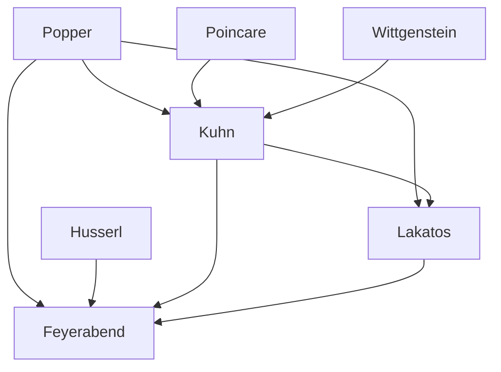

---
cssclasses:
  - Philosophy
subclasses:
  - Philosophy-of-Science
  - Epistemology
  - 20th-Century-Philosophy
aliases:
  - post positivism
  - paradigm shift
  - scientific revolutions
  - incommensurability
  - research programmes
  - falsificationism
  - anarchism epistemology
  - anything goes
  - normal science
  - theory laden
  - kuhn paradigm
  - lakatos methodology
tags:
  - Conceptual
  - Empirical
authors:
  - "[[Kuhn]]"
  - "[[Lakatos]]"
  - "[[Feyerabend]]"
  - "[[Popper]]"
movements:
  - "[[Post-Positivism]]"
  - "[[Philosophy of Science]]"
  - "[[Analytic Philosophy]]"
reference: "[[06 The search for thought - Unit 12 Chapter 1.pdf]]"
---

#### Central Problem

Post-positivist epistemology confronts the fundamental question: how does scientific knowledge actually develop, and what criteria (if any) can legitimately demarcate science from non-science? This philosophical movement emerged as a radical critique of both logical positivism (neopositivism) and Popper's critical rationalism, challenging their shared assumptions about scientific method, empirical verification/falsification, and the progressive accumulation of knowledge.

The central tension lies in reconciling the historical reality of scientific practice—with its social, psychological, and cultural dimensions—with traditional ideals of rationality, objectivity, and progress. Post-positivists challenge several foundational assumptions: the existence of a neutral empirical basis for testing theories; the possibility of objective comparison between competing theories; the notion of a fixed scientific method; and the cumulative, progressive character of scientific development. They ask: if observations are "theory-laden" and paradigms are "incommensurable," how can we rationally choose between competing scientific frameworks? And if we cannot, what becomes of the privileged epistemic status that Western civilization has accorded to science?

#### Main Thesis

Post-positivist epistemology, represented paradigmatically by [[Kuhn]], [[Lakatos]], and [[Feyerabend]], advances several interconnected theses that radically transform our understanding of science:

**Anti-Empiricism and Anti-Factualism:** Facts do not exist independently of theoretical frameworks. Observations are always "theory-laden" (theory laden): scientists see only what their conceptual frameworks allow them to see. A Ptolemaic astronomer and a Copernican do not interpret the same fact differently—they literally observe different facts (the rising sun vs. the Earth's rotation).

**Historical and Social Conditioning:** Science is not a purely logical enterprise operating in "crystalline heavens" of pure theory. It is conditioned by extrascientific factors—religious, aesthetic, political, economic—that influence methodological assumptions and theory choice. The cultural context determines which paradigm prevails.

**Rejection of Demarcation Criteria:** There is no fixed method or rigid criterion that definitively distinguishes science from other human activities. Neither verification (neopositivism) nor falsification (Popper) provides an adequate demarcation principle, since no neutral empirical base exists to serve this function.

**Incommensurability of Theories:** Successive paradigms or research programmes cannot be objectively compared because they operate with different concepts, address different problems, and observe different facts. Even when they use the same terms, these terms carry different meanings within different theoretical frameworks.

**Non-Cumulative Progress:** Science does not progress by gradual accumulation toward truth, but through revolutionary ruptures ([[Kuhn]]), competitive replacement of research programmes ([[Lakatos]]), or pragmatic criteria like effectiveness and persuasive power ([[Feyerabend]]).

#### Historical Context

Post-positivist epistemology emerged in the 1960s and 1970s as a response to the dominance of logical positivism and Popperian falsificationism in Anglo-American philosophy of science. The Vienna Circle's verification principle and Popper's falsification criterion had established themselves as the standard accounts of scientific method and demarcation.

However, historians and philosophers of science increasingly recognized a gap between these normative methodologies and actual scientific practice. [[Kuhn]]'s background as a historian of science was crucial: his detailed studies of the Copernican revolution and the development of physics revealed patterns that contradicted received epistemological doctrines.

The broader intellectual climate included the decline of positivist certainties after World War II, the influence of continental philosophy (particularly [[Husserl]]'s critique of Galilean science in *The Crisis of European Sciences*), and growing awareness of the social dimensions of knowledge production. [[Feyerabend]]'s anarchism also reflected the countercultural movements of the 1960s and critiques of technocratic rationality.

The debate was centered primarily in British and American universities, with the London School of Economics (where [[Popper]] and [[Lakatos]] taught) serving as a crucial institutional site. [[Kuhn]]'s *The Structure of Scientific Revolutions* (1962) became one of the most influential academic books of the twentieth century, fundamentally reshaping discussions in philosophy, history, and sociology of science.

#### Philosophical Lineage

#### Key Thinkers

| Thinker | Dates | Movement | Main Work | Core Concept |
|---------|-------|----------|-----------|--------------|
| [[Kuhn]] | 1922-1996 | [[Post-Positivism]] | *The Structure of Scientific Revolutions* | Paradigm shifts, incommensurability |
| [[Lakatos]] | 1922-1974 | [[Post-Positivism]] | *The Methodology of Scientific Research Programmes* | Research programmes, progressive/degenerative shifts |
| [[Feyerabend]] | 1924-1994 | [[Post-Positivism]] | *Against Method* | Epistemological anarchism, anything goes |
| [[Popper]] | 1902-1994 | [[Critical Rationalism]] | *The Logic of Scientific Discovery* | Falsificationism, conjectures and refutations |

#### Key Concepts

| Concept | Definition | Related to |
|---------|------------|------------|
| Paradigm | A constellation of shared beliefs, theories, models, and experimental practices that define normal science for a scientific community | [[Kuhn]], [[Post-Positivism]] |
| Normal science | Periods when scientists work within an established paradigm, solving puzzles without questioning fundamental assumptions | [[Kuhn]], [[Post-Positivism]] |
| Scientific revolution | A rupture in which an old paradigm is abandoned and replaced by a new one, requiring scientists to see the world completely differently | [[Kuhn]], [[Post-Positivism]] |
| Incommensurability | The impossibility of neutral comparison between paradigms because they employ different concepts and observe different facts | [[Kuhn]], [[Feyerabend]] |
| Theory-ladenness | The thesis that observations are not neutral but shaped by the theoretical framework within which they are made | [[Kuhn]], [[Feyerabend]], [[Popper]] |
| Research programme | A constellation of coherent scientific theories obeying methodological rules, with a hard core protected by auxiliary hypotheses | [[Lakatos]], [[Post-Positivism]] |
| Hard core | The central, unfalsifiable commitments of a research programme, protected by methodological decision | [[Lakatos]], [[Post-Positivism]] |
| Protective belt | Auxiliary hypotheses that shield the hard core from falsification and can be modified in response to anomalies | [[Lakatos]], [[Post-Positivism]] |
| Progressive/degenerative shift | A programme is progressive if it predicts novel facts; degenerative if it only accommodates known facts post hoc | [[Lakatos]], [[Post-Positivism]] |
| Epistemological anarchism | The view that no methodological rules are universally binding; anything goes in science | [[Feyerabend]], [[Post-Positivism]] |

#### Authors Comparison

| Theme | [[Kuhn]] | [[Lakatos]] | [[Feyerabend]] |
|-------|----------|-------------|----------------|
| View of science | Alternating normal science and revolutions | Competing research programmes | No fixed method, pluralistic |
| Role of history | Central: philosophy of science without history is empty | Essential for rational reconstruction | Reveals violation of all methodological rules |
| Rationality | Scientific change involves irrational "conversion" | Rational comparison of programmes possible | Reason is a "myth" to be undermined |
| Theory choice | Paradigm shift as gestalt switch | Progressive vs. degenerative programmes | Pragmatic criteria: effectiveness, persuasion |
| Demarcation | Paradigm membership | Progressive problem-shift | No demarcation possible |
| Progress | From primitive states, not toward truth | Through replacement of degenerative programmes | No cumulative progress; ocean of alternatives |
| Critique of Popper | Falsification is a myth; scientists don't abandon theories for anomalies | Experiments don't "crucially" refute; programmes are replaced | Falsificationism is just another dogma |

#### Influences & Connections

- **Predecessors:** [[Kuhn]] ← influenced by ← [[Poincaré]], [[Wittgenstein]], history of science
- **Predecessors:** [[Lakatos]] ← influenced by ← [[Popper]], [[Hegel]] (dialectical method)
- **Predecessors:** [[Feyerabend]] ← influenced by ← [[Popper]], [[Husserl]], [[Wittgenstein]]
- **Contemporaries:** [[Kuhn]] ↔ debate with ↔ [[Popper]], [[Lakatos]], [[Feyerabend]]
- **Followers:** [[Kuhn]] → influenced → sociology of scientific knowledge, science studies
- **Followers:** [[Feyerabend]] → influenced → social constructivism, postmodern critiques of science
- **Opposing views:** [[Kuhn]] ← criticized by ← [[Popper]] (irrationalism), [[Lakatos]] (mysticism)

#### Summary Formulas

- **[[Kuhn]]:** Science develops through alternating periods of normal science (puzzle-solving within a paradigm) and revolutionary ruptures in which incommensurable paradigms replace each other through conversion rather than rational demonstration.
- **[[Lakatos]]:** Scientific progress occurs through rational competition between research programmes; a programme is replaced when it becomes degenerative and a progressive rival emerges, though this judgment requires hindsight.
- **[[Feyerabend]]:** There is no universal scientific method; "anything goes" because the history of science shows that progress required violating every supposed methodological rule, and science is just one tradition among many.

#### Timeline

| Year | Event |
|------|-------|
| 1922 | [[Kuhn]] born in Cincinnati; [[Lakatos]] born in Hungary |
| 1924 | [[Feyerabend]] born in Vienna |
| 1934 | [[Popper]] publishes *The Logic of Scientific Discovery* |
| 1957 | [[Kuhn]] publishes *The Copernican Revolution* |
| 1962 | [[Kuhn]] publishes *The Structure of Scientific Revolutions* |
| 1965 | [[Feyerabend]] publishes *Problems of Empiricism* |
| 1969 | [[Kuhn]] adds important postscript to second edition of *Structure* |
| 1970 | [[Lakatos]] publishes *Falsification and the Methodology of Scientific Research Programmes* |
| 1975 | [[Feyerabend]] publishes *Against Method* |
| 1974 | [[Lakatos]] dies in London |
| 1978 | [[Feyerabend]] publishes *Science in a Free Society* |
| 1994 | [[Feyerabend]] dies; [[Popper]] dies |
| 1996 | [[Kuhn]] dies |

#### Notable Quotes

> "When paradigms change, the world itself changes with them. Guided by a new paradigm, scientists adopt new instruments and look in new directions." — [[Kuhn]]

> "The history of science has been and should be a history of competing research programmes... but it has not been and must not become a succession of periods of normal science." — [[Lakatos]]

> "The only principle that does not inhibit progress is: anything goes." — [[Feyerabend]]

#### See Also

- [[Critical Rationalism]]
- [[Logical Positivism]]
- [[Vienna Circle]]
- [[Falsificationism]]
- [[Philosophy of Science]]
- [[Scientific Method]]
- [[Sociology of Knowledge]]
- [[Relativism]]
- [[Dadaism]]
- [[Popper]]

> [!NOTE]
> *This summary has been created to present the key points from the source text, which was automatically extracted using LLM. Please note that the summary may contain errors. It serves as an essential starting point for study and reference purposes.*
