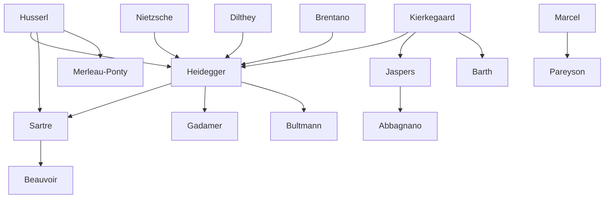

---
cssclasses:
  - Philosophy
subclasses:
  - Existentialism
  - Phenomenology
  - 20th-Century-Philosophy
aliases:
  - existentialism
  - dasein
  - being time
  - authenticity
  - angst
  - being world
  - care structure
  - being death
  - thrownness
  - facticity
  - the they
  - existence precedes
  - nothingness
  - freedom responsibility
tags:
  - Conceptual
authors:
  - "[[Heidegger]]"
  - "[[Sartre]]"
  - "[[Kierkegaard]]"
  - "[[Jaspers]]"
  - "[[Camus]]"
  - "[[Marcel]]"
  - "[[Abbagnano]]"
  - "[[Merleau-Ponty]]"
movements:
  - "[[Existentialism]]"
  - "[[Phenomenology]]"
reference: "[[06 The search for thought - Unit 8 Chapter 2.pdf]]"
---

#### Central Problem

Existentialism confronts the fundamental question of human existence: what does it mean to be a human being in a world where existence precedes essence? This philosophical movement emerged as a response to the crisis of meaning in modern Western civilization, particularly after the devastation of two World Wars that shattered Enlightenment optimism about human progress and rationality.

The central tension arises from the collapse of nineteenth-century certainties — Romanticism (in both idealistic and positivistic forms), scientific confidence, and religious frameworks — leaving humanity face to face with what Kierkegaard identified as "limit-situations": birth, struggle, suffering, the passage of time, and death. The First World War demolished illusions about objective necessity and progressive order, while art discovered through contact with non-European forms the relativity of its own structural determinations. Science lost its pretense to offer a theologizing knowledge, and religion once again confronted the prevalence of evil and destruction.

The existentialist challenge is directed against all philosophies that: misconceive human finitude by identifying man with the Absolute; dissolve individual singularity into impersonal totalizing processes (Spirit, historical dialectic); obscure limit-situations and their accompanying moods (anxiety, fear, hope); or deny initiative and choice by treating existence as a deterministically reconstructible fact.

#### Main Thesis

Existentialism, both as a cultural climate and as a strict philosophical movement, holds that existence constitutes the distinctive mode of being proper to humans, qualitatively different from all other entities in the world. The common features uniting various existentialist philosophies include:

**Existence as Relational:** Human existence is not self-sufficient but constitutively open to an "beyond" — whether conceived as ontological event (Heidegger), experiential reality (Sartre, Abbagnano), or divine transcendence (Jaspers, Marcel, Pareyson). The relationship between existence and being constitutes the central and decisive theme.

**Choice and Authenticity:** The existential relationship with being requires choice, project, and risk. Human beings are not substantial, predetermined realities but entities facing infinite possibilities that call upon their freedom, placing choices between authenticity and inauthenticity.

**Singularity:** The appeal to choice implies living as a "single one" — an individuated and unrepeatable entity with a personal perspective on being, directly summoned as such (no one can decide for another, no one can die for another).

**Situation:** As individuated relation to being, existence always finds itself in an equally individuated and concrete situation, bounded by birth and death.

**Finitude:** As relational structure characterized by singularity, possibility, choice, situation, and corresponding affective states (fear, anxiety, nausea, expectation), existence is constitutively marked by finitude and limit.

#### Historical Context

The existentialist climate characterized the period between the two World Wars, finding its greatest expression during and after the Second World War. The term spread beyond academic philosophy into literature, psychiatry, religious reflection, and everyday life. Newspapers of the immediate postwar years featured expressions like "existentialist novel," "existentialist fashion," "existentialist song," and even "existentialist suicide."

Key literary precursors include Dostoevsky, whose works portray the drama of humans facing life's possibilities while bearing the weight of choice and responsibility, and Kafka, who expresses the negative, paralyzing sense of human possibilities under the threat of insignificance and nothingness. The Grand Inquisitor's project in The Brothers Karamazov yields to Christ's silence — symbol of constitutive human freedom from which both good and evil flow.

Existentialist literature proper emerged through Sartre's writings on human problematicity and life's tragic aspects, Simone de Beauvoir's exploration of moral ambiguity, and Camus's meditation on the absurd — the divorce between rational expectations and brute factual reality, between human desire for happiness and clarity and the universe's indifferent opacity.

Italian hermeticism (Ungaretti, Montale, Quasimodo, Saba) paralleled existentialist themes: solitude, life's illusion, death, mystery, oblivion, and time's irrevocability. Ungaretti's "Allegria di naufragi" (1919) described life as a shipwreck of hopes, while Montale articulated suffering ("spesso il male di vivere ho incontrato") and existence's insurmountable limits.

#### Philosophical Lineage

#### Key Thinkers

| Thinker | Dates | Movement | Main Work | Core Concept |
|---------|-------|----------|-----------|--------------|
| [[Kierkegaard]] | 1813-1855 | [[Proto-Existentialism]] | *Either/Or* | Single one, anxiety, leap of faith |
| [[Heidegger]] | 1889-1976 | [[Phenomenology]] | *Being and Time* | Dasein, Being-toward-death, Care |
| [[Jaspers]] | 1883-1969 | [[Existentialism]] | *Philosophy* | Limit-situations, shipwreck |
| [[Sartre]] | 1905-1980 | [[Existentialism]] | *Being and Nothingness* | Existence precedes essence, nothingness |
| [[Camus]] | 1913-1960 | [[Absurdism]] | *The Myth of Sisyphus* | The absurd, revolt |
| [[Marcel]] | 1889-1973 | [[Christian Existentialism]] | *Metaphysical Journal* | Mystery, fidelity |
| [[Abbagnano]] | 1901-1990 | [[Positive Existentialism]] | *Structure of Existence* | Positive existentialism |
| [[Merleau-Ponty]] | 1908-1961 | [[Phenomenology]] | *Phenomenology of Perception* | Embodied existence |

#### Key Concepts

| Concept | Definition | Related to |
|---------|------------|------------|
| Dasein | "Being-there"; the entity that in its being is concerned about this being itself; human existence as being-in-the-world | [[Heidegger]], [[Phenomenology]] |
| Being-in-the-world | The fundamental structure of Dasein as taking-care of things through practical engagement, not theoretical contemplation | [[Heidegger]], [[Existentialism]] |
| Care (Sorge) | The totality of Dasein's structural determinations: being-ahead-of-itself, already-being-in-the-world, being-alongside entities | [[Heidegger]], [[Existentialism]] |
| Thrownness (Geworfenheit) | The facticity of finding oneself already in a situation not of one's choosing; disclosed through mood | [[Heidegger]], [[Phenomenology]] |
| The They (das Man) | Anonymous, impersonal existence where "one says" and "one does" dominate; inauthentic leveling | [[Heidegger]], [[Existentialism]] |
| Being-toward-death | Authentic confrontation with death as one's ownmost, unconditional, certain, indeterminate, unsurpassable possibility | [[Heidegger]], [[Existentialism]] |
| Angst (Anxiety) | The fundamental mood revealing nothingness and holding open the radical threat of death; distinct from fear | [[Heidegger]], [[Kierkegaard]] |
| Existence precedes essence | Humans first exist, then define themselves through choices; no predetermined human nature | [[Sartre]], [[Existentialism]] |
| Nothingness | The capacity of consciousness to detach from given reality by negating it; ground of freedom | [[Sartre]], [[Existentialism]] |
| The Absurd | The confrontation between human need for clarity and the universe's indifferent silence | [[Camus]], [[Absurdism]] |
| Limit-situations | Birth, struggle, suffering, death — boundaries that reveal authentic existence | [[Jaspers]], [[Existentialism]] |
| Hermeneutic circle | Understanding as articulation of pre-understanding; knowledge as interpretation of the pre-comprehended | [[Heidegger]], [[Hermeneutics]] |

#### Authors Comparison

| Theme | [[Heidegger]] | [[Sartre]] | [[Jaspers]] |
|-------|---------------|------------|-------------|
| Central question | What is the meaning of Being? | What is human freedom? | What is Existenz? |
| Method | Phenomenological ontology | Phenomenological ontology | Existential illumination |
| Human condition | Dasein as Care, thrownness, project | For-itself as nothingness, condemned to freedom | Existence in limit-situations |
| Authenticity | Resoluteness, anticipation of death | Good faith, radical responsibility | Communication, philosophical faith |
| Inauthenticity | The They, idle talk, curiosity | Bad faith, self-deception | Objectification, closure |
| The Other | Mitsein (being-with), solicitude | Conflictual "look," hell is other people | Loving struggle, communication |
| Freedom | Projection, being-ahead-of-itself | Absolute, causa sui, condemnation | Bounded by situation, appeal to transcendence |
| Death | Ownmost possibility, individualizing | Absurd, limit of projects | Limit-situation revealing Existenz |
| Being/Transcendence | Ontological difference, event | Being-in-itself vs for-itself | Cipher of transcendence, encompassing |

#### Influences & Connections

- **Predecessors:** [[Heidegger]] ← influenced by ← [[Husserl]], [[Kierkegaard]], [[Nietzsche]], [[Dilthey]], [[Brentano]]
- **Predecessors:** [[Sartre]] ← influenced by ← [[Husserl]], [[Heidegger]], [[Hegel]]
- **Contemporaries:** [[Heidegger]] ↔ dialogue with ↔ [[Jaspers]], [[Bultmann]]
- **Contemporaries:** [[Sartre]] ↔ dialogue with ↔ [[Merleau-Ponty]], [[Beauvoir]]
- **Followers:** [[Heidegger]] → influenced → [[Gadamer]], [[Sartre]], [[Jonas]], [[Arendt]]
- **Followers:** [[Sartre]] → influenced → [[Beauvoir]], [[Fanon]], [[Camus]]
- **Opposing views:** [[Sartre]] ← criticized by ← [[Heidegger]] (Letter on Humanism)
- **Literary connections:** [[Dostoevsky]], [[Kafka]] ← anticipated ← [[Existentialism]]

#### Summary Formulas

- **[[Kierkegaard]]:** The single individual, facing infinite possibilities and the weight of choice, discovers that authentic existence requires a leap beyond rational calculation into passionate commitment.
- **[[Heidegger]]:** Dasein's being is Care — thrown into the world, projecting possibilities, falling into the They; only anticipatory resoluteness toward death opens authentic existence.
- **[[Jaspers]]:** Human existence encounters limit-situations (death, suffering, guilt, struggle) that shatter worldly security and open Existenz to transcendence through philosophical faith.
- **[[Sartre]]:** Consciousness as nothingness is condemned to freedom; existence precedes essence, and humans bear absolute responsibility for what they make of themselves.
- **[[Camus]]:** The absurd arises from the confrontation between human longing for clarity and the world's indifferent silence; authentic response is revolt, not suicide or leap of faith.

#### Timeline

| Year | Event |
|------|-------|
| 1919 | [[Barth]] publishes *Epistle to Romans*; [[Jaspers]] publishes *Psychology of Worldviews* — beginning of Kierkegaard-Renaissance |
| 1927 | [[Heidegger]] publishes *Being and Time*; [[Marcel]] publishes *Metaphysical Journal* |
| 1932 | [[Jaspers]] publishes *Philosophy* (3 volumes) |
| 1934 | French "philosophy of spirit" develops (Lavelle, Le Senne) |
| 1938 | [[Sartre]] publishes *Nausea* |
| 1939 | [[Abbagnano]] publishes *Structure of Existence* — Italian positive existentialism begins |
| 1943 | [[Sartre]] publishes *Being and Nothingness*; [[Camus]] publishes *The Myth of Sisyphus* |
| 1946 | [[Sartre]] delivers "Existentialism is a Humanism" |
| 1947 | [[Heidegger]] publishes *Letter on Humanism* — critique of Sartre |
| 1950 | [[Pareyson]] publishes *Existence and Person* |
| 1951 | [[Camus]] publishes *The Rebel* |

#### Notable Quotes

> "The world, in itself, is not reasonable: that is all that can be said. But what is absurd is the confrontation of this irrational with the violent desire for clarity, whose call resounds in the deepest part of man." — [[Camus]]

> "L'Esserci è sempre la sua possibilità" (Dasein is always its possibility) — [[Heidegger]]

> "Man, being condemned to be free, carries the weight of the whole world on his shoulders: he is responsible for the world and for himself as a way of being." — [[Sartre]]

#### See Also

- [[Phenomenology]]
- [[Hermeneutics]]
- [[Absurdism]]
- [[Being and Time]]
- [[Being and Nothingness]]
- [[Anxiety]]
- [[Authenticity]]
- [[Decadentism]]
- [[Kierkegaard-Renaissance]]
- [[Nihilism]]

> [!NOTE]
> *This summary has been created to present the key points from the source text, which was automatically extracted using LLM. Please note that the summary may contain errors. It serves as an essential starting point for study and reference purposes.*
