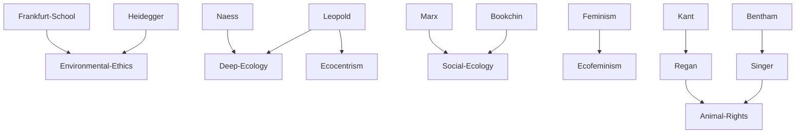

---
cssclasses:
  - Philosophy
subclasses:
  - Ethics
  - Applied-Ethics
  - 20th-Century-Philosophy
aliases:
  - environmental ethics
  - animal ethics
  - deep ecology
  - ecofeminism
  - biocentrism
  - ecocentrism
  - animal rights
  - speciesism
  - ecological philosophy
  - land ethics
  - animal liberation
tags:
  - Conceptual
  - Constructive
authors:
  - "[[Leopold]]"
  - "[[Naess]]"
  - "[[Singer]]"
  - "[[Regan]]"
  - "[[Bookchin]]"
  - "[[Callicott]]"
movements:
  - "[[Environmental Ethics]]"
  - "[[Deep Ecology]]"
  - "[[Ecofeminism]]"
reference: "[[07 The search for thought - Unit 18 Chapter 4.pdf]]"
---

#### Central Problem

Contemporary philosophy confronts the environmental crisis by questioning the traditional Western image of humanity as "master of nature." This conception—rooted in certain interpretations of the biblical command to "populate and subdue the earth" and in the Cartesian separation and hierarchization of *res cogitans* and *res extensa*—has produced catastrophic consequences that now demand a radical rethinking of ethics.

The central question becomes: What entities deserve moral consideration? Traditional ethics has been anthropocentric, recognizing only humans as moral subjects. But the ecological crisis forces us to ask: Should moral standing be extended beyond humans to include animals, plants, ecosystems, and even non-living natural entities? How do we ground such an extension philosophically?

The "animal question" poses the problem sharply: What is the correct human attitude toward animals? The dominant tradition—what [[Nozick]] calls "utilitarianism for animals, Kantianism for people"—recognizes animals merely as means and humans alone as ends. This Greek-Christian heritage is now challenged by philosophers demanding that we overcome **speciesism**: the discrimination of living beings based on species membership.

#### Main Thesis

Environmental philosophy has generated three fundamental paradigms for extending moral consideration beyond traditional anthropocentrism:

**Anthropocentrism** (John Passmore): The most conservative position, granting moral status only to humans. Nature and non-human entities remain instrumental—means for human economic, scientific, and aesthetic needs.

**Biocentrism** ([[Paul Taylor]]): Moral status extends to every form of life. Every living being is a "teleological center of life" possessing intrinsic value independent of our instrumental evaluations and regardless of whether it possesses consciousness.

**Ecocentrism** ([[Leopold]], [[Callicott]]): Moral consideration extends to non-individual and non-living environmental entities—the entire natural world and its ecosystems, animate and inanimate, individual and collective (populations, species).

Three major ecological movements elaborate these paradigms:

**Deep Ecology** ([[Naess]], Devall, Sessions): Against "shallow ecology" that treats symptoms, deep ecology investigates the profound causes of environmental problems. Its two principles are: (1) **Self-realization**—we realize ourselves fully only by identifying with other beings and ultimately with the entire ecosphere; (2) **Biocentric equality**—all organisms and entities have equal intrinsic value and equal right to live and develop.

**Social Ecology** ([[Bookchin]]): All ecological problems are social problems, rooted primarily in capitalism and its perverse globalization. This approach combines Marxist critique with anarchist, libertarian, and federalist elements.

**Ecofeminism** (d'Eaubonne, Warren, Merchant, Plumwood): The connection between the domination of women and the domination of nature reveals a common "androcentric" and "phallogocentric" logic. The dichotomous, hierarchical mentality of Western philosophy (mind/body, reason/emotion, man/woman, culture/nature) and historical patriarchy are twin expressions of the same domination.

On animal ethics specifically, two major philosophical approaches emerge:

**Utilitarian** ([[Singer]]): Following Bentham ("Can they suffer?"), Singer extends moral consideration to all beings capable of suffering, based on the principle of equality and universalizability.

**Rights-based** ([[Regan]]): Postulating natural objective rights, Regan argues that all beings who are "subjects-of-a-life"—capable of perception, memory, beliefs, desires, intentional action, emotional life, sense of future, and individual well-being—possess inherent value.

#### Historical Context

The ecological crisis emerged in the twentieth century as technological civilization's power to transform nature reached unprecedented and destructive levels. The Club of Rome reports, the first Earth Day (1970), and growing awareness of pollution, species extinction, and climate change created the context for environmental philosophy.

[[Aldo Leopold]] (1887-1948), the American naturalist, deserves credit for the first explicit thematization of the need for radical change. His "land ethic" founded on the figure of humanity as "biotic citizen" inaugurated environmental ethics as a discipline.

Early twentieth-century philosophers like [[Heidegger]] and the Frankfurt School had already begun questioning the "philosophy of world domination," but academic legitimacy came in the Anglo-Saxon world where environmental philosophy (environmental ethics) became established, with the journal *Environmental Ethics* founded in 1979.

[[Arne Naess]] coined "deep ecology" in 1973, distinguishing it from reformist "shallow ecology." [[Murray Bookchin]] developed social ecology from the 1960s onward. Ecofeminism emerged in the 1970s, with [[Françoise d'Eaubonne]] coining the term in 1974.

The animal rights movement gained philosophical momentum with [[Peter Singer]]'s *Animal Liberation* (1975) and [[Tom Regan]]'s *The Case for Animal Rights* (1983), providing systematic foundations for anti-speciesist ethics.

#### Philosophical Lineage

#### Key Thinkers

| Thinker | Dates | Movement | Main Work | Core Concept |
|---------|-------|----------|-----------|--------------|
| [[Leopold]] | 1887-1948 | [[Environmental Ethics]] | *A Sand County Almanac* | Land ethic, biotic citizen |
| [[Naess]] | 1912-2009 | [[Deep Ecology]] | *The Shallow and the Deep* | Biocentric equality |
| [[Bookchin]] | 1921-2006 | [[Social Ecology]] | *The Ecology of Freedom* | Ecological problems are social |
| [[Singer]] | 1946- | [[Utilitarianism]] | *Animal Liberation* | Sentience as moral criterion |
| [[Regan]] | 1938-2017 | [[Animal Rights]] | *The Case for Animal Rights* | Subjects-of-a-life |
| [[Taylor]] | 1923- | [[Biocentrism]] | *Respect for Nature* | Teleological centers of life |

#### Key Concepts

| Concept | Definition | Related to |
|---------|------------|------------|
| Anthropocentrism | Paradigm granting moral status only to humans; nature as instrument for human needs | [[Passmore]], [[Environmental Ethics]] |
| Biocentrism | Paradigm granting moral status to every form of life | [[Taylor]], [[Environmental Ethics]] |
| Ecocentrism | Paradigm attributing intrinsic value to all entities including non-living environmental components | [[Leopold]], [[Callicott]] |
| Deep Ecology | Philosophy investigating profound causes of environmental crisis; rejects industrial-technocratic ideology | [[Naess]], [[Deep Ecology]] |
| Social Ecology | View that all ecological problems are social problems, especially rooted in capitalism | [[Bookchin]], [[Social Ecology]] |
| Ecofeminism | Movement connecting domination of women and domination of nature as expressions of same patriarchal logic | [[Warren]], [[Plumwood]] |
| Speciesism | Discrimination of beings based on species membership; analogous to racism and sexism | [[Singer]], [[Animal Rights]] |
| Subjects-of-a-life | Beings with perception, memory, beliefs, desires, emotions, and individual welfare—basis for rights | [[Regan]], [[Animal Rights]] |
| Land Ethic | Ethics expanding moral community to include soils, waters, plants, animals—the land | [[Leopold]], [[Ecocentrism]] |

#### Authors Comparison

| Theme | [[Singer]] | [[Regan]] | [[Naess]] | [[Bookchin]] |
|-------|------------|-----------|-----------|--------------|
| Ethical foundation | Utilitarian | Deontological | Holistic-spiritual | Social-political |
| Moral criterion | Capacity to suffer | Being subject-of-a-life | Biocentric equality | Social justice |
| Scope of ethics | Sentient beings | Rights-bearing individuals | Entire ecosphere | Human-nature relations |
| Political orientation | Reform | Rights advocacy | Alternative worldview | Eco-anarchism |
| View of nature | Aggregation of individuals | Individuals with rights | Interconnected whole | Social-natural totality |
| Critique target | Speciesism | Utilitarianism | Industrial civilization | Capitalism |

#### Influences & Connections

- **Predecessors:** Environmental ethics ← influenced by ← [[Heidegger]], [[Frankfurt School]], [[Thoreau]]
- **Predecessors:** [[Singer]] ← influenced by ← [[Bentham]], [[Mill]]
- **Predecessors:** [[Regan]] ← influenced by ← [[Kant]], natural rights tradition
- **Predecessors:** Ecofeminism ← influenced by ← [[Derrida]], [[Irigaray]], [[Cixous]]
- **Contemporaries:** [[Singer]] ↔ debate with ↔ [[Regan]] on animal ethics foundations
- **Contemporaries:** [[Naess]] ↔ criticized by ↔ [[Bookchin]] (deep vs. social ecology)
- **Followers:** Environmental ethics → influenced → Environmental law, animal welfare legislation
- **Opposing views:** Animal liberationists ← criticized by ← Passmore, Midgley (ethics of responsibility)

#### Summary Formulas

- **[[Leopold]]:** The land ethic expands the moral community to include soils, waters, plants, and animals; humans are "biotic citizens" rather than masters of nature.

- **[[Naess]]:** Deep ecology reveals that human self-realization requires identification with the entire ecosphere; all beings possess equal intrinsic value and right to flourish.

- **[[Singer]]:** The principle of equal consideration of interests must be extended to all sentient beings; speciesism is as morally arbitrary as racism or sexism.

- **[[Regan]]:** All beings who are "subjects-of-a-life" possess inherent value and natural rights that cannot be overridden by utilitarian calculations.

- **[[Bookchin]]:** All ecological problems are social problems; capitalism and hierarchical domination are the root causes of environmental destruction.

#### Timeline

| Year | Event |
|------|-------|
| 1949 | [[Leopold]]'s *A Sand County Almanac* published posthumously |
| 1973 | [[Naess]] coins "deep ecology" in *The Shallow and the Deep* |
| 1974 | [[d'Eaubonne]] coins "ecofeminism" in *Le féminisme ou la mort* |
| 1975 | [[Singer]] publishes *Animal Liberation* |
| 1979 | Journal *Environmental Ethics* founded |
| 1983 | [[Regan]] publishes *The Case for Animal Rights* |
| 1985 | Devall and Sessions publish *Deep Ecology* |
| 1989 | [[Bookchin]] publishes *Per una società ecologica* |

#### Notable Quotes

> "The important thing is not to ask 'Can they reason?' nor 'Can they talk?' but 'Can they suffer?'" — [[Bentham]]

> "All ecological problems are social problems and not simply, or primarily, the result of religious, spiritual or political conceptions." — [[Bookchin]]

> "Respecting someone only insofar as they are similar to us is a very poor conception of respect." — [[Battaglia]]

#### See Also

- [[Environmental Ethics]]
- [[Animal Rights]]
- [[Deep Ecology]]
- [[Social Ecology]]
- [[Ecofeminism]]
- [[Biocentrism]]
- [[Speciesism]]
- [[Applied Ethics]]
- [[Utilitarianism]]
- [[Natural Rights]]

> [!NOTE]
> *This summary has been created to present the key points from the source text, which was automatically extracted using LLM. Please note that the summary may contain errors. It serves as an essential starting point for study and reference purposes.*
