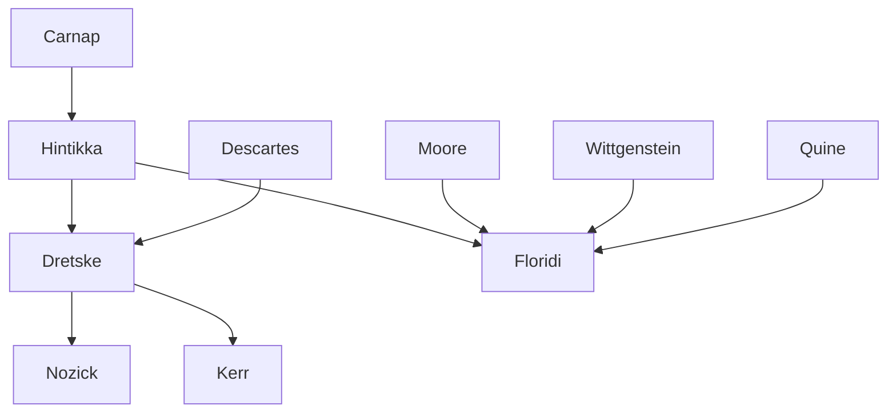

---

cssclasses:
  - Philosophy
  - Computer-Science
subclasses:
  - Epistemology
  - Logic-and-Philosophy-of-Logic
  - Philosophy-of-Mind
related:
  - "[[Philosophy as Conceptual Design (1 of 9)]]"
  - "[[Constructionism as Non-naturalism (2 of 9)]]"
  - "[[Perception and Testimony as Data Providers (3 of 9)]]"
  - "[[Information Quality (4 of 9)]]"
  - "[[Informational Scepticism and the Logically Possible (5 of 9)]]"
  - "[[A Defence of Information Closure (6 of 9)]]"
  - "[[Logical Fallacies as Bayesian Informational Shortcuts (7 of 9)]]"
  - "[[Maker’s Knowledge, between A Priori and A Posteriori (8 of 9)]]"
  - "[[Logic of Design as a Conceptual Logic of Information (9 of 9)]]"
aliases:
  - information closure
  - epistemic closure
  - modal logic
  - axiom distribution
  - normal logic
  - sceptical objection
  - being informed
  - logical omniscience
  - information extraction
  - closure principle
reference:
  - "Floridi, L. (2019). The logic of information: A theory of philosophy as conceptual design (First edition). Oxford University Press. (pp. 149-161)"
tags:
  - Podcast
---

#### Podcast

<iframe allow="autoplay *; encrypted-media *; fullscreen *; clipboard-write" frameborder="0" height="150" style="width:100%;overflow:hidden;border-radius:10px;background:transparent;" sandbox="allow-forms allow-popups allow-same-origin allow-scripts allow-storage-access-by-user-activation allow-top-navigation-by-user-activation" src="https://embed.podcasts.apple.com/us/podcast/the-logic-of-information-a-theory-of/id1786764068?i=1000681417145&uo=4&l=en-GB&theme=auto"></iframe>

> [!tip] This episode is part of a series — click "See More" for all the episodes.

---

#### Central Problem

Can the principle of information closure (PIC) withstand the sceptical objection that has been deployed against it? The principle states that if an agent S holds the information that p, and S holds the information that p entails q, then S holds the information that q. Critics like [[Dretske]] and [[Nozick]] argue that PIC is "too good to be true": if accepted, it would provide an easy refutation of radical scepticism, which contradicts the widely accepted thesis that factual information alone cannot answer sceptical doubts.

The problem has broader implications beyond epistemology. PIC is logically equivalent to the axiom of distribution in modal logic — one of the defining conditions that discriminates between normal and non-normal modal logics. If the sceptical objection against PIC succeeds, this would force the adoption of non-normal modal logics for formalizing "S is informed that p." Conversely, if PIC can be defended, the normal modal logic B (KTB) remains a plausible formalization.

The challenge is to determine whether PIC genuinely falls to the sceptical objection, or whether the objection misallocates blame to the wrong component of the argument.

#### Main Thesis

[[Floridi]] defends the principle of information closure against the sceptical objection by showing that the objection "mis-allocates the blame." The real troublemaker is not PIC itself, but the initial assumption that one can start with an uncontroversial piece of factual information (p) held by S.

**The Canonical Formulation of PIC:**

PIC: (Ip ∧ I(p → q)) → Iq

Where I is the modal operator "is informed (holds the information) that."

**The Sceptical Objection Reconstructed:**

The objection uses a modus tollens:
1. If PIC holds, S holds p ("S is in Edinburgh"), and S holds e ("if in Edinburgh, then not a brain in a vat on Alpha Centauri")
2. Then S can generate q ("not a BiVoAC") a priori
3. But q answers the sceptical doubt
4. This contradicts the thesis that information alone cannot answer sceptical doubts
5. Therefore, PIC must be rejected

**The Defence:**

The entailment e (if p then q) is analytically true — it does not extend knowledge beyond p. Valid deductions do not generate new information (the "scandal of deduction"). The anti-sceptical force comes entirely from assuming p is true and that S holds it. No shrewd sceptic will concede p in the first place, because conceding any genuine information opens the floodgates: "informationally, it never rains, it pours."

PIC merely "exchanges" the higher informativeness of p (where S is) into the lower informativeness of q (where S is not). The principle is "only following orders" — it is the initial input p that does the anti-sceptical work, not PIC.

#### Historical Context

The chapter engages with a debate in epistemology and philosophy of information that intensified in the late twentieth century. [[Dretske]]'s work on information and knowledge (1981, 1999, 2006) and [[Nozick]]'s tracking theory of knowledge (1981) both rejected closure principles, finding the sceptical objection convincing.

The formalization of epistemic and information logics has roots in [[Hintikka]]'s pioneering work (1962) on epistemic logic, which first systematically applied modal logic to knowledge and belief. The distinction between normal and non-normal modal logics became crucial: normal logics include the axiom of distribution, strong necessitation, and uniform substitution; dropping any of these yields non-normal alternatives.

The "statal" versus "actional" distinction in being informed — whether S holds information versus becomes informed — derives from grammatical analysis of passive verbal forms. This distinction structures contemporary debates about information logic, with Primiero (2009) developing the actional dimension and Allo (2011) exploring non-normal alternatives.

The broader context involves the "scandal of deduction" (Hintikka 1973) — the puzzle that valid deductions seem not to generate new information — and concerns about logical omniscience in epistemic logic, which D'Agostino and Floridi (2009) address through feasibility considerations.

#### Philosophical Lineage

#### Key Thinkers

| Thinker | Dates | Movement | Main Work | Core Concept |
|---------|-------|----------|-----------|--------------|
| [[Dretske]] | 1932-2013 | [[Epistemology]] | *Knowledge and the Flow of Information* | Rejection of epistemic closure |
| [[Nozick]] | 1938-2002 | [[Epistemology]] | *Philosophical Explanations* | Tracking theory, closure denial |
| [[Hintikka]] | 1929-2015 | [[Logic]] | *Knowledge and Belief* | Epistemic logic, possible worlds |
| [[Moore]] | 1873-1958 | [[Analytic Philosophy]] | *A Defence of Common Sense* | Common sense anti-scepticism |
| [[Descartes]] | 1596-1650 | [[Rationalism]] | *Meditations* | Radical scepticism, methodological doubt |

#### Key Concepts

| Concept | Definition | Related to |
|---------|------------|------------|
| Principle of Information Closure (PIC) | (Ip ∧ I(p → q)) → Iq — if S holds p and holds that p entails q, then S holds q | [[Floridi]], [[Modal Logic]] |
| Axiom of Distribution | □(φ → ψ) → (□φ → □ψ) — logically equivalent to PIC; distinguishes normal from non-normal modal logics | [[Modal Logic]], [[Hintikka]] |
| Statal vs Actional Information | Statal: S holds information; Actional: S becomes informed — grammatical distinction applied to information states | [[Floridi]], [[Epistemology]] |
| Known Entailment | Requiring that S holds not just p but also the information that p entails q | [[Epistemology]], [[Dretske]] |
| Scandal of Deduction | Valid deductions do not generate new information; analytically true implications do not extend knowledge | [[Hintikka]], [[Logic]] |
| Normal Modal Logic | Logic satisfying axiom of distribution, strong necessitation, and uniform substitution | [[Modal Logic]] |
| Logical Omniscience | Problem that closure principles seem to attribute unlimited inferential capacity to agents | [[Hintikka]], [[Epistemology]] |
| Sufficient Procedure | Handling implication as showing q is obtainable a priori from the available information base | [[Floridi]], [[Epistemology]] |
| Informational Co-variance | F(a) carries information that G(b) when systems a and b are coupled such that a's being F correlates to b's being G | [[Dretske]], [[Information Theory]] |
| Veridicality Thesis | p qualifies as semantic information only if p is true | [[Floridi]], [[Epistemology]] |

#### Authors Comparison

| Theme | [[Floridi]] | [[Dretske]] | [[Nozick]] |
|-------|-------------|-------------|------------|
| Information closure | Defends PIC; sceptical objection misallocates blame | Rejects closure; no informational basis for anti-sceptical claims | Rejects closure; tracking theory |
| Sceptical scenarios | Cannot be answered by factual info, but this doesn't undermine PIC | Used to show closure fails | Used to motivate tracking conditions |
| Modal logic | Normal logic B (KTB) remains plausible | Would require non-normal logic | Neighbourhood semantics |
| Role of entailment | Must be held as information by S (known entailment) | Informational basis cannot extend to heavyweight implications | Tracking conditions not closed under entailment |
| Logic vs empirical | PIC is logical/prescriptive, not empirical description | Conflates logical and empirical processing | Focus on counterfactual conditions |

#### Influences & Connections

- **Predecessors:** [[Floridi]] ← influenced by ← [[Hintikka]], [[Moore]], [[Quine]], [[Wittgenstein]]
- **Contemporaries:** [[Floridi]] ↔ debates with ↔ [[Dretske]], [[Kerr]], [[Pritchard]]
- **Technical development:** [[Allo]] → develops → non-normal modal alternative to PIC
- **Opposing views:** [[Dretske]] ← rejects PIC ← [[Nozick]]
- **Parallel debates:** [[D'Agostino]] ↔ addresses ↔ logical omniscience and feasibility

#### Summary Formulas

- **[[Floridi]]:** The principle of information closure is defensible; the sceptical objection mis-allocates blame to PIC when the real troublemaker is the assumption that S holds genuine factual information p. Conceding p already defeats scepticism; PIC merely extracts what is already implicit.

- **[[Dretske]]:** Information closure fails because one can have an informational basis for ordinary beliefs (being in Edinburgh) without having an informational basis for anti-sceptical beliefs (not being a brain in a vat), even while knowing the relevant entailment.

- **[[Hintikka]]:** Epistemic logic can be formalized using normal modal logic with the axiom of distribution, though this generates the scandal of deduction and logical omniscience problems.

- **[[Moore]]:** If you know something, you know a lot more than just that something — knowledge of one's hands provides leverage against scepticism.

#### Timeline

| Year | Event |
|------|-------|
| 1962 | [[Hintikka]] publishes *Knowledge and Belief*, founding epistemic logic |
| 1973 | [[Hintikka]] identifies the "scandal of deduction" |
| 1981 | [[Dretske]] publishes *Knowledge and the Flow of Information* |
| 1981 | [[Nozick]] publishes *Philosophical Explanations* with tracking theory |
| 2004 | Greco and [[Floridi]] begin work on logic of being informed |
| 2006 | [[Floridi]] publishes initial formulation of PIC |
| 2009 | [[D'Agostino]] and [[Floridi]] address feasibility in epistemic logic |
| 2011 | [[Allo]] develops non-normal modal logic alternative |
| 2012 | [[Kerr]] and [[Pritchard]] formulate sceptical objection against PIC |

#### Notable Quotes

> "Informationally (but also epistemically), it never rains, it pours: you never have just a bit of information; if you have some, you ipso facto have a lot more." — [[Floridi]]

> "PIC is only following orders, as it were. For PIC only exchanges the higher informativeness of a true p into the lower informativeness of a true q." — [[Floridi]]

> "I take logic to be a prescriptive not a descriptive discipline. From this perspective, PIC seems to be perfectly fine." — [[Floridi]]

---
> [!warning]-
> This annotation was normalised using a large language model and may contain inaccuracies. These texts serve as preliminary study resources rather than exhaustive references.
