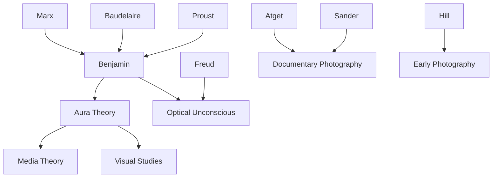

---
cssclasses:
  - Philosophy
  - Arts
  - History
subclasses:
  - Aesthetics
  - Critical-Theory
  - 20th-Century-Philosophy
related:
  - "[[Photography]]"
  - "[[Aura]]"
  - "[[Mechanical Reproduction]]"
  - "[[Frankfurt School]]"
  - "[[Visual Culture]]"
aliases:
  - photography history
  - aura photography
  - mechanical reproduction
  - optical unconscious
  - benjamin photography
  - cult value
  - exhibition value
  - daguerreotype history
  - atget photography
  - sander portraits
reference:
  - Benjamin, W. (1972). A Short History of Photography. Screen, 13(1), 5–26. https://doi.org/10.1093/screen/13.1.5
---

#### Central Problem

Benjamin confronts a fundamental transformation in the nature of visual experience brought about by photography. The essay addresses how mechanical reproduction fundamentally alters the ontological status of the image—its relationship to authenticity, uniqueness, and presence. The central tension lies between photography's capacity to democratize vision and make visible what was previously invisible, and its simultaneous destruction of the "aura" that characterized traditional art's connection to ritual and cult value.

#### Main Thesis

Photography inaugurates a new epoch in the history of perception, one characterized by the "decay of the aura" and the emergence of what Benjamin calls the "optical unconscious." Unlike painting, which maintained a ritual distance between viewer and image, photography brings things closer while simultaneously stripping them of their unique presence in time and space.

The thesis develops through historical analysis: photography's early "prime" (the 1840s-1850s, before full industrialization) produced images that retained auratic qualities through long exposures and the subjects' sustained presence before the camera. However, as photography became industrialized—with faster exposures, easier reproduction, and commercial portraiture—it lost this auratic quality while gaining new political possibilities.

Benjamin argues that [[Atget]]'s empty Parisian streets represent the culmination of photography's potential: by removing humans from the scene, these images "suck the aura out of reality like water from a sinking ship," preparing photography for its proper political function.

#### Historical Context

Written in 1931, the essay emerges from Benjamin's broader project of understanding modernity through its material culture. The interwar period saw photography mature as both art form and mass medium, with heated debates about its aesthetic status relative to painting.

Benjamin situates photography within the longer history of mechanical reproduction, tracing how each new technology (printing, engraving, lithography) transformed the relationship between original and copy. Photography represents a qualitative leap: for the first time, the mechanical process captures reality directly rather than translating it through human hand.

The essay's Marxist undercurrents connect to Benjamin's Frankfurt School associations, particularly his interest in how technological change transforms perception and consciousness. The concept of the optical unconscious—those aspects of reality that the camera reveals but the naked eye cannot perceive—anticipates later developments in media theory.

#### Philosophical Lineage

#### Key Thinkers

| Thinker | Dates | Movement | Main Work | Core Concept |
|---------|-------|----------|-----------|--------------|
| [[Benjamin]] | 1892-1940 | [[Frankfurt School]] | "Short History of Photography" | Aura, optical unconscious |
| [[Atget]] | 1857-1927 | [[Documentary Photography]] | Paris photographs | Deserted urban scenes |
| [[Sander]] | 1876-1964 | [[Documentary Photography]] | *Face of Our Time* | Physiognomic atlas |
| [[Hill]] | 1802-1870 | [[Early Photography]] | Portrait studies | Calotype portraits |
| [[Daguerre]] | 1787-1851 | [[Photography Invention]] | Daguerreotype process | First practical photography |

#### Key Concepts

| Concept | Definition | Related to |
|---------|------------|------------|
| Aura | Unique presence of an artwork in time and space; its authenticity and connection to ritual | [[Benjamin]], [[Aesthetics]] |
| Optical unconscious | Aspects of reality visible to the camera but not the naked eye; photography's revelatory capacity | [[Benjamin]], [[Freud]] |
| Cult value | The value of art derived from its role in religious or ritualistic contexts | [[Benjamin]], [[Art History]] |
| Exhibition value | The value of art derived from its visibility and accessibility to mass audiences | [[Benjamin]], [[Mass Culture]] |
| Decay of aura | The destruction of art's unique presence through mechanical reproduction | [[Benjamin]], [[Modernity]] |

#### Authors Comparison

| Theme | [[Benjamin]] | [[Adorno]] | [[Kracauer]] |
|-------|--------------|------------|--------------|
| View of photography | Ambivalent; political potential and auratic loss | Suspicious of mass culture | Documentary realism |
| Mass reproduction | Democratizing and destructive | Primarily ideological | Alienation and redemption |
| Political function | Revolutionary potential | Compromised by culture industry | Critical distance |
| Aura | Central concept | Less emphasized | Different formulation |

#### Influences & Connections

- **Predecessors:** [[Benjamin]] ← influenced by ← [[Marx]], [[Baudelaire]], [[Proust]], [[Freud]]
- **Contemporaries:** [[Benjamin]] ↔ dialogue with ↔ [[Adorno]], [[Kracauer]], [[Brecht]]
- **Followers:** [[Benjamin]] → influenced → [[Sontag]], [[Barthes]], [[Berger]], media theorists
- **Related concepts:** [[Mechanical Reproduction]] ↔ connected to ↔ [[Mass Culture]], [[Modernity]]

#### Summary Formulas

- **Aura defined:** The aura is the unique presence of an artwork in time and space—its authenticity and embeddedness in tradition that mechanical reproduction destroys.
- **Optical unconscious:** Photography reveals aspects of reality that escape conscious perception—"structural formations, cell tissues" that constitute a previously invisible realm.
- **Historical dialectic:** Photography's early prime retained auratic qualities; industrialization destroyed them; avant-garde photography ([[Atget]], [[Sander]]) reclaimed political rather than aesthetic function.
- **Political potential:** By stripping reality of its aura, photography prepares images for political use rather than ritual contemplation.

#### Timeline

| Year | Event |
|------|-------|
| 1839 | [[Daguerre]]'s process made public; photography born |
| 1843 | [[Hill]] produces portrait studies of Scottish clergy |
| 1840s-1850s | Photography's "prime"—long exposures, auratic images |
| 1880s | Industrialization of photography; portrait studios proliferate |
| 1900-1927 | [[Atget]] documents empty Paris streets |
| 1929 | [[Sander]] publishes *Face of Our Time* |
| 1931 | [[Benjamin]] publishes "A Short History of Photography" |

#### Notable Quotes

> "However skillful the photographer, however carefully he poses his model, the spectator feels an irresistible compulsion to look for the tiny spark of chance, of the here and now, with which reality has, as it were, seared the character in the picture."

> "Photography makes aware for the first time the optical unconscious, just as psychoanalysis discloses the instinctual unconscious."

> "Atget was the first to disinfect the stuffy atmosphere spread by the conventional portrait photography of the period of decline. He cleansed this atmosphere, indeed cleared it."

---
> [!warning]-
> This annotation was normalised using a large language model and may contain inaccuracies. These texts serve as preliminary study resources rather than exhaustive references.
