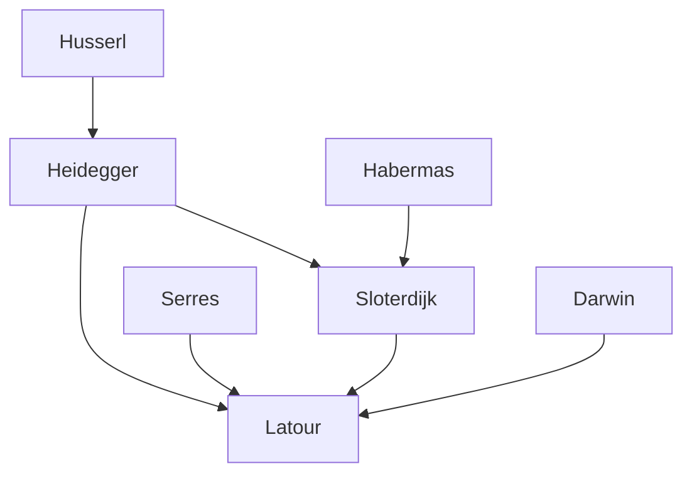

---
cssclasses:
  - Philosophy
  - Arts
subclasses:
  - Design-Theory
  - Philosophy-of-Science
  - 20th-Century-Philosophy
related:
  - "[[Actor-Network Theory]]"
  - "[[Philosophy of Design]]"
  - "[[Matters of Concern]]"
  - "[[Peter Sloterdijk]]"
  - "[[Ecological Crisis]]"
aliases:
  - philosophy design
  - cautious prometheus
  - matters concern
  - design thinking
  - sloterdijk spheres
  - dasein design
  - post promethean
  - redesign nature
  - ecological design
  - things assemblies
reference:
  - "Latour, B. (2008). A cautious prometheus?: A few steps toward a philosophy of design (with special attention to Peter Sloterdijk). 2–10."
---

#### Central Problem

The central problem [[Latour]] addresses is the profound transformation of the concept of "design" from a superficial aesthetic veneer to a comprehensive framework for understanding human action in the contemporary world. This transformation signals a fundamental shift in how we conceive objects, nature, and political engagement. The traditional modernist dichotomy between "function" (engineering, science, material necessity) and "form" (design, aesthetics, symbolism) has been dissolving as design infiltrates every level of existence — from genes and brains to cities, landscapes, and climate itself.

The deeper problem concerns the inadequacy of the modernist framework to handle the ecological crisis. Modernism operated under the assumption of an "outside" — nature as an inexhaustible resource, consequences that would "take care of themselves," and an unlimited space for expansion. But the ecological crisis has revealed that there is no outside anymore; every life support system must be explicitly designed, maintained, and carefully managed. The question becomes: how can we develop a "post-Promethean" theory of action that combines the scale of contemporary challenges (redesigning the entire planet) with the modesty, care, and precaution that design practice traditionally embodies?

#### Main Thesis

[[Latour]]'s main thesis is that design, understood in its expanded contemporary sense, offers a crucial alternative to the modernist concepts of "construction," "creation," and "revolution." The spread of design throughout all domains of human activity indicates that "we have never been modern" — that the sharp dichotomy between objective matters of fact and subjective matters of concern was always an illusion. Design replaces revolution as the operative concept for transformation.

Five advantages make design superior to modernist concepts of action:

**Humility:** Design implies modesty rather than hubris. Unlike "construction" or "creation," designing something never claims to start from scratch or achieve definitive mastery. A "cautious Prometheus" steals fire carefully.

**Attention to Detail:** Design requires meticulous craftsmanship and skill, contrasting with revolutionary attitudes that disregard consequences. The ecological crisis demands that we redesign infinitely more than any revolution contemplated, but with obsessive care.

**Meaning and Semiotics:** Everything designed is open to interpretation. Design treats artefacts as "things" (assemblies of contradictory concerns) rather than mere objects. Digitalization has accelerated this: artefacts are now "written in code" all the way down.

**Redesign, Not Creation:** Design never begins ex nihilo. There is always something given, something remedial. Unlike God the Creator, designers (and indeed God properly understood as redesigner) work with what already exists.

**Ethical Dimension:** Design necessarily involves normative questions — good versus bad design. Unlike matters of fact that claim to be value-neutral, designed things invite moral evaluation. This makes design inherently political.

#### Historical Context

The lecture was delivered in September 2008 at the Networks of Design conference in Falmouth, Cornwall, at a moment when the word "design" had expanded far beyond its traditional meaning. [[Latour]] recalls that in his youth, design (imported into French from English) meant merely "relooking" — adding aesthetic appeal to functional objects created by engineers. This "not only function but also form" dichotomy reflected the modernist separation between material reality and symbolic meaning.

By 2008, the ecological crisis had forced recognition that the entire fabric of earthly existence required redesigning. Climate change, biotechnology, nanotechnology, and urbanization had made it impossible to maintain the fiction of nature as an outside independent of human design. The philosophical context included the so-called Habermas-Sloterdijk debate of the late 1990s, where [[Habermas]] attacked [[Sloterdijk]] for suggesting humans need artificial "cultivation" — a position Habermas saw as quasi-eugenic, but which Sloterdijk understood as acknowledging that humans always require designed life-support systems.

The moment was also characterized by what [[Latour]] calls the disconnect between two great narratives: emancipation (progress, mastery, detachment) versus attachment (precaution, care, entanglement). Design offers a way to reconcile these narratives.

#### Philosophical Lineage

#### Key Thinkers

| Thinker | Dates | Movement | Main Work | Core Concept |
|---------|-------|----------|-----------|--------------|
| [[Sloterdijk]] | 1947– | [[Post-Phenomenology]] | *Sphären* trilogy | Spheres, envelopes, explicitation |
| [[Heidegger]] | 1889-1976 | [[Phenomenology]] | *Being and Time* | Dasein, things as gatherings |
| [[Habermas]] | 1929– | [[Critical Theory]] | *Theory of Communicative Action* | Communicative rationality, humanism |
| [[Galileo]] | 1564-1642 | [[Scientific Revolution]] | *Dialogue* | Book of nature in mathematical terms |
| [[Darwin]] | 1809-1882 | [[Evolutionary Theory]] | *Origin of Species* | Natural selection as blind design |

#### Key Concepts

| Concept | Definition | Related to |
|---------|------------|------------|
| Matters of concern | Things understood as contested assemblies of contradictory issues, as opposed to undisputable matters of fact | [[Latour]], [[ANT]] |
| Explicitation | The process of making visible and explicit the life-support systems, envelopes, and conditions that sustain existence | [[Sloterdijk]], [[Spherology]] |
| Spheres (Sphären) | The envelopes, bubbles, and artificial atmospheres that constitute human life-support systems | [[Sloterdijk]], [[Design Theory]] |
| Things (Dinge) | Gatherings or assemblies that bring together contradictory stakeholders, as opposed to objects as matters of fact | [[Heidegger]], [[Latour]] |
| Post-Promethean action | A theory of action combining the scale of planetary transformation with modesty, precaution, and care | [[Latour]], [[Ecological Design]] |
| Cautious radicalism | The paradoxical attitude required to redesign everything while proceeding with infinite care | [[Latour]], [[Design Ethics]] |
| Drawing things together | The challenge of visualizing matters of concern, including all contradictory stakeholders, rather than merely objects | [[Latour]], [[Design Visualization]] |

#### Authors Comparison

| Theme | [[Latour]] | [[Sloterdijk]] |
|-------|------------|----------------|
| Central metaphor | Matters of concern vs. matters of fact | Spheres, envelopes, life-support |
| View of modernism | We have never been modern | Modernism as architectural style (Globes) |
| Human condition | Humans entangled with non-humans | Humans always in artificial atmospheres |
| Ecological crisis | No outside anymore | Explicitation of life-support systems |
| Against humanism | Humanists treat objects unfairly | Humanists ignore human artificiality |
| Design's role | Replacement for revolution | Key to understanding Dasein |

#### Influences & Connections

- **Predecessors:** [[Latour]] ← influenced by ← [[Heidegger]], [[Serres]], [[Whitehead]]
- **Contemporaries:** [[Latour]] ↔ dialogue with ↔ [[Sloterdijk]], [[Stengers]]
- **Followers:** [[Latour]] → influenced → [[Speculative Design]], [[Ontological Design]], [[Object-Oriented Ontology]]
- **Opposing views:** [[Latour]] ← criticized by ← [[Habermas]], [[Modernist humanists]]

#### Summary Formulas

- **[[Latour]]:** Design replaces revolution; the expansion of design thinking signals the end of modernism and the recognition that everything — including nature — must be carefully redesigned as matters of concern rather than treated as matters of fact.
- **[[Sloterdijk]]:** "Dasein ist Design" — human existence is always already artificial, always already enveloped in carefully maintained life-support systems (spheres) that must be explicitly designed and protected.

#### Notable Quotes

> "The more objects are turned into things – that is, the more matters of facts are turned into matters of concern – the more they are rendered into objects of design through and through." — [[Latour]]

> "We have to be radically careful, or carefully radical… What an odd time we are living through." — [[Latour]]

> "To design is never to create ex nihilo." — [[Latour]]
