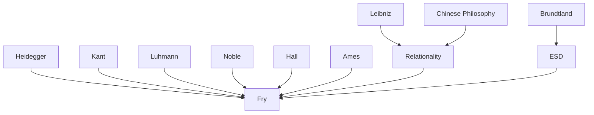

---

cssclasses:
  - Philosophy
  - Arts
subclasses:
  - Design-Theory
  - Ethics
  - Critical-Theory
related:
  - "[[Sustainability]]"
  - "[[Design Philosophy]]"
  - "[[Unsustainability]]"
  - "[[Ontological Design]]"
  - "[[Relationality]]"
  - "[[Biopolitics]]"
aliases:
  - defuturing design
  - design philosophy
  - sustain ability
  - unsustainability design
  - ontological design
  - relational design
  - futuring design
  - design agency
  - design futures
  - critical design
reference:
  - "Fry, T. (2020). Defuturing: a new design philosophy. Bloomsbury Visual Arts. (pp.1-15)"
tags:
  - Podcast
---

#### Podcast

<iframe allow="autoplay *; encrypted-media *; fullscreen *; clipboard-write" frameborder="0" height="150" style="width:100%;overflow:hidden;border-radius:10px;background:transparent;" sandbox="allow-forms allow-popups allow-same-origin allow-scripts allow-storage-access-by-user-activation allow-top-navigation-by-user-activation" src="https://embed.podcasts.apple.com/us/podcast/defuturing-a-new-design-philosophy/id1786764068?i=1000684349640&uo=4&l=en-GB&theme=auto"></iframe>

---

#### Central Problem

How has design—understood not merely as aesthetic practice but as a fundamental mode of world-making—systematically negated the possibility of sustainable futures? Fry introduces the concept of "defuturing" to name the process by which design, technology, and industrial modernity have colonized and cancelled future possibilities for human and non-human life. The central problem is twofold: first, the epistemological challenge of recognizing defuturing when our very frameworks of knowledge, perception, and judgment have been shaped by the same processes that produce unsustainability; second, the practical imperative to develop a new design philosophy capable of interrupting defuturing and enabling "sustain-ability."

The text confronts an "impossibility and a necessity"—the impossibility of fully telling the story of defuturing (since it would require rewriting everything) and the necessity of doing so if any genuine capacity to sustain is to be developed. Current understandings of "sustainability" are entirely inadequate because they fail to grasp how deeply unsustainability is inscribed in the material and immaterial structures of modern existence. Design, Fry argues, is everywhere yet intellectually nowhere—it determines our worlds while remaining unexamined as an ontological force.

#### Main Thesis

Fry argues that **defuturing** names the way design, in its omnipresent agency, systematically negates future possibilities for sustaining life. Against this, **sustain-ability** (hyphenated to emphasize ability as ongoing process rather than static endpoint) must be understood not as a condition to be achieved but as a constantly developed capacity to sustain what needs to be sustained.

The argument unfolds through several interconnected claims:

1. **Design as ontological force**: Design is not merely object, process, or appearance but a relational ensemble that constantly shapes and is shaped by the worlds it produces. "We design our world, while our world designs us." Design is prior to, within, and independent of both sciences and humanities.

2. **Three dimensions of Design**: (a) The designed object resulting from design acts; (b) Design agency—the designer designing or designing tools; (c) Design-in-process—the ongoing designing that is the agency of designed objects as they function or dysfunction, futuring or defuturing.

3. **Sustain-ability vs. sustainability**: Sustainability as political discourse (especially ESD—Ecologically Sustainable Development) sustains the unsustainable by leaving economic growth uncontested. Genuine sustain-ability requires learning to identify what defutures and developing capacities to make things otherwise.

4. **Relationality as method**: Against Western cause-effect metaphysics, Fry adopts a relational, correlative thinking (drawing on ancient Chinese thought) that understands phenomena as arising from dynamic conjunctural relations rather than linear causation.

5. **Design as metaphysics**: The question of design is always an ontological question—what it does in the ways it acts. A new philosophy of design manifests not as theoretical framework but as embodied ontological shift that transforms perception, understanding, and action.

#### Historical Context

The text, originally published in 1999 and reissued in 2020, emerges from multiple intersecting contexts: the environmental crisis and inadequacy of mainstream sustainability discourse (particularly post-Brundtland Report ESD frameworks from 1987); the marginality of design studies within academia despite design's omnipresence; the critique of Western metaphysical dualism and instrumental rationality; and the post-structuralist deconstruction of grand narratives.

Fry positions his work against three inadequate responses to ecological crisis: (1) UN-style reformism that seeks to modify development without contesting growth; (2) utopian positions like the Club of Rome's "Limits to Growth" that oppose development to ecology; (3) pragmatic positions that recognize ecological problems but fail to grasp their structural inscription in design. The text draws on critical theory, phenomenology (especially Heidegger's thinking on technology), systems theory (Luhmann), and correlative Chinese philosophy to develop an alternative approach.

The broader intellectual context includes debates about technology and modernity (Noble, Heidegger), the emergence of design studies as a field seeking academic legitimacy, and postmodern critiques of judgment and metanarrative—which Fry both acknowledges and resists.

#### Philosophical Lineage

#### Key Thinkers

| Thinker | Dates | Movement | Main Work | Core Concept |
|---------|-------|----------|-----------|--------------|
| [[Heidegger]] | 1889-1976 | [[Phenomenology]] | *The Question Concerning Technology* | Technology as enframing, being-in-the-world |
| [[Kant]] | 1724-1804 | [[German Idealism]] | *Critique of Judgement* | Judgement, aesthetic experience |
| [[Luhmann]] | 1927-1998 | [[Systems Theory]] | *Social Systems* | Autopoiesis, structure as arrested flow |
| [[Noble]] | 1945-2010 | [[History of Technology]] | *America by Design* | Design and forces of production |
| [[Hall]] | 1937-2023 | [[Comparative Philosophy]] | *Thinking Through Confucius* | Correlative thinking |
| [[Ames]] | 1947- | [[Comparative Philosophy]] | *Thinking Through Confucius* | Chinese correlative philosophy |
| [[Leibniz]] | 1646-1716 | [[Rationalism]] | *Monadology* | Relational metaphysics |

#### Key Concepts

| Concept | Definition | Related to |
|---------|------------|------------|
| Defuturing | The process by which design negates future possibilities for sustaining life; the making-present that takes away futures | [[Fry]], [[Sustainability]] |
| Sustain-ability | The ability to sustain—an ongoing process of learning and working on what is vital for being, not a static endpoint | [[Fry]], [[Design-Theory]] |
| Design (capitalized) | Metaview gathering object, agency, and process as they exist conjuncturally and relationally; ontological force of world-making | [[Fry]], [[Ontology]] |
| Relationality | Mode of thinking based on correlative processes rather than cause-effect; dynamic, temporal, opposed to Western binary metaphysics | [[Fry]], [[Chinese Philosophy]] |
| The defutured | That which has been taken away by defuturing; cancelled future possibilities now structurally inscribed | [[Fry]], [[Unsustainability]] |
| Design-in-process | The ongoing designing that is the agency of designed objects as they function/dysfunction | [[Fry]], [[Design Philosophy]] |
| ESD | Ecologically Sustainable Development; political discourse that fails to contest economic growth logic | [[Brundtland]], [[Sustainability]] |
| Futuring | The project of future-making cleared by recognition of defuturing; opposed to defuturing | [[Fry]], [[Design Futures]] |
| Ontological design | Understanding that design is always an ontological question—what it does in the ways it acts | [[Fry]], [[Heidegger]] |
| Synthetic environments | Designed post-natural environments (homes, workplaces, cars) into which humans have become naturalized | [[Fry]], [[Technology]] |

#### Authors Comparison

| Theme | [[Fry]] | [[Heidegger]] | [[Latour]] |
|-------|---------|---------------|------------|
| Central concern | Design as defuturing agency | Technology as enframing | Actor-networks, hybrids |
| Ontology | Relational, correlative | Fundamental ontology | Flat ontology |
| Technology | Inscribed unsustainability | Danger and saving power | Mediator, actant |
| Human/nonhuman | Interdependent, co-constitutive | Dasein's world | Symmetrical treatment |
| Agency | Design-in-process, ongoing | Gelassenheit, letting-be | Distributed across networks |
| Future orientation | Futuring vs defuturing | Preparation for new beginning | Composition of common world |
| Politics | Sustain-ability as learning | Critique of calculative thinking | Parliament of things |

#### Influences & Connections

- **Predecessors:** [[Fry]] ← influenced by ← [[Heidegger]], [[Luhmann]], [[Kant]], [[Leibniz]], Chinese correlative philosophy
- **Contemporaries:** [[Fry]] ↔ dialogue with ↔ [[Noble]], [[Hall]], [[Ames]]
- **Followers:** [[Fry]] → influenced → ontological design, transition design, design for sustainability
- **Opposing views:** [[Fry]] ← criticized by ← mainstream sustainability discourse, ESD proponents, design professionalism

#### Summary Formulas

- **[[Fry]]:** Defuturing names the way design systematically negates future possibilities. Sustain-ability is the learnt capacity to identify what defutures and make things otherwise. We design our world while our world designs us.

- **On Design:** Design is prior to, within, and independent of sciences and humanities. It is everywhere yet intellectually nowhere. The question of design is always ontological—concerning what it does in the ways it acts.

- **On relationality:** Against cause-effect metaphysics, relationality grasps phenomena as arising from dynamic conjunctural relations. Structure is the appearance of arrested fluid relations within a system.

- **On sustain-ability:** Not an endpoint to achieve but an ongoing ability to sustain. It requires learning defuturing, for one cannot pursue sustainability without understanding unsustainability.

#### Notable Quotes

> "We design our world, while our world designs us." — [[Fry]]

> "Without a knowledge of defuturing, from the perspective of Design, we have little comprehension of what designs, the agency of the already designed or the consequences of designing." — [[Fry]]

> "Although we, and the worlds we occupy, are significantly determined by design, it has never actually arrived as a serious object of inquiry – the study of design is a marginal activity of the academy, it does not attract the best minds, gain significant research support or generate general interest." — [[Fry]]

---
> [!warning]-
> This annotation was normalised using a large language model and may contain inaccuracies. These texts serve as preliminary study resources rather than exhaustive references.
