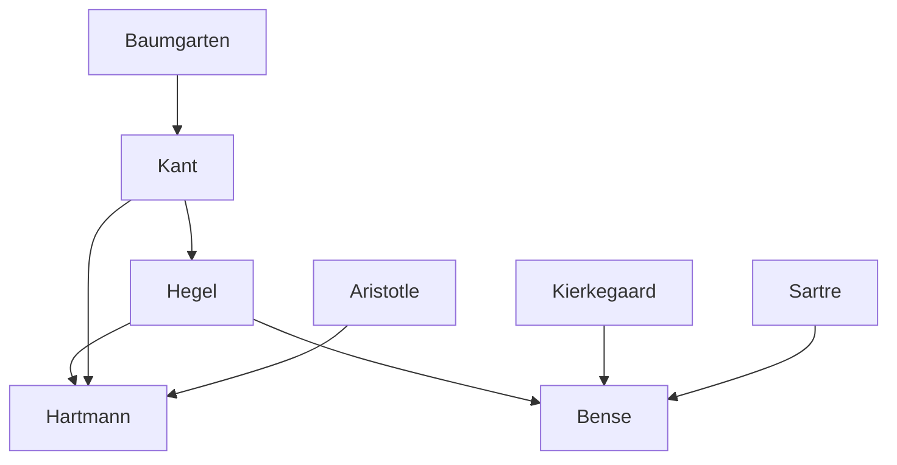

---
cssclasses:
  - Philosophy
  - Arts
subclasses:
  - Aesthetics
  - 20th-Century-Philosophy
  - Continental-Philosophy
related:
  - "[[German Aesthetics]]"
  - "[[Philosophy of Art]]"
  - "[[Hartmann]]"
  - "[[Bense]]"
  - "[[Hegelian Aesthetics]]"
aliases:
  - german aesthetics
  - hartmann aesthetics
  - bense aesthetics
  - philosophy beauty
  - aesthetic object
  - strata theory
  - coreality aesthetics
  - aesthetic value
  - appearance semblance
  - ontological modes
reference:
  - Schaper, E. (1956). The Aesthetics of Hartmann and Bense. The Review of Metaphysics, 10(2), 289–307.
---

#### Central Problem

The central problem addressed by [[Schaper]] is the state of German philosophical aesthetics in the mid-twentieth century, which she characterizes as isolated from both contemporary art criticism and Anglo-American philosophical developments. While Germany produced rich contributions to art criticism, literary interpretation, and formal analysis, these remained philosophically unsystematic. Meanwhile, professional philosophers retreated into either dated Kantian or Hegelian frameworks, or buried aesthetic issues under existentialist neologisms.

[[Schaper]] examines two prominent post-war German aestheticians — [[Hartmann]] and [[Bense]] — who both claim to continue the tradition originating with [[Baumgarten]]. Despite their differences in approach (Hartmann's systematic thoroughness versus Bense's aphoristic brilliance), both remain fundamentally Hegelian in their core assumptions, particularly in treating art as a manifestation of Spirit that addresses intellectual rather than merely emotional capacities. Neither engages seriously with practical criticism or twentieth-century developments in aesthetics and critical theory outside Germany.

#### Main Thesis

[[Schaper]]'s main thesis is that contemporary German aesthetics exemplifies an unfortunate dilemma: philosophical thoroughness and critical understanding of art works appear to exclude each other. [[Hartmann]] offers rigorous systematic analysis but remains utterly remote from practical concerns; [[Bense]] displays thorough acquaintance with modern art but produces no genuine arguments, only stimulating but infuriating paradoxical formulations.

**Hartmann's Position:** Aesthetics is the philosophy of the beautiful, understood as a comprehensive value-category. Aesthetic objects are characterized by a stratified structure (Schichten) involving a "real foreground" (sensuous material) through which an "unreal background" (appearance, meaning) shines. Unlike objects of cognition which exist in their own right, aesthetic objects exist only "for" an experiencer. Aesthetic values are "unrealized values" — they can only be presented, never made real — which accounts for aesthetic distance and disinterestedness. The value of art depends on the depth and richness of its stratified appearance, with "great art" embodying the "highest interests of the Spirit."

**Bense's Position:** Beauty is an ontological modality distinct from reality, necessity, and possibility. Aesthetic objects exist in the mode of "co-reality" (Mitwirklichkeit) — they require something real in order to appear but do not coincide with that reality. Aesthetic analysis concerns "signs" rather than categories, requiring interpretation rather than mere observation. Full aesthetic appreciation consists in clear intellectual comprehension that supersedes and destroys initial emotional responses.

**Schaper's Critique:** Both authors adopt Hegelian assumptions without the dialectical context that gave them meaning. Hartmann's strata theory involves unresolved ontological ambiguities regarding how the "real" foreground changes status within the aesthetic object. Bense's identification of aesthetic experience with aesthetic theory leads to insuperable difficulties, and his analysis often bewilders rather than illuminates.

#### Historical Context

The article was published in 1956, surveying post-war German aesthetics against the background of German philosophy's retreat from practical engagement with art. [[Schaper]] notes that Germany, once famous for systematic aesthetic thinking (from [[Baumgarten]] through [[Kant]] to [[Hegel]]), had become "remarkably silent" in philosophical aesthetics, with interesting contributions coming indirectly through existentialist approaches to art ([[Heidegger]]), critical theory of music ([[Adorno]]), and the "interpretation" method in literary studies ([[Staiger]], [[Kommerell]]).

The context includes the unprecedented challenges posed by modern art — the "inversion of hitherto accepted canons" in the novel, absence of subject-matter in painting, atonality in music — which [[Schaper]] suggests German philosophers failed to address adequately. She contrasts this unfavorably with Anglo-American aesthetics, which at least showed awareness of the mutual influence between critical and philosophical enterprises.

[[Hartmann]]'s Ästhetik (1953) was published posthumously; [[Bense]]'s Aesthetica appeared in 1954. Both claimed continuity with the German tradition, but [[Schaper]] argues they stopped at [[Hegel]], ignoring subsequent developments that should make purely Hegelian assumptions untenable.

#### Philosophical Lineage

#### Key Thinkers

| Thinker | Dates | Movement | Main Work | Core Concept |
|---------|-------|----------|-----------|--------------|
| [[Hartmann]] | 1882-1950 | [[Critical Realism]] | *Ästhetik* | Stratified aesthetic object, unrealized values |
| [[Bense]] | 1910-1990 | [[Information Aesthetics]] | *Aesthetica* | Co-reality, modal aesthetics |
| [[Hegel]] | 1770-1831 | [[German Idealism]] | *Lectures on Aesthetics* | Sensuous appearance of the Idea |
| [[Kant]] | 1724-1804 | [[Transcendental Idealism]] | *Critique of Judgment* | Autonomy, disinterestedness |
| [[Baumgarten]] | 1714-1762 | [[Rationalism]] | *Aesthetica* | Founded aesthetics as discipline |
| [[Nohl]] | 1879-1960 | [[Hermeneutics]] | *Die ästhetische Wirklichkeit* | Historical approach to aesthetics |

#### Key Concepts

| Concept | Definition | Related to |
|---------|------------|------------|
| Strata (Schichten) | Levels of existence within aesthetic objects; Hartmann distinguishes "real foreground" (sensuous material) from "unreal background" (appearance) | [[Hartmann]], [[Ontology]] |
| Unrealized values | Aesthetic values that can only be presented, never made real; accounts for aesthetic distance and suspension of desire | [[Hartmann]], [[Value Theory]] |
| Co-reality (Mitwirklichkeit) | The ontological mode of aesthetic objects; beauty appears "with" something real but does not coincide with it | [[Bense]], [[Modal Ontology]] |
| Aesthetic object | Object whose complexity involves stratified being; exists only "for" an experiencer, unlike objects of cognition | [[Hartmann]], [[Phenomenology]] |
| Sign-world | Complex of aesthetic elements requiring interpretation; aesthetic analysis concerns signs rather than categories | [[Bense]], [[Semiotics]] |
| Appearance (Schein) | What "shines through" the sensuous stratum; the locus of aesthetic value in both Hartmann and Bense | [[Hegel]], [[German Idealism]] |

#### Authors Comparison

| Theme | [[Hartmann]] | [[Bense]] |
|-------|--------------|-----------|
| Method | Systematic, rigorous analysis | Aphoristic, paradoxical formulations |
| Relation to criticism | Aesthetics irrelevant to appreciation and creation | Aesthetics equals full aesthetic experience |
| Ontological approach | Strata theory (real/unreal) | Modal analysis (co-reality) |
| Value of art | Depth of stratified appearance | Intellectual comprehension |
| Modern art | Largely ignored | Central concern, but poorly illuminated |
| Historical awareness | Stops at Hegel | Bristles with modern references |

#### Influences & Connections

- **Predecessors:** [[Hartmann]] ← influenced by ← [[Hegel]], [[Kant]], [[Aristotle]]
- **Predecessors:** [[Bense]] ← influenced by ← [[Hegel]], [[Kierkegaard]], [[Sartre]]
- **Contemporaries:** [[Hartmann]] ↔ contrast with ↔ [[Bense]], [[Heidegger]], [[Adorno]]
- **Followers:** [[Bense]] → influenced → [[Information Aesthetics]], [[Concrete Poetry]]
- **Opposing views:** [[Schaper]] ← critiques ← [[Hartmann]], [[Bense]]

#### Summary Formulas

- **[[Hartmann]]:** Aesthetic objects are stratified complexes of real foreground and unreal background; aesthetic values are unrealized values that can only appear, never be made real, which grounds aesthetic distance and disinterestedness.
- **[[Bense]]:** Beauty is an ontological modality of "co-reality" distinct from actuality; aesthetic appreciation culminates in intellectual comprehension that supersedes emotional response, identifying aesthetic experience with aesthetic theory.
- **[[Schaper]]:** Contemporary German aesthetics exemplifies an unfortunate dilemma where philosophical thoroughness and critical understanding exclude each other; both Hartmann and Bense remain trapped in Hegelian assumptions divorced from artistic realities and critical practice.

#### Notable Quotes

> "Philosophical thoroughness and critical understanding of art works exclude each other." — [[Schaper]]

> "Art brings to consciousness the highest interests of the Spirit." — [[Hegel]], cited as Leitmotiv by [[Bense]]

> "Art is and remains for us a thing of the past." — [[Hegel]], cited by [[Schaper]] to challenge Hegelian assumptions

---
> [!warning]-
> This annotation was normalised using a large language model and may contain inaccuracies. These texts serve as preliminary study resources rather than exhaustive references.
