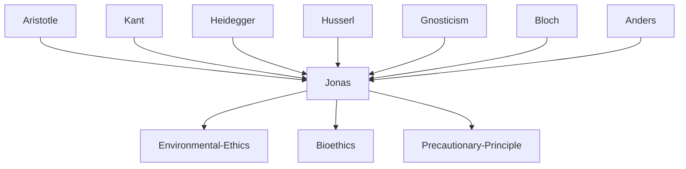

---
cssclasses:
  - Philosophy
subclasses:
  - Ethics
  - Applied-Ethics
  - 20th-Century-Philosophy
aliases:
  - responsibility ethics
  - technology ethics
  - environmental ethics
  - future generations
  - ecological ethics
  - heuristics fear
  - precautionary principle
  - imperative ethics
contributions:
  - Conceptual
  - Constructive
authors:
  - "[[Jonas]]"
  - "[[Kant]]"
  - "[[Heidegger]]"
  - "[[Bloch]]"
reference: Abbagnano, N., & Fornero, G. (2012). La ricerca del pensiero. Vol. 3C. Dalla crisi della modernità agli sviluppi più recenti. Paravia.
related:
  - "[[Environmental Ethics]]"
  - "[[Bioethics]]"
  - "[[Precautionary Principle]]"
  - "[[Technology Ethics]]"
  - "[[Kantian Ethics]]"
  - "[[Applied Ethics]]"
  - "[[Future Generations]]"
  - "[[Phenomenology]]"
  - "[[Gnosticism]]"
  - "[[Theodicy]]"
---

#### Central Problem

The unprecedented power of modern technological civilization has created an ethical emergency without parallel in human history. [[Jonas]] diagnoses this as the problem of "Prometheus unbound"—humanity has acquired god-like powers to transform nature and even human nature itself, yet operates with ethical frameworks designed for pre-technological societies. Traditional ethics are anthropocentric (focused only on humans), presentist (concerned only with the "here and now"), and individualistic (focused on interpersonal relations). They ignore the long-term, cumulative, potentially irreversible consequences of collective technological action.

The central question becomes: How do we develop an ethics adequate to the age of technology? Traditional moralities—whether Kantian ethics of intention, Christian ethics of conscience, or utilitarian calculations—are structurally "myopic" and incapable of addressing the novel situation where humanity can destroy the conditions for its own future existence and that of the entire biosphere. We can no longer remain content with being "at peace with our conscience" while our actions threaten planetary catastrophe.

Jonas poses the fundamental question: Why should we sacrifice for future generations? On what basis can we ground an unconditional duty to ensure that human life continues indefinitely? The challenge is to derive an ought (moral obligation) from an is (being itself)—directly confronting and rejecting [[Hume]]'s prohibition against deriving values from facts.

#### Main Thesis

[[Jonas]] proposes a **new categorical imperative** for the technological age to replace [[Kant]]'s purely formal moral principle:

> "Act so that the consequences of your action are compatible with the permanence of genuine human life on earth."

Or negatively: "Act so that the consequences of your action do not destroy the future possibility of such life."

Or simply: "Do not endanger the conditions for the indefinite survival of humanity on earth."

Or positively: "Include in your present choice the future integrity of humanity as an object of your will."

This imperative requires grounding ethics in **ontology** (metaphysics). Rejecting [[Hume]]'s law (the prohibition against deriving ought from is), [[Jonas]] argues neo-Aristotelically that there is an intrinsic ought-to-be (Sein-Sollen) within being itself. Being affirms itself over non-being; life demands the continuation of life. The very existence of purpose in nature reveals being's "vote" for itself against nothingness. This teleological structure provides the objective foundation for the new ethics.

The concept of **responsibility** becomes central—not the backward-looking responsibility of traditional ethics (being held accountable for past actions) but forward-looking responsibility for future beings who cannot yet make claims on us. The archetype of such responsibility is parental care for the newborn, whose very existence is an appeal for care. The helpless infant provides the "ontic paradigm" of the coincidence of being and ought-to-be.

Jonas advocates a **heuristics of fear**: the imagined threat of future catastrophe helps us discover ethical principles we would otherwise not recognize. Only by contemplating the possible destruction of humanity do we grasp what must be preserved.

Against the **utopianism** of both Baconian techno-optimism and Marxist eschatology, [[Jonas]] proposes a modest ethics of survival rather than perfection, cautious preservation rather than revolutionary transformation.

#### Historical Context

[[Jonas]] (1903-1993) was shaped by the intellectual ferment of Weimar Germany, studying with [[Husserl]], [[Heidegger]], and [[Bultmann]]. His fellow students included [[Arendt]] and [[Anders]]. As a German Jew, he fled Nazism, emigrating first to England, then Palestine, where he served as a volunteer in the British Army. After the war he taught in Canada and the United States, becoming professor at the New School for Social Research in New York (1955-1976).

Jonas's early work focused on Gnosticism, interpreting the ancient religious movement's sense of alienation—being "strangers" cast into an indifferent world—as an anticipation of modern nihilism and the rupture between humanity and nature. This analysis of the "alien life" motif connected ancient gnosis to [[Heidegger]]'s existentialism and modern technological alienation.

His later work developed a philosophy of biology emphasizing organism and freedom (*The Phenomenon of Life*, 1966), countering mechanistic reductionism with a recognition of intrinsic purpose in living nature.

*The Imperative of Responsibility* (1979) appeared amid growing environmental consciousness following the Club of Rome reports, the first Earth Day (1970), and the oil crisis. It offered philosophical foundations for environmental ethics when ecology was becoming a global political issue. The book established [[Jonas]] as a major voice for an ethics of technological restraint.

His reflections on theodicy, *The Concept of God After Auschwitz* (1984), grappled with how to conceive God after the Holocaust—concluding that we must abandon the concept of divine omnipotence.

#### Philosophical Lineage

#### Key Thinkers

| Thinker | Dates | Movement | Main Work | Core Concept |
|---------|-------|----------|-----------|--------------|
| [[Jonas]] | 1903-1993 | [[Environmental Ethics]] | *The Imperative of Responsibility* | Responsibility for future generations |
| [[Kant]] | 1724-1804 | [[German Idealism]] | *Critique of Practical Reason* | Categorical imperative |
| [[Heidegger]] | 1889-1976 | [[Phenomenology]] | *Being and Time* | Technology as enframing |
| [[Bloch]] | 1885-1977 | [[Western Marxism]] | *The Principle of Hope* | Utopian hope |
| [[Anders]] | 1902-1992 | [[Critical Theory]] | *The Obsolescence of Humanity* | Technological despair |

#### Key Concepts

| Concept | Definition | Related to |
|---------|------------|------------|
| Promethean Technology | Modern technology as "Prometheus unbound," threatening planetary catastrophe through uncontrolled power | [[Jonas]], [[Environmental Ethics]] |
| New Categorical Imperative | "Act so that the consequences of your action are compatible with the permanence of genuine human life on earth" | [[Jonas]], [[Kant]] |
| Heuristics of Fear | Method of discovering ethical principles through imaginative contemplation of possible catastrophe | [[Jonas]], [[Applied-Ethics]] |
| Responsibility | Forward-looking care for future beings; paradigmatically expressed in parental care for children | [[Jonas]], [[Ethics]] |
| Ethics and Ontology | Grounding moral obligation in the structure of being itself; rejecting [[Hume]]'s is-ought distinction | [[Jonas]], [[Metaphysics]] |
| Utopianism | Dangerous eschatological optimism (Baconian or Marxist) that must be rejected for modest survival ethics | [[Jonas]], [[Bloch]] |
| Precautionary Principle | Political application of [[Jonas]]'s ethics: act cautiously when consequences are uncertain but potentially catastrophic | [[Environmental Ethics]], [[Bioethics]] |
| Ontic Paradigm | The newborn as living proof of the coincidence of being and ought-to-be | [[Jonas]], [[Metaphysics]] |
| God After Auschwitz | Reconception of God as non-omnipotent, having renounced power to grant human freedom | [[Jonas]], [[Theodicy]] |

#### Authors Comparison

| Theme | [[Jonas]] | [[Kant]] | [[Bloch]] |
|-------|-----------|----------|-----------|
| Imperative type | Consequentialist-ontological | Formal-deontological | Utopian-eschatological |
| Time orientation | Future generations | Present universalizability | Future utopia |
| Foundation | Ontological (being itself) | Rational self-consistency | Historical materialism |
| View of hope | Cautious, paired with fear | Not central | Central ("principle of hope") |
| Technology | Threat requiring restraint | Not thematized | Means of liberation |
| Progress | Suspicious, anti-utopian | Enlightenment confidence | Revolutionary transformation |

#### Influences & Connections

- **Predecessors:** [[Jonas]] ← influenced by ← [[Husserl]], [[Heidegger]], [[Aristotle]], [[Kant]]
- **Predecessors:** [[Jonas]] ← influenced by ← Gnosticism studies, Jewish tradition
- **Contemporaries:** [[Jonas]] ↔ dialogue with ↔ [[Arendt]], [[Anders]]
- **Contemporaries:** [[Jonas]] ↔ critical of ↔ [[Bloch]]'s utopian Marxism
- **Followers:** [[Jonas]] → influenced → Environmental ethics, Bioethics
- **Followers:** [[Jonas]] → influenced → Precautionary principle in international law
- **Opposing views:** [[Jonas]] ← criticized by ← Techno-optimists, Marxists

#### Summary Formulas

- **[[Jonas]]:** The unprecedented power of modern technology requires a new ethics of responsibility for future generations, grounded in the ontological priority of being over non-being, expressed as: "Act so that the consequences of your action are compatible with the permanence of genuine human life on earth."

- **[[Kant]] (traditional):** "Act only according to that maxim whereby you can at the same time will that it should become a universal law"—a formal principle focused on present rational consistency.

- **[[Bloch]]:** Hope is the fundamental ontological principle; utopian imagination anticipates the "Not-Yet-Being" that historical progress will realize through revolutionary transformation.

#### Timeline

| Year | Event |
|------|-------|
| 1903 | [[Jonas]] born in Mönchengladbach, Germany |
| 1934 | [[Jonas]] publishes first part of *Gnosis and Late-Antique Spirit* |
| 1958 | [[Jonas]] publishes *The Gnostic Religion* |
| 1966 | [[Jonas]] publishes *The Phenomenon of Life* |
| 1979 | [[Jonas]] publishes *The Imperative of Responsibility* |
| 1984 | [[Jonas]] publishes *The Concept of God After Auschwitz* |
| 1992 | Rio Earth Summit adopts precautionary principle |
| 1993 | [[Jonas]] dies in New York |

#### Notable Quotes

> "Act so that the consequences of your action are compatible with the permanence of genuine human life on earth." — [[Jonas]]

> "The Prometheus irresistibly unbound, to whom science gives unprecedented powers and the economy gives ceaseless impulse, demands an ethics that through voluntary restraints prevents his power from becoming a disaster for humanity." — [[Jonas]]

> "Only the anticipated distortion of humanity helps us formulate the concept of humanity to be preserved." — [[Jonas]]

---
> [!NOTE]
> *This summary has been created to present the key points from the source text, which was automatically extracted using LLM. Please note that the summary may contain errors. It serves as an essential starting point for study and reference purposes.*
