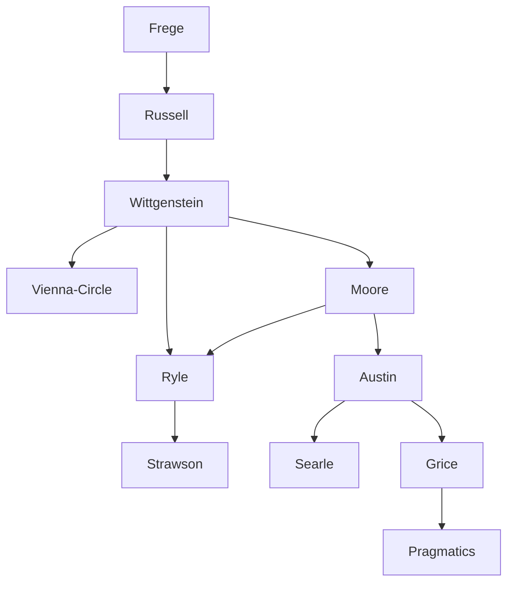

#### Central Problem

What is the proper method for philosophical investigation, and what role does language play in resolving (or dissolving) philosophical problems? Analytic philosophy emerges from the conviction that many traditional philosophical puzzles arise from misunderstandings about how language works. The central question becomes: should philosophy analyze the logical structure of an ideal language (as the logical positivists held), or should it examine the rich complexity of ordinary language as actually used?

The "linguistic turn" announced by Schlick in 1930 marked a decisive shift: language is not a neutral medium for describing reality, but the indispensable means of access to reality itself. Every object is assigned to a "category" by language. This raises fundamental questions: How do different domains of discourse (ethical, aesthetic, religious, scientific) function? What are the conditions for meaningful utterance? Can philosophical problems be dissolved by returning words to their ordinary use?

The analytic philosophers divide into two camps: the "ideal language" philosophers (neopositivists) who seek to reveal the hidden logical structure beneath everyday language, and the "ordinary language" philosophers (centered at Oxford and Cambridge) who insist that ordinary language contains resources far richer than formal logic and should be analyzed on its own terms.

#### Main Thesis

**The Ordinary Language Approach:**

For ordinary language philosophers, philosophical problems typically arise from misusing or misunderstanding everyday language. The task is not to construct an ideal logical language, but to examine how language actually functions in its diverse uses — ethical, aesthetic, religious, scientific — none of which has priority over others.

**Ryle on Category Mistakes:**

[[Ryle]] argues that philosophical confusions stem from "category mistakes" — assigning terms to categories where they don't belong. The classic example is Cartesian dualism, which treats the mind as a "thing" parallel to the body, creating the myth of a "ghost in the machine." The mind is not a substance but a way of describing behavioral dispositions. Philosophy's task is to map the "logical geography" of concepts, determining which combinations are legitimate.

**Austin on Speech Acts:**

[[Austin]] revolutionizes philosophy of language by distinguishing between *constative* utterances (which describe states of affairs and can be true or false) and *performative* utterances (which perform actions — promising, ordering, betting — and cannot be true or false, only "felicitous" or "infelicitous"). 

Austin later generalizes this insight: every utterance has three aspects:
- **Locutionary act**: the mere utterance of words
- **Illocutionary act**: the performative force (asserting, promising, commanding)
- **Perlocutionary act**: the effect on the hearer (convincing, alarming, amusing)

**Grice on Meaning and Conversation:**

[[Grice]] argues that meaning is fundamentally about the speaker's *intentions* and their recognition by the hearer. Communication operates according to a "cooperative principle" with maxims requiring contributions to be relevant, clear, appropriately informative, and truthful. When speakers visibly violate these maxims, hearers infer "conversational implicatures" — unstated meanings beyond the literal content.

**Rehabilitation of Metaphysics:**

Contrary to the neopositivist rejection of metaphysics, later analytic philosophers rehabilitate it as a legitimate enterprise — not as direct knowledge of transcendent entities, but as a way of organizing different perspectives on reality and establishing relationships between disciplines.

#### Historical Context

Analytic philosophy emerged around 1898 with Moore's article "The Nature of Judgment" in *Mind*, consolidating between 1918 (Russell's "Philosophy of Logical Atomism") and 1921 (Wittgenstein's *Tractatus*). It originated in Poland, Britain, Scandinavia, and the United States before spreading to continental Europe.

The "linguistic turn" of the 1930s marked the conviction that language shapes access to reality. The Vienna Circle developed logical positivism, while Cambridge and Oxford became centers for ordinary language philosophy, with the journal *Analysis* (founded 1933) as its organ.

[[Ayer]]'s *Language, Truth and Logic* (1936) brought logical positivism to the English-speaking world, though he later abandoned strict verificationism. The Oxford philosophers — Ryle, Austin, and their colleagues — held influential Saturday morning seminars that shaped a generation.

The Oxford movement reached its peak in the 1950s, declining around 1960 (the year of Austin's death). While Wittgenstein's direct influence waned, analytic methods were transplanted into new forms of linguistic and philosophical investigation, influencing pragmatics, speech act theory, and cognitive science.

#### Philosophical Lineage

#### Key Thinkers

| Thinker | Dates | Movement | Main Work | Core Concept |
|---------|-------|----------|-----------|--------------|
| [[Moore]] | 1873-1958 | [[Analytic Philosophy]] | *Principia Ethica* | Common sense philosophy |
| [[Ayer]] | 1910-1989 | [[Logical Positivism]] | *Language, Truth and Logic* | Verification principle; Emotivism |
| [[Ryle]] | 1900-1976 | [[Ordinary Language Philosophy]] | *The Concept of Mind* | Category mistakes; Ghost in machine |
| [[Austin]] | 1911-1960 | [[Ordinary Language Philosophy]] | *How to Do Things with Words* | Speech acts; Performatives |
| [[Grice]] | 1913-1988 | [[Ordinary Language Philosophy]] | *Studies in the Way of Words* | Meaning as intention; Implicature |
| [[Strawson]] | 1919-2006 | [[Analytic Philosophy]] | *Individuals* | Descriptive metaphysics |

#### Key Concepts

| Concept | Definition | Related to |
|---------|------------|------------|
| Linguistic Turn | The shift viewing language not as neutral medium but as constitutive of access to reality | [[Schlick]], [[Wittgenstein]] |
| Category Mistake | Assigning a term to a logical category where it doesn't belong; source of philosophical confusion | [[Ryle]], [[Analytic Philosophy]] |
| Ghost in the Machine | Ryle's pejorative term for Cartesian dualism treating mind as substance inhabiting body | [[Ryle]], Philosophy of Mind |
| Constative | Utterances that describe states of affairs and are true or false | [[Austin]], Speech Act Theory |
| Performative | Utterances that perform actions (promising, ordering) rather than describing | [[Austin]], Speech Act Theory |
| Illocutionary Act | The performative force of an utterance — what it does (asserting, commanding, promising) | [[Austin]], Speech Act Theory |
| Felicity Conditions | Circumstances required for a performative to succeed (appropriate speaker, context, completion) | [[Austin]], Speech Act Theory |
| Conversational Implicature | Meaning conveyed beyond literal content through deliberate violation of conversational maxims | [[Grice]], Pragmatics |
| Cooperative Principle | The tacit rule that conversational contributions should be appropriate, relevant, and clear | [[Grice]], Pragmatics |
| Emotivism | The view that ethical statements express emotions rather than describing facts | [[Ayer]], [[Stevenson]] |

#### Authors Comparison

| Theme | [[Ryle]] | [[Austin]] | [[Grice]] |
|-------|----------|------------|-----------|
| Method | Internal analysis of ordinary language | Phenomenological collection of linguistic usage | Analysis of speaker intentions |
| Philosophical problems | Pseudo-problems from category mistakes | Legitimate problems solvable via language analysis | Problems requiring semantic-pragmatic distinction |
| Language's function | Describing behavioral dispositions | Performing actions (speech acts) | Communicating intentions cooperatively |
| Meaning | Determined by correct categorical use | Determined by illocutionary force | Determined by speaker's intentions |
| Key innovation | Dissolving mind-body dualism | Constative/performative distinction | Implicature and cooperative principle |
| Relation to Wittgenstein | Influenced but independent | Shared perspectives, no direct influence | Denied any influence |

#### Influences & Connections

- **Predecessors:** [[Ryle]] ← influenced by ← [[Moore]], [[Wittgenstein]]
- **Predecessors:** [[Austin]] ← influenced by ← [[Moore]], [[Aristotle]]
- **Contemporaries:** [[Ryle]] ↔ dialogue with ↔ [[Austin]], [[Strawson]], [[Hampshire]]
- **Followers:** [[Austin]] → influenced → [[Searle]], [[Grice]], contemporary pragmatics
- **Followers:** [[Grice]] → influenced → [[Habermas]], [[Apel]], discourse ethics
- **Opposing views:** Ordinary language philosophers ← criticized by ← [[Carnap]], formal semanticists

#### Summary Formulas

- **[[Ryle]]:** Philosophical problems arise from category mistakes — assigning concepts to logical types where they don't belong; the mind is not a ghost in the machine but a way of describing behavioral dispositions.

- **[[Austin]]:** Language does not merely describe reality but performs actions; speech acts have locutionary, illocutionary, and perlocutionary dimensions, and their success depends on appropriate "felicity conditions."

- **[[Grice]]:** Meaning is the speaker's intention and its recognition by the hearer; conversation operates on a cooperative principle, and violations of its maxims generate conversational implicatures beyond literal content.

- **[[Ayer]]:** Only propositions that are either analytic (tautologies) or empirically verifiable have cognitive meaning; metaphysical and ethical statements are either nonsense or expressions of emotion.

#### Timeline

| Year | Event |
|------|-------|
| 1898 | [[Moore]] publishes "The Nature of Judgment" — origin of analytic philosophy |
| 1918 | [[Russell]] publishes "Philosophy of Logical Atomism" |
| 1921 | [[Wittgenstein]] publishes *Tractatus Logico-Philosophicus* |
| 1930 | [[Schlick]] announces the "linguistic turn" in philosophy |
| 1933 | Journal *Analysis* founded |
| 1936 | [[Ayer]] publishes *Language, Truth and Logic* |
| 1937 | [[Ryle]] publishes "Categories" |
| 1949 | [[Ryle]] publishes *The Concept of Mind* |
| 1956 | [[Austin]] delivers "A Plea for Excuses" |
| 1960 | [[Austin]] dies; decline of Oxford ordinary language philosophy |
| 1962 | [[Austin]]'s *How to Do Things with Words* published posthumously |
| 1975 | [[Grice]] publishes "Logic and Conversation" |

#### Notable Quotes

> "The philosopher is not heir to the mantle of the prophet, but has the more modest task of an underlaborer, clearing away the rubbish that lies in the way of knowledge." — [[Ryle]]

> "What we cannot speak about we must pass over in silence." — [[Wittgenstein]]

> "In philosophy it is always good to put a question instead of an answer to a question." — [[Austin]]

#### See Also

- [[Analytic Philosophy]]
- [[Ordinary Language Philosophy]]
- [[Speech Act Theory]]
- [[Logical Positivism]]
- [[Vienna Circle]]
- [[Philosophy of Language]]
- [[Pragmatics]]
- [[Wittgenstein]]
- [[Verification Principle]]
- [[Philosophy of Mind]]

> [!NOTE]
> *This summary has been created to present the key points from the source text, which was automatically extracted using LLM. Please note that the summary may contain errors. It serves as an essential starting point for study and reference purposes.*
