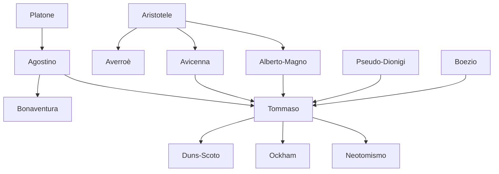

---
cssclasses:
  - Philosophy
subclasses:
  - Medieval-and-Renaissance-Philosophy
  - Metaphysics
  - Epistemology
related:
  - "[[Scholasticism]]"
  - "[[Aristotelianism]]"
  - "[[Natural Theology]]"
  - "[[Essence and Existence]]"
  - "[[Five Ways]]"
  - "[[Natural Law]]"
  - "[[Divine Attributes]]"
  - "[[Transcendentals]]"
  - "[[Faith and Reason]]"
  - "[[Analogy of Being]]"
  - "[[Neothomism]]"
  - "[[Summa Theologiae]]"
aliases:
  - five ways
  - essence existence
  - natural law
  - faith reason
  - analogy being
  - actus essendi
reference:
  - "[Abbagnano, N., & Fornero, G. (2012). La ricerca del pensiero. Vol. 1B. Dall'ellenismo alla scolastica. Paravia.](https://archive.org/download/ssp-s02-e09/The%20search%20for%20thought%20-%20Unit%207%20Chapter%202.pdf)"
tags:
  - Podcast
---

#### Podcast

<iframe src="https://archive.org/embed/ssp-s02-e09" width="100%" height="30" frameborder="0" webkitallowfullscreen="true" mozallowfullscreen="true" allowfullscreen></iframe>

---

#### Central Problem

The central problem of Thomistic philosophy is the systematic harmonization of Aristotelian philosophy with Christian revelation, specifically addressing the relationship between faith and reason (*fides et ratio*). While previous thinkers either subordinated philosophy to theology or maintained their incompatibility, [[Tommaso]] seeks to establish their legitimate autonomy and fruitful collaboration within a unified vision of truth.

The problem manifests in several dimensions: metaphysically, how can the Aristotelian conception of necessary, eternal forms be reconciled with the Christian doctrine of creation *ex nihilo*? Epistemologically, what is the proper scope of rational inquiry concerning divine truths, and where must faith supplement reason? Anthropologically, how can the Aristotelian conception of soul as form of the body be compatible with personal immortality and resurrection? Ethically, how do natural virtue and divine grace relate in achieving human flourishing and salvation?

[[Aquinas]] inherits from [[Alberto Magno]] the project of incorporating [[Aristotle]] into Christian thought, but realizes that mere piecemeal adaptation is insufficient. A radical reformation of the entire philosophical-theological system is required, one that neither reduces faith to reason (as the Averroists tended) nor abandons reason for authority (as anti-dialecticians urged).

#### Main Thesis

[[Tommaso]] establishes a comprehensive synthesis centered on the distinction between essence (*essentia*) and existence (*esse* or *actus essendi*), which constitutes the reforming principle allowing Aristotelianism to express Christian doctrines. His main theses include:

**The Harmony of Faith and Reason:** Reason and faith cannot contradict each other because both derive from God. Reason can: (1) demonstrate the "preambles of faith" (e.g., God's existence); (2) clarify revealed truths through analogies; (3) refute objections against faith. Faith serves as the rule for correct reasoning, but does not annul reason's autonomous domain.

**The Metaphysics of Participation:** In creatures, essence and existence are really distinct; existence is the act (*actus essendi*) by which essences, having being only potentially, actually exist. Only in God do essence and existence coincide—God *is* Being itself (*ipsum esse subsistens*). All finite beings receive their existence by participation in divine Being, establishing the metaphysical necessity of creation.

**The Five Ways:** God's existence, though self-evident in itself, requires *a posteriori* demonstration for humans. The five ways proceed from motion, efficient causality, contingency, degrees of perfection, and finality, each concluding to a transcendent cause: the unmoved mover, first cause, necessary being, perfect being, and intelligent orderer.

**Analogical Predication:** Terms applied to both God and creatures are neither univocal (identical) nor equivocal (entirely different), but analogical—partially similar and partially dissimilar. This safeguards divine transcendence while permitting meaningful theological discourse.

**The Transcendentals:** Being (*ens*) possesses universal properties that transcend the categories: *unum* (unity), *verum* (truth), *bonum* (goodness). Every being, insofar as it exists, is true (conformable to divine intellect) and good (desirable). This grounds Thomistic ontological optimism.

**Natural Law Theory:** There are four types of law: eternal law (God's rational governance of the universe), natural law (human participation in eternal law through reason), human law (particular applications of natural law), and divine positive law (revealed law directing humans to supernatural ends).

#### Historical Context

[[Tommaso]] (1225/26-1274) lived during the great flowering of [[Scholasticism]] when Aristotelian texts, transmitted through Arabic translations and commentaries, had revolutionized European universities. The full Aristotelian corpus—including the *Physics*, *Metaphysics*, and *De Anima*—arrived in Latin translation during the 12th-13th centuries, presenting both opportunity and crisis for Christian thought.

The Aristotelian worldview appeared to conflict with fundamental Christian doctrines: the eternity and necessity of the world contradicted creation; the identification of soul with bodily form seemed to preclude immortality; the thesis of a single universal intellect (as interpreted by [[Averroè]]) eliminated individual immortality. The faculty of arts at Paris witnessed the rise of Latin Averroism under [[Sigieri di Brabante]], teaching positions apparently incompatible with faith.

Ecclesiastical authorities responded with condemnations (1210, 1215, 1270, 1277), prohibiting the teaching of [[Aristotle]]'s natural philosophy. Meanwhile, the Franciscan school, led by [[Bonaventura]], defended the Augustinian-Platonic tradition against Aristotelian innovations, advocating divine illumination and the primacy of will over intellect.

Into this contested terrain came [[Tommaso]], a Dominican friar trained under [[Alberto Magno]] at Paris and Cologne. His project—continued throughout teaching positions at Paris, Rome, and Naples—was to demonstrate that authentic Aristotelianism, properly understood and reformed, could serve as the rational foundation for Christian theology. His two great *Summae* (the *Summa contra Gentiles* and the unfinished *Summa Theologiae*) represent the most comprehensive medieval synthesis of philosophy and theology.

#### Philosophical Lineage

#### Key Thinkers

| Thinker | Dates | Movement | Main Work | Core Concept |
|---------|-------|----------|-----------|--------------|
| [[Tommaso]] | 1225-1274 | [[Thomism]] | *Summa Theologiae* | Essence-existence distinction |
| [[Alberto Magno]] | 1193-1280 | [[Aristotelianism]] | *Commentaries on [[Aristotle]]* | Philosophy-theology distinction |
| [[Bonaventura]] | 1221-1274 | [[Augustinianism]] | *Itinerarium mentis in Deum* | Divine illumination |
| [[Avicenna]] | 980-1037 | [[Islamic Philosophy]] | *Book of Healing* | Necessary being |
| [[Averroè]] | 1126-1198 | [[Aristotelianism]] | *Commentaries on [[Aristotle]]* | Unity of intellect |
| [[Sigieri di Brabante]] | 1240-1284 | [[Averroism]] | *De anima intellectiva* | Double truth |

#### Key Concepts

| Concept | Definition | Related to |
|---------|------------|------------|
| Essence (*essentia*) | The quiddity or nature of a thing; what a thing is; responds to *quid est?* | [[Tommaso]], [[Metaphysics]] |
| Existence (*esse*, *actus essendi*) | The act by which essences actually exist; the actuality of all acts | [[Tommaso]], [[Metaphysics]] |
| Participation | The act by which creatures "take part" in being, receiving partially what belongs to God totally | [[Tommaso]], [[Neoplatonism]] |
| Analogy of being | Neither univocal nor equivocal predication; terms apply to God and creatures with partial similarity | [[Tommaso]], [[Metaphysics]] |
| Transcendentals | Properties belonging to every being as such: unity, truth, goodness | [[Tommaso]], [[Metaphysics]] |
| Five ways | Five *a posteriori* proofs of God's existence from motion, causality, contingency, perfection, finality | [[Tommaso]], [[Philosophy-of-Religion]] |
| Abstraction | Process by which intellect extracts universal forms from individual matter | [[Tommaso]], [[Epistemology]] |
| Adaequatio | Truth as correspondence of intellect and thing (*adaequatio intellectus et rei*) | [[Tommaso]], [[Epistemology]] |
| Natural law | Human participation in eternal law through reason; the rational creature's share in providence | [[Tommaso]], [[Ethics]] |
| Agere sequitur esse | "Action follows being"—ontological foundation of ethics; mode of action follows mode of being | [[Tommaso]], [[Ethics]] |

#### Authors Comparison

| Theme | [[Tommaso]] | [[Bonaventura]] | [[Averroè]] |
|-------|-------------|-----------------|-------------|
| Faith and reason | Harmony; distinct but cooperative | Faith illuminates reason | Philosophy autonomous from religion |
| Knowledge of God | Via negativa, causality, eminence | Divine illumination | Philosophical demonstration |
| Soul-body relation | Soul as form, yet subsistent | Soul as substance + form | Soul separated from individual |
| Intellect | Individual active intellect in each soul | Requires divine illumination | Single universal intellect |
| Eternity of world | Neither demonstrable nor refutable | Demonstrably false | Demonstrably true |
| Metaphysical framework | Reformed Aristotelianism | Augustinian Neoplatonism | Pure Aristotelianism |
| Greek philosophy | [[Aristotle]] as "the Philosopher" | [[Plato]] preferred | [[Aristotle]] as "the Philosopher" |

#### Influences & Connections

- **Predecessors:** [[Tommaso]] ← influenced by ← [[Aristotele]], [[Agostino]], [[Pseudo-Dionigi]], [[Boezio]], [[Avicenna]]
- **Contemporaries:** [[Tommaso]] ↔ friendship with ↔ [[Bonaventura]]; ↔ opposed ↔ [[Sigieri di Brabante]]
- **Contemporaries:** [[Tommaso]] ← trained by ← [[Alberto Magno]]
- **Followers:** [[Tommaso]] → influenced → [[Duns Scoto]], [[Ockham]], Counter-Reformation theology
- **Followers:** [[Tommaso]] → influenced → Neothomism ([[Maritain]], [[Gilson]])
- **Opposing views:** [[Tommaso]] ← criticized by ← Franciscan theologians, 1277 condemnations

#### Summary Formulas

- **[[Tommaso]]:** Essence and existence are really distinct in creatures but identical in God; all finite being participates in divine Being; faith and reason harmoniously cooperate, each in its proper domain.
- **[[Alberto Magno]]:** Philosophy must proceed by demonstration alone, distinct from theology which proceeds from revealed principles; [[Aristotle]] represents the perfection of human reason.
- **[[Bonaventura]]:** The mind's journey to God requires divine illumination at every stage; natural reason is insufficient without the light of faith; the soul is a spiritual substance, not merely form.
- **[[Averroè]]:** The world is eternal and necessary; the intellect (both agent and possible) is one for all humanity; philosophy expresses demonstratively what religion teaches symbolically.

#### Timeline

| Year | Event |
|------|-------|
| 1225/26 | [[Tommaso]] born at Roccasecca near Cassino |
| 1243 | Enters the Dominican Order at Naples |
| 1245-1252 | Studies under [[Alberto Magno]] at Paris and Cologne |
| 1254-1256 | Writes *De ente et essentia* at Paris |
| 1256-1259 | First Parisian regency as Master of Theology |
| 1259-1264 | Writes *Summa contra Gentiles* in Italy |
| 1265 | Begins *Summa Theologiae* |
| 1269-1272 | Second Parisian regency; writes against Averroists |
| 1270 | Bishop Tempier condemns 13 Averroist propositions at Paris |
| 1274 | [[Tommaso]] dies at Fossanova on way to Council of Lyons |
| 1277 | Bishop Tempier condemns 219 propositions, including some Thomistic ones |
| 1323 | [[Tommaso]] canonized by Pope John XXII |
| 1879 | Leo XIII's encyclical *Aeterni Patris* establishes Thomism as official Catholic philosophy |

#### Notable Quotes

> "Grace does not destroy nature, but perfects it." — [[Tommaso]]

> "Being is the actuality of all acts and the perfection of all perfections." — [[Tommaso]]

> "Truth is the adequation of thing and intellect." — [[Tommaso]], citing Isaac Ben Israeli

---
> [!warning]-
> This annotation was normalised using a large language model and may contain inaccuracies. These texts serve as preliminary study resources rather than exhaustive references.
