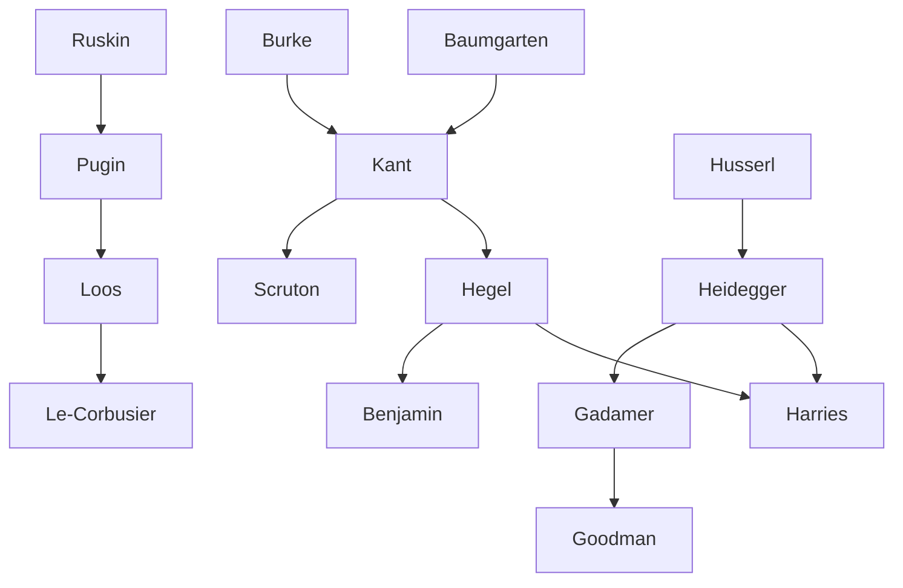

---

cssclasses:
  - Philosophy
  - Arts
subclasses:
  - Aesthetics
  - Phenomenology
  - Continental-Philosophy
related:
  - "[[Phenomenology]]"
  - "[[Kant]]"
  - "[[Hegel]]"
  - "[[Heidegger]]"
  - "[[Aesthetics]]"
  - "[[Architectural Theory]]"
aliases:
  - architecture phenomenology
  - architectural aesthetics
  - dependent beauty
  - free beauty
  - ethical function
  - ornament architecture
  - building meaning
  - kantian aesthetics
  - gothic architecture
  - functionalist theory
reference:
  - "Keane, J., & Selinger, E. (Eds.). (2014). Footprint: Architecture and Phenomenology. 3. https://doi.org/10.7480/FOOTPRINT.2.2. (pp. 1-5)"
tags:
  - Podcast
---

#### Podcast

<iframe allow="autoplay *; encrypted-media *; fullscreen *; clipboard-write" frameborder="0" height="150" style="width:100%;overflow:hidden;border-radius:10px;background:transparent;" sandbox="allow-forms allow-popups allow-same-origin allow-scripts allow-storage-access-by-user-activation allow-top-navigation-by-user-activation" src="https://embed.podcasts.apple.com/us/podcast/heidegger-space-and-the-public-realm/id1786764068?i=1000684949626&uo=4&l=en-GB&theme=auto"></iframe>

---

#### Central Problem

The text addresses a fundamental tension in the philosophy of architecture: how should architecture be understood in relation to philosophical aesthetics, and what constitutes the difference between mere building and architecture proper? This question unfolds through two historical "turns" that have shaped the discourse.

The first turn represents architecture's historical aversion to philosophical reflection—for most of its history, architecture operated independently of philosophy. Even after aesthetics emerged as a discipline with [[Baumgarten]]'s *Aesthetica* (1750/1758), architecture received only passing attention from philosophers like [[Burke]] and [[Kant]], who treated it superficially or cited buildings they had never visited.

The second turn involves the movement from practice into theory, where theoretical reflection emerged primarily from practitioners like [[Alberti]] and [[Palladio]] rather than philosophers. This generated persistent questions: What distinguishes architecture from building? Are there normative values attached to architecture?

The deeper problem concerns the Kantian inheritance and its consequences—particularly how [[Kant]]'s distinction between "free" and "dependent" beauty has affected functionalist and mimetic theories for an ethics of architecture. The text suggests this inheritance has been systematically misappropriated, distorting subsequent aesthetic debates and obscuring more fundamental phenomenological questions about meaning, world, and dwelling.

#### Main Thesis

The authors argue that the dominant approaches to architectural aesthetics—whether Kantian functionalism or its critics—have obscured more fundamental questions that phenomenology alone can properly address. The text advocates for a turn toward phenomenological inquiry that moves beyond the impasse between formalism and functionalism.

The key argumentative threads are:

**Critique of the Kantian Framework:** Following [[Kirwan]]'s analysis, the text contends that [[Kant]]'s original distinction between "free beauty" (pure aesthetic pleasure independent of concepts) and "dependent beauty" (beauty presupposing a concept of what the object should be) has been catastrophically misappropriated. Architecture, as "dependent beauty" for Kant, became trapped in debates about function versus ornament that miss the deeper aesthetic experience.

**The Ornament Debate as Symptomatic:** The fierce rejection of ornament by [[Loos]] and [[Le Corbusier]], and [[Harries]]'s contemporary critique of the "decorated shed," represent responses to a problem badly framed. [[Harries]] provocatively suggests that "theory" in architecture now functions as the new "ornament"—an added embellishment rather than essential understanding.

**Beyond Functionalism and Formalism:** Neither the Kantian functionalist interpretation (represented by [[Scruton]] and [[Watkin]]) nor the Hegelian-Heideggerian alternative (represented by [[Harries]]) fully escapes the limitations of the aesthetic approach that understands architecture as "a functional building with an added aesthetic component."

**The Phenomenological Turn:** The text points toward phenomenology as offering a more adequate framework. The question of meaning and symbolisation (following [[Goodman]]) requires reconsidering experience itself—how manifestation occurs, how truth becomes visible in expression. Phenomenology asks not about variables or psychological effects but about "access to the realm of beings within the environmentality of world."

#### Historical Context

The text situates the philosophy of architecture within the broader development of aesthetics as a philosophical discipline from the eighteenth century onward.

The emergence of aesthetics with [[Baumgarten]] (1750/1758) initially gave architecture marginal attention. [[Burke]]'s *Enquiry* (1757) addressed architecture only to ridicule Vitruvian body/building analogies and consider scale and the sublime. [[Kant]]'s third *Critique* (1790) treated architecture in passing, using buildings like St. Peter's in Rome—which he never visited—merely as examples of magnificence and the sublime. Only [[Hegel]]'s *Lectures on Aesthetics* (1835-8) attempted a fuller treatment.

The nineteenth century witnessed the Neo-Gothic revival, championed by [[Pugin]] and [[Ruskin]], which venerated Gothic architecture as manifesting "a marriage of the material and the metaphysical"—a "built theology" where material was adequate to ideal. [[Ruskin]]'s *Lectures on Architecture* (1853) positioned ornament as "the principal part of architecture."

The Modernist reaction emerged forcefully with [[Loos]]'s polemic *Ornament und Verbrechen* (1908), which characterized ornament as "degenerate, diseased," a deceit requiring cultural transcendence. [[Karl Kraus]] captured this as the difference between "an urn and a chamber pot." The Bauhaus developed a formalist concern where "design is the a priori of architecture."

Post-modernism, emerging as a stylistic category within architectural discourse, represented what the text calls "a savage parody of the concerns of the neo-Gothic," where ornamentation surrenders to "the flatness of surface visualisation" and methods of montage, following [[Benjamin]]'s archaeological-filmic approach.

#### Philosophical Lineage

#### Key Thinkers

| Thinker | Dates | Movement | Main Work | Core Concept |
|---------|-------|----------|-----------|--------------|
| [[Kant]] | 1724-1804 | [[German Idealism]] | *Critique of the Power of Judgement* | Free vs. dependent beauty |
| [[Hegel]] | 1770-1831 | [[German Idealism]] | *Lectures on Aesthetics* | Art as embodiment of Spirit |
| [[Ruskin]] | 1819-1900 | [[Neo-Gothic]] | *Lectures on Architecture* | Ornament as principal |
| [[Loos]] | 1870-1933 | [[Modernism]] | *Ornament und Verbrechen* | Ornament as crime |
| [[Harries]] | 1937- | [[Phenomenology]] | *The Ethical Function of Architecture* | Ethics beyond decoration |
| [[Scruton]] | 1944-2020 | [[Analytic Philosophy]] | *The Aesthetics of Architecture* | Kantian functionalism |

#### Key Concepts

| Concept | Definition | Related to |
|---------|------------|------------|
| Free beauty | Pure aesthetic pleasure presupposing no concept of what the object should be; pleasure attendant on mere reflection on a given intuition | [[Kant]], [[Aesthetics]] |
| Dependent beauty | Beauty presupposing a concept of the end of what the thing should be; "adherent beauty" tied to perfection and function | [[Kant]], [[Architecture]] |
| Decorated shed | Architecture understood as functional building with an added aesthetic component; the target of [[Harries]]'s critique | [[Harries]], [[Functionalism]] |
| Sensus communis | Common sense grounding aesthetic judgments; allows subjective pleasure to claim universal validity | [[Kant]], [[Aesthetics]] |
| Environmentality | The worldly context within which beings are encountered; phenomenological alternative to empiricist variables | [[Heidegger]], [[Phenomenology]] |
| Genius | Inborn predisposition through which nature gives rules to art; produces original works that serve as exemplary models | [[Kant]], [[Aesthetics]] |

#### Authors Comparison

| Theme | [[Kant]] | [[Harries]] | [[Loos]] |
|-------|----------|-------------|----------|
| Central question | What is the aesthetic judgment? | What is architecture's ethical function? | How does ornament deceive? |
| Architecture's status | Dependent beauty; functional with aesthetic component | Must transcend decorated shed | Truth as nudity; form as grace |
| Ornament | Compatible with beauty but secondary | Theory as new ornament | Crime; sign of degeneration |
| Normative basis | Purposiveness without purpose | Ethical dwelling | Cultural evolution |
| Method | Transcendental analysis | Hegelian-Heideggerian critique | Polemical manifesto |

#### Influences & Connections

- **Predecessors:** [[Harries]] ← influenced by ← [[Hegel]], [[Heidegger]], [[Gadamer]]
- **Contemporaries:** [[Scruton]] ↔ debate with ↔ [[Harries]] on functionalism vs. ethics
- **Followers:** [[Goodman]] → influenced → meaning and symbolisation in architecture
- **Opposing views:** [[Ruskin]] ← criticized by ← [[Loos]], [[Harries]]
- **Parallel developments:** [[Benjamin]] ↔ related to ↔ post-modern montage aesthetics

#### Summary Formulas

- **[[Kant]]:** Architecture exhibits dependent beauty—beauty compatible with function but presupposing a concept of the object's end; aesthetic judgment in architecture unifies taste with reason.
- **[[Harries]]:** Architecture must transcend the "decorated shed" through recovering its ethical function; theory has become the new ornament obscuring authentic dwelling.
- **[[Loos]]:** Ornament is crime—the evolution of culture is identical with the removal of ornament from objects of utility; modern architecture exhibits truth as nudity.
- **Phenomenological turn:** The question of architectural meaning requires moving beyond empiricist psychology toward phenomenology's question of access to beings within the environmentality of world.

#### Timeline

| Year | Event |
|------|-------|
| 1750 | [[Baumgarten]] publishes *Aesthetica*, establishing aesthetics as discipline |
| 1757 | [[Burke]] publishes *A Philosophical Enquiry into the Sublime and Beautiful* |
| 1790 | [[Kant]] publishes *Critique of the Power of Judgement* |
| 1835-8 | [[Hegel]]'s *Lectures on Aesthetics* first published by Hotho |
| 1853 | [[Ruskin]] delivers *Lectures on Architecture* |
| 1908 | [[Loos]] publishes *Ornament und Verbrechen* |
| 1949 | [[Wittkower]] publishes *Architectural Principles in the Age of Humanism* |
| 1979 | [[Scruton]] publishes *The Aesthetics of Architecture* |
| 1990 | [[Venturi]] publishes *Complexity and Contradiction in Architecture* (2nd ed.) |
| 1997 | [[Harries]] publishes *The Ethical Function of Architecture* |

#### Notable Quotes

> "As long as architectural theory remains ruled by the aesthetic approach, it has to understand architecture as Kant did, as a functional building with an added aesthetic component, that is a decorated shed." — [[Harries]]

> "The turn to experience cannot result in a science of the sensible, because it does not ask the more adequate and guiding question of phenomenology, which is that of access to the realm of beings within the environmentality of world." — [[OByrne]]

---
> [!warning]-
> This annotation was normalised using a large language model and may contain inaccuracies. These texts serve as preliminary study resources rather than exhaustive references.
