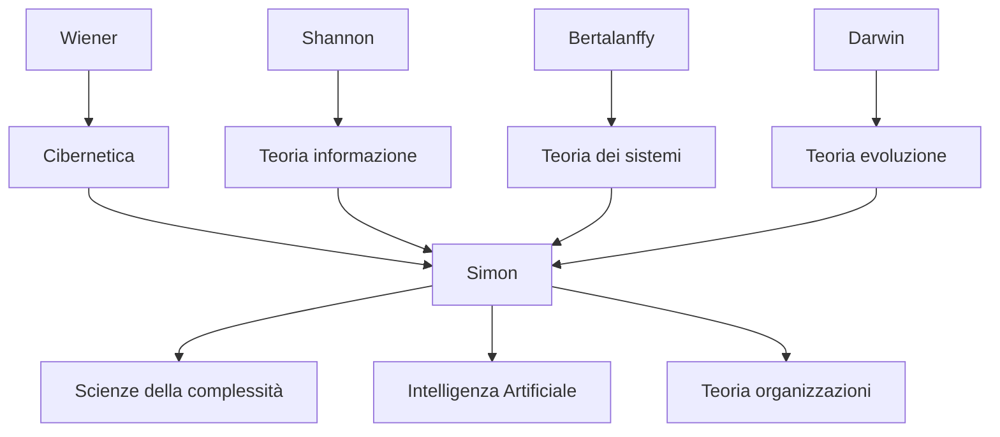

---

cssclasses:
  - Philosophy
subclasses:
  - Epistemology
  - Philosophy-of-Science
  - 20th-Century-Philosophy
related:
  - "[[Complexity Theory]]"
  - "[[Systems Theory]]"
  - "[[Hierarchy]]"
  - "[[Evolution]]"
  - "[[Problem Solving]]"
  - "[[Cybernetics]]"
  - "[[Simon]]"
  - "[[Revisiting Herbert Simon's Science of Design]]"
  - "[[Cybernetic Explanation]]"
aliases:
  - architecture complexity
  - simon hierarchy
  - near decomposability
  - watchmaker parable
  - hierarchic systems
  - complex systems
  - hora tempus
  - simon 1962
reference:
  - Simon, H. A. (1991). The Architecture of Complexity. In G. J. Klir, Facets of Systems Science (pp. 457–476). Springer. https://doi.org/10.1007/978-1-4899-0718-9_31
tags:
  - Podcast
---

#### Podcast

<iframe allow="autoplay *; encrypted-media *; fullscreen *; clipboard-write" frameborder="0" height="150" style="width:100%;overflow:hidden;border-radius:10px;background:transparent;" sandbox="allow-forms allow-popups allow-same-origin allow-scripts allow-storage-access-by-user-activation allow-top-navigation-by-user-activation" src="https://embed.podcasts.apple.com/us/podcast/the-architecture-of-complexity/id1786764068?i=1000681225288&uo=4&l=en-GB&theme=auto"></iframe>

---

#### Central Problem

[[Simon]] addresses the fundamental problem of **complexity**: how can complex systems exist? How can they evolve from simplicity? And how can we understand and describe them? The paradox is that the random evolution of complex systems seems statistically impossible given the available time — yet such systems exist.

The answer lies in **hierarchical structure**: complex systems do not assemble all at once but through **stable intermediate subsystems**. This hierarchical architecture not only explains the evolution of complexity but also determines the dynamic properties of systems and the very possibility of their description and comprehension.

The problem has implications spanning biology, physics, social sciences, organization theory, and artificial intelligence — all fields to which Simon contributed decisively.

#### Main Thesis

[[Simon]]'s central thesis is that **hierarchy is the architecture of complexity**. Complex systems are almost universally hierarchical because hierarchical structure is the only one that can evolve in reasonable time and can be understood by finite minds.

**The Parable of the Watchmakers (Hora and Tempus):** Two watchmakers build watches of 1000 parts. Tempus assembles each watch as a single unit: if interrupted, he loses all his work. Hora builds stable subassemblies of 10 parts, then assembles them into groups of 10, then these into the final watch. With random interruptions (p=0.01), Hora is about 4000 times more productive than Tempus. The principle: **stable intermediate forms exponentially accelerate evolution**.

**Near Decomposability:** Hierarchical systems have a crucial property: *intra*-component interactions are much stronger than *inter*-component interactions. This means that:
- In the short run, each subsystem behaves almost independently of the others
- In the long run, subsystems interact only in an aggregate manner

The house example: rooms divided into cubicles, walls with different insulating capacity. Temperature equilibrates first *within* each room, then *between* rooms.

**Describing Complexity:** Hierarchical structure makes possible the *economical description* of complex systems. System redundancy can be captured recursively. The world is "nearly empty" — most things interact weakly with most other things.

#### Historical Context

The essay was presented in 1962 to the American Philosophical Society, at a crucial moment for complexity science. [[Simon]] — Nobel Prize winner in economics (1978) and pioneer of artificial intelligence — was developing a unified theory connecting his work on bounded rationality, organization theory, and problem solving.

The intellectual context includes: [[Wiener]]'s cybernetics, [[Bertalanffy]]'s general systems theory, [[Shannon]]'s information theory, and early artificial intelligence research at Carnegie Institute of Technology. Simon sought common principles that would cut across these disciplines.

The essay also implicitly responds to [[Jacobson]]'s speculations about the thermodynamic improbability of biological evolution, showing how hierarchy resolves the temporal paradox.

#### Philosophical Lineage

#### Key Thinkers

| Thinker | Dates | Movement | Main Work | Core Concept |
|---------|-------|----------|-----------|--------------|
| [[Simon]] | 1916-2001 | [[Cognitive Science]] | *The Architecture of Complexity* | Hierarchy, near decomposability |
| [[Wiener]] | 1894-1964 | [[Cybernetics]] | *Cybernetics* | Feedback, control |
| [[Bertalanffy]] | 1901-1972 | [[Systems Theory]] | *General System Theory* | Open systems, equifinality |
| [[Shannon]] | 1916-2001 | [[Information Theory]] | *Mathematical Theory of Communication* | Entropy, information |
| [[Darwin]] | 1809-1882 | [[Evolutionary Biology]] | *Origin of Species* | Natural selection |

#### Key Concepts

| Concept | Definition | Related to |
|---------|------------|------------|
| Hierarchy | System composed of interrelated subsystems, each in turn hierarchic down to the elementary level | [[Simon]], [[Systems Theory]] |
| Near Decomposability | Property whereby intra-component interactions are much stronger than inter-component interactions | [[Simon]], [[Complexity]] |
| Stable Intermediate Forms | Subassemblies that persist long enough to serve as building blocks for more complex assemblies | [[Simon]], [[Evolution]] |
| State Description | Description of a system in terms of its static properties (blueprint) | [[Simon]], [[Epistemology]] |
| Process Description | Description of a system as a sequence of operations that generate it (recipe) | [[Simon]], [[Epistemology]] |
| Span | Number of immediate subsystems in a hierarchic system | [[Simon]], [[Organization]] |

#### Authors Comparison

| Theme | [[Simon]] | [[von Bertalanffy]] | [[Wiener]] |
|-------|-----------|---------------------|------------|
| Central focus | Architecture of complexity | General properties of systems | Control and communication |
| Key principle | Hierarchy and decomposability | Equifinality, open systems | Negative feedback |
| Approach | Analytical-empirical | Theoretical-general | Mathematical-engineering |
| Evolution | Central (stable forms) | Secondary | Marginal |
| Applications | Organizations, AI, biology | Biology, sociology | Engineering, neuroscience |

#### Influences & Connections

- **Predecessors:** [[Simon]] ← influenced by ← [[Wiener]] (cybernetics), [[Shannon]] (information), [[Darwin]] (evolution)
- **Contemporaries:** [[Simon]] ↔ dialogue with ↔ [[Newell]] (AI), [[March]] (organizations)
- **Followers:** [[Simon]] → influences → [[Complexity Science]], [[Santa Fe Institute]], [[Design Science]]
- **Opposing views:** [[Simon]] ← implicit critique of ← [[Jacobson]] (improbability of evolution), naive reductionism

#### Summary Formulas

- **[[Simon]]:** Complex systems are almost universally hierarchical because hierarchy is the only architecture that can evolve in reasonable time and can be understood by finite minds.
- **Parable of Hora and Tempus:** The presence of stable intermediate forms reduces evolution time from exponential to logarithmic in the number of elements.
- **Near Decomposability:** High-frequency dynamics (internal to components) + low-frequency dynamics (between components) = comprehensibility and economical description.
- **Redundancy:** Simple description of complexity is possible because hierarchical systems are highly redundant — few types of subsystems in various combinations.

#### Timeline

| Year | Event |
|------|-------|
| 1948 | [[Wiener]] pubblica *Cybernetics* |
| 1955 | [[Jacobson]] stima tempo evoluzione (troppo lungo senza gerarchia) |
| 1956 | Simon, Newell, Shaw creano Logic Theorist (prima IA) |
| 1957 | Simon lavora su organizzazioni e razionalità limitata |
| 1962 | [[Simon]] presenta "The Architecture of Complexity" |
| 1969 | [[Simon]] pubblica *The Sciences of the Artificial* |
| 1978 | [[Simon]] riceve Nobel per economia (razionalità limitata) |

#### Notable Quotes

> "Among possible complex forms, hierarchies are the ones that have the time to evolve." — [[Simon]]

> "In a nearly decomposable system, the short-run behavior of each of the component subsystems is approximately independent of the short-run behavior of the other components." — [[Simon]]

> "If there are important systems in the world that are complex without being hierarchic, they may to a considerable extent escape our observation and our understanding." — [[Simon]]

---
> [!warning]-
> This annotation was normalised using a large language model and may contain inaccuracies. These texts serve as preliminary study resources rather than exhaustive references.
