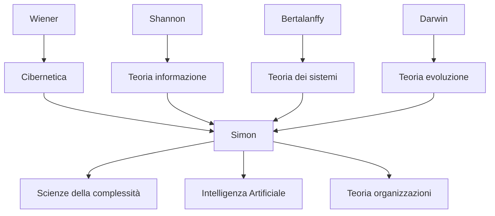

---
cssclasses:
  - Philosophy
subclasses:
  - Epistemology
  - Philosophy-of-Science
  - 20th-Century-Philosophy
related:
  - "[[Complexity Theory]]"
  - "[[Systems Theory]]"
  - "[[Hierarchy]]"
  - "[[Evolution]]"
  - "[[Problem Solving]]"
  - "[[Cybernetics]]"
aliases:
  - architecture complexity
  - simon hierarchy
  - near decomposability
  - watchmaker parable
  - hierarchic systems
  - complex systems
  - hora tempus
  - simon 1962
  - sistemi complessi
  - sistemi gerarchici
reference:
  - Simon, H. A. (1991). The Architecture of Complexity. In G. J. Klir, Facets of Systems Science (pp. 457–476). Springer. https://doi.org/10.1007/978-1-4899-0718-9_31
---

#### Central Problem

[[Simon]] affronta il problema fondamentale della **complessità**: come possono esistere sistemi complessi? Come possono evolversi dalla semplicità? E come possiamo comprenderli e descriverli? Il paradosso è che l'evoluzione casuale di sistemi complessi sembra statisticamente impossibile dato il tempo disponibile — eppure tali sistemi esistono.

La risposta risiede nella **struttura gerarchica**: i sistemi complessi non si assemblano in un sol colpo ma attraverso **sottosistemi stabili intermedi**. Questa architettura gerarchica non solo spiega l'evoluzione della complessità, ma determina anche le proprietà dinamiche dei sistemi e la possibilità stessa della loro descrizione e comprensione.

Il problema ha implicazioni che attraversano biologia, fisica, scienze sociali, teoria dell'organizzazione e intelligenza artificiale — tutti ambiti in cui Simon ha contribuito in modo decisivo.

#### Main Thesis

La tesi centrale di [[Simon]] è che **la gerarchia è l'architettura della complessità**. I sistemi complessi sono quasi universalmente gerarchici perché la struttura gerarchica è l'unica che può evolversi in tempi ragionevoli e può essere compresa da menti finite.

**La Parabola degli Orologiai (Hora e Tempus):** Due orologiai costruiscono orologi di 1000 pezzi. Tempus assembla ogni orologio in un unico blocco: se interrotto, perde tutto il lavoro. Hora costruisce sottogruppi stabili di 10 pezzi, poi li assembla in gruppi di 10, poi questi in l'orologio finale. Con interruzioni casuali (p=0.01), Hora è circa 4000 volte più produttivo di Tempus. Il principio: **le forme stabili intermedie accelerano esponenzialmente l'evoluzione**.

**Near Decomposability (Quasi-Decomponibilità):** I sistemi gerarchici hanno una proprietà cruciale: le interazioni *intra*-componente sono molto più forti delle interazioni *inter*-componente. Questo significa che:
- Nel breve periodo, ogni sottosistema si comporta quasi indipendentemente dagli altri
- Nel lungo periodo, i sottosistemi interagiscono solo in modo aggregato

L'esempio della casa: stanze divise in cubicoli, pareti con diversa capacità isolante. La temperatura si equilibra prima *dentro* ogni stanza, poi *tra* le stanze.

**Descrizione della Complessità:** La struttura gerarchica rende possibile la *descrizione economica* dei sistemi complessi. La ridondanza del sistema può essere catturata ricorsivamente. Il mondo è "quasi vuoto" — la maggior parte delle cose interagisce debolmente con la maggior parte delle altre.

#### Historical Context

Il saggio fu presentato nel 1962 alla American Philosophical Society, in un momento cruciale per le scienze della complessità. [[Simon]] — premio Nobel per l'economia (1978) e pioniere dell'intelligenza artificiale — stava sviluppando una teoria unificata che connettesse i suoi lavori su razionalità limitata, teoria dell'organizzazione, e problem solving.

Il contesto intellettuale include: la cibernetica di [[Wiener]], la teoria generale dei sistemi di [[Bertalanffy]], la teoria dell'informazione di [[Shannon]], e le prime ricerche in intelligenza artificiale al Carnegie Institute of Technology. Simon cercava principi comuni che attraversassero queste discipline.

Il saggio risponde implicitamente anche alle speculazioni di [[Jacobson]] sulla improbabilità termodinamica dell'evoluzione biologica, mostrando come la gerarchia risolva il paradosso temporale.

#### Philosophical Lineage

#### Key Thinkers

| Thinker | Dates | Movement | Main Work | Core Concept |
|---------|-------|----------|-----------|--------------|
| [[Simon]] | 1916-2001 | [[Scienze Cognitive]] | *The Architecture of Complexity* | Gerarchia, near decomposability |
| [[Wiener]] | 1894-1964 | [[Cibernetica]] | *Cybernetics* | Feedback, controllo |
| [[Bertalanffy]] | 1901-1972 | [[Teoria dei Sistemi]] | *General System Theory* | Sistemi aperti, equifinalità |
| [[Shannon]] | 1916-2001 | [[Teoria dell'Informazione]] | *Mathematical Theory of Communication* | Entropia, informazione |
| [[Darwin]] | 1809-1882 | [[Biologia Evolutiva]] | *Origin of Species* | Selezione naturale |

#### Key Concepts

| Concept | Definition | Related to |
|---------|------------|------------|
| Gerarchia | Sistema composto di sottosistemi interrelati, ciascuno a sua volta gerarchico fino al livello elementare | [[Simon]], [[Teoria dei Sistemi]] |
| Near Decomposability | Proprietà per cui le interazioni intra-componente sono molto più forti di quelle inter-componente | [[Simon]], [[Complessità]] |
| Forme Stabili Intermedie | Sottogruppi che persistono abbastanza da servire come blocchi per assemblaggi più complessi | [[Simon]], [[Evoluzione]] |
| State Description | Descrizione di un sistema in termini delle sue proprietà statiche (blueprint) | [[Simon]], [[Epistemologia]] |
| Process Description | Descrizione di un sistema come sequenza di operazioni che lo generano (ricetta) | [[Simon]], [[Epistemologia]] |
| Span | Numero di sottosistemi immediati in un sistema gerarchico | [[Simon]], [[Organizzazione]] |

#### Authors Comparison

| Theme | [[Simon]] | [[von Bertalanffy]] | [[Wiener]] |
|-------|-----------|---------------------|------------|
| Focus centrale | Architettura della complessità | Proprietà generali dei sistemi | Controllo e comunicazione |
| Principio chiave | Gerarchia e decomponibilità | Equifinalità, sistemi aperti | Feedback negativo |
| Approccio | Analitico-empirico | Teorico-generale | Matematico-ingegneristico |
| Evoluzione | Centrale (forme stabili) | Secondaria | Marginale |
| Applicazioni | Organizzazioni, IA, biologia | Biologia, sociologia | Ingegneria, neuroscienza |

#### Influences & Connections

- **Predecessors:** [[Simon]] ← influenzato da ← [[Wiener]] (cibernetica), [[Shannon]] (informazione), [[Darwin]] (evoluzione)
- **Contemporaries:** [[Simon]] ↔ dialogo con ↔ [[Newell]] (IA), [[March]] (organizzazioni)
- **Followers:** [[Simon]] → influenza → [[Scienze della Complessità]], [[Santa Fe Institute]], [[Design Science]]
- **Opposing views:** [[Simon]] ← critica implicita a ← [[Jacobson]] (improbabilità evoluzione), riduzionismo ingenuo

#### Summary Formulas

- **[[Simon]]:** I sistemi complessi sono quasi universalmente gerarchici perché la gerarchia è l'unica architettura che può evolversi in tempi ragionevoli e può essere compresa da menti finite.
- **Parabola di Hora e Tempus:** La presenza di forme stabili intermedie riduce il tempo di evoluzione da esponenziale a logaritmico nel numero di elementi.
- **Near Decomposability:** Dinamica ad alta frequenza (interna ai componenti) + dinamica a bassa frequenza (tra componenti) = comprensibilità e descrizione economica.
- **Ridondanza:** La descrizione semplice della complessità è possibile perché i sistemi gerarchici sono altamente ridondanti — pochi tipi di sottosistemi in varie combinazioni.

#### Timeline

| Year | Event |
|------|-------|
| 1948 | [[Wiener]] pubblica *Cybernetics* |
| 1955 | [[Jacobson]] stima tempo evoluzione (troppo lungo senza gerarchia) |
| 1956 | Simon, Newell, Shaw creano Logic Theorist (prima IA) |
| 1957 | Simon lavora su organizzazioni e razionalità limitata |
| 1962 | [[Simon]] presenta "The Architecture of Complexity" |
| 1969 | [[Simon]] pubblica *The Sciences of the Artificial* |
| 1978 | [[Simon]] riceve Nobel per economia (razionalità limitata) |

#### Notable Quotes

> "Among possible complex forms, hierarchies are the ones that have the time to evolve." — [[Simon]]

> "In a nearly decomposable system, the short-run behavior of each of the component subsystems is approximately independent of the short-run behavior of the other components." — [[Simon]]

> "If there are important systems in the world that are complex without being hierarchic, they may to a considerable extent escape our observation and our understanding." — [[Simon]]

---
> [!warning]-
> This annotation was normalised using a large language model and may contain inaccuracies. These texts serve as preliminary study resources rather than exhaustive references.
