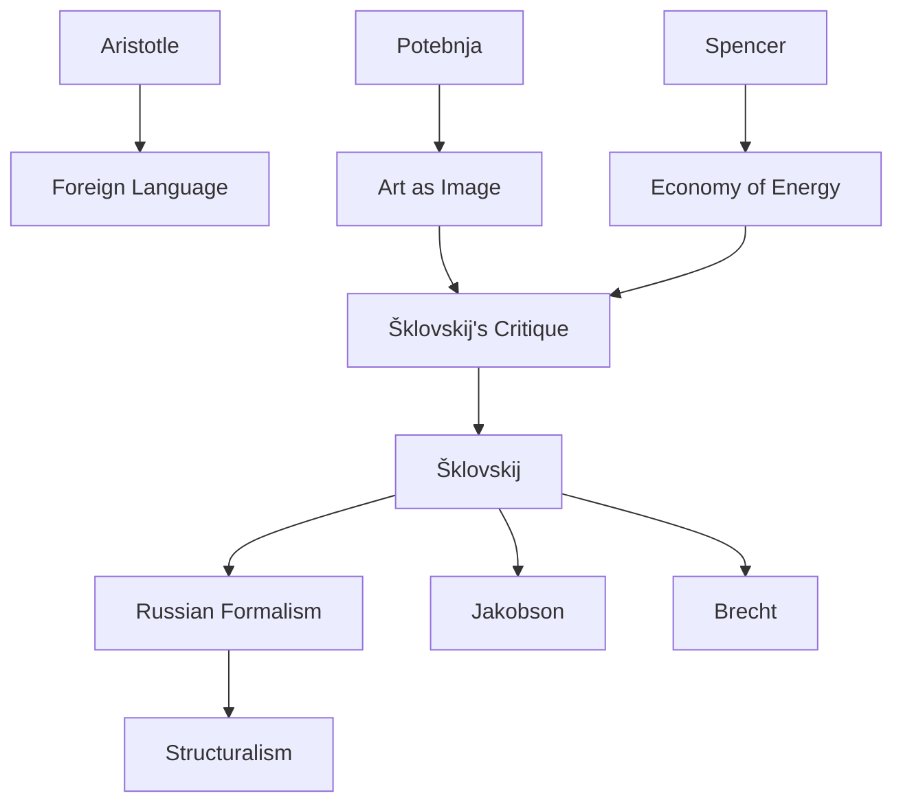

---
cssclasses:
  - Philosophy
subclasses:
  - Aesthetics
  - Phenomenology
  - 20th-Century-Philosophy
related:
  - "[[Russian Formalism]]"
  - "[[Defamiliarization]]"
  - "[[Phenomenology]]"
  - "[[Aesthetics]]"
  - "[[Literary Theory]]"
  - "[[Perception]]"
aliases:
  - art as technique
  - art technique
  - ostranenie effect
  - defamiliarization art
  - defamiliarization theory
  - shklovskij 1917
  - russian formalism
  - automatic perception
  - poetic language
  - vision recognition
reference:
  - Shklovskiĭ, V. (1990). L’arte come procedimento. In Theory of prose. https://doi.org/10.1400/86251
---

#### Central Problem

[[Šklovskij]] addresses the fundamental question of the essence of art and poetry: what makes something "artistic"? Against the dominant theory of [[Potebnja]] — according to which "art is thought realized through images" and the function of the image is to economize mental energy — Šklovskij proposes a radically opposite theory.

The central problem is the **automatization of perception**: in everyday life, actions and objects become mechanical, perceived through "recognition" rather than "vision". Life itself "vanishes into nothingness" when it passes unconsciously. Art exists precisely to counter this process, to **restore the sensation of life**, to make "the stone stony".

The theory of economy of energy (Spencer, Avenarius) may hold for practical language, but is fundamentally wrong when applied to poetic language, which operates according to completely different laws.

#### Main Thesis

[[Šklovskij]]'s central thesis is that the **purpose of art is defamiliarization** (*ostranenie*): making objects "strange", difficult, in order to prolong and intensify perception. Art serves not to simplify but to complicate, not to economize energy but to expend it.

**Defamiliarization (*Ostranenie*):** The fundamental device of art consists in "removing the object from the automatism of perception". Not calling the object by its name, describing it as if seen for the first time, using unusual designations. The result is **vision** rather than **recognition**.

**Poetic Language vs. Practical Language:** Poetic language must have a "foreign and surprising" character (Aristotle). It is a language "impeded, tortuous, difficult" — the opposite of economy. Prose is customary, economical, regular language; poetry is the deliberate construction of difficulty.

**Poetic Image vs. Prosaic Image:** The prosaic image is a means of abstraction (saying "watermelon" for "ball" abstracts a quality); the poetic image is a means to **intensify the impression**, to create heightened perception.

**Artistic Rhythm:** Poetic rhythm also does not follow the law of economy. Prosaic rhythm automatizes (marching in time is easier); artistic rhythm consists in the **violation of expected rhythm**, creating unpredictability that prevents automatization.

#### Historical Context

The essay was written in 1917, a crucial moment for [[Russian Formalism]]. Šklovskij and his colleagues at OPOJAZ (Society for the Study of Poetic Language) — including [[Jakobson]], [[Ejchenbaum]], [[Tynjanov]] — were developing a new approach to literature that rejected both biographism and sociologism.

The main polemical target is [[Potebnja]] and his school, which had dominated Russian literary theory with the formula "art = thought through images = economy of energy". This theory had been adopted by the Symbolists (Andrej Belyj, Merežkovskij) but, according to Šklovskij, fundamentally confused poetic and practical language.

The context also includes [[Jakubinskij]]'s discoveries about the difference between the phonetics of poetic and practical language — early empirical evidence of the "non-coincidence of the two languages". The essay is part of a methodological revolution seeking the "internal laws" of literature.

#### Philosophical Lineage

#### Key Thinkers

| Thinker | Dates | Movement | Main Work | Core Concept |
|---------|-------|----------|-----------|--------------|
| [[Šklovskij]] | 1893-1984 | [[Russian Formalism]] | *Art as Technique* | Defamiliarization, impeded language |
| [[Potebnja]] | 1835-1891 | [[Linguistics]] | *Notes on the Theory of Literature* | Art as thought through images |
| [[Jakobson]] | 1896-1982 | [[Russian Formalism]] | *Fundamentals of Language* | Poetic function, metaphor/metonymy |
| [[Tolstoj]] | 1828-1910 | [[Russian Literature]] | *Cholstomer*, *War and Peace* | Master of defamiliarization |
| [[Spencer]] | 1820-1903 | [[Positivism]] | *Philosophy of Style* | Economy of mental energy |

#### Key Concepts

| Concept | Definition | Related to |
|---------|------------|------------|
| Defamiliarization (*Ostranenie*) | Device that makes the object "strange" to remove it from perceptual automatism | [[Šklovskij]], [[Russian Formalism]] |
| Automatization | Process by which repeated perceptions become mechanical and unconscious | [[Perception]], [[Phenomenology]] |
| Vision vs. Recognition | Seeing the object in its fullness vs. identifying it by few traits | [[Šklovskij]], [[Aesthetics]] |
| Impeded language | Poetic language that is "difficult, tortuous" and slows perception | [[Poetics]], [[Linguistics]] |
| Poetic image | Means to intensify the impression, not to abstract | [[Šklovskij]], [[Rhetoric]] |
| Device (*Priëm*) | Identifiable and analyzable artistic technique | [[Russian Formalism]], [[Narratology]] |

#### Authors Comparison

| Theme | [[Šklovskij]] | [[Potebnja]] | [[Tolstoj]] |
|-------|---------------|--------------|-------------|
| Function of art | Restore sensation of life | Economize mental energy | Touch moral conscience |
| Image | Means of intensification | Means of simplification | Instrument of truth |
| Perception | Must be prolonged, difficult | Must be facilitated | Must be renewed |
| Poetic language | Impeded, foreign | Economical, familiar | Simple but defamiliarizing |

#### Influences & Connections

- **Predecessors:** [[Šklovskij]] ← critiques ← [[Potebnja]], [[Spencer]] (economy of energy); ← uses examples from ← [[Tolstoj]], [[Gogol]]
- **Contemporaries:** [[Šklovskij]] ↔ collaborates with ↔ [[Jakobson]], [[Ejchenbaum]], [[Tynjanov]] (OPOJAZ)
- **Followers:** [[Šklovskij]] → influences → [[Brecht]] (Verfremdungseffekt), [[Structuralism]], [[Narratology]]
- **Opposing views:** [[Šklovskij]] ← criticized by ← [[Orthodox Marxism]], [[Sociology of Literature]]

#### Summary Formulas

- **[[Šklovskij]]:** Art exists to restore the sensation of life through defamiliarization — making difficult what is automatic, making seen what is merely recognized.
- **[[Potebnja]]:** Art is thought through images that economizes mental energy by bringing the unknown closer to the known — a theory rejected by Šklovskij as confusion between practical and poetic language.
- **[[Tolstoj]]:** Master of defamiliarization: describes flogging, property, theater, war as if seen for the first time, tearing them from automatism.

#### Timeline

| Year | Event |
|------|-------|
| 1835-1891 | [[Potebnja]] develops theory of art as thought through images |
| 1914 | [[Šklovskij]] publishes *The Resurrection of the Word* |
| 1916 | Founding of OPOJAZ in Saint Petersburg |
| 1917 | [[Šklovskij]] publishes "Art as Technique" |
| 1925 | [[Šklovskij]] publishes *Theory of Prose* |
| 1936 | [[Brecht]] develops Verfremdungseffekt, influenced by the Russian concept |

#### Notable Quotes

> "And so life vanishes into nothingness. Automatization eats away at things, at clothes, at furniture, at our wives, and at our fear of war." — [[Šklovskij]]

> "The purpose of art is to impart the sensation of things as they are perceived and not as they are known; the technique of art is to make objects 'unfamiliar', to make forms difficult." — [[Šklovskij]]

> "Poetic language is a language of construction. Prose is ordinary language: economical, regular, easy." — [[Šklovskij]]

---
> [!warning]-
> This annotation was normalised using a large language model and may contain inaccuracies. These texts serve as preliminary study resources rather than exhaustive references.
