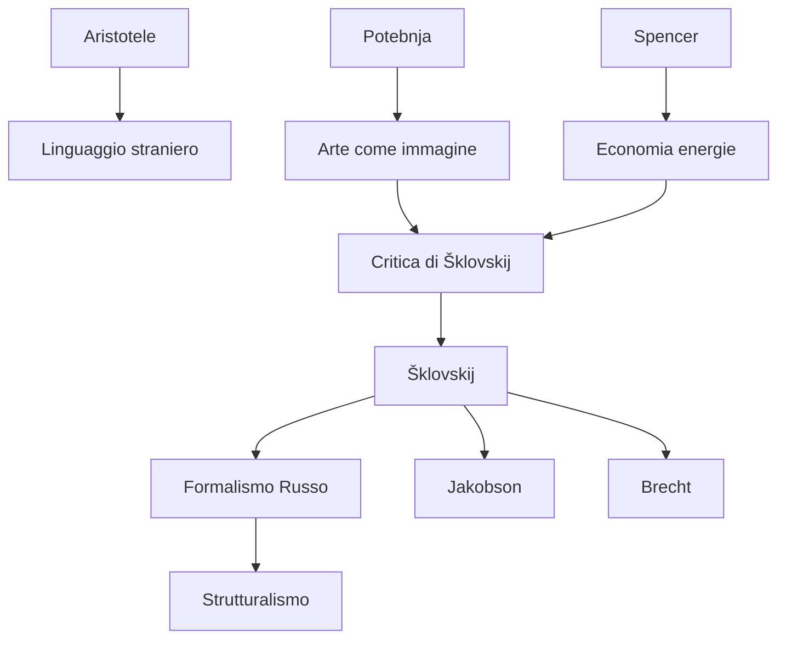

---
cssclasses:
  - Philosophy
subclasses:
  - Aesthetics
  - Phenomenology
  - 20th-Century-Philosophy
related:
  - "[[Russian Formalism]]"
  - "[[Defamiliarization]]"
  - "[[Phenomenology]]"
  - "[[Aesthetics]]"
  - "[[Literary Theory]]"
  - "[[Perception]]"
aliases:
  - arte come
  - art as
  - ostranenie
  - straniamento
  - defamiliarization
  - shklovskij 1917
  - formalismo russo
  - percezione automatica
  - linguaggio poetico
  - visione riconoscimento
reference:
  - Shklovskiĭ, V. (1990). L’arte come procedimento. In Theory of prose. https://doi.org/10.1400/86251
---

#### Central Problem

[[Viktor Šklovskij]] affronta la questione fondamentale dell'essenza dell'arte e della poesia: che cosa rende qualcosa "artistico"? Contro la teoria dominante di [[Aleksandr Potebnja]] — secondo cui "l'arte è pensiero che si attua per mezzo di immagini" e la funzione dell'immagine è economizzare energie mentali — Šklovskij propone una teoria radicalmente opposta.

Il problema centrale è l'**automatizzazione della percezione**: nella vita quotidiana, le azioni e gli oggetti diventano meccanici, percepiti per "riconoscimento" anziché per "visione". La vita stessa "scompare trasformandosi in nulla" quando passa inconsciamente. L'arte esiste precisamente per contrastare questo processo, per **restituire la sensazione della vita**, per far sì che "la pietra sia di pietra".

La teoria dell'economia delle energie (Spencer, Avenarius) può valere per il linguaggio pratico, ma è fondamentalmente errata quando applicata al linguaggio poetico, che opera secondo leggi completamente diverse.

#### Main Thesis

La tesi centrale di [[Šklovskij]] è che lo **scopo dell'arte è lo straniamento** (*ostranenie*): rendere gli oggetti "strani", difficili, per prolungare e intensificare la percezione. L'arte non serve a semplificare ma a complicare, non a economizzare energie ma a spenderle.

**Straniamento (*Ostranenie*):** Il procedimento fondamentale dell'arte consiste nel "sottrarre l'oggetto all'automatismo della percezione". Non chiamare l'oggetto col suo nome, descriverlo come visto per la prima volta, usare denominazioni inusuali. Il risultato è la **visione** anziché il **riconoscimento**.

**Linguaggio Poetico vs. Linguaggio Pratico:** Il linguaggio poetico deve avere carattere "straniero e sorprendente" (Aristotele). È un linguaggio "impedito, tortuoso, difficoltoso" — l'opposto dell'economia. La prosa è linguaggio consueto, economico, regolare; la poesia è costruzione deliberata della difficoltà.

**Immagine Poetica vs. Immagine Prosaica:** L'immagine prosaica è mezzo di astrazione (dire "cocomero" per "palla" astrae una qualità); l'immagine poetica è mezzo per **rafforzare l'impressione**, per creare percezione intensificata.

**Ritmo Artistico:** Anche il ritmo poetico non segue la legge dell'economia. Il ritmo prosaico automatizza (marciare a tempo è più facile); il ritmo artistico consiste nell'**infrazione del ritmo** atteso, creando imprevedibilità che impedisce l'automatizzazione.

#### Historical Context

Il saggio fu scritto nel 1917, momento cruciale per il [[Formalismo Russo]]. Šklovskij e i suoi colleghi dell'OPOJAZ (Società per lo Studio del Linguaggio Poetico) — tra cui [[Roman Jakobson]], [[Boris Ejchenbaum]], [[Jurij Tynjanov]] — stavano sviluppando un nuovo approccio alla letteratura che rifiutava sia il biografismo che il sociologismo.

Il bersaglio polemico principale è [[Aleksandr Potebnja]] e la sua scuola, che aveva dominato la teoria letteraria russa con la formula "arte = pensiero per immagini = economia di energie". Questa teoria era stata adottata dai simbolisti (Andrej Belyj, Merežkovskij) ma, secondo Šklovskij, confondeva fondamentalmente linguaggio poetico e linguaggio pratico.

Il contesto include anche le scoperte di [[L. P. Jakubinskij]] sulla differenza tra fonetica del linguaggio poetico e pratico — prime prove empiriche della "non-coincidenza dei due linguaggi". Il saggio fa parte di una rivoluzione metodologica che cercava le "leggi interne" della letteratura.

#### Philosophical Lineage

#### Key Thinkers

| Thinker | Dates | Movement | Main Work | Core Concept |
|---------|-------|----------|-----------|--------------|
| [[Viktor Šklovskij]] | 1893-1984 | [[Formalismo Russo]] | *L'arte come procedimento* | Straniamento, linguaggio impedito |
| [[Aleksandr Potebnja]] | 1835-1891 | [[Linguistica]] | *Note sulla teoria della letteratura* | Arte come pensiero per immagini |
| [[Roman Jakobson]] | 1896-1982 | [[Formalismo Russo]] | *Fundamentals of Language* | Funzione poetica, metafora/metonimia |
| [[Lev Tolstoj]] | 1828-1910 | [[Letteratura Russa]] | *Cholstomer*, *Guerra e pace* | Maestro dello straniamento |
| [[Herbert Spencer]] | 1820-1903 | [[Positivismo]] | *Filosofia dello stile* | Economia delle energie mentali |

#### Key Concepts

| Concept | Definition | Related to |
|---------|------------|------------|
| Straniamento (*Ostranenie*) | Procedimento che rende l'oggetto "strano" per sottrarlo all'automatismo percettivo | [[Šklovskij]], [[Formalismo Russo]] |
| Automatizzazione | Processo per cui percezioni ripetute diventano meccaniche e inconsce | [[Percezione]], [[Fenomenologia]] |
| Visione vs. Riconoscimento | Vedere l'oggetto nella sua pienezza vs. identificarlo per pochi tratti | [[Šklovskij]], [[Estetica]] |
| Linguaggio impedito | Linguaggio poetico "difficile, tortuoso" che rallenta la percezione | [[Poetica]], [[Linguistica]] |
| Immagine poetica | Mezzo per rafforzare l'impressione, non per astrarre | [[Šklovskij]], [[Retorica]] |
| Procedimento (*Priëm*) | Tecnica artistica identificabile e analizzabile | [[Formalismo Russo]], [[Narratologia]] |

#### Authors Comparison

| Theme | [[Šklovskij]] | [[Potebnja]] | [[Tolstoj]] |
|-------|---------------|--------------|-------------|
| Funzione dell'arte | Restituire sensazione della vita | Economizzare energie mentali | Toccare la coscienza morale |
| Immagine | Mezzo di intensificazione | Mezzo di semplificazione | Strumento di verità |
| Percezione | Deve essere prolungata, difficile | Deve essere facilitata | Deve essere rinnovata |
| Linguaggio poetico | Impedito, straniero | Economico, familiare | Semplice ma straniante |

#### Influences & Connections

- **Predecessors:** [[Šklovskij]] ← critica ← [[Potebnja]], [[Spencer]] (economia energie); ← usa esempi di ← [[Tolstoj]], [[Gogol]]
- **Contemporaries:** [[Šklovskij]] ↔ collabora con ↔ [[Jakobson]], [[Ejchenbaum]], [[Tynjanov]] (OPOJAZ)
- **Followers:** [[Šklovskij]] → influenza → [[Bertolt Brecht]] (Verfremdungseffekt), [[Strutturalismo]], [[Narratologia]]
- **Opposing views:** [[Šklovskij]] ← criticato da ← [[Marxismo ortodosso]], [[Sociologia della letteratura]]

#### Summary Formulas

- **[[Šklovskij]]:** L'arte esiste per restituire la sensazione della vita attraverso lo straniamento — rendere difficile ciò che è automatico, far vedere ciò che è solo riconosciuto.
- **[[Potebnja]]:** L'arte è pensiero per immagini che economizza energie mentali avvicinando l'ignoto al noto — teoria rifiutata da Šklovskij come confusione tra linguaggio pratico e poetico.
- **[[Tolstoj]]:** Maestro dello straniamento: descrive la fustigazione, la proprietà, il teatro, la guerra come visti per la prima volta, strappandoli all'automatismo.

#### Timeline

| Year | Event |
|------|-------|
| 1835-1891 | [[Potebnja]] sviluppa teoria dell'arte come pensiero per immagini |
| 1914 | [[Šklovskij]] pubblica *La resurrezione della parola* |
| 1916 | Fondazione dell'OPOJAZ a San Pietroburgo |
| 1917 | [[Šklovskij]] pubblica "L'arte come procedimento" |
| 1925 | [[Šklovskij]] pubblica *Teoria della prosa* |
| 1936 | [[Brecht]] sviluppa il Verfremdungseffekt, influenzato dal concetto russo |

#### Notable Quotes

> "Così la vita scompare trasformandosi in nulla. L'automatizzazione si mangia gli oggetti, il vestito, il mobile, la moglie e la paura della guerra." — [[Šklovskij]]

> "Scopo dell'arte è di trasmettere l'impressione dell'oggetto, come 'visione' e non come 'riconoscimento'; procedimento dell'arte è il procedimento dello 'straniamento' degli oggetti." — [[Šklovskij]]

> "Il linguaggio poetico è un linguaggio-costruzione. La prosa è linguaggio consueto: economica, regolare, facile." — [[Šklovskij]]
