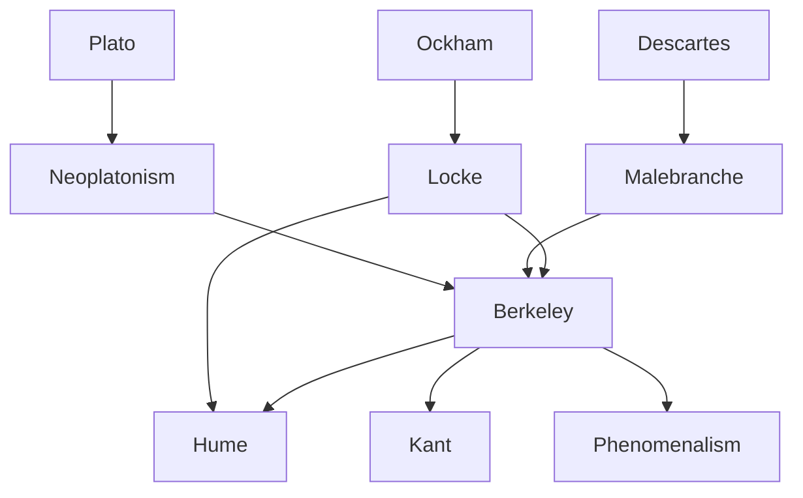

---
cssclasses:
  - Philosophy
subclasses:
  - Epistemology
  - Metaphysics
  - 17th-18th-Century-Philosophy
related:
  - "[[British Empiricism]]"
  - "[[Idealism]]"
  - "[[Esse est percipi]]"
  - "[[Primary and Secondary Qualities]]"
  - "[[Problem of Substance]]"
  - "[[Occasionalism]]"
  - "[[Phenomenalism]]"
  - "[[Locke]]"
  - "[[Hume]]"
  - "[[Malebranche]]"
  - "[[Neoplatonism]]"
aliases:
  - radical nominalism
  - spirit matter
  - ideas perception
  - abstract ideas
  - primary secondary
  - divine language
  - infinite spirit
  - idealism berkeley
  - perception reality
  - mind dependent
reference:
  - "Abbagnano, N., & Fornero, G. (2012). La ricerca del pensiero. Vol. 2A. Dall'Umanesimo all'empirismo. Paravia."
---

#### Central Problem

Berkeley confronts a profound epistemological and metaphysical problem: how can we justify belief in an external material world if all we ever directly perceive are our own ideas? Building on [[Locke]]'s empiricist premise that knowledge consists only of ideas, Berkeley asks whether the concept of "matter" or "material substance" existing independently of mind is coherent or even meaningful.

The problem has both philosophical and religious dimensions. Philosophically, if [[Locke]] is right that we only know ideas, how can we claim knowledge of material objects "behind" or "causing" those ideas? The gap between idea and thing seems unbridgeable. Religiously, Berkeley sees materialism as the philosophical foundation of atheism—if matter can explain everything, God becomes superfluous. The challenge is to defend both the reality of our knowledge and the existence of God against materialist skepticism.

Berkeley also addresses the problem of abstract ideas inherited from [[Locke]]. Can we truly form a general idea of "triangle" or "man" that has no particular characteristics? Berkeley argues such abstraction is psychologically impossible and philosophically unnecessary, leading to his radical nominalism.

#### Main Thesis

Berkeley's revolutionary thesis is summarized in the formula *esse est percipi*—"to be is to be perceived." For ideas, existence consists entirely in being perceived by a mind. Since what we call "things" are nothing but collections of ideas (a cherry is just the collection of ideas: red, round, sweet, etc.), things too exist only insofar as they are perceived. There is no material substance underlying or causing our perceptions.

**Radical Nominalism:** Abstract general ideas are impossible. We cannot form an idea of "extension" that has no particular size, shape, or color. What [[Locke]] called "general ideas" are actually particular ideas used as signs to represent other similar particulars. A particular triangle in a proof represents all triangles not because it lacks specific characteristics, but because those characteristics are irrelevant to the demonstration.

**Immaterialism:** Material substance does not exist. Berkeley's arguments:
1. We only ever perceive ideas, never matter itself
2. Ideas cannot resemble anything except other ideas—a color cannot resemble something invisible
3. Primary qualities (extension, motion) cannot exist without secondary qualities (color, smell)—there is no colorless extension
4. The concept of a material substratum "supporting" qualities is unintelligible
5. Matter, being inert, cannot be the cause of our ideas

**Spiritual Causation:** Since ideas are passive and require a cause, and matter cannot be that cause, the source must be spirit. Our own minds produce ideas of imagination, but the vivid, orderly, involuntary ideas of sense perception must come from another Spirit—God. The "laws of nature" are simply the regular patterns by which God produces ideas in us.

**Preservation of Reality:** Things continue to exist when unperceived by finite minds because they are always perceived by God's infinite mind. Nature is God's language, speaking to us through the orderly succession of sensible ideas.

#### Historical Context

Berkeley (1685-1753) developed his philosophy in early eighteenth-century Ireland and England, during a period of intense debate between religious orthodoxy and emerging Deism and free-thinking. Born in Kilkenny, Ireland, he studied at Trinity College Dublin and formulated his core philosophical position—immaterialism—remarkably early, publishing his main works before age 30.

The intellectual context was shaped by [[Locke]]'s *Essay Concerning Human Understanding* (1690), which Berkeley both built upon and criticized. [[Locke]]'s empiricism seemed to many to lead toward skepticism about the external world—if we only know ideas, how can we know things? Berkeley's radical solution was to eliminate the problem by eliminating matter.

Berkeley was also responding to the perceived threat of materialist philosophy, which he associated with [[Hobbes]] and with the "free-thinkers" of his day. He saw materialism as leading inevitably to atheism, fatalism, and the denial of providence, free will, and immortality. His immaterialism was explicitly intended as an apologetic for Christian theism.

His later career included an ambitious (ultimately unsuccessful) project to establish a college in Bermuda to educate colonists and Native Americans. As Bishop of Cloyne (from 1734), he devoted himself to philanthropy and practical concerns, including promoting tar-water as a medicinal cure-all. His later work *Siris* (1744) developed a more explicitly Neoplatonic metaphysics.

#### Philosophical Lineage

#### Key Thinkers

| Thinker | Dates | Movement | Main Work | Core Concept |
|---------|-------|----------|-----------|--------------|
| [[Berkeley]] | 1685-1753 | [[British Empiricism]] | *Treatise Concerning the Principles of Human Knowledge* | Esse est percipi, immaterialism |
| [[Locke]] | 1632-1704 | [[British Empiricism]] | *Essay Concerning Human Understanding* | Ideas from experience, primary/secondary qualities |
| [[Malebranche]] | 1638-1715 | [[Occasionalism]] | *The Search After Truth* | Vision in God, occasionalism |
| [[Descartes]] | 1596-1650 | [[Rationalism]] | *Meditations* | Mind-body dualism, material substance |
| [[Hume]] | 1711-1776 | [[British Empiricism]] | *Treatise of Human Nature* | Skepticism about substance, causation |

#### Key Concepts

| Concept | Definition | Related to |
|---------|------------|------------|
| Esse est percipi | "To be is to be perceived"—for ideas, existence consists in being perceived by a mind | [[Berkeley]], [[Idealism]] |
| Immaterialism | The doctrine that material substance does not exist; only minds and ideas are real | [[Berkeley]], [[Idealism]] |
| Radical nominalism | General ideas are impossible; particular ideas serve as signs for groups of similar particulars | [[Berkeley]], [[Ockham]] |
| Ideas | The immediate objects of perception and thought; passive entities requiring a perceiving mind | [[Berkeley]], [[Locke]] |
| Spirit | Active, perceiving substance; minds that have ideas and exercise will, imagination, memory | [[Berkeley]], [[Metaphysics]] |
| Primary qualities | Extension, figure, motion—Berkeley denies these exist independently of perception | [[Locke]], [[Berkeley]] |
| Secondary qualities | Colors, sounds, tastes—Locke admitted these are mind-dependent; Berkeley extends this to all qualities | [[Locke]], [[Berkeley]] |
| Laws of nature | The fixed, regular patterns by which God produces sensible ideas in finite minds | [[Berkeley]], [[Theology]] |
| Divine language | Nature understood as God's communication to humans through orderly sensible ideas | [[Berkeley]], [[Theology]] |
| Notions | Knowledge of spirits (one's own and others'), which differs from knowledge of ideas | [[Berkeley]], [[Epistemology]] |

#### Authors Comparison

| Theme | [[Berkeley]] | [[Locke]] | [[Malebranche]] |
|-------|--------------|-----------|-----------------|
| Objects of knowledge | Ideas only | Ideas representing external things | Ideas in God's mind |
| Material substance | Does not exist | Exists but unknowable in itself | Exists, created by God |
| Primary/secondary qualities | No distinction—all mind-dependent | Primary objective, secondary subjective | All qualities perceived in God |
| Cause of sensory ideas | God (infinite Spirit) | External material objects | God (occasionalism) |
| Abstract ideas | Impossible | Possible through abstraction | Possible |
| Universals | Nominalism—particular ideas as signs | Nominalism—ideas as signs | Ideas in divine understanding |
| Purpose of philosophy | Defense of religion | Extension of natural knowledge | Union with God |
| Existence of things unperceived | Perceived by God | Exist independently | Exist in God's ideas |

#### Influences & Connections

- **Predecessors:** [[Berkeley]] ← influenced by ← [[Locke]] (empiricism, ideas as objects), [[Descartes]] (method of ideas)
- **Predecessors:** [[Berkeley]] ← influenced by ← [[Malebranche]] (occasionalism, vision in God), [[Ockham]] (nominalism)
- **Contemporaries:** [[Berkeley]] ↔ dialogue with ↔ English Deists (polemic in *Alciphron*)
- **Followers:** [[Berkeley]] → influenced → [[Hume]] (skepticism about substance), [[Kant]] (idealism critique)
- **Followers:** [[Berkeley]] → influenced → [[Phenomenalism]], [[Logical Positivism]] (verification principle)
- **Opposing views:** [[Berkeley]] ← criticized by ← [[Johnson]] (kicking stone refutation), [[Reid]] (common sense realism)

#### Summary Formulas

- **[[Berkeley]]:** To be is to be perceived (*esse est percipi*); matter does not exist, only minds and their ideas; God is the infinite Spirit who causes our sensible ideas and guarantees their continuous existence.
- **[[Locke]]:** We know only ideas, but these represent external material objects whose primary qualities truly exist in things themselves.
- **[[Malebranche]]:** We see all things in God; matter exists but is causally inert, with God being the only true cause of all effects.
- **[[Hume]]:** Taking empiricism to its logical conclusion, we have no justified belief in either material or spiritual substance.

#### Timeline

| Year | Event |
|------|-------|
| 1685 | [[Berkeley]] born at Dysert, Ireland |
| 1707 | [[Berkeley]] graduates from Trinity College Dublin |
| 1709 | [[Berkeley]] publishes *Essay Towards a New Theory of Vision* |
| 1710 | [[Berkeley]] publishes *Treatise Concerning the Principles of Human Knowledge* |
| 1713 | [[Berkeley]] publishes *Three Dialogues between Hylas and Philonous* |
| 1728 | [[Berkeley]] sails for America to establish college in Bermuda |
| 1731 | [[Berkeley]] returns to England after Bermuda project fails |
| 1732 | [[Berkeley]] publishes *Alciphron* (apology against free-thinkers) |
| 1734 | [[Berkeley]] appointed Bishop of Cloyne, Ireland |
| 1744 | [[Berkeley]] publishes *Siris* (tar-water and Neoplatonic metaphysics) |
| 1752 | [[Berkeley]] moves to Oxford |
| 1753 | [[Berkeley]] dies at Oxford |

#### Notable Quotes

> "The esse of things is percipi, and it is not possible that they should have any existence outside the minds that perceive them." — [[Berkeley]]

> "All the choir of heaven and furniture of the earth, in a word all those bodies which compose the mighty frame of the world, have not any subsistence without a mind." — [[Berkeley]]

> "Some truths there are so near and obvious to the mind that a man need only open his eyes to see them. Such I take this important one to be, namely, that all the choir of heaven and furniture of the earth have no subsistence without a mind." — [[Berkeley]]

---
> [!warning]-
> This annotation was normalised using a large language model and may contain inaccuracies. These texts serve as preliminary study resources rather than exhaustive references.
