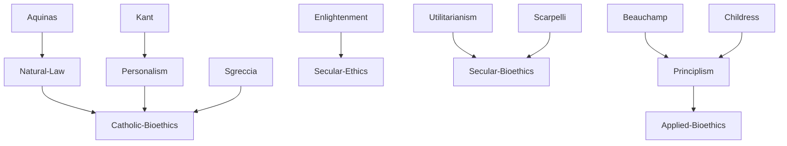

---
cssclasses:
  - Philosophy
  - Health-Sciences
subclasses:
  - Applied-Ethics
  - Ethics
  - 20th-Century-Philosophy
aliases:
  - bioethics
  - medical ethics
  - life ethics
  - sanctity life
  - quality life
  - secular bioethics
  - catholic bioethics
  - natural law
  - moral principles
  - euthanasia debate
  - abortion ethics
contributions:
  - Conceptual
  - Constructive
authors:
  - "[[Potter]]"
  - "[[Sgreccia]]"
  - "[[Beauchamp]]"
  - "[[Childress]]"
  - "[[Engelhardt]]"
  - "[[Scarpelli]]"
reference: "[[07 The search for thought - Unit 18 Chapter 5.pdf]]"
---

#### Central Problem

Bioethics confronts the profound questions raised by advances in biomedical technology: What limits, if any, should be placed on scientific intervention in human life? Is everything that is scientifically possible and technically realizable also ethically permissible? How do we evaluate practices such as abortion, euthanasia, artificial fertilization, organ transplantation, embryo manipulation, and genetic engineering?

The fundamental divide in bioethics is between two incompatible paradigms regarding human life itself:

**The paradigm of life's unavailability (indisponibilità):** Human life is not available for human manipulation at will. Since we are not life's authors, we are not its "proprietors." This view, most prominently articulated in Catholic bioethics, holds that life is **sacred** because it is created by God and must be protected absolutely.

**The paradigm of life's availability (disponibilità):** Human life is available in freedom to the individual, who is its legitimate subject and "judge." What matters is not life *as such* but the **quality** and **dignity** of life, of which the individual is the sole authorized interpreter.

These paradigms produce radically different answers to concrete bioethical questions. As Pope Benedict XVI stated, on the theme of availability or unavailability of life, these two mentalities "oppose each other in an irreconcilable manner."

#### Main Thesis

The contemporary bioethics debate is best understood as a conflict between two comprehensive paradigms—the Catholic ethics of life's **sanctity** and the secular ethics of life's **quality**.

**Catholic Bioethics** (Sgreccia's "ontologically founded personalism"):

The core is a creationist anthropology: humans are created in God's image, and life is therefore sacred and unavailable. The individual has no arbitrary ownership over their life but must receive it with religious awareness that "God is its only Lord." Catholic bioethics proceeds *etsi Deus daretur* ("as if God exists"), seeing God as the ontological and ethical foundation of humanity.

This leads to the doctrine of **natural law**: God has inscribed a "project" in human nature prescribing how we must act. Medical art must "imitate nature" and cannot contradict the purposes for which life or organs were created. The faithful observance of natural law requires respecting the two basic finalities: self-preservation and species reproduction.

Catholic bioethics is **deontological** in the strict sense—based on absolute prohibitions that apply "always and forever," regardless of circumstances or intentions. Certain acts are "intrinsically evil": abortion and euthanasia are "always gravely immoral."

**Secular Bioethics** (bioetica laica in the "strong" sense):

This approach reasons *etsi Deus non daretur* ("as if God does not exist"). It holds that morality is a human construction—humans, not God or natural order, are the source of ethical norms. Nature is a historical-cultural product from which it is vain to expect precise ethical indications.

The first principle is **autonomy**: every individual has equal dignity, and no superior authority may choose for them in matters of health and life. The emphasis is on quality of life, individual freedom, and progressive reduction of suffering through scientific advances.

This bioethics is **anti-absolutist**: either consequentialist (oriented to outcomes, as in utilitarianism) or "prima facie" deontological (principles that bind "at first sight" but admit exceptions in cases of conflict). Pluralism is embraced—there are as many bioethics as there are ethics.

#### Historical Context

The term "bioethics" was coined by oncologist [[Van Rensselaer Potter]] in 1970-71, originally meaning an attempt to join life sciences with an ethics capable of ensuring human survival against the "cancer" of scientific-technological revolution. However, the term gained wider currency through the Kennedy Institute of Ethics (founded 1971) at Georgetown University, where [[Warren Reich]] defined bioethics as "the systematic study of human conduct in the area of the life sciences and health care, when such conduct is examined in the light of moral values and principles."

Bioethics became a phenomenon of planetary relevance in the 1990s, with the founding of the International Association of Bioethics in 1992. As [[Scarpelli]] wrote, if Tocqueville had predicted that private property would be the great "battlefield" of the nineteenth century, "the great battlefield at the end of this century is biology with its ethics."

The discipline emerged from multiple factors: crisis of common moral beliefs, collapse of totalizing visions of reality and history, development of technologies capable of intervening on human biological and psychological constitution, increasing complexity of contemporary life, greater sensitivity toward the Other, and need to guarantee coexistence among diverse ethnicities and cultures.

The Italian debate has been particularly marked by the opposition between Catholic and secular bioethics, producing significant documents like the "Manifesto of Secular Bioethics" (1996) and the "New Manifesto of Secular Bioethics" (2007).

#### Philosophical Lineage

#### Key Thinkers

| Thinker | Dates | Movement | Main Work | Core Concept |
|---------|-------|----------|-----------|--------------|
| [[Potter]] | 1911-2001 | [[Bioethics]] | *Bioethics: Bridge to the Future* | Coined "bioethics" |
| [[Sgreccia]] | 1928-2019 | [[Catholic Bioethics]] | *Manual of Bioethics* | Ontologically founded personalism |
| [[Beauchamp]] | 1939- | [[Principlism]] | *Principles of Biomedical Ethics* | Four principles approach |
| [[Childress]] | 1940- | [[Principlism]] | *Principles of Biomedical Ethics* | Four principles approach |
| [[Engelhardt]] | 1941-2018 | [[Secular Bioethics]] | *Foundations of Bioethics* | Procedural ethics |
| [[Scarpelli]] | 1924-1993 | [[Secular Bioethics]] | *Bioetica laica* | Secular methodology |

#### Key Concepts

| Concept | Definition | Related to |
|---------|------------|------------|
| Bioethics | Systematic study of human conduct in life sciences and health care examined in light of moral values and principles | [[Applied Ethics]] |
| Sanctity of Life | Life has intrinsic sacred value making it unavailable and inviolable; in Catholic view, connected to human creatureliness | [[Catholic Bioethics]], [[Sgreccia]] |
| Quality of Life | What matters is not life as such but its concrete quality; individual is sole authorized interpreter of their own life's quality | [[Secular Bioethics]], [[Autonomy]] |
| Natural Law | Moral law inscribed by God in human nature prescribing how we must act; source of bioethical norms | [[Catholic Bioethics]], [[Aquinas]] |
| Principilism | Bioethics based on four principles: autonomy, non-maleficence, beneficence, justice | [[Beauchamp]], [[Childress]] |
| Moral Absolutism | Ethics based on absolute prohibitions applying always and in all circumstances; some acts are intrinsically evil | [[Catholic Bioethics]] |
| Anti-absolutism | Ethics without absolutes; either consequentialist or "prima facie" deontological allowing exceptions | [[Secular Bioethics]] |
| Etsi Deus daretur | "As if God exists"—Catholic reasoning presupposing God as foundation | [[Catholic Bioethics]] |
| Etsi Deus non daretur | "As if God does not exist"—secular reasoning independent of divine hypothesis | [[Secular Bioethics]], [[Scarpelli]] |

#### Authors Comparison

| Theme | [[Sgreccia]] | [[Beauchamp]]/[[Childress]] | [[Scarpelli]] |
|-------|--------------|----------------------------|---------------|
| Foundation | Ontological-theological | Principilism | Secular autonomy |
| Core value | Sanctity of life | Four principles | Quality of life |
| Life's status | Unavailable (sacred) | Respect for autonomy | Available to individual |
| Method | "Triangular method" | Prima facie balancing | Etsi Deus non daretur |
| Moral type | Deontological-absolute | Prima facie deontological | Anti-absolutist |
| On pluralism | One true bioethics | Common ground | Irreducible plurality |
| Natural law | Central and binding | Not emphasized | Rejected |

#### Influences & Connections

- **Predecessors:** Catholic bioethics ← influenced by ← [[Aquinas]], [[Augustine]], [[Aristotle]]
- **Predecessors:** Secular bioethics ← influenced by ← [[Kant]], [[Bentham]], [[Mill]]
- **Contemporaries:** [[Sgreccia]] ↔ opposed to ↔ [[Scarpelli]], [[Mori]]
- **Contemporaries:** [[Beauchamp]]/[[Childress]] ↔ mediating position ↔ various traditions
- **Followers:** Catholic bioethics → influenced → Vatican documents, Catholic hospitals
- **Followers:** Secular bioethics → influenced → Liberal legislation, patient autonomy movements
- **Opposing views:** Sanctity of life ← criticized by ← Quality of life proponents (and vice versa)

#### Summary Formulas

- **[[Sgreccia]]:** Bioethics must be founded on ontological personalism; life is sacred because created in God's image, and natural law inscribed in human nature provides absolute moral norms binding always and everywhere.

- **[[Beauchamp]]/[[Childress]]:** Bioethics should be based on four principles—autonomy, non-maleficence, beneficence, justice—that provide a minimal common platform across diverse philosophical and religious orientations.

- **[[Scarpelli]]:** Bioethics must reason *etsi Deus non daretur*; life is available to the individual who is its legitimate judge; pluralism of ethical positions must be respected through tolerance.

- **[[Engelhardt]]:** In a postmodern world with multiple moral narratives, we can only speak of bioethics in the plural; no one can claim to possess the truth.

#### Timeline

| Year | Event |
|------|-------|
| 1970 | [[Potter]] first uses term "bioethics" |
| 1971 | [[Potter]] publishes *Bioethics: Bridge to the Future* |
| 1971 | Kennedy Institute of Ethics founded at Georgetown |
| 1978 | [[Reich]] publishes *Encyclopedia of Bioethics* |
| 1979 | [[Beauchamp]] and [[Childress]] publish *Principles of Biomedical Ethics* |
| 1992 | International Association of Bioethics founded |
| 1995 | Pope John Paul II issues *Evangelium vitae* |
| 1996 | "Manifesto of Secular Bioethics" published in Italy |
| 2007 | "New Manifesto of Secular Bioethics" published |

#### Notable Quotes

> "The life sciences and the ethics of life must be united to create a bridge capable of ensuring the survival and well-being of humanity." — [[Potter]]

> "What is good is everything that protects, defends, heals, promotes the human being as person; what is evil is everything that threatens, attacks, offends, instrumentalizes, eliminates him." — [[Tettamanzi]]

> "The great battlefield at the end of this century is biology with its ethics." — [[Scarpelli]]

#### See Also

- [[Applied Ethics]]
- [[Medical Ethics]]
- [[Natural Law]]
- [[Catholic Philosophy]]
- [[Secular Ethics]]
- [[Utilitarianism]]
- [[Personalism]]
- [[Autonomy]]
- [[Euthanasia]]
- [[Abortion Ethics]]

> [!NOTE]
> *This summary has been created to present the key points from the source text, which was automatically extracted using LLM. Please note that the summary may contain errors. It serves as an essential starting point for study and reference purposes.*
