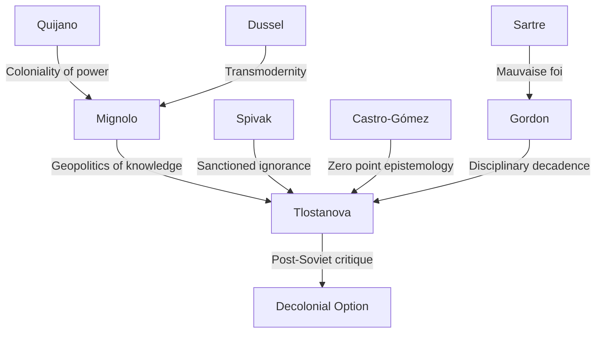

---

cssclasses:
  - Philosophy
subclasses:
  - Epistemology
  - 20th-Century-Philosophy
  - Philosophy-of-Science
related:
  - "[[Decolonial Theory]]"
  - "[[Mignolo]]"
  - "[[Coloniality of Knowledge]]"
  - "[[Post-Soviet Studies]]"
  - "[[Geopolitics of Knowledge]]"
  - "[[Body-Politics of Knowledge]]"
aliases:
  - tlostanova 2015
  - postsoviet thought
  - coloniality knowledge
  - postsoviet epistemology
  - geopolitics knowledge
  - bodypolitics knowledge
  - imperial difference
  - disciplinary decadence
  - zero point
  - secondary eurocentrism
reference:
  - Tlostanova, M. (2015). Can the post-Soviet think? On coloniality of knowledge, external imperial and double colonial difference. Intersections, 1(2). https://doi.org/10.17356/ieejsp.v1i2.38
tags:
  - Podcast
---

#### Podcast

<iframe allow="autoplay *; encrypted-media *; fullscreen *; clipboard-write" frameborder="0" height="150" style="width:100%;overflow:hidden;border-radius:10px;background:transparent;" sandbox="allow-forms allow-popups allow-same-origin allow-scripts allow-storage-access-by-user-activation allow-top-navigation-by-user-activation" src="https://embed.podcasts.apple.com/us/podcast/can-the-post-soviet-think/id1786764068?i=1000688422236&uo=4&l=en-GB&theme=auto"></iframe>

---

#### Can the Post-Soviet Think?

#### Central Problem

Can post-Soviet subjects produce original knowledge, or are they trapped in a double bind of epistemic coloniality? Tlostanova investigates why Russian and post-Soviet social sciences remain largely invisible in global academia—not merely due to Western hegemony but also because of chronic intellectual dependency, "secondary Eurocentrism," and the complex interplay of *external imperial difference* (Russia's subaltern position vis-à-vis the West) and *internal colonial difference* (Russia's own colonizing relationship with its non-European peripheries). The question "Can the post-Soviet think?" echoes Spivak's "Can the subaltern speak?" but addresses a distinct configuration: subjects who were once second-world producers of knowledge but have been epistemically erased and struggle to articulate independent critical thought.

#### Main Thesis

The post-Soviet condition is marked by a unique *coloniality of knowledge* stemming from **external imperial difference**—Russia's position as a "not-quite-Western, not-quite-capitalist" empire that was epistemically colonized by the West while simultaneously colonizing its own peripheries (Caucasus, Central Asia). This generates "secondary Eurocentrism": Russian scholars mimic Western methodologies while projecting Orientalist attitudes onto their own colonies. The result is *epistemic stagnation*: Russian social sciences oscillate between derivative Westernization and reactive nationalist fundamentalism, while non-Russian post-Soviet scholars face *double colonization* (Western and Russian). The way out lies not in recognition claims but in **delinking** from the catching-up logic, **learning to unlearn** Western and Soviet epistemic frameworks, and developing original critical knowledge rooted in local histories without provincialism.

#### Historical Context and Intellectual Background

After 1989, Western sovietology collapsed alongside its object of study. The "end of history" discourse (Fukuyama) rendered the post-Soviet world epistemically invisible—millions of people whose existence became irrelevant to global knowledge production. Cold War social sciences had divided knowledge into:

1. **Imperial social sciences**: Theory-producing, conducted by/about the West
2. **Colonial area studies**: Descriptive, applied to non-Western regions
3. **Sovietology**: A hybrid area study that collapsed with its object

Post-Soviet scholars faced impossible choices: (a) adopt Western methods wholesale (secondary Eurocentrism), (b) retreat into insular nationalist "indigenous science," or (c) attempt critical delinking—the rarest option. Meanwhile, Western posthumanism (Braidotti) and transdisciplinary projects, while promising, remain blind to persistent power asymmetries in global knowledge production.

Key intellectual contexts include:
- **Decolonial thought** (Mignolo, Quijano, Dussel): Critique of modernity/coloniality
- **Lewis Gordon's "disciplinary decadence"**: Disciplines lose contact with reality
- **Spivak's "sanctioned ignorance"**: Western erasure of non-Western knowledge
- **Castro-Gómez's "zero point epistemology"**: The hubris of claiming a view from nowhere

#### Philosophical Lineage

#### Key Thinkers

| Thinker | Dates | Movement | Main Work | Core Concept |
|---------|-------|----------|-----------|--------------|
| [[Mignolo]] | 1941- | [[Decolonial Theory]] | *The Darker Side of Modernity* | Geopolitics of knowledge, colonial difference |
| [[Spivak]] | 1942- | [[Postcolonial Theory]] | *A Critique of Postcolonial Reason* | Sanctioned ignorance, subaltern |
| [[Gordon]] | 1962- | [[Africana Philosophy]] | *Disciplinary Decadence* | Bad faith in disciplines, teleological suspension |
| [[Castro-Gómez]] | 1958- | [[Decolonial Theory]] | *La hybris del punto cero* | Zero point epistemology |
| [[Braidotti]] | 1954- | [[Posthumanism]] | *The Posthuman* | Post-anthropocentrism, zoe |

#### Key Concepts

| Concept | Definition | Related to |
|---------|------------|------------|
| Geopolitics of knowledge | Knowledge is always produced from a specific spatial-temporal location; this locality is erased by universalist claims | [[Mignolo]], [[Decolonial Theory]] |
| Body-politics of knowledge | Knowledge rooted in individual/collective biographical trajectories marked by race, gender, religion | [[Mignolo]], [[Tlostanova]] |
| Zero point epistemology | The Western illusion of speaking from nowhere, from a neutral universal position | [[Castro-Gómez]], [[Descartes]] |
| Imperial difference | The gap between first-class Western empires and subalternized "not-quite-Western" empires (Russia, Ottoman) | [[Tlostanova]], [[Mignolo]] |
| Colonial difference | The gap between Western empires and their colonized others | [[Quijano]], [[Mignolo]] |
| Secondary Eurocentrism | Non-Western empires mimicking Western colonialism in their own peripheries | [[Tlostanova]] |
| Disciplinary decadence | Disciplines losing contact with reality, defending methods over truth | [[Gordon]] |
| Sanctioned ignorance | Systematic Western ignorance of non-Western knowledge | [[Spivak]] |

#### Authors Comparison

| Theme | Tlostanova | Mignolo | Spivak |
|-------|------------|---------|--------|
| Focus region | Post-Soviet space, Russia | Latin America, Global South | South Asia, Global South |
| Key problematic | Can post-Soviets produce knowledge? | Decolonial option | Can subaltern speak? |
| Colonial configuration | External imperial + internal colonial difference | Colonial difference | Epistemic violence |
| Solution | Delink, learn to unlearn, create local theory | Border thinking, pluriversality | Strategic essentialism |
| On Western theory | Secondary Eurocentrism as trap | Appropriation for decolonial ends | Critique from within |

#### Influences & Connections

#### Predecessors
- **[[Quijano]]**: Coloniality of power as matrix of modernity
- **[[Dussel]]**: Transmodernity, critique of Eurocentrism
- **[[Fanon]]**: Colonial psychology, decolonization of mind

#### Contemporaries
- **[[Mignolo]]**: Collaborator; geopolitics/body-politics of knowledge framework
- **[[Gordon]]**: Disciplinary decadence, Africana philosophy
- **[[Braidotti]]**: Posthumanism (critiqued for blindness to power asymmetries)

#### Successors
- **[[Suchland]]**: Post-socialist critique
- **[[Central Asian scholars]]**: Emerging decolonial voices from the region
- **[[Cross-Roads Asia Network]]**: Post-area studies approaches

#### Summary Formulas

1. **The Post-Soviet Paradox**: Post-Soviet subjects lost their status as knowledge producers (second world → void) without gaining the voice of postcolonial critique.

2. **External Imperial Difference**: Russia = subalternized empire, epistemically colonized by West, yet colonizing its own peripheries → "Janus-faced empire" playing both roles.

3. **Secondary Eurocentrism**: Russian scholars mimic Western methodologies + project Orientalism onto Caucasus/Central Asia = doubly colonized knowledge in the peripheries.

4. **Disciplinary Decadence**: Methods reject reality; disciplines become self-referential rituals → "bad faith" (Sartrean mauvaise foi) fleeing responsibility through false objectivity.

5. **The Way Out**: Not recognition claims to the West, but *delinking* from catching-up logic + *learning to unlearn* + creating original theory rooted in local histories without provincialism.

#### Timeline

| Year | Event |
|------|-------|
| 1989 | Fall of Berlin Wall; collapse of sovietology as area studies |
| 1992 | [[Fukuyama]] publishes *The End of History* |
| 1998 | [[Castro-Gómez]] & Mendieta: *Teorías sin Disciplina* |
| 1999 | [[Spivak]] publishes *A Critique of Postcolonial Reason* |
| 2001 | David Chioni Moore applies postcolonial theory to post-socialist world |
| 2006 | [[Gordon]] publishes *Disciplinary Decadence* |
| 2006 | Mignolo & Tlostanova: "Theorizing from the Borders" |
| 2010 | [[Tlostanova]] publishes *Gender Epistemologies and Eurasian Borderlands* |
| 2012 | Tlostanova & Mignolo: *Learning to Unlearn* |
| 2013 | [[Braidotti]] publishes *The Posthuman* |
| 2015 | Tlostanova publishes "Can the Post-Soviet Think?" |

#### Notable Quotes

> "I am where I think' sets the stage for epistemic affirmations that have been disavowed. At the same time, it creates a shift in the geography of reasoning." — [[Mignolo]]

> "Disciplinary decadence is when a 'method facilitates the epistemic rejection of reality' and scholars concentrate on the problems of frozen and de-ontologized disciplines and not human beings in the real world." — [[Gordon]]

> "Freeing oneself from coloniality of knowledge is a long and painful process which requires learning to unlearn in order to relearn but on different grounds and sometimes actually creating and remaking these grounds." — [[Tlostanova]]

---
> [!warning]-
> This annotation was normalised using a large language model and may contain inaccuracies. These texts serve as preliminary study resources rather than exhaustive references.
