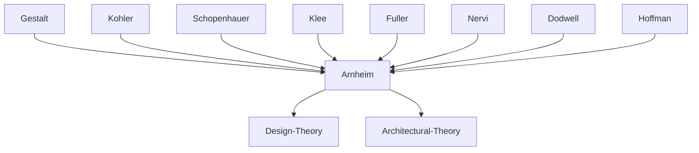

---
cssclasses:
  - Philosophy
  - Arts
  - Psychology
subclasses:
  - Aesthetics
  - Design-Theory
related:
  - "[[Arnheim]]"
  - "[[Le Corbusier]]"
  - "[[Palladio]]"
  - "[[Nervi]]"
  - "[[Gestalt]]"
  - "[[Mondrian]]"
aliases:
  - architectural composition
  - centers grids
  - building architecture
  - visual composition
  - grid systems
  - centric eccentric
  - physical foundation
  - temporal composition
  - equilibrium center
  - spatial organization
reference:
  - "Arnheim, R. (1994). Il potere del centro: psicologia della composizione nelle arti visive (Nuova versione). Einaudi. (pp. 214-248)"
---

#### Central Problem

How do the compositional principles of centricity and eccentricity manifest in architecture and temporal arts? The central problem of these concluding chapters concerns the universal application of the compositional schema developed throughout the book: on one hand, architecture offers a privileged case for studying the interaction between centric systems (volumes, containers) and eccentric systems (grids, communication channels); on the other, the question emerges whether these principles also apply to compositions that unfold in time, such as the visitor's experience traversing a building or watching a film.

The text also addresses a fundamental epistemological question: if compositional principles are universally applicable, what is their foundation? Arnheim explores the possibility that centricity and eccentricity are not cultural conventions but structures rooted in the physiology of perception, isomorphic to neural processes in the brain.

#### Main Thesis

Architecture demonstrates paradigmatically the interaction between centric and eccentric systems. Buildings, due to their dependence on gravity and their function as containers, naturally tend toward Cartesian grids (verticals and horizontals); however, without a center around which to organize the composition, the building loses orientation and meaning. The tension between grids and centers is constitutive of architectural experience.

**Characteristics of elevation:** The vertical facade manifests the struggle with gravity. Vectors pointing upward (spiritual aspiration) and downward (material weight) must be balanced around a center of equilibrium, often located at the midpoint of the central vertical.

**Characteristics of the plan:** The horizontal plane is the arena of action, free from gravitational dominance. Here composition must balance the centricity of spaces (rooms, rotundas) with the linearity of communication channels (corridors, naves). Traditional church design combines the Greek cross (centricity) with the longitudinal basilica (eccentricity).

**Composition in time:** Architectural experience is not only spatial but temporal: the visitor traversing a building experiences a sequence of centers that are approached, reached, and surpassed. In temporal arts (film, music), the eccentric principle of vectorial flow tends to dominate over centricity.

**Physical foundation:** The similarity between compositional models and physical structures (Nervi's isostatic ribs, Dodwell-Hoffman's neural vector fields) suggests that centricity and eccentricity have a physiological basis, isomorphic to the brain's perceptual processes.

#### Historical Context

These chapters conclude *The Power of the Center* (1982), Arnheim's mature work synthesizing decades of reflection on visual composition. The intellectual context includes the twentieth-century debate between formalist approaches to art and theories of expression, as well as the crisis of the Modern Movement in architecture.

Arnheim writes in a period when Minimalist art and International Style architecture had pushed toward geometric simplification risking "aesthetic sterility." Rosalind Krauss's critique of the "prison of pure visuality" resonates as a warning against reducing art to mere compositional diagrams.

On the scientific plane, Gestalt psychology (Köhler) and Dodwell-Hoffman's neurophysiological research on perceptual constancy provide Arnheim with an empirical foundation for asserting the universality of compositional principles, against relativist tendencies in social sciences.

#### Philosophical Lineage

#### Key Thinkers

| Thinker | Dates | Movement | Main Work | Core Concept |
|---------|-------|----------|-----------|--------------|
| [[Arnheim]] | 1904-2007 | [[Gestalt]] | *The Power of the Center* | Center of equilibrium |
| [[Le Corbusier]] | 1887-1965 | [[Modernism]] | Villa Savoye, Carpenter Center | Centric volume |
| [[Palladio]] | 1508-1580 | [[Renaissance]] | Villa Valmarana | Symmetry and circulation |
| [[Nervi]] | 1891-1979 | [[Structural Expressionism]] | Gatti Wool Factory | Isostatic lines |
| [[Köhler]] | 1887-1967 | [[Gestalt]] | *Gestalt Psychology* | Neural isomorphism |
| [[Klee]] | 1879-1940 | [[Expressionism]] | *The Thinking Eye* | Gravity as constraint |

#### Key Concepts

| Concept | Definition | Related to |
|---------|------------|------------|
| Grid | System of Cartesian coordinates (verticals and horizontals) organizing composition according to eccentric principle | [[Arnheim]], [[Architecture]] |
| Center of equilibrium | Point around which dynamic compositional forces balance; fulcrum of the centric system | [[Arnheim]], [[Gestalt]] |
| Elevation | Vertical dimension of the building, realm of sight and struggle with gravity | [[Arnheim]], [[Architecture]] |
| Plan | Horizontal plane of the building, arena of action free from gravitational dominance | [[Arnheim]], [[Architecture]] |
| Isomorphism | Structural similarity between neural processes and perceptual dynamics | [[Köhler]], [[Gestalt]] |
| Temporal composition | Organization of forms unfolding in time through sequences of centers | [[Arnheim]], [[Film Theory]] |
| Isostatic lines | Structural ribs following principal moments of curvature, generating centric systems | [[Nervi]], [[Structure]] |

#### Authors Comparison

| Theme | [[Arnheim]] | [[Schopenhauer]] |
|-------|-------------|------------------|
| Architecture | Interaction of centricity and eccentricity | Physical conflict of weight and rigidity |
| Artistic dignity | Expression of human meanings | "The lowest among artistic media" |
| Vertical dimension | Spiritual and material expression | Purely physical struggle |
| Center | Indispensable for orientation | Not thematized |

#### Influences & Connections

- **Predecessors:** [[Arnheim]] ← influenced by ← [[Köhler]], [[Klee]], [[Schopenhauer]]
- **Contemporaries:** [[Arnheim]] ↔ dialogue with ↔ [[Fuller]], [[Nervi]], [[Le Corbusier]]
- **Scientific sources:** [[Arnheim]] ← informed by ← [[Dodwell]], [[Hoffman]]
- **Applications:** [[Arnheim]] → influenced → [[Architectural Theory]], [[Film Theory]], [[Design Theory]]

#### Summary Formulas

- **[[Arnheim]] on architecture:** Architectural composition manifests the necessary interaction between centric systems (volumes, containers) and eccentric systems (grids, channels), where the center of equilibrium is indispensable for giving orientation and meaning to the structure.
- **[[Arnheim]] on temporality:** In temporal arts the eccentric principle of vectorial flow tends to dominate, but centricity remains active as a structural reference conferring unity to experience.
- **[[Arnheim]] on physical foundation:** The compositional principles of centricity and eccentricity are not cultural conventions but structures rooted in the physiology of perception, isomorphic to neural processes in the brain.

#### Timeline

| Year | Event |
|------|-------|
| 1927 | [[Köhler]] publishes *Gestalt Psychology* |
| 1961 | [[Klee]], *The Thinking Eye* (posthumous) |
| 1974 | [[Arnheim]] publishes *Art and Visual Perception* (revised ed.) |
| 1978 | Sekler and Curtis, monograph on [[Le Corbusier]]'s Carpenter Center |
| 1982 | [[Arnheim]] publishes *The Power of the Center* |
| 1985 | [[Krauss]], *The Originality of the Avant-Garde* |

#### Notable Quotes

> "Unless the building has a center around which to gather its being, we are not in the presence of anything that faces the challenge of gravity." — [[Arnheim]]

> "Paul Klee calls buildings our fellow sufferers, reminding us of our dependence on the earthly force that perpetually pulls us toward the ground." — [[Arnheim]]

> "Through the composition of well-defined, unambiguous, complete forms, colors, and movements, concentrated on the essential, order organizes a form suited to the content. It is, first of all, the content that composition refers to." — [[Arnheim]]

---
> [!warning]-
> This annotation was normalised using a large language model and may contain inaccuracies. These texts serve as preliminary study resources rather than exhaustive references.
