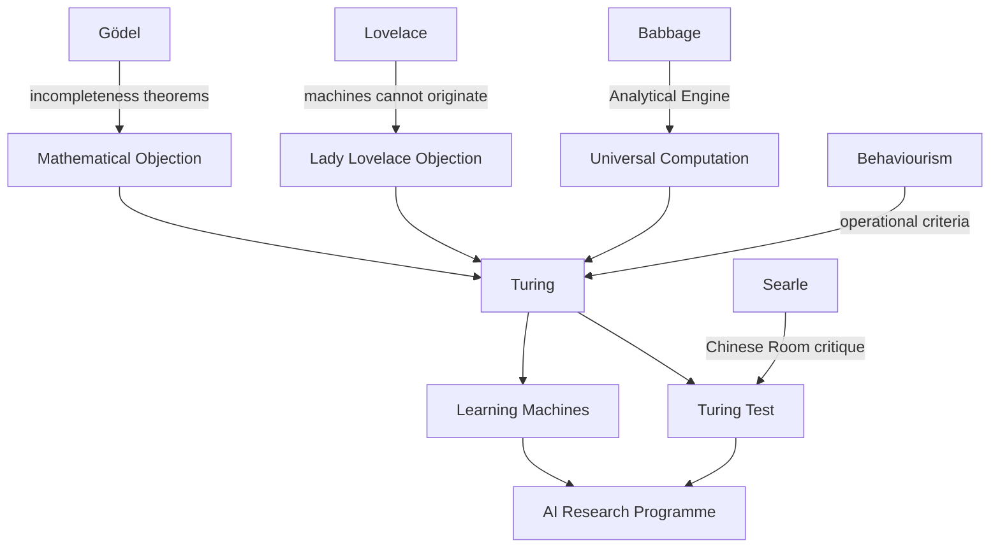

---

cssclasses:
  - Philosophy
subclasses:
  - Philosophy-of-Science
  - Epistemology
related:
  - "[[Searle]]"
  - "[[Wittgenstein]]"
  - "[[Gödel]]"
  - "[[Babbage]]"
  - "[[Lovelace]]"
aliases:
  - computing machinery
  - turing test
  - imitation game
  - machine thinking
  - lady lovelace
  - argument consciousness
  - learning machines
  - discretestate machines
  - universal digital
  - child machine
  - machine intelligence
  - thinking machines
reference:
  - Turing, A. M. (2009). Computing Machinery and Intelligence. In R. Epstein, G. Roberts, & G. Beber (Eds.), Parsing the Turing Test (pp. 23–65). Springer. https://doi.org/10.1007/978-1-4020-6710-5_3
tags:
  - Podcast
---

#### Podcast

<iframe allow="autoplay *; encrypted-media *; fullscreen *; clipboard-write" frameborder="0" height="150" style="width:100%;overflow:hidden;border-radius:10px;background:transparent;" sandbox="allow-forms allow-popups allow-same-origin allow-scripts allow-storage-access-by-user-activation allow-top-navigation-by-user-activation" src="https://embed.podcasts.apple.com/us/podcast/computing-machinery-and-intelligence/id1786764068?i=1000682466867&uo=4&l=en-GB&theme=auto"></iframe>

---

#### Central Problem

Can machines think? And if the question is too ambiguous, can it be replaced with an operational criterion — the "Imitation Game" — that avoids metaphysical disputes about consciousness while testing for intelligent behaviour indistinguishable from human performance?

#### Main Thesis

The question "Can machines think?" should be replaced by the question "Can a machine succeed in the Imitation Game?" — a test where an interrogator must distinguish between human and machine responses through written conversation. Turing predicts that by 2000, digital computers with 10⁹ bits of storage will play the game well enough that an average interrogator will have no more than 70% chance of correct identification after five minutes. Rather than defining "thinking," the test operationalises intelligent behaviour, and Turing systematically refutes nine objections to machine intelligence while proposing that *learning machines* modelled on child development offer the most promising path forward.

#### Historical Context

Writing in 1950 at the dawn of the computer age, Turing addresses the emerging question of artificial intelligence before the field had a name (the term "AI" was coined in 1956). Drawing on his theoretical work on computability (1936), his wartime experience with codebreaking machines, and his knowledge of Charles Babbage's Analytical Engine, Turing proposes a behaviourist criterion for machine intelligence that sidesteps philosophical disputes about consciousness and souls. The paper anticipates and responds to objections from theology, mathematics (Gödel's theorem), neuroscience, and philosophy of mind, establishing the conceptual framework for AI research.

#### Philosophical Lineage

#### Key Thinkers

| Thinker | Dates | Movement | Main Work | Core Concept |
|---------|-------|----------|-----------|--------------|
| [[Babbage]] | 1791–1871 | Computing Pioneer | Analytical Engine design | Universal mechanical computation |
| [[Lovelace]] | 1815–1852 | Computing Pioneer | Notes on Analytical Engine (1842) | "Machine can only do what we order" |
| [[Gödel]] | 1906–1978 | Mathematical Logic | Incompleteness Theorems (1931) | Limits of formal systems |
| [[Turing]] | 1912–1954 | Mathematical Logic/CS | "On Computable Numbers" (1936) | Turing Machine, computability |
| [[Searle]] | 1932–2025 | Philosophy of Mind | "Minds, Brains, and Programs" (1980) | Chinese Room argument against Turing Test |

#### Key Concepts

| Concept | Definition | Related to |
|---------|------------|------------|
| **Imitation Game** | Test where interrogator distinguishes human from machine through written Q&A; replaced by "Turing Test" | Behaviourism, operational criteria |
| **Discrete-state machine** | Machine that moves by sudden jumps between definite states; digital computers are examples | Universal machines, determinism |
| **Universal machine** | Digital computer capable of mimicking any discrete-state machine given adequate storage and programming | Church-Turing thesis |
| **Storage capacity** | Memory measured in binary digits; Turing estimates 10⁹ bits needed for intelligent behaviour | Brain analogy |
| **Learning machine** | Machine that modifies its behaviour through experience; Turing's proposed path to AI | Child machine, evolution |
| **Child machine** | Simple programme that learns like a child rather than simulating adult intelligence directly | Education, tabula rasa |
| **Lady Lovelace's objection** | Claim that machines can only do what we programme them to do, never originate anything | Creativity, learning |
| **Argument from consciousness** | Objection that machines cannot truly think without subjective experience | Solipsism, qualia |

#### Authors Comparison

| Theme | Alan Turing | Ada Lovelace | John Searle (later) |
|-------|-------------|--------------|---------------------|
| Can machines think? | Yes, operationally defined | No, only execute orders | No, syntax ≠ semantics |
| Test criterion | Behavioural indistinguishability | N/A | Insufficient |
| Role of learning | Essential path to intelligence | Not considered | Irrelevant to understanding |
| Consciousness | Avoids the question | N/A | Central to real thinking |
| Originality | Possible through learning | Impossible for machines | Impossible without intentionality |

#### Influences & Connections

- **Draws from**: [[Babbage]] (universal computation), [[Lovelace]] (objection to refute), [[Gödel]] (incompleteness), behaviourist psychology, information theory
- **Responds to**: Theological objection (souls), mathematical objection (Gödel), consciousness objection (Jefferson), Lady Lovelace objection, argument from informality of behaviour
- **Influences**: Artificial Intelligence research programme, cognitive science, philosophy of mind debates, [[Searle]]'s Chinese Room (as target)
- **Anticipates**: Machine learning, neural networks, child development models for AI, computational limits debates

#### Summary Formulas

1. **Operational Replacement**: "Can machines think?" → "Can machines pass the Imitation Game?"
2. **Universal Computation Thesis**: Any discrete-state machine can be mimicked by a digital computer with adequate storage
3. **Learning over Programming**: Better to build child machines that learn than to directly programme adult intelligence
4. **Prediction (1950)**: By 2000, machines with 10⁹ bits will fool average interrogators 30% of the time in 5 minutes
5. **Against Lovelace**: Machines can surprise us; learning allows going beyond explicit programming

#### Timeline

- **1822–1871**: [[Babbage]] designs Difference Engine and Analytical Engine
- **1842**: [[Lovelace]] writes Notes on Analytical Engine with famous objection
- **1931**: [[Gödel]] proves incompleteness theorems
- **1936**: Turing publishes "On Computable Numbers" (Turing Machine)
- **1943**: McCulloch & Pitts publish neural network model
- **1950**: Turing publishes "Computing Machinery and Intelligence"
- **1956**: Dartmouth Conference coins "Artificial Intelligence"
- **1980**: [[Searle]] publishes "Minds, Brains, and Programs" (Chinese Room)

#### Notable Quotes

> "I propose to consider the question, 'Can machines think?' This should begin with definitions of the meaning of the terms 'machine' and 'think.' [...] Instead of attempting such a definition I shall replace the question by another, which is closely related to it and is expressed in relatively unambiguous words." — [[Turing]]

> "I believe that in about fifty years' time it will be possible to programme computers, with a storage capacity of about 10⁹, to make them play the imitation game so well that an average interrogator will not have more than 70 per cent chance of making the right identification after five minutes of questioning." — [[Turing]]

> "We can only see a short distance ahead, but we can see plenty there that needs to be done." — [[Turing]]

---
> [!warning]-
> This annotation was normalised using a large language model and may contain inaccuracies. These texts serve as preliminary study resources rather than exhaustive references.
