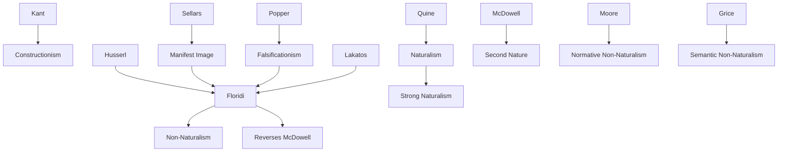

---
cssclasses:
  - Philosophy
  - Computer-Science
subclasses:
  - Epistemology
  - Philosophy-of-Science
  - Metaphysics
related:
  - "[[Philosophy as Conceptual Design (1 of 9)]]"
  - "[[Constructionism as Non-naturalism (2 of 9)]]"
  - "[[Perception and Testimony as Data Providers (3 of 9)]]"
  - "[[Information Quality (4 of 9)]]"
  - "[[Informational Scepticism and the Logically Possible (5 of 9)]]"
  - "[[A Defence of Information Closure (6 of 9)]]"
  - "[[Logical Fallacies as Bayesian Informational Shortcuts (7 of 9)]]"
  - "[[Maker’s Knowledge, between A Priori and A Posteriori (8 of 9)]]"
  - "[[Logic of Design as a Conceptual Logic of Information (9 of 9)]]"
aliases:
  - naturalism philosophy
  - constructionism naturalism
  - semantic artefacts
  - normative phenomena
  - semantic phenomena
  - explanatory closure
  - philosophy information
  - artefactual natural
  - strong naturalism
  - non naturalism
reference:
  - "Floridi, L. (2019). The logic of information: A theory of philosophy as conceptual design (First edition). Oxford University Press. (pp. 53-68)"
---
2
#### Central Problem

This chapter confronts a "strange predicament" in contemporary science: while science maintains a methodological commitment to naturalistic explanation (all natural phenomena explained solely by reference to other natural phenomena), it simultaneously depends on increasingly artificial Information and Communication Technologies that "denaturalize" the world. The search for ultimate explanations of the natural relies upon and promotes the development of the artificial—the non-natural. How can naturalism, understood as methodological closure of explanation within the natural, reconcile with the profoundly technological and constructed character of scientific knowledge?

The deeper problem concerns the scope and limits of naturalization itself. Floridi distinguishes between forms of naturalism that are "philosophically trivial" (anti-supernaturalism, which is correct but uninteresting) versus forms that are "mistaken" (anti-constructionism, which illegitimately seeks to reduce all phenomena to natural explanation). The central question becomes: are there phenomena—specifically normative and semantic phenomena—that resist naturalization without information loss?

The chapter thus addresses whether philosophy can maintain a foundational role distinct from scientific "assimilation," or whether [[Quine]]'s naturalized epistemology correctly predicts philosophy's absorption into empirical science.

#### Main Thesis

Floridi defends non-naturalism as a philosophically superior position to strong naturalism. His argument proceeds through several interconnected claims:

**Strong Naturalism Defined:** Strong naturalism (SN) holds that all natural phenomena are closed under explanation (C(NP)) and that no non-natural phenomena exist that cannot be reduced to natural phenomena. This amounts to claiming NNP (the set of non-natural phenomena) is empty.

**The RRQ Test:** The "Reasonably Reiterable Query" test distinguishes lossless from lossy explanations. A naturalistic explanation is lossless (non-reductive) if, after receiving it, asking "yes, but why...?" again would be unreasonable. Lossy explanations leave legitimate questions unanswered.

**Two Indefensible Non-Naturalisms:** Supernaturalism (explaining phenomena through paranormal/magical causes, e.g., Cottingley Fairies) and preternaturalism (phenomena from non-natural sources, e.g., augmented reality fairies) are fully naturalizable without information loss. The RRQ test shows no residual questions remain.

**Two Defensible Non-Naturalisms:** Normative and semantic phenomena resist naturalization. Asking why child pornography is immoral, or why Romeo and Juliet die (in the narrative sense), cannot be answered fully by natural explanation. The residual element requiring explanation is precisely what matters—"the contribution that the mind makes to the world."

**The Artefactual Nature of the Natural:** The meta-level analysis of naturalism itself is non-natural (semantic and normative). Our interpretation of "the natural" is a cultural, conceptual construction. "The non-natural is our first nature, and the natural is actually our second nature."

#### Historical Context

The chapter situates itself within the post-Quinean debate on naturalized epistemology. [[Quine]]'s 1969 "Epistemology Naturalized" initiated the contemporary naturalization movement, which peaked in the 1980s–1990s (as Ngram data shows) before declining. Floridi seizes this moment of reduced "heat" to reassess non-naturalism.

The text engages critically with the Anglo-American analytic tradition's "unquestioned Ur-philosophical thesis" of representationalism (traced to Platonic roots in Chapter 2). Against this, Floridi positions [[Kant]]'s constructivism: "we construct the world that we experience as we experience it; we do not mirror it."

The information revolution provides crucial context: as societies become increasingly technological, with "expert and intelligent handling of data and information" as the primary value-adding activity, the tension between naturalistic methodology and artificial means of inquiry becomes acute. The "arti-ficialization" of science creates the predicament this chapter addresses.

The chapter also invokes [[Sellars]]'s distinction between Manifest Image (normative-semantic environment built by minds) and Scientific Image, arguing both are real but irreducible to each other.

#### Philosophical Lineage

#### Key Thinkers

| Thinker | Dates | Movement | Main Work | Core Concept |
|---------|-------|----------|-----------|--------------|
| [[Quine]] | 1908–2000 | [[Analytic Philosophy]] | *Epistemology Naturalized* | Assimilation of epistemology to psychology |
| [[Kant]] | 1724–1804 | [[Transcendental Idealism]] | *Critique of Pure Reason* | Constructivism, phenomenal world |
| [[Sellars]] | 1912–1989 | [[Analytic Philosophy]] | *Philosophy and the Scientific Image* | Manifest vs Scientific Image |
| [[McDowell]] | 1942– | [[Neo-Kantianism]] | *Mind and World* | Second nature (reversed by Floridi) |
| [[Moore]] | 1873–1958 | [[Analytic Philosophy]] | *Principia Ethica* | Naturalistic fallacy |
| [[Popper]] | 1902–1994 | [[Critical Rationalism]] | *Logic of Scientific Discovery* | Falsificationism, constraints |

#### Key Concepts

| Concept | Definition | Related to |
|---------|------------|------------|
| Strong Naturalism (SN) | Thesis that C(NP) ∧ ¬∃x (x ∈ NNP): all phenomena closed under natural explanation, no non-natural phenomena exist | [[Quine]], Naturalization |
| Non-Naturalism (NN) | Thesis that C(NP) ∧ C(NNP) ∧ (A.1): both sets closed under respective explanations, non-natural irreducible | [[Floridi]], [[Moore]] |
| RRQ Test | Reasonably Reiterable Query: if asking "yes, but why...?" remains reasonable after explanation, the explanation is lossy | [[Floridi]], Epistemology |
| Lossless/Lossy Explanation | Non-reductive vs reductive explanation; whether all significant features are explained without residue | Data Compression Analogy |
| Closure Under Explanation | A set is closed if explaining any member only produces other members of the same set | Set Theory, Naturalism |
| Normative Phenomena | Phenomena (moral, ethical) that resist naturalization; "no ought from is" | [[Hume]], [[Moore]] |
| Semantic Phenomena | Phenomena of meaning that resist naturalization; internal narrative logic | [[Grice]], Hermeneutics |
| Artefactual Natural | The natural is itself a semantic construction, not given but made | [[Floridi]], Constructionism |

#### Authors Comparison

| Theme | [[Floridi]] | [[Quine]] |
|-------|-------------|-----------|
| Epistemology's fate | Foundational, irreducible | Assimilated to empirical psychology |
| Knowledge nature | Constructionist, poietic | Representationalist, receptive |
| Natural/Non-natural | Both closed; natural is artefactual | Only natural exists |
| Philosophy's role | Conceptual design, foundational | Continuous with science |
| Explanation | Semantic/normative residue remains | Full reduction possible |
| Mind's contribution | Primary, first nature | Derivative, eliminable |

#### Influences & Connections

- **Predecessors:** [[Floridi]] ← influenced by ← [[Kant]], [[Husserl]], [[Sellars]], [[Popper]], [[Lakatos]]
- **Contemporaries:** [[Floridi]] ↔ dialogue with ↔ [[McDowell]] (reverses direction), De Caro & Macarthur (liberal naturalism)
- **Opposing views:** [[Floridi]] ← criticizes ← [[Quine]] (assimilation), Strong Naturalism
- **Supporting traditions:** [[Moore]] → normative non-naturalism → [[Floridi]]; [[Grice]] → semantic non-naturalism → [[Floridi]]
- **Methodological allies:** [[Popper]] → falsificationism (constraints) → [[Floridi]]; [[Lakatos]] → research programmes → [[Floridi]]

#### Summary Formulas

- **[[Quine]]:** Naturalism assimilates epistemology to empirical psychology; philosophy ends where science begins; all phenomena reducible to natural explanation.

- **[[Floridi]] on Strong Naturalism:** C(NP) ∧ ¬∃x (x ∈ NNP)—all natural phenomena closed under explanation, no irreducible non-natural phenomena exist; this is either trivially correct (anti-supernaturalism) or mistaken (anti-constructionism).

- **[[Floridi]] on Non-Naturalism:** C(NP) ∧ C(NNP) ∧ (A.1)—both natural and non-natural phenomena closed under their respective explanations; normative and semantic phenomena resist lossless naturalization.

- **[[Floridi]]'s Conclusion:** The natural is artefactual—a semantic construction; "the non-natural is our first nature, and the natural is actually our second nature"; philosophy as foundationalism or assimilation, tertium non datur.

#### Timeline

| Year | Event |
|------|-------|
| 1917 | Cottingley Fairies photographs taken (later revealed as hoax) |
| 1969 | [[Quine]] publishes "Epistemology Naturalized" |
| 1963 | [[Sellars]] distinguishes Manifest and Scientific Images |
| 1978 | [[Lakatos]] publishes methodology of scientific research programmes |
| 1996 | [[McDowell]] publishes *Mind and World* (second nature) |
| 2007 | [[Maddy]] publishes *Second Philosophy* (naturalism programme) |
| 2009 | Fairy Trails augmented reality app released |
| 2010 | De Caro & Macarthur propose "liberal naturalism" |
| 2019 | [[Floridi]] publishes *The Logic of Information* |

#### Notable Quotes

> "The non-natural is our first nature, and the natural is actually our second nature. And this means that what we need is a genealogy of the natural from the non-natural, not vice versa." — [[Floridi]]

> "Naturalism is a user's philosophy: it endorses a primacy of ontology over epistemology and a representationalist/correspondentist interpretation of knowledge. Non-naturalism endorses a primacy of epistemology over ontology and a constructionist/correctness-based interpretation of knowledge." — [[Floridi]]

> "To be human is to refuse to accept the natural as naturalistic, and to take full responsibility for such a refusal." — [[Floridi]]

---
> [!warning]-
> This annotation was normalised using a large language model and may contain inaccuracies. These texts serve as preliminary study resources rather than exhaustive references.
