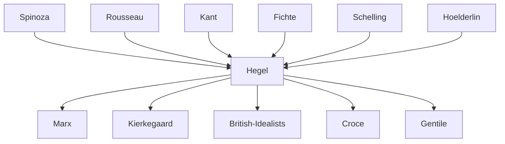

---
cssclasses:
  - Philosophy
subclasses:
  - 19th-Century-Philosophy
  - Metaphysics
  - Epistemology
aliases:
  - hegel
  - absolute idealism
  - dialectic
  - aufhebung
  - thesis antithesis
  - real rational
  - spirit idea
  - panlogism
  - absolute spirit
  - speculative reason
  - finite infinite
  - justificationism
contributions:
  - Conceptual
authors:
  - "[[Hegel]]"
  - "[[Kant]]"
  - "[[Fichte]]"
  - "[[Schelling]]"
  - "[[Spinoza]]"
  - "[[Rousseau]]"
reference: "[[04 The search for thought - Unit 9 Chapter 1.pdf]]"
---

#### Central Problem

The central problem Hegel confronts is the fundamental split (Entzweiung) between finite and infinite, subject and object, reason and reality, thought and being — a dichotomy that had plagued modern philosophy from Kant through Fichte and Schelling. How can philosophy overcome the rigid oppositions of the understanding (Verstand) — between universal and particular, freedom and necessity, individual and community, ideal and real — and attain genuine knowledge of the Absolute?

In his early theological-political writings, this problem takes the form of examining the relationship between inner religious-moral regeneration and outer political revolution. Hegel asks: how can genuine political transformation occur without a corresponding transformation of consciousness? The "positivity" of established religion — its external dogmas, rigid laws, and institutional forms — has severed humanity from the living spirit of love and communion originally preached by Jesus. The modern world has inherited the "unhappy consciousness" of Judaism, characterized by a divided existence in which God remains an alien, transcendent master and nature appears as hostile.

Against the Kantian dichotomy between duty and inclination, reason and sensibility, and against what Hegel sees as Fichte's "bad infinity" (an infinite striving that never attains its goal), Hegel seeks a philosophical comprehension of the Absolute as living totality — one in which all finite determinations are "moments" of infinite spirit's self-development.

#### Main Thesis

Hegel's system rests on three foundational theses:

**1. The Resolution of the Finite in the Infinite:** Reality is not an aggregate of independent substances but a unified organic totality (the Absolute) of which all finite entities are partial manifestations. The finite, as such, does not truly exist — what we call "finite" is merely an expression of the infinite. Just as a part cannot exist except in connection with the whole, so the finite exists only in and through the infinite. Unlike Spinoza's static Substance, however, Hegel's Absolute is a subject, a spiritual process that produces itself and only at the end reveals itself as what it truly is: Spirit.

**2. The Identity of Reason and Reality:** Hegel's famous aphorism — "What is rational is real; and what is real is rational" — expresses the complete identity of thought and being. Rationality is not mere abstraction or "ought-to-be" but the very substance of what exists; reality is not chaotic matter but the unfolding of a rational structure (the Idea or Reason). This manifests unconsciously in nature and consciously in humanity. Every aspect of the world, properly understood, reveals a network of necessary connections constituting the living articulation of the one Idea (panlogism).

**3. The Justificatory Function of Philosophy:** Philosophy's task is not to prescribe how the world ought to be but to comprehend what is, recognizing the rational structures constituting reality. Like Minerva's owl that takes flight at dusk, philosophy arrives only when reality has completed its formative process. Philosophy must "maintain peace with reality" and demonstrate the intrinsic rationality of what exists — including, most controversially, the state and political institutions.

**The Dialectical Method:** The Absolute's development follows a triadic rhythm of thesis (abstract moment), antithesis (dialectical or negative-rational moment), and synthesis (speculative or positive-rational moment). The Aufhebung ("sublation") simultaneously negates, preserves, and elevates each moment. The three partitions of philosophy correspond to the Idea's three moments: Logic (Idea in-itself), Philosophy of Nature (Idea outside-itself), Philosophy of Spirit (Idea returning to itself).

#### Historical Context

Georg Wilhelm Friedrich Hegel (1770-1831) was born in Stuttgart and studied philosophy and theology at Tübingen (1788-1793), where he formed crucial friendships with Schelling and Hölderlin. The French Revolution profoundly shaped his thought — with his Tübingen friends he planted a "liberty tree" and remained the most ardent defender of revolutionary principles. When Napoleon entered Jena in 1806, Hegel famously described him as "this world-soul riding through the city."

After working as a private tutor in Bern (1793-1796) and Frankfurt (1797-1800), Hegel moved to Jena in 1801, publishing his first philosophical work (*Difference between Fichte's and Schelling's Systems of Philosophy*) and collaborating with Schelling on the *Critical Journal of Philosophy*. The *Phenomenology of Spirit* (1807) marked his break with Schelling. After serving as gymnasium director in Nuremberg (1808-1816), Hegel became professor at Heidelberg (1816) and then Berlin (1818), where he achieved his greatest success until his death (probably from cholera) in 1831.

His early unpublished writings (*Life of Jesus*, *Positivity of the Christian Religion*, *Spirit of Christianity and Its Fate*) reveal a thinker grappling with the relationship between inner religious renewal and outer political transformation, heavily influenced by Rousseau, Lessing, and Spinoza. The German context was crucial: the intertwining of Protestant churches and German principalities meant religion and politics formed a single complex requiring reform.

#### Philosophical Lineage

#### Key Thinkers

| Thinker | Dates | Movement | Main Work | Core Concept |
|---------|-------|----------|-----------|--------------|
| [[Hegel]] | 1770-1831 | [[German Idealism]] | *Phenomenology of Spirit* | Absolute Spirit, dialectic |
| [[Kant]] | 1724-1804 | [[Critical Philosophy]] | *Critique of Pure Reason* | Finite reason, thing-in-itself |
| [[Fichte]] | 1762-1814 | [[German Idealism]] | *Doctrine of Science* | Absolute I, infinite striving |
| [[Schelling]] | 1775-1854 | [[German Idealism]] | *System of Transcendental Idealism* | Identity of nature and spirit |
| [[Spinoza]] | 1632-1677 | [[Rationalism]] | *Ethics* | Substance as static totality |
| [[Rousseau]] | 1712-1778 | [[Enlightenment]] | *Social Contract* | General will, political regeneration |

#### Key Concepts

| Concept | Definition | Related to |
|---------|------------|------------|
| Absolute | The infinite spiritual subject that is the totality of reality, revealing itself fully only at the end of its self-development as Spirit | [[Hegel]], [[German Idealism]] |
| Dialectic | The law governing both reality's development and its comprehension: thesis (affirmation), antithesis (negation), synthesis (negation of negation) | [[Hegel]], [[German Idealism]] |
| Aufhebung | "Sublation" — the dialectical process that simultaneously abolishes, preserves, and elevates each moment to a higher unity | [[Hegel]], [[Dialectic]] |
| Idea (Idee) | The Absolute conceived as the unity of thought and being, concept and object, subject and object; the rational structure of reality | [[Hegel]], [[German Idealism]] |
| Spirit (Geist) | The Idea returning to itself in humanity; the Absolute's self-consciousness achieved through human activity | [[Hegel]], [[German Idealism]] |
| Understanding (Verstand) | The lower faculty that fixes rigid, abstract determinations and holds them apart according to identity and non-contradiction | [[Hegel]], [[Kant]] |
| Speculative Reason (Vernunft) | The higher faculty that grasps the unity of opposites, fluidifying the rigid determinations of understanding | [[Hegel]], [[German Idealism]] |
| Panlogism | The doctrine of the identity of real and rational: reality is thoroughly constituted by necessary rational connections | [[Hegel]], [[German Idealism]] |
| Bad Infinity | False infinity (Fichte's infinite striving) that never attains its goal, perpetually postponing completion | [[Hegel]], [[Fichte]] |
| Positivity | External, institutional, dogmatic form of religion that has lost living spiritual content; the letter that kills the spirit | [[Hegel]], Early writings |

#### Authors Comparison

| Theme | [[Kant]] | [[Fichte]] | [[Schelling]] | [[Hegel]] |
|-------|---------|-----------|--------------|----------|
| The Absolute | Unknowable thing-in-itself | Absolute I as infinite striving | Identity of subject/object | Spirit as self-developing totality |
| Finite/Infinite | Unbridgeable separation | Infinite as goal never attained | Static identity | Finite resolved in infinite |
| Reason/Reality | Perpetual gap (ought vs. is) | Ideal perpetually pursued | Immediate identity | Complete dialectical identity |
| Method | Critique, transcendental analysis | Genetic deduction | Intellectual intuition | Speculative dialectic |
| Nature | Mechanically determined appearance | Obstacle for moral action | Visible spirit, autonomous | Idea's alienation, externality |
| Philosophy's task | Limiting knowledge to make room for faith | Deducing consciousness from I | Grasping absolute identity | Comprehending what is |

#### Influences & Connections

- **Predecessors:** [[Hegel]] ← influenced by ← [[Kant]] (critical method), [[Fichte]] (dialectical I), [[Schelling]] (identity philosophy), [[Spinoza]] (substance), [[Rousseau]] (political theory)
- **Contemporaries:** [[Hegel]] ↔ dialogue then rupture with ↔ [[Schelling]]; [[Hegel]] ↔ friendship with ↔ [[Hoelderlin]], [[Goethe]]
- **Followers:** [[Hegel]] → influenced → [[Marx]] (dialectic, history), [[Kierkegaard]] (critique), British Idealists (Bradley, Green), Italian neo-idealists ([[Croce]], [[Gentile]])
- **Opposing views:** [[Hegel]] ← criticized by ← [[Schopenhauer]] ("charlatan"), [[Kierkegaard]] (system vs. existence), [[Marx]] (ideological mystification)

#### Summary Formulas

- **[[Hegel]]:** The real is rational and the rational is real — philosophy comprehends the Absolute as Spirit that develops dialectically through nature and history, attaining full self-consciousness in art, religion, and philosophy.

- **[[Kant]]:** Reason cannot know the Absolute; its ideas are merely regulative, and an unbridgeable gap separates the phenomenal world of experience from the noumenal realm of things-in-themselves.

- **[[Fichte]]:** The Absolute I posits itself and the non-I in an infinite striving toward self-identity that is never fully realized — the ought always exceeds the is.

- **[[Schelling]]:** The Absolute is the immediate identity of nature and spirit, subject and object — but this identity remains static and fails to explain the emergence of difference and multiplicity.

#### Timeline

| Year | Event |
|------|-------|
| 1770 | [[Hegel]] born in Stuttgart |
| 1788 | [[Hegel]] begins theological studies at Tübingen; meets [[Schelling]] and [[Hoelderlin]] |
| 1789 | French Revolution begins; [[Hegel]] and friends plant liberty tree |
| 1793-1796 | [[Hegel]] works as private tutor in Bern; writes *Life of Jesus*, *Positivity of the Christian Religion* |
| 1797-1800 | [[Hegel]] in Frankfurt; writes *Spirit of Christianity and Its Fate* |
| 1801 | [[Hegel]] publishes *Difference between Fichte's and Schelling's Systems* |
| 1802 | [[Hegel]] publishes *Faith and Knowledge* in *Critical Journal of Philosophy* |
| 1806 | Napoleon enters Jena; [[Hegel]] sees "world-soul on horseback" |
| 1807 | [[Hegel]] publishes *Phenomenology of Spirit*; breaks with [[Schelling]] |
| 1812-1816 | [[Hegel]] publishes *Science of Logic* |
| 1817 | [[Hegel]] publishes *Encyclopedia of the Philosophical Sciences* |
| 1818 | [[Hegel]] becomes professor in Berlin |
| 1821 | [[Hegel]] publishes *Elements of the Philosophy of Right* |
| 1831 | [[Hegel]] dies in Berlin, probably of cholera |

#### Notable Quotes

> "What is rational is real; and what is real is rational." — [[Hegel]]

> "The true is the whole. But the whole is merely the essence completing itself through its development. Of the Absolute it must be said that it is essentially result, that only at the end is it what it truly is." — [[Hegel]]

> "Philosophy always arrives too late to give instruction on how the world ought to be. It paints its grey in grey only when a form of life has grown old... The owl of Minerva begins its flight only with the falling of dusk." — [[Hegel]]

#### See Also

- [[German Idealism]]
- [[Dialectic]]
- [[Phenomenology of Spirit]]
- [[Science of Logic]]
- [[Philosophy of Right]]
- [[Absolute Spirit]]
- [[Marx]]
- [[Kierkegaard]]
- [[Neo-Hegelianism]]
- [[French Revolution]]

> [!NOTE]
> *This summary has been created to present the key points from the source text, which was automatically extracted using LLM. Please note that the summary may contain errors. It serves as an essential starting point for study and reference purposes.*
