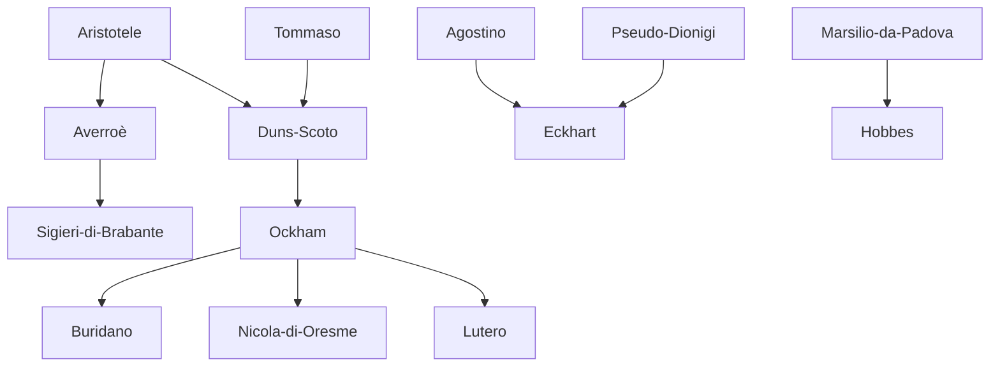

---
cssclasses:
  - Philosophy
subclasses:
  - Medieval-and-Renaissance-Philosophy
  - Epistemology
  - Social-and-Political-Philosophy
related:
  - "[[Scholasticism]]"
  - "[[Nominalism]]"
  - "[[Averroism]]"
  - "[[Voluntarism]]"
  - "[[Fideism]]"
  - "[[Natural Law]]"
  - "[[Legal Positivism]]"
  - "[[Medieval Political Philosophy]]"
  - "[[Mysticism]]"
  - "[[Ockham's Razor]]"
  - "[[Problem of Universals]]"
  - "[[Faith and Reason]]"
aliases:
  - double truth
reference:
  - "Abbagnano, N., & Fornero, G. (2012). La ricerca del pensiero. Vol. 1B. Dall'ellenismo alla scolastica. Paravia."
---

#### Central Problem

The central problem of late Scholasticism is the progressive dissolution of the faith-reason synthesis that had been the animating project of medieval philosophy. While [[Tommaso]] had established harmony between philosophical inquiry and revealed truth, subsequent thinkers increasingly questioned whether such synthesis was possible or even desirable.

The problem manifests across multiple dimensions: epistemologically, can human reason truly demonstrate theological truths, or does rigorous Aristotelian demonstration reveal the limits of rational theology? Metaphysically, do universal concepts correspond to real essences, or are they merely mental signs referring to particular things? Politically, does the Church possess legitimate authority over temporal affairs, or should spiritual and secular powers remain radically separate?

The crisis is both internal and external. Internally, the application of Aristotelian standards of demonstrative science to theological claims reveals that most religious doctrines cannot be proven but only believed. Externally, the decline of empire and papacy, the rise of national monarchies and mercantile classes, and the emergence of secular intellectual culture all challenge the institutional framework within which Scholasticism had flourished.

#### Main Thesis

The late Scholastic thinkers develop several interconnected theses that collectively dissolve the classical Scholastic synthesis:

**[[Sigieri di Brabante]] and Double Truth:** The Averroist doctrine holds that truths of philosophy and truths of faith may contradict each other, each valid in its own domain. This directly opposes the Thomistic harmony of faith and reason, suggesting that what is philosophically demonstrable (e.g., the eternity of the world) may contradict what faith requires (creation in time).

**[[Duns Scoto]]'s Separation of Theoretical and Practical:** For the "Subtle Doctor," theology belongs entirely to the practical domain—it concerns what we should do for salvation, not what we can demonstrate. Metaphysics alone is theoretical science in the strict sense. Faith has nothing to do with science; its certainty is "practical," founded on free acceptance rather than rational demonstration. Many divine attributes (God's life, wisdom, will, causality, infinity) and the immortality of the soul are indemonstrable.

**[[Ockham]]'s Radical Empiricism:** All knowledge derives from intuitive cognition of particular existing things. Since we have no intuitive knowledge of God or supernatural realities, theology cannot be science. The "articles of faith are not principles of demonstration nor conclusions, and are not even probable, since they appear false to all or to most or to the wise." Faith and science are radically heterogeneous and cannot coexist.

**Nominalism and the Razor:** Universals exist only in the intellect as natural signs (*signa naturalia*) of classes of particular things. The principle of economy ("Ockham's Razor") forbids multiplying entities beyond necessity, eliminating the metaphysical apparatus of real universals, substantial forms, and final causes.

**Voluntarist Theology:** God's will is absolutely free, bound by no prior rational order. What is good is good because God wills it; the world could have been created entirely differently. This undermines attempts to discover necessary metaphysical truths about creation.

**[[Marsilio da Padova]]'s Political Positivism:** Law is not natural inclination or divine command but coercive precept established by human authority. The only legislator is the people (*populus* or *pars valentior*). Church authority is limited to spiritual matters; clergy are subject to civil law like all other citizens.

#### Historical Context

The fourteenth century witnesses what historian Johan Huizinga called "the autumn of the Middle Ages." The two pillars of medieval order—papacy and empire—both enter terminal decline. Pope Boniface VIII's attempt to restore papal theocracy fails spectacularly; Emperor Henry VII's effort to revive imperial prestige proves equally futile. The Avignon papacy (1309-1377) subjects the Church to French royal interests, provoking fierce criticism from Franciscan spirituals and imperial theorists alike.

The real protagonists of the new era are the national monarchies of France, England, and emerging territorial states, which strengthen their institutional, military, and bureaucratic structures. Simultaneously, proto-capitalist and proto-bourgeois mercantile classes rise to prominence in Italian cities and transalpine states. Though not yet exercising high-level political leadership, their influence grows steadily, and their intellectuals begin to challenge ecclesiastical monopoly over culture.

The condemnation of 1277 by Bishop Étienne Tempier at Paris targeted both Averroist and some Thomistic propositions, signaling official anxiety about philosophical autonomy. The controversy over apostolic poverty pitted Franciscan spirituals against Pope John XXII, leading [[Ockham]] and Michael of Cesena to flee Avignon for the protection of Emperor Ludwig of Bavaria.

Within this context, the consciousness of limits that philosophical inquiry encounters when attempting to explain Catholic dogmas grows rapidly. What [[Duns Scoto]] had begun—using Aristotelian standards to restrict rational theology—[[Ockham]] carries to its logical conclusion: the complete separation of philosophy and faith.

#### Philosophical Lineage

#### Key Thinkers

| Thinker | Dates | Movement | Main Work | Core Concept |
|---------|-------|----------|-----------|--------------|
| [[Sigieri di Brabante]] | 1240-1284 | [[Averroism]] | *De anima intellectiva* | Double truth |
| [[Duns Scoto]] | 1266-1308 | [[Scholasticism]] | *Opus Oxoniense* | Haecceitas |
| [[Roger Bacon]] | 1214-1292 | [[Experimentalism]] | *Opus maius* | Experience and mathematics |
| [[Ockham]] | 1290-1349 | [[Nominalism]] | *Summa logicae* | [[Ockham]]'s Razor |
| [[Marsilio da Padova]] | 1275-1343 | [[Political Philosophy]] | *Defensor pacis* | Popular sovereignty |
| [[Eckhart]] | 1260-1327 | [[Mysticism]] | *German Sermons* | Divine spark |

#### Key Concepts

| Concept | Definition | Related to |
|---------|------------|------------|
| Double truth | Doctrine that philosophical and theological truths may contradict; each valid in its domain | [[Sigieri di Brabante]], [[Averroism]] |
| Haecceitas | "Thisness"; the principle of individuation that makes a thing this particular thing | [[Duns Scoto]], [[Metaphysics]] |
| Intuitive cognition | Direct knowledge of an object present in its real existence, foundation of all knowledge | [[Ockham]], [[Epistemology]] |
| Abstractive cognition | Knowledge that abstracts from the real existence of its object; derived from intuitive cognition | [[Ockham]], [[Duns Scoto]] |
| Suppositio | The semantic dimension of terms in propositions; terms "stand for" (supposit) their referents | [[Ockham]], [[Logic]] |
| [[Ockham]]'s Razor | Principle of parsimony: entities should not be multiplied beyond necessity | [[Ockham]], [[Nominalism]] |
| Voluntarism | The primacy of will over intellect; God's will creates moral law without rational constraints | [[Duns Scoto]], [[Ockham]] |
| Natural sign | Concept as sign naturally produced by things themselves, predicable of many particulars | [[Ockham]], [[Nominalism]] |
| Pars valentior | The "weightier part" of citizens that constitutes the legitimate legislator | [[Marsilio da Padova]], [[Political Philosophy]] |
| Legal positivism | Law is valid because imposed by authority, not because conforming to natural justice | [[Marsilio da Padova]], [[Philosophy-of-Law]] |

#### Authors Comparison

| Theme | [[Duns Scoto]] | [[Ockham]] | [[Marsilio da Padova]] |
|-------|----------------|------------|------------------------|
| Faith and reason | Separated; theology is practical, not theoretical | Radically heterogeneous; theology is not science | Separate domains; Church has no temporal authority |
| Universals | Common nature, indifferent to universality and individuality | Mental signs only; no real universals | Not a primary concern |
| Knowledge of God | Limited; many attributes indemonstrable | Impossible by natural reason; faith alone | Outside scope of political inquiry |
| Will vs intellect | Will is free, not determined by intellect | Radical voluntarism; will is self-determining | Human will establishes positive law |
| Causality | Accepted but carefully qualified | Empirically grounded; final causes rejected | Irrelevant to legal validity |
| Political authority | Not a primary concern | Church should be spiritual community only | People are sole legitimate legislator |

#### Influences & Connections

- **Predecessors:** [[Ockham]] ← influenced by ← [[Duns Scoto]], [[Aristotele]], [[Pietro Aureolo]]
- **Predecessors:** [[Marsilio da Padova]] ← influenced by ← [[Aristotele]], [[Averroè]]
- **Contemporaries:** [[Ockham]] ↔ allied with ↔ [[Marsilio da Padova]] at Ludwig's court
- **Contemporaries:** [[Ockham]] ← opposed ↔ Pope John XXII
- **Followers:** [[Ockham]] → influenced → [[Buridano]], [[Nicola di Oresme]], [[Lutero]]
- **Followers:** [[Marsilio da Padova]] → influenced → [[Hobbes]], modern legal positivism
- **Opposing views:** [[Ockham]] ← criticized by ← Thomist and Scotist schools

#### Summary Formulas

- **[[Sigieri di Brabante]]:** Philosophy and faith may reach contradictory conclusions, each valid in its own domain; reason demonstrates what faith may deny.
- **[[Duns Scoto]]:** Theology is entirely practical, concerning salvation, not theoretical demonstration; faith has no scientific basis but is freely accepted; individuation comes through haecceitas, not matter.
- **[[Ockham]]:** Only particular things exist; universals are natural signs in the mind; all knowledge derives from intuitive experience; theological truths are neither demonstrable nor even probable to natural reason; God's will is absolutely free.
- **[[Marsilio da Padova]]:** The people are the sole legislator; law is coercive precept, not natural inclination; clergy are subject to civil authority in temporal matters; the pope has no supreme power.
- **[[Eckhart]]:** The soul must negate its creaturely nature to be reborn as an element of divine life; God is known only through mystical union, not rational demonstration.

#### Timeline

| Year | Event |
|------|-------|
| 1266/1274 | [[Duns Scoto]] born in Scotland |
| 1270 | Bishop Tempier condemns 13 Averroist propositions at Paris |
| 1277 | Bishop Tempier condemns 219 propositions, including some Thomistic ones |
| 1284 | Death of [[Sigieri di Brabante]] |
| 1290 | [[Ockham]] born in Surrey, England |
| 1292 | Death of [[Roger Bacon]] |
| 1308 | Death of [[Duns Scoto]] at Cologne |
| 1324 | [[Ockham]] summoned to Avignon; [[Marsilio da Padova]] completes *Defensor pacis* |
| 1326 | Papal commission censures 51 articles from [[Ockham]]'s writings |
| 1327 | Death of [[Eckhart]] |
| 1328 | [[Ockham]] flees Avignon with Michael of Cesena |
| 1343 | Death of [[Marsilio da Padova]] |
| 1348/49 | Death of [[Ockham]] in Bavaria |

#### Notable Quotes

> "The articles of faith are not principles of demonstration nor conclusions and are not even probable, since they appear false to all or to most or to the wise." — [[Ockham]]

> "The legislator, or the first and efficient cause of law, is the people or the whole body of citizens or its weightier part." — [[Marsilio da Padova]]

> "We cannot see God unless we see all things and ourselves as pure nothing." — [[Eckhart]]

---
> [!warning]-
> This annotation was normalised using a large language model and may contain inaccuracies. These texts serve as preliminary study resources rather than exhaustive references.
