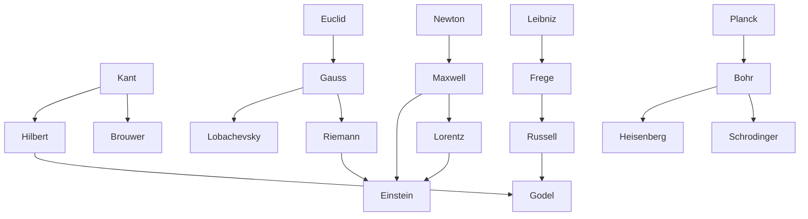

---
cssclasses:
  - Philosophy
  - Physical-Sciences
  - Mathematics
subclasses:
  - Philosophy-of-Science
  - Epistemology
  - Logic-and-Philosophy-of-Logic
related:
  - "[[Philosophy of Mathematics]]"
  - "[[Philosophy of Physics]]"
  - "[[Set Theory]]"
  - "[[Quantum Mechanics]]"
  - "[[Theory of Relativity]]"
  - "[[Vienna Circle]]"
  - "[[Logical Positivism]]"
  - "[[Kant]]"
  - "[[Scientific Revolution]]"
  - "[[Epistemology]]"
aliases:
  - crisis foundations
  - non euclidean
  - relativity theory
  - quantum mechanics
  - incompleteness theorem
  - uncertainty principle
  - set theory
  - field theory
reference:
  - "Abbagnano, N., & Fornero, G. (2012). La ricerca del pensiero. Vol. 3A. Da Schopenhauer a Freud. Paravia."
---

#### Central Problem

The late nineteenth and early twentieth centuries witnessed a profound crisis in the foundations of both mathematics and physics — the two pillars of scientific certainty since antiquity. In mathematics, the discovery of non-Euclidean geometries shattered the belief that Euclidean geometry represented the necessary a priori structure of space (as [[Kant]] had claimed). This led to the urgent "problem of foundations": if geometry could no longer serve as the secure base for mathematics, what could? Three competing programs emerged — logicism, formalism, and intuitionism — each attempting to secure mathematical truth on new foundations.

Simultaneously, physics confronted the incompatibility between Newtonian mechanics and Maxwell's electromagnetic field theory, leading to [[Einstein]]'s revolutionary theories of relativity that transformed our understanding of space, time, and gravity. The discovery of quantum phenomena further challenged classical physics, revealing that at atomic scales, continuity gives way to discreteness, determinism yields to probability, and the very act of observation alters what is observed.

The chapter explores how these twin revolutions undermined the Enlightenment confidence in scientific certainty while paradoxically advancing scientific knowledge into realms far beyond common-sense intuition.

#### Main Thesis

The crisis of foundations reveals that scientific knowledge cannot achieve absolute certainty, yet this limitation is itself a kind of knowledge. The chapter traces three interrelated developments:

**The Plurality of Geometries:** Non-Euclidean geometries (Lobachevsky's hyperbolic geometry where parallel lines diverge; Riemann's elliptic geometry where no parallel lines exist) demonstrated that Euclidean geometry is not the unique necessary structure of space. [[Hilbert]]'s axiomatic approach further abstracted geometry, defining points, lines, and planes purely through their formal relations rather than intuitive content.

**The Foundations Crisis in Mathematics:** The program of "arithmetization" sought to reduce all mathematics to arithmetic. Frege's logicism attempted to reduce arithmetic itself to pure logic, defining numbers through the extension of concepts. [[Russell]]'s paradox (the class of all classes that don't contain themselves) revealed fatal inconsistencies in naive set theory. [[Russell]]'s "theory of types" and [[Hilbert]]'s "metamathematics" attempted repairs, but Gödel's incompleteness theorems (1931) proved that any sufficiently powerful formal system is either incomplete (contains undecidable propositions) or inconsistent. This represented a "revenge of Kantianism" — the reality of limits reasserted itself against aspirations to absolute foundations.

**The New Physics:** Maxwell's electromagnetic field theory replaced [[Newton]]'s action-at-distance with continuous fields propagating through space. [[Einstein]]'s special relativity (1905) unified space and time into a four-dimensional continuum, establishing the constancy of light speed and the relativity of simultaneity. General relativity (1915) reinterpreted gravity as spacetime curvature produced by matter. Quantum theory, initiated by Planck's quantization of energy (1900), revealed matter and energy's discrete, granular structure. Bohr's atomic model, de Broglie's wave-particle duality, Schrödinger's wave mechanics, and Heisenberg's uncertainty principle established that position and momentum cannot be simultaneously determined with arbitrary precision.

The cumulative effect was to distance scientific knowledge from common-sense intuition while demonstrating that limits to knowledge can themselves be rigorously known.

#### Historical Context

The late nineteenth century appeared as a period of scientific triumphalism. Physics seemed near completion with the unification of electricity, magnetism, and optics in Maxwell's equations (1860s). Mathematics was being systematically unified through arithmetization, with Weierstrass, Dedekind, and [[Cantor]] providing rigorous foundations for analysis using set-theoretic methods.

Yet contradictions lurked beneath the surface. The incompatibility of Newtonian mechanics (with its absolute space and time) and electromagnetic theory (requiring an immobile "luminiferous ether") became evident through the Michelson-Morley experiments (1881-1904), which failed to detect any motion relative to the ether. Lorentz proposed that motion through ether caused physical contraction, but [[Einstein]] cut the Gordian knot by abandoning absolute simultaneity altogether.

In mathematics, the discovery of paradoxes (Russell's paradox, 1902) threatened the entire logicist program just as Frege was completing his life's work on the logical foundations of arithmetic. The "Kantian" intuition — that mathematics concerns our mode of knowing rather than objective reality — found new expression in Brouwer's intuitionism, which rejected logical foundations in favor of the mind's temporal construction of mathematical objects.

The First World War and its aftermath provided the cultural context for these intellectual upheavals. The crisis of European civilization mirrored the crisis of scientific foundations — certainties dissolving, absolute reference frames disappearing, the observer becoming implicated in observation.

#### Philosophical Lineage

#### Key Thinkers

| Thinker | Dates | Movement | Main Work | Core Concept |
|---------|-------|----------|-----------|--------------|
| [[Frege]] | 1848-1925 | [[Logicism]] | *Foundations of Arithmetic* | Logical definition of number |
| [[Russell]] | 1872-1970 | [[Logicism]] | *Principia Mathematica* | [[Russell]]'s paradox, theory of types |
| [[Hilbert]] | 1862-1943 | [[Formalism]] | *Foundations of Geometry* | Axiomatic method, metamathematics |
| [[Brouwer]] | 1881-1966 | [[Intuitionism]] | *On the Foundations of Mathematics* | Intuition as foundation, rejection of excluded middle |
| [[Gödel]] | 1906-1978 | [[Mathematical Logic]] | *On Formally Undecidable Propositions* | Incompleteness theorems |
| [[Cantor]] | 1845-1918 | [[Set Theory]] | *Contributions to the Founding of Transfinite Numbers* | Transfinite numbers, set theory |
| [[Einstein]] | 1879-1955 | [[Relativity]] | *On the Electrodynamics of Moving Bodies* | Special and general relativity |
| [[Planck]] | 1858-1947 | [[Quantum Theory]] | *On the Law of Distribution of Energy* | Energy quantization |
| [[Bohr]] | 1885-1962 | [[Quantum Theory]] | *On the Constitution of Atoms and Molecules* | Quantized electron orbits |
| [[Heisenberg]] | 1901-1976 | [[Quantum Theory]] | *On Quantum-Theoretical Reinterpretation* | Uncertainty principle, matrix mechanics |

#### Key Concepts

| Concept | Definition | Related to |
|---------|------------|------------|
| Non-Euclidean Geometry | Geometries where [[Euclid]]'s parallel postulate fails; hyperbolic (Lobachevsky) or elliptic (Riemann) | [[Riemann]], [[Lobachevsky]] |
| Logicism | Program to reduce mathematics to pure logic; numbers defined via concept extensions | [[Frege]], [[Russell]] |
| [[Russell]]'s Paradox | The class of all classes not containing themselves is self-contradictory | [[Russell]], [[Set Theory]] |
| Formalism | Mathematics as manipulation of symbols according to rules; consistency via metamathematics | [[Hilbert]], [[Mathematics]] |
| Intuitionism | Mathematics founded on temporal intuition; rejects law of excluded middle for infinite domains | [[Brouwer]], [[Kant]] |
| Incompleteness Theorems | Any consistent formal system containing arithmetic has undecidable propositions | [[Gödel]], [[Logic]] |
| Special Relativity | Space-time as four-dimensional continuum; constancy of light speed; relativity of simultaneity | [[Einstein]], [[Physics]] |
| General Relativity | Gravity as spacetime curvature; no privileged reference frames | [[Einstein]], [[Riemann]] |
| Quantum | Discrete unit of energy; energy exchanged in packets proportional to frequency | [[Planck]], [[Bohr]] |
| Uncertainty Principle | Position and momentum cannot be simultaneously determined with arbitrary precision | [[Heisenberg]], [[Quantum Theory]] |

#### Authors Comparison

| Theme | [[Frege]]/[[Russell]] | [[Hilbert]] | [[Brouwer]] | [[Einstein]] |
|-------|----------------------|-------------|-------------|--------------|
| Goal | Reduce mathematics to logic | Prove consistency of mathematics | Found mathematics on intuition | Unify physics |
| Method | Logical derivation | Axiomatic formalization | Mental construction | Thought experiments, mathematics |
| Foundation | Logic and set theory | Metamathematics | Temporal intuition | Physical principles |
| Attitude to infinity | Actual infinity accepted | Infinity as ideal element | Only potential infinity | Spacetime as continuum |
| Fate of program | Failed (Russell's paradox, Gödel) | Failed (Gödel) | Marginalized but vindicated | Successful but incomplete |

#### Influences & Connections

- **Predecessors:** [[Gödel]] ← influenced by ← [[Hilbert]], [[Russell]], [[Frege]]
- **Predecessors:** [[Einstein]] ← influenced by ← [[Maxwell]], [[Lorentz]], [[Riemann]], [[Mach]]
- **Predecessors:** [[Brouwer]] ← influenced by ← [[Kant]]
- **Contemporaries:** [[Bohr]] ↔ debate with ↔ [[Einstein]] (quantum interpretation)
- **Contemporaries:** [[Hilbert]] ↔ debate with ↔ [[Brouwer]] (foundations of mathematics)
- **Followers:** [[Einstein]] → influenced → [[Quantum Field Theory]], [[Cosmology]]
- **Followers:** [[Gödel]] → influenced → [[Computer Science]], [[Philosophy of Mind]]

#### Summary Formulas

- **[[Gödel]]:** Any formal system powerful enough to express arithmetic is either incomplete (contains undecidable propositions) or inconsistent — the dream of absolute foundations is impossible.
- **[[Einstein]]:** Space and time form a unified four-dimensional continuum; the laws of physics must be the same for all observers regardless of their state of motion.
- **[[Heisenberg]]:** The uncertainty principle establishes that position and momentum cannot be simultaneously determined with arbitrary precision — the act of observation disturbs what is observed.
- **[[Hilbert]]:** Mathematics can be secured through axiomatic formalization and metamathematical proof of consistency — though Gödel proved this program unrealizable.
- **[[Brouwer]]:** Mathematics rests on the intuition of time; mathematical objects exist only insofar as they can be mentally constructed in a finite number of steps.

#### Timeline

| Year | Event |
|------|-------|
| 1826-1830 | [[Lobachevsky]] and [[Bolyai]] independently develop hyperbolic geometry |
| 1854 | [[Riemann]] presents elliptic geometry and differential geometry |
| 1872 | [[Dedekind]] and [[Cantor]] provide arithmetical foundations of real numbers |
| 1884 | [[Frege]] publishes *Foundations of Arithmetic* |
| 1899 | [[Hilbert]] publishes *Foundations of Geometry* |
| 1900 | [[Planck]] introduces energy quantization |
| 1902 | [[Russell]] discovers paradox in set theory |
| 1905 | [[Einstein]] publishes special relativity theory |
| 1910-1913 | [[Russell]] and [[Whitehead]] publish *Principia Mathematica* |
| 1913 | [[Bohr]] proposes quantized atomic model |
| 1915 | [[Einstein]] completes general relativity |
| 1925-1926 | [[Heisenberg]] and [[Schrödinger]] develop quantum mechanics |
| 1927 | [[Heisenberg]] formulates uncertainty principle |
| 1931 | [[Gödel]] proves incompleteness theorems |

#### Notable Quotes

> "God does not play dice." — [[Einstein]]

> "If a system pretends to demonstrate its own non-contradictoriness, it becomes incoherent; if it chooses to preserve its internal coherence, it cannot ground itself and remains necessarily incomplete." — [[Gödel]] (paraphrase)

> "Against positivism, which halts at phenomena — 'there are only facts' — I would say: no, facts are precisely what there are not, only interpretations." — [[Nietzsche]] (precursor)

---
> [!NOTE]
> *This summary has been created to present the key points from the source text, which was automatically extracted using LLM. Please note that the summary may contain errors. It serves as an essential starting point for study and reference purposes.*
