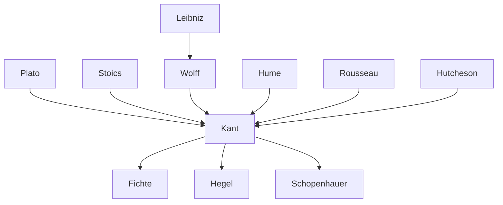

---
cssclasses:
  - Philosophy
subclasses:
  - Ethics
  - Epistemology
  - 17th-18th-Century-Philosophy
related:
  - "[[Critique of Pure Reason]]"
  - "[[Groundwork of the Metaphysics of Morals]]"
  - "[[Categorical Imperative]]"
  - "[[Deontological Ethics]]"
  - "[[Autonomy]]"
  - "[[German Idealism]]"
  - "[[Enlightenment Philosophy]]"
  - "[[Moral Philosophy]]"
  - "[[Freedom and Determinism]]"
  - "[[Practical Reason]]"
aliases:
  - practical reason
  - categorical imperative
  - moral law
  - duty ethics
  - pure practical
  - kingdom ends
  - good will
  - deontological ethics
  - moral philosophy
  - freedom morality
reference:
  - "[Abbagnano, N., & Fornero, G. (2012). La ricerca del pensiero. Vol. 2B. Dall'Illuminismo a Hegel. Paravia.](https://archive.org/download/ssp-s04-e08/The%20search%20for%20thought%20-%20Unit%207%20Chapter%203.pdf)"
tags:
  - Podcast
---

#### Podcast

<iframe src="https://archive.org/embed/ssp-s04-e08" width="100%" height="30" frameborder="0" webkitallowfullscreen="true" mozallowfullscreen="true" allowfullscreen></iframe>

---

#### Central Problem

The *Critique of Practical Reason* (1788) addresses the fundamental question of how moral action is possible and what constitutes the foundation of ethics. [[Kant]] investigates how pure reason, independent of experience and sensibility, can determine the will and guide human conduct. The central tension lies between reason and sensibility: humans are beings torn between rational moral demands and sensible inclinations.

The work examines whether morality requires a pure practical reason that operates independently from empirical conditions (pathological determinations), or whether all practical reason is merely instrumental, serving our sensible desires. [[Kant]] argues that if morality exists at all, it must be unconditional (*unbedingt*) — that is, it must presuppose a practical reason capable of freeing itself from sensible inclinations and guiding conduct in a stable, universal manner.

Unlike the *Critique of Pure Reason*, which criticized theoretical reason's illegitimate pretensions to transcend experience, the *Critique of Practical Reason* criticizes empirical practical reason's pretension to be the sole motive of action. Pure practical reason operates legitimately *a priori* and does not need criticism in its pure part because it obeys a universal law.

#### Main Thesis

[[Kant]]'s central thesis is that pure reason can be practical — that is, reason alone, without any empirical motives, can determine the will. The moral law is given as a "fact of pure reason" (*Factum der Vernunft*) of which we are conscious *a priori* and apodictically certain. This law commands unconditionally through the **categorical imperative**.

The categorical imperative differs fundamentally from hypothetical imperatives. While hypothetical imperatives have the form "if... then you ought..." and prescribe means to contingent ends, the categorical imperative commands with a pure "you ought" (*Sollen*) regardless of any particular purpose. Its formula states:

> "Act so that the maxim of your will could always hold at the same time as a principle of a universal legislation."

The equation **morality = unconditionality = freedom = universality and necessity** forms the core of [[Kant]]'s ethical analysis. From this derive the essential attributes of the moral law:

1. **Categoricity**: The moral law commands absolutely, not conditionally
2. **Formality**: The law prescribes not *what* to do but *how* to act — according to universalizable maxims
3. **Autonomy**: The will gives the law to itself; morality is not imposed externally

[[Kant]] presents three formulations of the categorical imperative:
- **First formula** (Universal Law): Act only according to that maxim which you can will to become a universal law
- **Second formula** (Humanity): Act so as to treat humanity, in yourself and others, always as an end and never merely as a means
- **Third formula** (Autonomy): Act so that your will can regard itself as giving universal law through its maxims

The moral agent's intention matters fundamentally: an action is truly moral only when performed **for the sake of duty** (*aus Pflicht*), not merely in conformity with duty (*pflichtmäßig*). This is the **good will** — the only thing unconditionally good in the world.

#### Historical Context

The *Critique of Practical Reason* was published in 1788, following the *Groundwork of the Metaphysics of Morals* (1785) and the *Critique of Pure Reason* (1781). [[Kant]] was responding to multiple philosophical traditions that he found inadequate for grounding morality.

The rationalist tradition (represented by [[Wolff]]) had based morality on metaphysics, founding it on the order of the world or on God. The empiricist tradition (represented by [[Hume]]) had grounded morality in sentiment, particularly sympathy. [[Kant]] found both approaches insufficient: rationalism failed to preserve moral autonomy, while empiricism made morality too subjective and unstable.

[[Rousseau]]'s influence is evident in [[Kant]]'s emphasis on human dignity and the idea that in the "kingdom of ends" each person is simultaneously subject and legislator. The English moral sense theorists like [[Hutcheson]] had emphasized moral feeling, which [[Kant]] transformed into his concept of "respect for the law" as the only legitimate moral sentiment.

[[Kant]] explicitly criticizes all "heteronomous" moral systems — those that ground duty in forces external to human reason itself, whether in education (Montaigne), civil government (Mandeville), physical sentiment ([[Epicurus]]), moral sentiment ([[Hutcheson]]), perfection ([[Wolff]] and the Stoics), or divine will ([[Crusius]] and theological moralists).

#### Philosophical Lineage

#### Key Thinkers

| Thinker | Dates | Movement | Main Work | Core Concept |
|---------|-------|----------|-----------|--------------|
| [[Kant]] | 1724-1804 | [[German Idealism]] | *Critique of Practical Reason* | Categorical imperative, autonomy |
| [[Hume]] | 1711-1776 | [[Empiricism]] | *Treatise of Human Nature* | Moral sentiment, sympathy |
| [[Rousseau]] | 1712-1778 | [[Enlightenment]] | *Social Contract* | General will, human dignity |
| [[Wolff]] | 1679-1754 | [[Rationalism]] | *German Metaphysics* | Perfection as moral principle |
| [[Hutcheson]] | 1694-1746 | [[Moral Sense Theory]] | *Inquiry into Beauty and Virtue* | Moral sense, benevolence |

#### Key Concepts

| Concept | Definition | Related to |
|---------|------------|------------|
| Pure practical reason | Reason that determines the will independently of experience and sensibility | [[Kant]], categorical imperative |
| Categorical imperative | Command that prescribes duty unconditionally, with the form "you ought" pure and simple | [[Kant]], moral law |
| Hypothetical imperative | Command prescribing means to particular ends, with the form "if... then you ought..." | [[Kant]], prudence |
| Maxim | Subjective principle of action, rule valid only for the individual's own will | [[Kant]], practical principles |
| Autonomy | Self-legislation of the will; the will giving law to itself | [[Kant]], freedom |
| Heteronomy | Dependence of the will on external laws or material principles | [[Kant]], critique of morals |
| Good will | Intention of the will to conform to the moral law; the only unconditionally good thing | [[Kant]], duty |
| Respect for the law | The only legitimate moral sentiment, produced by reason, disposing one to obedience to duty | [[Kant]], moral feeling |
| Postulates | Propositions that cannot be demonstrated but must be assumed for morality to be possible | [[Kant]], practical reason |
| Kingdom of ends | Ideal community of rational beings living according to moral laws, recognizing each other's dignity | [[Kant]], human dignity |

#### Authors Comparison

| Theme | [[Kant]] | [[Hume]] | [[Rousseau]] |
|-------|----------|----------|--------------|
| Foundation of morality | Pure practical reason | Moral sentiment, sympathy | General will, natural goodness |
| Role of reason | Determines will autonomously | Slave of the passions | Guides but does not dominate |
| Role of feeling | Only respect for law is legitimate | Primary source of morality | Natural compassion (*pitié*) |
| Freedom | Noumenal autonomy | Compatibilist | Civil freedom through social contract |
| Universal validity | A priori, necessary | Empirically derived | Through general will |
| Human nature | Finite rational being | Creature of habit and passion | Naturally good, corrupted by society |

#### Influences & Connections

- **Predecessors:** [[Kant]] ← influenced by ← [[Hume]] (awakened from dogmatic slumber), [[Rousseau]] (dignity of humanity), [[Wolff]] (rational ethics), [[Leibniz]] (rationalist tradition)
- **Contemporaries:** [[Kant]] ↔ dialogue with ↔ [[Mendelssohn]], [[Jacobi]], [[Herder]]
- **Followers:** [[Kant]] → influenced → [[Fichte]] (ethical idealism), [[Hegel]] (critique and dialectical transformation), [[Schopenhauer]] (pessimistic ethics)
- **Opposing views:** [[Kant]] ← criticized by ← [[Hegel]] (empty formalism), [[Schopenhauer]] (rigorism), later [[Utilitarianism]]

#### Summary Formulas

- **[[Kant]]:** Pure reason is practical in itself; the moral law commands categorically through the imperative "act only according to that maxim which you can at the same time will to become a universal law."

- **[[Kant]] on autonomy:** The will is not merely subject to the law but must be considered self-legislating, and only thus subject to the law of which it is itself the author.

- **[[Kant]] on freedom:** "You ought, therefore you can" — the moral law reveals our freedom; freedom is the *ratio essendi* of the moral law, while the moral law is the *ratio cognoscendi* of freedom.

- **[[Kant]] on postulates:** Immortality of the soul and the existence of God are "necessary presuppositions from a practical point of view" that make possible the highest good (union of virtue and happiness).

#### Timeline

| Year | Event |
|------|-------|
| 1724 | [[Kant]] born in Königsberg |
| 1781 | [[Kant]] publishes *Critique of Pure Reason* |
| 1785 | [[Kant]] publishes *Groundwork of the Metaphysics of Morals* |
| 1788 | [[Kant]] publishes *Critique of Practical Reason* |
| 1790 | [[Kant]] publishes *Critique of Judgment* |
| 1793 | [[Kant]] publishes *Religion within the Limits of Reason Alone* |
| 1797 | [[Kant]] publishes *Metaphysics of Morals* |
| 1804 | [[Kant]] dies in Königsberg |

#### Notable Quotes

> "Duty! Sublime and mighty name, that embraces nothing charming or insinuating, but requires submission; yet seeks not to move the will by threatening anything that would arouse natural aversion or terror, but merely holds forth a law that of itself finds entrance into the mind." — [[Kant]]

> "Act so that you treat humanity, whether in your own person or in that of any other, always as an end and never merely as a means." — [[Kant]]

> "Two things fill the mind with ever new and increasing admiration and reverence: the starry heavens above me and the moral law within me." — [[Kant]]

---
> [!warning]-
> This annotation was normalised using a large language model and may contain inaccuracies. These texts serve as preliminary study resources rather than exhaustive references.
