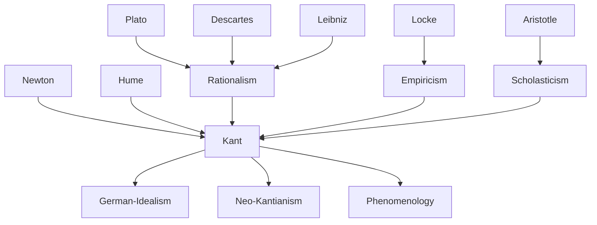

---
cssclasses:
  - Philosophy
subclasses:
  - Epistemology
  - Metaphysics
  - 17th-18th-Century-Philosophy
related:
  - "[[Transcendental Idealism]]"
  - "[[Critique of Practical Reason]]"
  - "[[Critique of the Power of Judgment]]"
  - "[[German Idealism]]"
  - "[[Epistemology]]"
  - "[[Rationalism]]"
  - "[[Empiricism]]"
  - "[[Metaphysics]]"
  - "[[Philosophy of Science]]"
  - "[[Neo-Kantianism]]"
aliases:
  - critique pure
  - synthetic a
  - transcendental idealism
  - copernican revolution
  - phenomenon noumenon
  - transcendental aesthetic
  - transcendental analytic
  - transcendental dialectic
  - categories intellect
  - forms intuition
  - space time
  - io penso
reference:
  - "[Abbagnano, N., & Fornero, G. (2012). La ricerca del pensiero. Vol. 2B. Dall'Illuminismo a Hegel. Paravia.](https://archive.org/download/ssp-s04-e07/The%20search%20for%20thought%20-%20Unit%207%20Chapter%202.pdf)"
tags:
  - Podcast
---

#### Podcast

<iframe src="https://archive.org/embed/ssp-s04-e07" width="100%" height="30" frameborder="0" webkitallowfullscreen="true" mozallowfullscreen="true" allowfullscreen></iframe>

---

#### Central Problem

The Critique of Pure Reason addresses the fundamental question: what are the conditions, possibilities, and limits of human knowledge? [[Kant]]'s investigation emerges from the debate between rationalism and empiricism concerning the foundations of science. Against rationalism (represented by [[Leibniz]] and [[Wolff]]), which claimed to derive all knowledge from innate ideas and pure reason, [[Kant]] argues that knowledge requires sensory experience. Against empiricism (represented by [[Locke]] and especially [[Hume]]), which grounded all knowledge in experience alone, [[Kant]] contends that experience presupposes certain a priori principles that cannot themselves be derived from experience.

The central problem crystallizes in the question: "How are synthetic a priori judgments possible?" This question encompasses three subordinate inquiries: How is pure mathematics possible? How is pure natural science possible? Is metaphysics as a science possible? [[Hume]] had awakened [[Kant]] from his "dogmatic slumber" by demonstrating that the principle of causality cannot be derived from experience. If [[Hume]] is right, the very foundation of science—its universal and necessary laws—would collapse into mere psychological habit. [[Kant]]'s task is to rescue science from skepticism while acknowledging the legitimate boundaries of human reason.

#### Main Thesis

Kant's revolutionary solution involves what he calls a "Copernican revolution" in philosophy. Just as [[Copernicus]] reversed the relationship between observer and celestial bodies, [[Kant]] reverses the relationship between subject and object in knowledge: instead of the mind conforming to objects, objects must conform to the a priori structures of the mind. This inversion grounds the possibility of synthetic a priori knowledge.

**The Theory of Judgments:**
- *Analytic a priori judgments* are those where the predicate merely explicates what is already contained in the subject concept (e.g., "Bodies are extended"). They are universal and necessary but sterile—they do not extend knowledge.
- *Synthetic a posteriori judgments* are those where the predicate adds something new to the subject based on experience (e.g., "Bodies are heavy"). They are fertile but lack universality and necessity.
- *Synthetic a priori judgments* combine fertility with universality and necessity. They are the foundation of science: they say something new about objects while being universally and necessarily valid.

**Knowledge as Synthesis of Matter and Form:**
Knowledge results from the union of two elements:
- *Matter*: the chaotic multiplicity of sensory impressions received from experience (a posteriori element)
- *Form*: the fixed mental structures through which the mind organizes these impressions (a priori element)

**The Structure of Cognitive Faculties:**
1. *Sensibility* (Transcendental Aesthetic): The passive faculty through which objects are given to us via the pure forms of space and time
2. *Understanding* (Transcendental Analytic): The active faculty through which we think objects via the twelve categories
3. *Reason* (Transcendental Dialectic): The faculty that seeks to unify all knowledge through the ideas of soul, world, and God

**Phenomenon and Thing-in-Itself:**
- The *phenomenon* is reality as it appears to us through our a priori forms—not an illusion but the only reality we can know
- The *thing-in-itself* (noumenon) is reality considered independently of our forms of knowledge—an unknowable x that nonetheless serves as a limiting concept

**The Refutation of Traditional Metaphysics:**
The ideas of reason (soul, world, God) have no legitimate cognitive use since they transcend all possible experience. The attempt to know them produces:
- *Paralogisms*: fallacious arguments about the soul
- *Antinomies*: contradictory but equally demonstrable theses about the world
- *Failed proofs*: the ontological, cosmological, and physico-theological arguments for God's existence

#### Historical Context

The Critique of Pure Reason (1781, second edition 1787) emerged at the height of the German Enlightenment (Aufklärung) and represents the culmination of early modern epistemological debates. [[Kant]] lived his entire life in Königsberg, where he taught at the university and developed his critical philosophy through sustained engagement with both rationalist and empiricist traditions.

The intellectual context was shaped by several factors: the stunning success of Newtonian physics, which seemed to establish universal mathematical laws of nature; the challenge posed by [[Hume]]'s empiricism to the very possibility of necessary knowledge; the competing claims of Leibnizian-Wolffian rationalism, which dominated German universities; and the growing sense that traditional metaphysics had reached an impasse of empty disputes.

Kant's pre-critical period saw him working within the rationalist framework while increasingly influenced by [[Newton]] and eventually [[Hume]]. The "great light" of 1769 and the subsequent "silent decade" of intensive work led to the first Critique, which [[Kant]] hoped would settle metaphysical disputes once and for all by determining what reason can and cannot know.

#### Philosophical Lineage

#### Key Thinkers

| Thinker | Dates | Movement | Main Work | Core Concept |
|---------|-------|----------|-----------|--------------|
| [[Kant]] | 1724-1804 | [[Critical Philosophy]] | *Critique of Pure Reason* | Synthetic a priori, transcendental idealism |
| [[Hume]] | 1711-1776 | [[Empiricism]] | *Treatise of Human Nature* | Skepticism about causality |
| [[Leibniz]] | 1646-1716 | [[Rationalism]] | *New Essays* | Pre-established harmony, innate ideas |
| [[Locke]] | 1632-1704 | [[Empiricism]] | *Essay Concerning Human Understanding* | Tabula rasa, ideas from experience |
| [[Newton]] | 1643-1727 | [[Natural Philosophy]] | *Principia Mathematica* | Universal laws of nature |
| [[Descartes]] | 1596-1650 | [[Rationalism]] | *Meditations* | Cogito, clear and distinct ideas |
| [[Berkeley]] | 1685-1753 | [[Empiricism]] | *Three Dialogues* | Esse est percipi |

#### Key Concepts

| Concept | Definition | Related to |
|---------|------------|------------|
| Synthetic a priori | Judgments that extend knowledge (synthetic) while being universal and necessary (a priori); the foundation of science | [[Epistemology]], [[Kant]] |
| Transcendental | Not the a priori elements themselves but the philosophical study of how a priori knowledge of objects is possible | [[Critical Philosophy]], [[Kant]] |
| Phenomenon | Reality as it appears through our a priori forms; the proper object of human knowledge | [[Epistemology]], [[Transcendental Idealism]] |
| Thing-in-itself (Noumenon) | Reality considered independently of our cognitive forms; unknowable but necessary as a limiting concept | [[Metaphysics]], [[Kant]] |
| Categories | The twelve pure concepts of understanding through which we think objects; the supreme unifying functions of the intellect | [[Logic]], [[Kant]] |
| I think (Ich denke) | The transcendental unity of apperception; the supreme principle that must accompany all representations | [[Epistemology]], [[Kant]] |
| Space and Time | Pure forms of sensibility; not properties of things-in-themselves but a priori conditions of perception | [[Transcendental Aesthetic]], [[Kant]] |
| Transcendental Deduction | The justification of the legitimate use of categories; showing how a priori concepts apply to experience | [[Epistemology]], [[Kant]] |
| Schematism | The doctrine showing how categories apply to intuitions through temporal "schemes" | [[Epistemology]], [[Kant]] |
| Antinomies | Contradictions in which reason becomes entangled when using the idea of "world"; pairs of opposed theses equally demonstrable | [[Dialectic]], [[Kant]] |

#### Authors Comparison

| Theme | [[Kant]] | [[Hume]] | [[Leibniz]] |
|-------|----------|----------|-------------|
| Source of knowledge | Synthesis of experience and a priori forms | Experience alone | Innate ideas developed by reason |
| Status of causality | Synthetic a priori principle; necessary for experience | Psychological habit based on constant conjunction | Rational principle grounded in sufficient reason |
| Mathematics | Based on pure intuitions of space and time | Relations of ideas (analytic) | Truths of reason (analytic) |
| Metaphysics | Impossible as theoretical science; legitimate as critique | Meaningless speculation | Supreme rational science |
| Space and time | A priori forms of sensibility | Ideas derived from experience | Ideal relations among substances |
| Thing-in-itself | Exists but is unknowable | Question makes no sense | Monads as ultimate reality |

#### Influences & Connections

- **Predecessors:** [[Kant]] ← influenced by ← [[Hume]], [[Leibniz]], [[Newton]], [[Locke]], [[Wolff]]
- **Contemporaries:** [[Kant]] ↔ dialogue with ↔ [[Mendelssohn]], [[Jacobi]], [[Herder]]
- **Followers:** [[Kant]] → influenced → [[Fichte]], [[Schelling]], [[Hegel]], [[Schopenhauer]]
- **Later developments:** [[Kant]] → influenced → [[Neo-Kantianism]], [[Phenomenology]], [[Analytic Philosophy]]
- **Opposing views:** [[Kant]] ← criticized by ← [[Hamann]], [[Herder]], [[Jacobi]] (for limiting faith)

#### Summary Formulas

- **[[Kant]]:** Human knowledge is the synthesis of sensory matter and a priori forms; we can know phenomena but not things-in-themselves; science is grounded in synthetic a priori judgments that express the necessary conditions for any possible experience.
- **[[Hume]]:** All knowledge derives from experience; causality is merely psychological habit from observing constant conjunctions; necessary connection cannot be demonstrated.
- **[[Leibniz]]:** The mind contains innate ideas that develop through rational reflection; all truths are ultimately analytic; the principle of sufficient reason governs all existence.

#### Timeline

| Year | Event |
|------|-------|
| 1724 | [[Kant]] born in Königsberg |
| 1739-40 | [[Hume]] publishes *A Treatise of Human Nature* |
| 1755 | [[Kant]] receives doctorate; publishes *Universal Natural History* |
| 1763 | [[Kant]] publishes *The Only Possible Argument for a Demonstration of God's Existence* |
| 1770 | [[Kant]] publishes *Inaugural Dissertation*; "great light" period |
| 1781 | [[Kant]] publishes *Critique of Pure Reason* (first edition) |
| 1783 | [[Kant]] publishes *Prolegomena to Any Future Metaphysics* |
| 1787 | [[Kant]] publishes *Critique of Pure Reason* (second edition with Refutation of Idealism) |
| 1804 | [[Kant]] dies in Königsberg |

#### Notable Quotes

> "Thoughts without content are empty, intuitions without concepts are blind." — [[Kant]]

> "I call transcendental all knowledge that is occupied not so much with objects as with the manner of our knowledge of objects insofar as this manner is to be possible a priori." — [[Kant]]

> "It remains a scandal to philosophy and to human reason in general that the existence of things outside us must be accepted merely on faith." — [[Kant]]

---
> [!warning]-
> This annotation was normalised using a large language model and may contain inaccuracies. These texts serve as preliminary study resources rather than exhaustive references.
