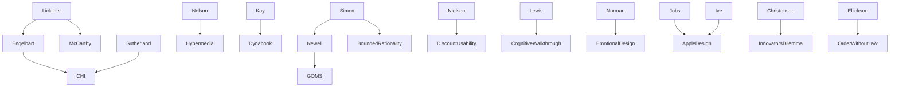

---
cssclasses:
  - Computer-Science
  - History
  - Sociology
subclasses:
  - Human-Computer-Interaction
  - CSCW
  - Design-Theory
related:
  - "[[Licklider]]"
  - "[[Engelbart]]"
  - "[[Jobs]]"
  - "[[Simon]]"
  - "[[Norman]]"
  - "[[Kay]]"
aliases:
  - hci cultures
  - disciplinary bridges
  - publication cultures
  - human symbiosis
  - ai hci
  - internet things
  - design analytics
  - community technology
  - discretionary use
  - interdisciplinary hci
reference:
  - "Grudin, J. (2017). From tool to partner: the evolution of human-computer interaction. Morgan & Claypool Publishers. (pp. 91-113)"
---

#### Central Problem

This text addresses the fragmentation and cultural barriers that have prevented meaningful collaboration across the major HCI research communities—human factors (HF&E), management information systems (IS), library and information science (LIS), and computer science-based CHI. Despite decades of bridge-building attempts, these fields have remained largely separate, developing distinct methods, publication cultures, terminological conventions, and research priorities. The text interrogates why interdisciplinarity remains rare despite universal rhetorical support, and explores how technological advances—particularly the emergence of human-computer symbiosis and AI—are transforming the landscape while simultaneously creating new challenges around visibility, community dissolution, and the fragmentation of professional organizations.

The deeper problem lies in the tension between technology's capacity to connect globally dispersed networks and its tendency to erode local, embodied communities. As HCI moves from supporting isolated tasks to mediating increasingly intimate partnerships between humans and machines, questions of privacy, autonomy, conflicting interests, and the moral neutrality of digital partners become paramount. The chapter thus serves as both historical reflection and forward-looking analysis of an inflection point in HCI's evolution.

#### Main Thesis

Grudin argues that the failure of interdisciplinary collaboration in HCI stems not from lack of effort but from deep structural and cultural differences: distinct methodological orientations (scientific generalization vs. ecological validity vs. intuition-driven design), incompatible publication systems (journal-based vs. conference-archival), divergent terminology, generational attitudes, and regional research cultures. These barriers persisted even as the fields' nominal focus on "human-computer interaction" appeared convergent.

The text further argues that HCI has entered a new phase—[[Licklider]]'s "Phase 2" of human-computer symbiosis—where technology increasingly acts as a semi-autonomous partner rather than a passive tool. This shift demands reconceptualization: the field rechristened as "Human-Computer Integration" rather than mere interaction. AI and HCI, historically competitive for resources, must now collaborate to create effective symbiotic systems that understand human behavior, cultural differences, and domain-specific requirements.

Finally, Grudin contends that technology is simultaneously enabling global connectivity while dissolving local communities. Professional organizations like ACM SIGs have seen dramatic membership declines; conferences have fragmented into specialized venues; and individuals increasingly maintain distributed weak ties at the expense of deep local bonds. This transformation—where "peripheral activity and community compete for our attention"—represents a profound shift in human social organization with consequences that remain uncertain.

#### Historical Context

The text synthesizes five decades of HCI evolution (1960s–2015) while projecting into an emergent future. Key contextual elements include:

**Disciplinary Origins**: HF&E emerged from military and organizational efficiency concerns; IS from business management; LIS from library specialist contexts; CHI from the consumer software revolution of the 1980s. Each field developed around different use paradigms—non-discretionary organizational use vs. discretionary consumer use—leading to divergent methods.

**Publication Revolution**: In the late 1980s, ACM's decision to archive conference proceedings as final publications diverged American computer science from traditional journal-based disciplines. This created acceptance rate competition (CHI dropping to 15%) that deterred cross-disciplinary submission.

**AI Cycles**: The text traces AI's boom-bust cycles, noting that HCI flourished during "AI winters" (Ivan Sutherland's TX-2 access, major HCI labs in late 1970s, HCI hiring boom in 1990s following Strategic Computing Initiative failures). The 2016 "AI summer"—deep learning, autonomous vehicles, Watson—raised questions about whether this cycle would differ.

**Apple's Design Turn**: [[Jobs]]'s 2007 decision to dismiss HCI researchers ("Why do you need them? You have me?") and prioritize [[Ive]]'s visual design shifted industry priorities toward aesthetics over usability research.

**Community Transformation**: From pre-internet local bulletin boards (The WELL, 1985) through Usenet to contemporary social networks, technology has progressively enabled distributed connections while competing with local community formation.

#### Philosophical Lineage

#### Key Thinkers

| Thinker | Dates | Movement | Main Work | Core Concept |
|---------|-------|----------|-----------|--------------|
| [[Licklider]] | 1915–1990 | [[Cybernetics]] | *Man-Computer Symbiosis* | Three phases: interaction → symbiosis → ultra-intelligence |
| [[Engelbart]] | 1925–2013 | [[Augmentation]] | NLS/Augment | Human augmentation over automation |
| [[Jobs]] | 1955–2011 | [[Design]] | Apple products | Design-driven consumer technology |
| [[Simon]] | 1916–2001 | [[Bounded Rationality]] | *Sciences of the Artificial* | Specialization from information volume |
| [[Christensen]] | 1952–2020 | [[Innovation Studies]] | *The Innovator's Dilemma* | Technological disruption patterns |
| [[Ellickson]] | 1941– | [[Law and Society]] | *Order Without Law* | Informal norms vs. formal rules |

#### Key Concepts

| Concept | Definition | Related to |
|---------|------------|------------|
| Human-Computer Symbiosis | Partnership where humans and machines work together, technology acting semi-autonomously on user's behalf | [[Licklider]], [[Engelbart]] |
| Discretionary vs. Non-discretionary Use | Distinction between voluntary consumer use and mandated organizational use that shapes research methods | [[CHI]], [[HF&E]] |
| Publication Culture Divide | Conference-archival (CS) vs. journal-final (other sciences) systems creating cross-disciplinary barriers | [[ACM]], [[IS]] |
| AI Summers and Winters | Cyclical funding patterns where AI optimism diverts resources from HCI, followed by retrenchment | [[Minsky]], [[McCarthy]] |
| Demand Characteristics | Lab participants tell experimenters what they want to hear, distorting subjective assessments | [[Newell]], Experimental Psychology |
| Internet of Things | Embedded, often invisible sensors collecting information as part of human-technology partnership | [[Ubiquitous Computing]] |
| Community Dissolution | Technology enabling distributed weak ties while eroding local strong-tie communities | Social Networks, [[Putnam]] |
| Design Ascendancy | Post-2007 shift prioritizing visual design over usability research in industry | [[Jobs]], [[Ive]] |

#### Authors Comparison

| Theme | [[Grudin]] | Common View |
|-------|------------|-------------|
| Interdisciplinarity failure | Cultural/structural barriers, not lack of effort | Insufficient bridge-building attempts |
| AI-HCI relationship | Cyclical competition; collaboration needed for symbiosis | Distinct fields with separate goals |
| Publication systems | Major barrier to collaboration | Neutral venue differences |
| Design vs. research | Pendulum swing, may overcorrect | Complementary approaches |
| Community change | Technology dissolving local bonds | Technology connecting people |
| Conference fragmentation | Loss of community despite topic focus | Healthy specialization |

#### Influences & Connections

- **Predecessors:** [[Grudin]] ← influenced by ← [[Licklider]], [[Engelbart]], [[Simon]], [[Newell]]
- **Contemporaries:** [[Grudin]] ↔ dialogue with ↔ [[Norman]], [[Nielsen]], [[Shneiderman]]
- **Opposing views:** AI researchers (singularity timeline) ← disagrees with ← [[Grudin]] (extended Phase 2)
- **Methodological traditions:** Experimental psychology → HF&E; General theory → IS; Intuition-driven → CHI
- **Regional variations:** U.S. (ACM/conference culture) ↔ contrasts with ↔ Europe (government/organizational) ↔ Asia (journal/consumer)

#### Summary Formulas

- **[[Licklider]]:** HCI progresses through three phases—interaction (done), symbiosis (emerging), ultra-intelligence (distant)—with Phase 2 lasting far longer than early AI researchers predicted.

- **[[Grudin]] on barriers:** Interdisciplinary collaboration fails not from lack of bridges but from cultural incompatibilities: methods, publication systems, terminology, generational attitudes, and regional differences.

- **[[Grudin]] on symbiosis:** Digital partners are distillations of human knowledge about tasks, but their amorality and narrow competence distinguish them from human partners, requiring new design approaches.

- **[[Grudin]] on community:** Technology enables peripheral connections while competing with local community formation; professional organizations fragment as specialized conferences proliferate and membership declines.

#### Timeline

| Year | Event |
|------|-------|
| 1960 | [[Licklider]] publishes "Man-Computer Symbiosis" blueprint |
| 1985 | The WELL (Whole Earth 'Lectronic Link) founded |
| 1988 | ACM begins archiving conference proceedings as final publications |
| 1991 | Santa Monica Public Electronic Network launched |
| 1994 | International Journal of Man-Machine Studies renamed Human-Computer Studies |
| 1997 | [[Christensen]] publishes *The Innovator's Dilemma* |
| 2002–2004 | CHI acceptance rate drops to 15–16% |
| 2007 | [[Jobs]] dismisses HCI staff; iPhone launched |
| 2011 | iConference attendance peaks |
| 2016 | AI summer: deep learning, autonomous vehicles, Watson investments |

#### Notable Quotes

> "If the Singularity will arrive soon, long-term interface efforts are wasted: A superintelligent machine will clean up interfaces in minutes! To propose to work on HCI is to question the claims of your AI colleagues and the agencies funding them." — [[Grudin]]

> "We have a fixed number of hours available for social interaction. Social lives at college once centered in dormitories; now students carry their dispersed high school cohort in their pocket." — [[Grudin]]

> "If our field of early adopters is the canary in a technology mine, most of us are chirping happily, with only occasional distressed tweets." — [[Grudin]]

---
> [!warning]-
> This annotation was normalised using a large language model and may contain inaccuracies. These texts serve as preliminary study resources rather than exhaustive references.
